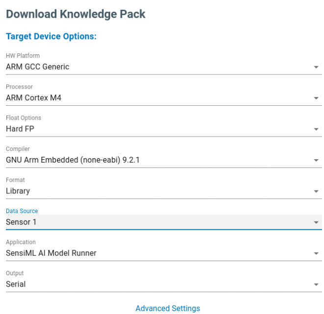
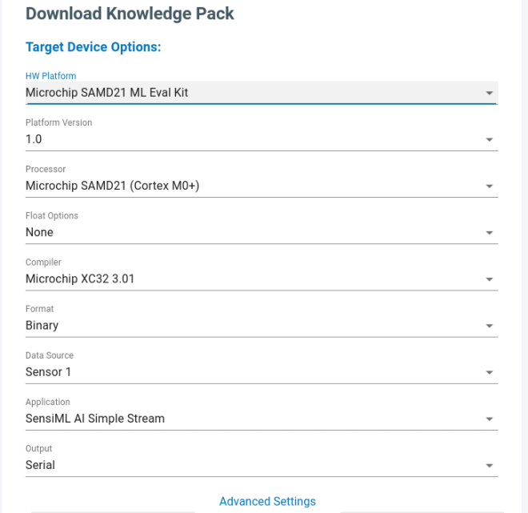

.. meta::
   :title: Adding Third-Party Devices to the Analytics Studio
   :description: How to add third-party devices as build options to the SensiML Analytics Studio

============
Introduction
============

Overview
````````

The SensiML Analytics Studio supports building recognition firmware (Knowledge Packs) for any hardware platform described in the :doc:`SensiML Firmware Documentation<../../knowledge-packs/flashing-a-knowledge-pack-to-an-embedded-device>`. If your hardware architecture (Arm, x86, etc) is already supported in this list, then you can build Knowledge Packs right away and do not need to follow this tutorial.

The following instructions are only necessary if you would like your specific third-party device to be displayed as an available option for SensiML customers in the SensiML Analytics Studio instead of the generic hardware architecture name.

After creating a hardware platform, it will load as an available option in the SensiML Analytics Studio download screen:

|generic| **changes to:** |specific|





Defining Your Hardware Platform
```````````````````````````````

Third-party devices can be added as available build options for Knowledge Packs in the SensiML Analytics Studio by implementing pre-defined YAML objects for your platform. Once you have defined the following objects, `contact the SensiML integration team <https://sensiml.com/contact/>`__ and we will work with you to integrate your hardware platform into the SensiML Toolkit

1.	:doc:`hardware-platform`
2.	:doc:`architecture`
3.	:doc:`processor`
4.	:doc:`compiler`
5.	:doc:`build-scripts`

.. note:: A number of fields require generating a UUID. An online tool can generate your UUID's here: `Online UUID4 Generator <https://www.uuidgenerator.net/version4>`__
