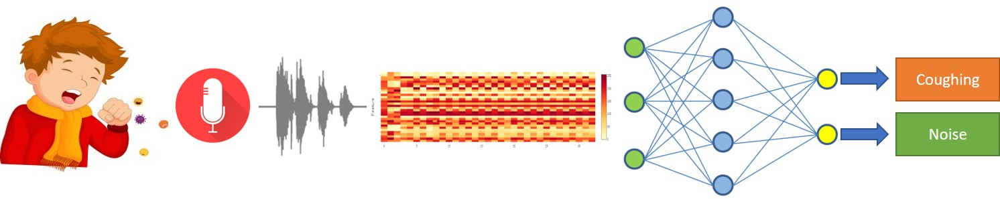
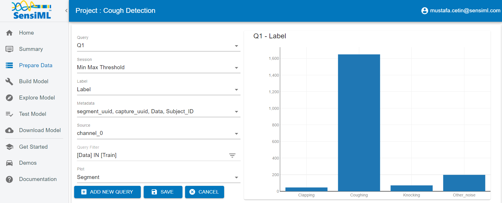
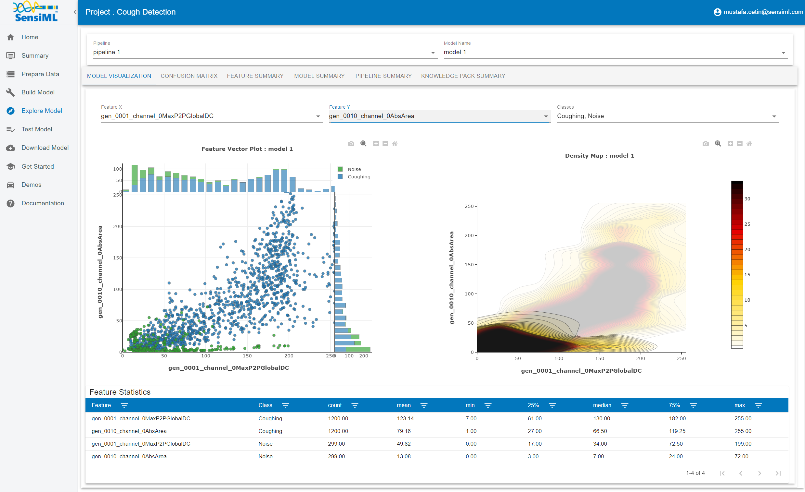
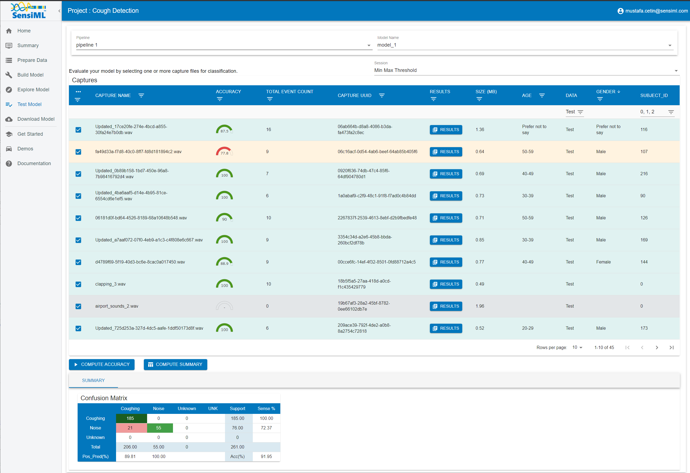
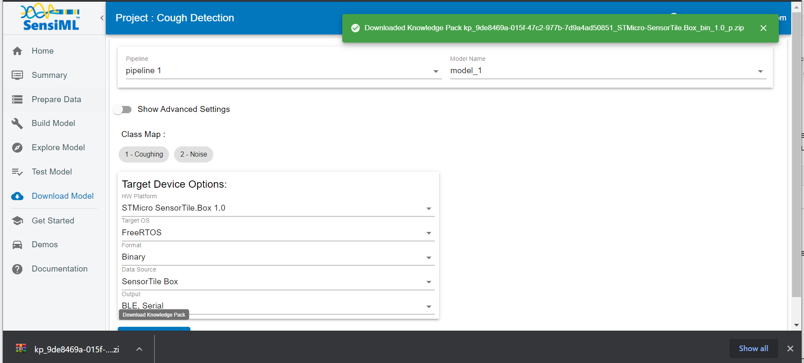

.. meta::
    :title: Audio Cough Detection
    :description: Classification of coughing sounds from microphone signal
    :sensiml:title: Audio Cough Detection
    :sensiml:excerpt: In this tutorial, we are going to build a Cough Detection application that can run entirely on a cortex-M4 microcontroller using SensiML Analytics Toolkit.
    :sensiml:image: /documentation/_images/coughing.jpg

Audio Cough Detection
=====================

Overview
--------

In this tutorial, we are going to build a **Cough Detection** application that can run entirely on a cortex-M4 microcontroller using `SensiML Analytics Toolkit <https://sensiml.com/>`__. These technologies are applicable to a variety of domains where classifying time series sensor data is critical such as gesture recognition, activity recognition, sound classification, and keyword spotting.

   coughing

Why Cough Detection?
~~~~~~~~~~~~~~~~~~~~

With respiratory disease the third leading cause of death worldwide (after heart disease and cancer). Cough is a common but complicated symptom of respiratory diseases.

The assessment of cough severity is subjective at present: it contains visual analogue scales (VAS), health-related quality of life (HRQOL), Leicester cough questionnaire (LCQ), cough-specific quality of life questionnaire (CQLQ). Also, when cough becomes chronic, it is extremely unpleasant and distressing that the life quality of chronic cough patients has significant reductions. In addition to that, the health care cost, medical consultations, and medication use hence become a heavy burden for them.

The evaluation of its intensity and frequency of occurrence could provide valuable clinical information in the assessment of patients with chronic cough. Detecting a cough is a challenging ML problem due to variety of coughs which can be wet or dry, brassy or raspy, ringing or barking. Also, they can whistle, whoop or wheeze.

The data we provide contains:

1. Cough sounds from continuous ambulatory recordings.
2. Background noise (factory, steed, kitchen, airport, etc.)
3. False positive sounds (clapping, knocking, etc.).

Objective
~~~~~~~~~

1. Demonstrate how to collect and annotate a high-quality audio dataset by using the SensiML Data Studio.
2. Build a data pipeline to extract features in real-time on your target device.
3. Train a classification model using SensiML custom pipeline.
4. Convert the model into a Knowledge Pack and flash it to our target embedded device.
5. Perform live validation of the Knowledge Pack running on-device using the SensiML TestApp.

Capturing Sensor Data
---------------------

For every machine learning project, the quality of the final product depends on the quality of your curated data set. Time series sensor data are often unique to the application as the combination of sensor placement, sensor type, and event type greatly affects the type of data created. Because of this, you will be unlikely to have a relevant dataset already available, meaning you will need to collect and annotate your own dataset.

To help you to build a data set for your application we have created the SensiML :doc:`Data Studio </data-studio/overview>`, which we are going to use for collecting and annotating data for different states. If you are using the `demo version <https://app.sensiml.cloud/demo>`__ of SensiML this project is already uploaded to the account as **Cough Detection**. Otherwise, the dataset for this tutorial can be downloaded at the link below.

:download:`Cough_Detection.zip </application-tutorials/file/audio-cough-detection/Cough_Detection.zip>`

1. Unzip the files and import the dataset to the Data Studio by clicking ``Import Project``

Below you can see a quick demonstration of how the Data Capture lab enabled us to create an annotated audio state data set for cough detection. In the next few sections, we are going to walk through how we used the Data Studio to collect and label this dataset.

Determining events of interest
~~~~~~~~~~~~~~~~~~~~~~~~~~~~~~

Detecting and classifying events is ultimately the main goal of a time series application. In general, events fall into one of two types: continuous or discrete.

**Discrete “Trigger” Events**

Discrete events are events that have discrete trigger actions that the application needs to be trained for. In this **cough detection** example, the sensor will detect the trigger events of “Coughing” or “Clapping”. But ignore all other input. You may find that detecting discrete events is a more challenging problem than continuous events. Therefore, collecting enough data to prevent False Positives is critical.

**Why is this important?**

The type of event you are trying to detect will change the way you want to train your raw sensor data in the SensiML toolkit. In the SensiML Data Studio, you can put what we call Segment Labels on any portion of your sensor data. This allows you to accurately mark wherein the dataset each type of event is occurring.

Capturing environmental context
~~~~~~~~~~~~~~~~~~~~~~~~~~~~~~~

In addition to labels, it is also important to capture information about the environment. Capturing this contextual information enables you to build highly tailored models. Additionally, it makes it possible to diagnose why a model might be failing for subsets of your data.

For example, in this “cough detection” dataset, we captured several contextual properties such as subject, age, gender, etc. Using these we would be able to build a model for different age groups that most likely would be more accurate and compact than attempting to build a single general model.

You can capture the contextual information in the Data Studio using the metadata properties. Metadata are applied to the entire captured file, so when you are creating your data collection strategy think carefully about what information you may need. Metadata can be created as a selectable dropdown or manual entry allowing flexibility for your data collectors.

The video below goes into how to create and update metadata and segment label properties in the SensiML Data Studio.

Capturing Data
~~~~~~~~~~~~~~

It's time to start collecting data. To collect data, we will go to the **Capture** mode in the Data Studio. The first thing we need to do is to set up the sensor configuration that we would like to use. For this tutorial, we are using the ST SensorTile Box. There are several other sensors with built-in support for this edge device. You can see more information about this board :doc:`here</firmware/st-sensortile-box/st-sensortile-box>`.

We will configure this sensor to capture audio data at a sample rate of 16kHz. In this tutorial, the data is stored directly to an internal SD card then transferred directly to our computer.

After specifying our sensor configuration, we will connect to the device and be ready to record live data. The captured data will be saved locally to your computer as well as be synced up to the SensiML cloud. This allows other members of your team who have permission to see and label your new captured file. Alternatively, if you already have a data collection method for your device, the Data Studio can import CSV and WAV files directly so you can still use it for annotating the data.

The video below walks through capturing and syncing the data to your cloud project with the Data Studio.

*The video below walks through:*

-  Open the project
-  Setup sensor configuration for desired edge device
-  Connecting Data Studio to edge device
-  Setup class and metadata labels for data collection
-  Adding data to your cloud project with the Data Studio

.. raw:: html

    <iframe width="750" height="450" src="https://www.youtube.com/embed/eyjjDD2i1DM?autoplay=0&rel=0&version=3&&loop=1" frameborder="0"></iframe>

Annotating Events of Interest
~~~~~~~~~~~~~~~~~~~~~~~~~~~~~

The Data Studio has a manual label mode and an automatic event detection mode. For this tutorial, we are going to use automatic event detection mode and label the events. When we go to build the model, we will use these events to generate features to feed into the classifier.

To label a region, click on the “Detect Segments” button then the selected segmentation algorithm detects the event, and then specify which label is associated with that event. If you have collected your data set through other means, you can also import CSV or WAV files into the Data Studio. More details can be found `:doc:`here </data-studio/importing-external-sensor-data>`.

The video below walks you through how to label the events of a captured file in the SensiML Data Studio.

.. raw:: html

    <iframe width="750" height="450" src="https://www.youtube.com/embed/hleVMW04MZw?autoplay=0&rel=0&version=3&&loop=1" frameborder="0"></iframe>

Building a Model
----------------

The SensiML Analytics Studio is where you can create the following steps

-  Create a query and pull data into your model
-  Adding model building steps to the pipeline
-  Explore the model
-  Validate model accuracy against raw signal data
-  Download your model as firmware code for the target device

For the next part of the tutorial, you will need to log into `Analytics Studio <https://app.sensiml.cloud/>`__

Creating a Query
~~~~~~~~~~~~~~~~

We will first start off by selecting the “Cough Detection” project which is created with the SensiML Data Studio. When you select the project, you will see an overview of all the captures, queries, pipelines, and models that are part of the project. We will start off by creating a query.

The query is used to select your sensor data from your project. If you need to filter out certain parts of your sensor data based on metadata or labels, you can specify that here.

   Prepare Data

1. Open the Prepare Data screen to create a query
2. Create a new query with the following properties:

::

   * Query Name: Q1
   * Session: Min Max Threshold
   * Label: Label
   * Metadata: segment_uuid, capture_uuid, Data, Subject_ID
   * Source: channel_0
   * Filter: [Data] IN [Train]

3. After clicking **Save** the Analytics Studio will count all the    **events of interest** you have labeled in this project and graph    them

SensiML Python SDK
~~~~~~~~~~~~~~~~~~

We are going to connect to SensiML's cloud engine using the SensiML Python SDK. If you have not yet created an account on SensiML you will need to do that before continuing. You can create a free account by going `here <https://sensiml.com/plans/community-edition/>`__

To install the SensiML Python SDK in your environment, run the command in the following cell. ``!pip install sensiml -U``

Import the SensiML Python SDK and use it to connect to SensiML Cloud. Run the following cell, which will ask you for your username and password. After connecting, you will be able to use the SensiML Python SDK to manage the data in your project, create queries, build and test models as well as download firmware. Further documentation for using the SensiML Python SDK can be found :doc:`here </sensiml-python-sdk/overview>`.

.. code:: ipython3

    from sensiml import *
    client = SensiML()

.. raw:: html

    

Next we are going to connect to our **Cough Detection** project. Run the following cell to connect to the project.

.. code:: ipython3

    client.project = 'Cough Detection'

Creating a pipeline
~~~~~~~~~~~~~~~~~~~

Pipelines are a key component of the SensiML workflow. Pipelines store the preprocessing, feature extraction, and model building steps. When training a model, these steps are executed on the SensiML server. Once the model has been trained, the pipeline is converted to a firmware code that will run on your target embedded device. For more documentation on pipelines see the advanced model building :doc:`tutorial </sensiml-python-sdk/getting-started-with-the-sensiml-python-sdk>`. To create a new empty pipeline, run the cell below.

.. code:: ipython3

    client.pipeline = 'pipeline 1'

Now we are going to add our preprocessing steps to the pipeline, for a detailed description of the features available in a pipeline see the documentation :doc:`here </pipeline-functions/overview>`.

You can also list the functions by running ``client.list_functions(qgrid=False)`` in a code cell of the notebook.

Adding steps to the pipeline
~~~~~~~~~~~~~~~~~~~~~~~~~~~~

The pipeline for this tutorial will consist of the following steps:

Input Query
^^^^^^^^^^^

Define the query that will be used in the pipeline.

.. code:: ipython3

    client.pipeline.reset()
    client.pipeline.set_input_query("Q1")

Segment Transform - Strip
^^^^^^^^^^^^^^^^^^^^^^^^^

This transform shifts the entire signal towards 'mean' or 'min' before calling the feature generation and classification. In this tutorial we will use the mean options.

.. code:: ipython3

    client.pipeline.add_transform("Strip", 
                               params={"input_columns": ['channel_0'], 
                                       "type": 'mean'
                                      }
                              )

Feature Vector Generation
^^^^^^^^^^^^^^^^^^^^^^^^^

At this point, we are ready to generate a feature vector from our segments. Feature generators are algorithms to extract relevant feature vectors for model building. Details of the features can be found :doc:`here </pipeline-functions/feature-generators>`.

.. code:: ipython3

    sample_rate = 16000
    
    feature_list = [
        {'subtype_call': 'Amplitude'},
        {'subtype_call': 'Physical'},
        {'subtype_call': 'Area', 'params': {'sample_rate': sample_rate, 
                                            'smoothing_factor': 9
                                           }
        },
        {'subtype_call': 'Time', 'params': {'sample_rate': sample_rate}},
        {'subtype_call': 'Frequency', 'params': {'sample_rate': sample_rate}},
        {'subtype_call': 'Rate of Change'},    
        {'subtype_call': 'Statistical'},
        {'subtype_call': 'Energy'}
    ]
    
    client.pipeline.add_feature_generator(feature_list, 
                                       function_defaults={'columns': ['channel_0']}
                                      )

Feature Transform - Combine Labels
^^^^^^^^^^^^^^^^^^^^^^^^^^^^^^^^^^

Reducing the number of labels to 2 by combining the 'Clapping', 'Knocking', 'Background_noise', 'Other_noise' audio states to Noise. At the end of this transform, we will have only 'Coughing' and 'Noise' in the data set for the rest of the pipeline.

.. code:: ipython3

    client.pipeline.add_transform("Combine Labels", 
                               params={"combine_labels":{"Coughing": ['Coughing'], 
                                                         "Noise": ['Clapping', 
                                                                   'Knocking', 
                                                                   'Background_noise',
                                                                   'Other_noise']
                                                        }
                                      }
                              )

Feature Transform - Isolation Forest Filtering
^^^^^^^^^^^^^^^^^^^^^^^^^^^^^^^^^^^^^^^^^^^^^^

Removing the outliers and noisy data is useful to improve the robustness of the model. In this tutorial, we will use the Isolation Forest Filtering. List of filters can be found :doc:`here </pipeline-functions/samplers>`

.. code:: ipython3

    client.pipeline.add_transform("Isolation Forest Filtering")

Feature Selector
^^^^^^^^^^^^^^^^

The Feature Selector which selects the best features. In this case, we are using the a set of feature selectors which are “Correlation Threshold”, “Variance Threshold” and “Univariate Selection” to down sample the features.

.. code:: ipython3

    client.pipeline.add_feature_selector([
        {'name':'Correlation Threshold', 'params':{"threshold": 0.99}},
        {'name':'Variance Threshold', 'params':{"threshold": 0.005}},
        {'name':'Univariate Selection', 'params':{"number_of_features": 32 }}
    ])

Feature Transform - Undersample Majority Classes
^^^^^^^^^^^^^^^^^^^^^^^^^^^^^^^^^^^^^^^^^^^^^^^^

Since the data is not balanced, we will reduce the max number of vectors with 1200 for each class. If the number of vectors is larger than 1200, the algorithm randomly select 1200 vectors.

.. code:: ipython3

    client.pipeline.add_transform("Undersample Majority Classes", 
                               params={"maximum_samples_size_per_class": 1200})

Feature Transform - Min Max Scale
^^^^^^^^^^^^^^^^^^^^^^^^^^^^^^^^^

Our classifiers are optimized for performance and memory usage to fit on resource constrained devices. Because of this we scale the features in the feature vector to be a single byte each so we need to add the Min Max Scale transform to the pipeline. This function will scale the features in the feature vector to have values between 0 and 255.

.. code:: ipython3

    client.pipeline.add_transform("Min Max Scale")

Generating feature vectors
~~~~~~~~~~~~~~~~~~~~~~~~~~

At this point the pipeline has not been executed yet, we are just assembling the steps. To run the pipeline, execute the following cell. This will execute the pipeline on SensiML Cloud and return the results as a pandas DataFrame.

Once the pipeline is finished running, the results will be stored in the variable *fv_t*. A summary of the execution is stored in the *s_t* variable.

.. code:: ipython3

    fv_t, s_t = client.pipeline.execute()

.. parsed-literal::

    Executing Pipeline with Steps:
    
    ------------------------------------------------------------------------
     0.     Name: Q1                        		Type: query                    
    ------------------------------------------------------------------------
    ------------------------------------------------------------------------
     1.     Name: Strip                     		Type: transform                
    ------------------------------------------------------------------------
    ------------------------------------------------------------------------
     2.     Name: generator_set             		Type: generatorset             
    ------------------------------------------------------------------------
    ------------------------------------------------------------------------
     3.     Name: Combine Labels            		Type: sampler                  
    ------------------------------------------------------------------------
    ------------------------------------------------------------------------
     4.     Name: Isolation Forest Filtering 		Type: sampler                  
    ------------------------------------------------------------------------
    ------------------------------------------------------------------------
     5.     Name: selector_set              		Type: selectorset              
    ------------------------------------------------------------------------
    ------------------------------------------------------------------------
     6.     Name: Undersample Majority Classes 		Type: sampler                  
    ------------------------------------------------------------------------
    ------------------------------------------------------------------------
     7.     Name: Min Max Scale             		Type: transform                
    ------------------------------------------------------------------------
    ------------------------------------------------------------------------
    
    
    
    Results Retrieved... Execution Time: 0 min. 1 sec.
    

.. code:: ipython3

    fv_t.head()

.. raw:: html
    
    

    

    

<pre>[16]:
    </pre>

    

    

    

    
    <table border="1" class="dataframe">
    <thead>
        <tr style="text-align: right;">
        <th></th>
        <th>gen_0001_channel_0MaxP2PGlobalDC</th>
        <th>gen_0002_channel_0MaxP2PGlobalAC</th>
        <th>gen_0003_channel_0MaxP2P1stHalfAC</th>
        <th>gen_0004_channel_0P2P</th>
        <th>gen_0005_channel_0MinMaxSum</th>
        <th>gen_0007_VarInt</th>
        <th>gen_0008_AvgSigMag</th>
        <th>gen_0009_channel_0TotArea</th>
        <th>gen_0011_channel_0TotAreaDc</th>
        <th>gen_0012_channel_0AbsAreaDc</th>
        <th>...</th>
        <th>gen_0043_channel_0minimum</th>
        <th>gen_0044_channel_0maximum</th>
        <th>gen_0047_channel_0AbsMean</th>
        <th>gen_0048_channel_0Variance</th>
        <th>gen_0050_TotEng</th>
        <th>Data</th>
        <th>Label</th>
        <th>SegmentID</th>
        <th>capture_uuid</th>
        <th>segment_uuid</th>
        </tr>
    </thead>
    <tbody>
        <tr>
        <th>0</th>
        <td>200</td>
        <td>178</td>
        <td>176</td>
        <td>230</td>
        <td>97</td>
        <td>99</td>
        <td>212</td>
        <td>181</td>
        <td>93</td>
        <td>126</td>
        <td>...</td>
        <td>17</td>
        <td>223</td>
        <td>189</td>
        <td>131</td>
        <td>190</td>
        <td>Train</td>
        <td>Coughing</td>
        <td>815</td>
        <td>3327526d-f8c7-4f66-bb6e-71a61c15f918</td>
        <td>8b5d7dee-ddd7-487d-9f06-bf4c195fc2d8</td>
        </tr>
        <tr>
        <th>1</th>
        <td>167</td>
        <td>73</td>
        <td>73</td>
        <td>203</td>
        <td>107</td>
        <td>74</td>
        <td>212</td>
        <td>201</td>
        <td>57</td>
        <td>121</td>
        <td>...</td>
        <td>48</td>
        <td>200</td>
        <td>173</td>
        <td>105</td>
        <td>174</td>
        <td>Train</td>
        <td>Coughing</td>
        <td>868</td>
        <td>996998c6-9533-40b7-bb82-4deece21dea3</td>
        <td>784d838b-1f45-4a07-8a55-8a7b139b5d03</td>
        </tr>
        <tr>
        <th>2</th>
        <td>18</td>
        <td>2</td>
        <td>2</td>
        <td>6</td>
        <td>112</td>
        <td>1</td>
        <td>212</td>
        <td>187</td>
        <td>3</td>
        <td>20</td>
        <td>...</td>
        <td>246</td>
        <td>4</td>
        <td>21</td>
        <td>2</td>
        <td>16</td>
        <td>Train</td>
        <td>Coughing</td>
        <td>1560</td>
        <td>a6896d1b-7929-4476-bb20-945c9172caa6</td>
        <td>6c7a7060-eaf3-49ea-9bf4-da44d0e186ce</td>
        </tr>
        <tr>
        <th>3</th>
        <td>129</td>
        <td>25</td>
        <td>25</td>
        <td>131</td>
        <td>94</td>
        <td>25</td>
        <td>212</td>
        <td>185</td>
        <td>118</td>
        <td>55</td>
        <td>...</td>
        <td>115</td>
        <td>121</td>
        <td>75</td>
        <td>27</td>
        <td>49</td>
        <td>Train</td>
        <td>Coughing</td>
        <td>802</td>
        <td>06673dbe-420d-44ed-af3e-251d0d5ef8eb</td>
        <td>b99d851c-dc5f-4ddf-8326-c42bbf46406a</td>
        </tr>
        <tr>
        <th>4</th>
        <td>116</td>
        <td>77</td>
        <td>77</td>
        <td>166</td>
        <td>143</td>
        <td>28</td>
        <td>212</td>
        <td>193</td>
        <td>35</td>
        <td>79</td>
        <td>...</td>
        <td>101</td>
        <td>178</td>
        <td>87</td>
        <td>33</td>
        <td>89</td>
        <td>Train</td>
        <td>Coughing</td>
        <td>1363</td>
        <td>48df29c2-cd4d-4658-ab84-7180f8ebdbd2</td>
        <td>89ca1d39-4f3f-4673-b169-57e5d778ceed</td>
        </tr>
    </tbody>
    </table>
    
5 rows × 37 columns

    

    

Run the following cell to see the distribution of feature each across the different classes. The best features will have low variance and good class separation.

.. code:: ipython3

    client.pipeline.visualize_features(fv_t)

.. image:: /application-tutorials/audio-cough-detection_files/audio-cough-detection_31_0.png

Now we have our features for this model, we will go ahead and train a TensorFlow Model in the colab environment. We will start by splitting our dataset into train and validate groups. Our test set is not included in the query and will be used later.

The SensiML Python SDK has a built-in function for performing this split. You can also pass in the validation data test sizes. By default, they are set to 10% each.

.. code:: ipython3

    x_train, x_test, x_validate, y_train, y_test, y_validate, class_map = \
        client.pipeline.features_to_tensor(fv_t, test=.1, validate=.2)

.. parsed-literal::

    -----  Summary  -----
    Class Map: {'Coughing': 0, 'Noise': 1}
    Train:
     total:  1049
     by class: [846. 203.]
    Validate:
     total:  301
     by class: [237.  64.]
    Train:
     total:  149
     by class: [117.  32.]
    

Creating a TensorFlow model
~~~~~~~~~~~~~~~~~~~~~~~~~~~

The next step is to define what our TensorFlow model looks like. For this tutorial, we are going to use the TensorFlow Keras API to create the NN. When you are building a model to deploy on a microcontroller, it is important to remember that all functions of TensorFlow are not suitable for a microcontroller. Additionally, only a subset of TensorFlow functions is available as part of TensorFlow Lite Micro. For a full list of available functions see the `all_ops_resolver.cc <https://github.com/tensorflow/tensorflow/blob/master/tensorflow/lite/micro/all_ops_resolver.cc>`__.

For this tutorial, we will create a deep fully connected network to efficiently classify the coughing audio states. Our aim is to limit the number and size of every layer in the model to only those necessary to get our desired accuracy. Often you will find that you need to make a trade-off between latency/memory usage and accuracy in order to get a model that will work well on your microcontroller.

.. code:: ipython3

    import tensorflow as tf
    from tensorflow.keras import Sequential
    from tensorflow.keras import layers

.. code:: ipython3

    tf_model = Sequential()
    tf_model.add(layers.Dense(16, input_dim=x_train.shape[1], activation='relu'))
    tf_model.add(layers.Dropout(0.15))
    
    tf_model.add(layers.Dense(8, activation='relu'))
    tf_model.add(layers.Dropout(0.1))
    
    tf_model.add(layers.Dense(4, activation='relu'))
    tf_model.add(layers.Dropout(0.1))
    
    tf_model.add(layers.Dense(len(class_map.keys()), activation='softmax'))
    
    tf_model.compile(loss='categorical_crossentropy', optimizer='adam', metrics=['accuracy'])
    
    #To visualize neural network
    tf_model.summary()
    

.. parsed-literal::

    Model: "sequential_2"
    _________________________________________________________________
    Layer (type)                 Output Shape              Param #   
    =================================================================
    dense_8 (Dense)              (None, 16)                528       
    _________________________________________________________________
    dropout_6 (Dropout)          (None, 16)                0         
    _________________________________________________________________
    dense_9 (Dense)              (None, 8)                 136       
    _________________________________________________________________
    dropout_7 (Dropout)          (None, 8)                 0         
    _________________________________________________________________
    dense_10 (Dense)             (None, 4)                 36        
    _________________________________________________________________
    dropout_8 (Dropout)          (None, 4)                 0         
    _________________________________________________________________
    dense_11 (Dense)             (None, 2)                 10        
    =================================================================
    Total params: 710
    Trainable params: 710
    Non-trainable params: 0
    _________________________________________________________________
    

Training the TensorFlow model
~~~~~~~~~~~~~~~~~~~~~~~~~~~~~

After defining the model graph, it is time to train the model. Training NN consists of iterating through batches of your training dataset multiple times, each time it loops through the entire training set is called an epoch. For each batch of data, the loss function is computed and the weights of the layers in the network are adjusted.

The following cell will loop through the training data num_iterations of times. Each time running a specific number of epochs. After each iteration, the visualizations for the loss, accuracy, and confusion matrix will be updated for both the validation and training data sets. You can use this to see how the model is progressing.

.. code:: ipython3

    from IPython.display import clear_output
    import sensiml.tensorflow.utils as sml_tf
    
    num_iterations=10
    epochs=100
    batch_size=32
    
    train_history = {'loss':[], 'val_loss':[], 'accuracy':[], 'val_accuracy':[]}
    
    data  = tf.data.Dataset.from_tensor_slices((x_train, y_train))
    shuffle_ds = data.shuffle(buffer_size=x_train.shape[0], 
                              reshuffle_each_iteration=True
                             ).batch(batch_size)
    
    for i in range(num_iterations):
        history = tf_model.fit(shuffle_ds, 
                               epochs=epochs, 
                               batch_size=batch_size, 
                               validation_data=(x_validate, y_validate), 
                               verbose=0
                              )
    
        for key in train_history:
            train_history[key].extend(history.history[key])
    
        clear_output()    
        sml_tf.plot_training_results(tf_model, 
                                     train_history, 
                                     x_train, 
                                     y_train, 
                                     x_validate, 
                                     y_validate
                                    )

.. image:: /application-tutorials/audio-cough-detection_files/audio-cough-detection_38_0.png

Quantize the TensorFlow model
~~~~~~~~~~~~~~~~~~~~~~~~~~~~~

Now that you have trained a neural network with TensorFlow, we are going to use the built-in tools to quantize it. Quantization of NN allows use to reduce the model size by up to 4x by converting the network weights from 4-byte floating-point values to 1-byte uint8. This can be done without sacrificing much in terms of accuracy. The best way to perform quantization is still an active area of research. For this tutorial, we will use the built-in methods that are provided as part of TensorFlow.

-  The ``representative_dataset_generator()`` function is necessary to    provide statistical information about your dataset in order to    quantize the model weights appropriately.
-  The TFLiteConverter is used to convert a TensorFlow model into a    tensor flow lite model. The TensorFlow lite model is stored as a    `flatbuffer <https://google.github.io/flatbuffers/>`__ which allows    us to easily store and access it on embedded systems.

.. code:: ipython3

    import numpy as np
    def representative_dataset_generator():  
        for value in x_test:   
            # Each scalar value must be inside of a 2D array that is wrapped in a list 
            yield [np.array(value, dtype=np.float32, ndmin=2)]
    
    # Unquantized Model
    converter = tf.lite.TFLiteConverter.from_keras_model(tf_model)
    tflite_model_full = converter.convert()
    print("Full Model Size", len(tflite_model_full))
    
    # Quantized Model
    converter = tf.lite.TFLiteConverter.from_keras_model(tf_model)
    converter.optimizations = [tf.lite.Optimize.OPTIMIZE_FOR_SIZE]
    converter.experimental_new_converter = True
    converter.representative_dataset = representative_dataset_generator
    tflite_model_quant = converter.convert()
    
    print("Quantized Model Size", len(tflite_model_quant))

.. parsed-literal::

    INFO:tensorflow:Assets written to: C:\Users\mcetin\AppData\Local\Temp\tmpzwyayxry\assets
    

.. parsed-literal::

    INFO:tensorflow:Assets written to: C:\Users\mcetin\AppData\Local\Temp\tmpzwyayxry\assets
    

.. parsed-literal::

    Full Model Size 5072
    INFO:tensorflow:Assets written to: C:\Users\mcetin\AppData\Local\Temp\tmplt72p7qa\assets
    

.. parsed-literal::

    INFO:tensorflow:Assets written to: C:\Users\mcetin\AppData\Local\Temp\tmplt72p7qa\assets
    

.. parsed-literal::

    Quantized Model Size 4192
    

An additional benefit of quantizing the model is that TensorFlow Lite Micro is able to take advantage of specialized instructions on Cortex-M processors using the `cmsis-nn <http://www.keil.com/pack/doc/cmsis/NN/html/index.html>`__ DSP library which gives another huge boost in performance. For more information on TensorFlow lite for microcontrollers, you can check out the excellent `tinyml <https://www.oreilly.com/library/view/tinyml/9781492052036/>`__ book by Pete Warden.

Uploading the TensorFlow Lite model to SensiML Cloud
~~~~~~~~~~~~~~~~~~~~~~~~~~~~~~~~~~~~~~~~~~~~~~~~~~~~

Now that you have trained your model, it's time to upload the trained model as the final step in your pipeline. From here you will be able to test the entire pipeline against test data as well as download the firmware which can be flashed to run locally on your embedded device. To do this we will use the **Load Model TF Micro** function. We will convert the tflite model and upload it to the SensiML Cloud server.

.. code:: ipython3

    #increment by 1 as 0 corresponds to unknown
    class_map_tmp = {k:v+1 for k,v in class_map.items()} 
    
    client.pipeline.set_training_algorithm(
        "Load Model TF Micro",
        params={"model_parameters": {'tflite': sml_tf.convert_tf_lite(tflite_model_quant)},
                "class_map": class_map_tmp,
                "estimator_type": "classification",
                "threshold": 0.0,
                })
    
    client.pipeline.set_validation_method("Recall", params={})
    
    client.pipeline.set_classifier("TF Micro", params={})
    
    client.pipeline.set_tvo()
    
    results, stats = client.pipeline.execute()

.. parsed-literal::

    Executing Pipeline with Steps:
    
    ------------------------------------------------------------------------
     1.     Name: Q1                        		Type: query                    
    ------------------------------------------------------------------------
    ------------------------------------------------------------------------
     1.     Name: Strip                     		Type: transform                
    ------------------------------------------------------------------------
    ------------------------------------------------------------------------
     1.     Name: generator_set             		Type: generatorset             
    ------------------------------------------------------------------------
    ------------------------------------------------------------------------
     1.     Name: Combine Labels            		Type: sampler                  
    ------------------------------------------------------------------------
    ------------------------------------------------------------------------
     1.     Name: Isolation Forest Filtering 		Type: sampler                  
    ------------------------------------------------------------------------
    ------------------------------------------------------------------------
     1.     Name: selector_set              		Type: selectorset              
    ------------------------------------------------------------------------
    ------------------------------------------------------------------------
     1.     Name: Undersample Majority Classes 		Type: sampler                  
    ------------------------------------------------------------------------
    ------------------------------------------------------------------------
     1.     Name: Min Max Scale             		Type: transform                
    ------------------------------------------------------------------------
    ------------------------------------------------------------------------
     1.     Name: tvo                       		Type: tvo                      
    ------------------------------------------------------------------------
    	Classifier: TF Micro
    
    
    	Training Algo: Load Model TF Micro
    		class_map: {'Coughing': 1, 'Noise': 2}
    		estimator_type: classification
    		model_parameters: {'tflite': '2000000054464c3300000000000012001c00040008000c0010001400000018001200000003000000d00f0000d8040000c00400003c00000004000000010000000c00000008000c000400080008000000080000000f000000130000006d696e5f72756e74696d655f76657273696f6e001000000078040000640400003804000014040000c00300008c0300005803000034030000200100008c000000800000006c000000580000004400000030000000040000000afbffff0400000010000000312e352e30000000000000000000000000000000000000000000000000fbffff00000000000000000000000010fbffff00000000000000000000000020fbffff00000000000000000000000030fbffff00000000000000000000000040fbffff000000007afbffff040000008000000033f0142894fe4229211d8106e3cf3a29dcf817f41a023513272822d83cdcc3c82e16ecd0dc36da37e4eefcfe2811fae33608ec23f320ce27edf1fecb2a0ff2b5e4180ad8adf1f92230efcbe611f52e23043b201f08e9483d07fb3f293bf2da12fa19cdcbe64bbdc6b5fdf5181a2110fb3a2b11f512f124f61ac922db1ee035d6000000000afcffff040000000002000020e8e0f8f502eade0efc00ef21e1190d09e6e1f9f40ff31ef5e218ed0114e6df040efbfceeeaeee0fdfe1618e9e91ff0eb0dfbedf30cf4ef031f00140efe17f0c2e4c0eee6c2e1f430c2411dfd11fb072601f10e2002dd157f03f4fefe031a1719ef0a08ed1307e3dcebe4ef16df041ae7fb05010100f5eb07010de2e00c1b030ef5db1413e4e103e00812a3fb1046fa32ee030bfd0407e4611bf1f7e408e7d72fe91df6124ef1dfec26cd09e1061616f210051beef21e11e1fefaf4ee2a4f13aee50efcfd371d12fdc4d2d7010beef1f22f00c1ecd83f09481acaf31bf41bff141a00dbf31afd1edffbebe3f8f3130bddfdfbe3f0f4e5e4fd0d02de13e60af90504f0ff10c61614fae0e0cb0007bdf60b0908cbfdf6d2ed54f493f817c7cee0e5fe16fee3ea12f3fbf01ade0613f8ebed0502e5e206e518e201f30fdd05ddedf5e502e8ea2709f9e8f0d59cfa1a5dfcc6bbfbe1f6f9fbe52d0afe0be72409091910ead700050af7000de4dafc1ae5e3ecdd0cfde9effb1dd8e4e4e0fbfe15ff1a0706f817e205e4f0f7ebe10a03e8f6e60e10e7dd020ff0f119e204eaf8dde530c12d01dbe00217dc0044120af0f2f312fafd1ff40f1aeba5f51efd031af7df0aeb17e3e6e40fe1f3ee0df8fa14f6e21212060ae6f2e6f70d04fa00e8ec1dee0acfe5e4eeabe4132828829c03e3d93710030094ea0e00fdfa17d9f2f4d902da000000001afeffff0400000008000000ec7ccd1b97c94e810000000000000000000000003afeffff040000002000000081fbcb83d9b8d3ffd7db222ecad214c34f2bcec75215e03ce88b2744dbaf158b000000006afeffff0400000020000000e9ffffffe5ffffff1100000007000000fafffffffaffffff0f000000f6ffffff000000009afeffff04000000400000000000000000000000ffffffffffffffff01000000feffffff00000000fcffffff00000000fffffffff4fffffffbfffffffdffffff0c000000000000000000000000000000eafeffff040000000800000009000000f7ffffff0000000000000000000000000affffff0400000010000000ccffffff79000000000000008700000000000000000000000000000000ffffff00000000000000000000000010ffffff0f0000004d4c495220436f6e7665727465642e00010000001400000000000e001800040008000c00100014000e000000dc010000d0010000c40100001400000004000000040000006d61696e0000000007000000880100003c010000f4000000ac0000007400000038000000040000009efeffff030000001000000004000000010000000f000000010000000d00000000000e001a0008000c001000070014000e000000000000090100000024000000180000000c0000000000060008000400060000000000803f010000000d000000010000000c00000096ffffff000000081c00000010000000080000000400040004000000010000000c000000030000000b0000000600000002000000caffffff000000081c000000100000000400000076ffffff00000001010000000b000000030000000a000000050000000100000000000e001400000008000c00070010000e000000000000081c0000001000000004000000baffffff00000001010000000a0000000300000009000000080000000400000000000e001600000008000c00070010000e0000000000000824000000180000000c0000000000060008000700060000000000000101000000090000000300000000000000070000000300000000000a001000040008000c000a0000000200000010000000040000000100000000000000010000000e000000010000000f000000010000000e0000001000000064080000c007000030070000ac06000028060000a4050000200500009c040000180400004c03000080020000b401000000010000940000005400000004000000c8ffffff28000000140000000400000002000000ffffffff02000000080000004964656e74697479000000000200000001000000020000001400100004000000000008000000000000000c00140000002c000000140000000400000002000000ffffffff200000000d00000064656e73655f385f696e70757400000002000000010000002000000078f8ffff00000009540000000e00000038000000140000000400000002000000ffffffff0200000014f9ffff14000000040000000100000080ffffffffffffff010000000000803b0d0000004964656e746974795f696e7438000000020000000100000002000000e0f8ffff000000099c0000000d00000054000000140000000400000002000000ffffffff02000000ccf8ffff300000002400000018000000040000000100000012000000000000000000000001000000d3846c3f0100000072e1c84201000000952707c33a00000073657175656e7469616c5f322f64656e73655f31312f4d61744d756c3b73657175656e7469616c5f322f64656e73655f31312f42696173416464000002000000010000000200000090f9ffff00000009b40000000c00000050000000140000000400000002000000ffffffff040000007cf9ffff2c0000002000000014000000040000000100000080ffffffffffffff010000002e32fe3e01000000fc33fd4201000000000000005500000073657175656e7469616c5f322f64656e73655f31302f4d61744d756c3b73657175656e7469616c5f322f64656e73655f31302f52656c753b73657175656e7469616c5f322f64656e73655f31302f4269617341646400000002000000010000000400000058faffff00000009b40000000b00000054000000140000000400000002000000ffffffff0800000044faffff300000002400000018000000040000000100000080ffffffffffffff0000000001000000269a963f010000008c03964301000000000000005200000073657175656e7469616c5f322f64656e73655f392f4d61744d756c3b73657175656e7469616c5f322f64656e73655f392f52656c753b73657175656e7469616c5f322f64656e73655f392f42696173416464000002000000010000000800000020fbffff00000009b40000000a00000054000000140000000400000002000000ffffffff100000000cfbffff300000002400000018000000040000000100000080ffffffffffffff0000000001000000009ded3f0100000063afec4301000000000000005200000073657175656e7469616c5f322f64656e73655f382f4d61744d756c3b73657175656e7469616c5f322f64656e73655f382f52656c753b73657175656e7469616c5f322f64656e73655f382f42696173416464000002000000010000001000000082fcffff000000096c000000090000004400000004000000c4fbffff300000002400000018000000040000000100000000000000000000000000000001000000a4fd023c01000000bde1183f01000000a9f781bf1b00000073657175656e7469616c5f322f64656e73655f392f4d61744d756c0002000000080000001000000002fdffff000000096c00000008000000440000000400000044fcffff3000000024000000180000000400000001000000000000000000000000000000010000008328273c0100000032daa53f010000001904a5bf1b00000073657175656e7469616c5f322f64656e73655f382f4d61744d756c0002000000100000002000000082fdffff000000096c000000070000004000000004000000c4fcffff2c00000020000000140000000400000001000000000000000000000001000000b43acb3b01000000cb6a443f010000003fa449bf1c00000073657175656e7469616c5f322f64656e73655f31312f4d61744d756c0000000002000000020000000400000002feffff000000096c00000006000000400000000400000044fdffff2c000000200000001400000004000000010000000000000000000000010000009ae4af3b010000004b81e13e01000000d1842ebf1c00000073657175656e7469616c5f322f64656e73655f31302f4d61744d756c0000000002000000040000000800000082feffff0000000270000000050000002c0000000400000074feffff180000000400000001000000000000000000000000000000010000004d2a733c3400000073657175656e7469616c5f322f64656e73655f392f426961734164642f526561645661726961626c654f702f7265736f7572636500000000010000000800000002ffffff0000000270000000040000002c00000004000000f4feffff180000000400000001000000000000000000000000000000010000008328273c3400000073657175656e7469616c5f322f64656e73655f382f426961734164642f526561645661726961626c654f702f7265736f7572636500000000010000001000000082ffffff000000026c00000003000000280000000400000074ffffff14000000040000000100000000000000000000000100000015cc493b3500000073657175656e7469616c5f322f64656e73655f31312f426961734164642f526561645661726961626c654f702f7265736f75726365000000010000000200000000000e001800080007000c00100014000e000000000000027c0000000200000038000000100000000c000c0000000000040008000c00000018000000040000000100000000000000000000000000000001000000b8f3ce3b3500000073657175656e7469616c5f322f64656e73655f31302f426961734164642f526561645661726961626c654f702f7265736f75726365000000010000000400000014001c00080007000c00100014000000000018001400000000000009800000000100000060000000200000000400000002000000ffffffff200000000c001400040008000c0010000c000000300000002400000018000000040000000100000080ffffffffffffff00000000010000000000803f0100000000007f4301000000000000001200000064656e73655f385f696e7075745f696e743800000200000001000000200000000400000054000000340000002400000004000000c8ffffff0000000602000000060000000c000c0007000000000008000c0000000000007272000000f0ffffff0000001902000000190000000c0010000700000008000c000c000000000000090400000009000000'}
    		threshold: 0.0
    
    	Validation Method: Recall
    
    
    ------------------------------------------------------------------------
    
    
    
    Results Retrieved... Execution Time: 0 min. 6 sec.
    

Model summary
~~~~~~~~~~~~~

After executing the pipeline, the cloud computes a model summary as well as a confusion matrix. The model summary gives a quick overview of the model performance so we can see what the accuracy of the quantized model was across our data set.

.. code:: ipython3

    results.summarize()

.. parsed-literal::

    TRAINING ALGORITHM: Load Model TF Micro
    VALIDATION METHOD:  Recall
    CLASSIFIER:         TF Micro
    
    AVERAGE METRICS:
                     F1_SCORE:  92.6  std: 0.00
                    PRECISION:  95.7  std: 0.00
                  SENSITIVITY:  90.1  std: 0.00
    
    --------------------------------------
    
    RECALL MODEL RESULTS : SET VALIDATION
    
    MODEL INDEX: Fold 0
                     F1_SCORE:    train: 92.55  validation: 92.55  
                  SENSITIVITY:    train: 90.05  validation: 90.05  
    
    

Confusion matrix
~~~~~~~~~~~~~~~~

The confusion matrix provides information not only about the accuracy but also what sort of misclassifications occurred. The confusion matrix is often one of the best ways to understand how your model is performing, as you can see which classes are difficult to distinguish between.

The confusion matrix here also includes the Sensitivity and Positive Predictivity for each class along with the overall accuracy. If you raise the threshold value, you will notice that some of the classes start showing up as having UNK values. This corresponds to an unknown class and is useful for filtering out False Positives or detecting anomalous states.

.. code:: ipython3

    model = results.configurations[0].models[0]
    cm = model.confusion_matrix_stats
    cm['validation'].confusion_matrix_data_frame

.. raw:: html

    

    
    <table border="1" class="dataframe">
      <thead>
        <tr style="text-align: right;">
          <th></th>
          <th>ClassIn</th>
          <th>Coughing</th>
          <th>Noise</th>
          <th>UNK</th>
          <th>UNC</th>
          <th>Support</th>
          <th>Sens(%)</th>
        </tr>
      </thead>
      <tbody>
        <tr>
          <th>0</th>
          <td>Coughing</td>
          <td>1190.00000</td>
          <td>10.000000</td>
          <td>0.0</td>
          <td>0.0</td>
          <td>1200</td>
          <td>99.166667</td>
        </tr>
        <tr>
          <th>1</th>
          <td>Noise</td>
          <td>57.00000</td>
          <td>242.000000</td>
          <td>0.0</td>
          <td>0.0</td>
          <td>299</td>
          <td>80.936455</td>
        </tr>
        <tr>
          <th>2</th>
          <td>UNK</td>
          <td>0.00000</td>
          <td>0.000000</td>
          <td>0.0</td>
          <td>0.0</td>
          <td>0</td>
          <td>NaN</td>
        </tr>
        <tr>
          <th>3</th>
          <td>Total</td>
          <td>1247.00000</td>
          <td>252.000000</td>
          <td>0.0</td>
          <td>0.0</td>
          <td>1499</td>
          <td>0.000000</td>
        </tr>
        <tr>
          <th>4</th>
          <td>PosPred(%)</td>
          <td>95.42903</td>
          <td>96.031746</td>
          <td>NaN</td>
          <td>0.0</td>
          <td>Acc(%)</td>
          <td>95.530354</td>
        </tr>
      </tbody>
    </table>
    

Saving the Model
~~~~~~~~~~~~~~~~

Finally, we save the model knowledge pack with a name. This tells the server to persist the model. Models that you persist can be retrieved and viewed in the Analytics Studio in the future. Models that are not saved will be deleted when the pipeline is rerun.

.. code:: ipython3

    model.knowledgepack.save('model_1')

.. parsed-literal::

    Knowledgepack 'model_1' updated.
    

Exploring the Created Models
~~~~~~~~~~~~~~~~~~~~~~~~~~~~

In the Explore Model tab, you can get more information about the models that were generated. In this tab you can find the following options:

-  Model Visualization
-  Confusion Matrix
-  Feature Summary
-  Model Summary
-  Pipeline Summary
-  Knowledge Pack Summary

After selecting your pipeline and a model to explore, you can see the performance of your model in confusion matrix that describes how well the model performed at recognizing each class based on validation data. If the selected model is a hierarchical model, the structure of the model and sub-models can be seen in the explore model tab as shown below.

   Explore The Model

Testing a Model in the Analytics Studio
---------------------------------------

Before you flash the model to the device, you can test the model using the Test Model tab. You can test against any of the captured data files. To do this:

1. Go to the Explore Model tab of the Analytics Studio.
2. Select the pipeline you built the model with.
3. Select the model you want to test.
4. Select any of the capture files in the Project.
5. Click RUN to classify that capture using the selected model.

The model will be compiled in the SensiML Cloud and the output of the model will be returned. The graph shows the segment start and segment classified for all the detected events.

   Test Model

Our model is trained with 'Coughing', and 'Noise' which combination of 'Clapping', 'Knocking', 'Background_noise', 'Other_noise' audio states. We tested our model with 'Coughing' and 'Noise'. Our model can predict 'Coughing' and 'Noise' audio states while filtering background noises”

Running a Model On Your Device
------------------------------

Downloading the Knowledge Pack
~~~~~~~~~~~~~~~~~~~~~~~~~~~~~~

Now that we have validated our model it is time for a live test. To build the firmware for your specific device go to the Download Model tab of the Analytics Studio. We support the compiled binaries for our target platforms which include fully configured sensors and classification reporting over BLE. We also provide compiled libraries that can be integrated into your application. For enterprise customers, you will have full access to the SDK and can take the compiled models and modify or optimize them for your target devices.

If you are using the community edition of SensiML, you can download the firmware binary or library for your device. Head over to the `Analytics Studio <https://app.sensiml.cloud>`__ to download your model and flash it to the device. To download the firmware for this tutorial

1. Go to the **Download Model** tab of the Analytics Studio
2. Select the pipeline and model you want to download
3. Select the HW platform **ST SensorTile Box**
4. Select Format **Binary**
5. To turn on debug output check Advanced Settings and set **Debug** to True
6. Click on Output and add **BLE** as an option as well which enables UART output over serial
7. Click Download and the model will be compiled and downloaded to your computer.
8. Unzip the downloaded file and flash to your device.

   Download The Model

After downloading the Knowledge Pack, follow the instructions associated with your firmware for flashing it. We have flashing instructions for our supported boards :doc:`here </knowledge-packs/flashing-a-knowledge-pack-to-an-embedded-device>`.

Live test using SensiML TestApp
-------------------------------

Being able to rapidly iterate on your model is critical when developing an application that uses machine learning. To facilitate validating in the field, we provide the `SensiML TestApp <https://play.google.com/store/apps/details?id=com.sensiml.suite.testapp&hl=en_US>`__. The TestApp allows you to connect to your microcontroller over Bluetooth and see the classification results live as they are generated by Knowledge Pack running on the microcontroller.

The TestApp also has some nice features, such as the ability to load the class-map, associate images with results, see the history, and apply a majority voting post-processing filter. Documentation on how to use the TestApp can be found :doc:`here </testapp/running-a-model-on-your-embedded-device>`. In this example, we have loaded the TestApp with images of the different machine states to detect. As the machine changes state, the results will be displayed in the TestApp along with the picture and class name.

.. raw:: html

    <iframe width="750" height="450" src="https://www.youtube.com/embed/MB3FaB5137c?autoplay=0&rel=0&version=3&&loop=1" frameborder="0"></iframe>

Summary
-------

We hope you enjoyed this tutorial using SensiML Analytics Toolkit. In this tutorial we have covered how to:

1. Collect and annotate a high-quality data set.
2. Build a pipeline using SensiML.
3. Use the SensiML TestApp to perform live validation of the model running on the device.

For more information about SensiML visit our website. To work with us to enable you to build your application get in `touch with us <https://sensiml.com/contact/>`__.

`SensiML <https://sensiml.com>`__
~~~~~~~~~~~~~~~~~~~~~~~~~~~~~~~~~

SensiML enables developers to quickly and easily create machine learning models that run locally on resource-constrained edge devices. SensiML SaaS provides an end to end solution from collecting and annotating a high-quality sensor time-series data set, to analyzing and building data models using AutoML, and finally generating firmware that will run on your target device.
