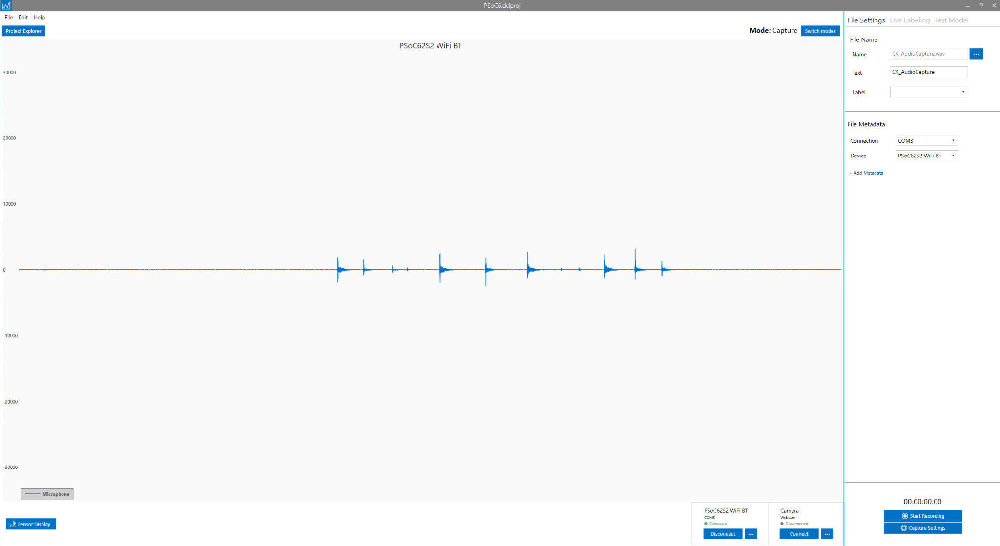

.. meta::
    :title: Guitar Note Audio Recognition
    :description: Example Application for Acoustic Event Recognition using Guitar Notes
    :sensiml:title: Guitar Note Audio Recognition
    :sensiml:excerpt: We use SensiML Analytics Toolkit to build a model that can run entirely on a microcontroller to classify guitar tuning notes.
    :sensiml:image: /documentation/_images/guitar-note-recognition-image.webp
    
=============================
Guitar Note Audio Recognition
=============================

.. figure:: /application-tutorials/img/guitar-tuning-notes/guitar-note-recognition-image.webp
    :align: center
    :alt: SensiML Guitar Note Recognition Image

Overview
--------

In this tutorial, we are going to build a model to classify guitar tuning notes that can run entirely on a microcontroller using the `SensiML Analytics Toolkit <https://sensiml.com/>`__. This tutorial will provide you with the knowledge to build an audio recognition model. You will learn how to

1. Collect and annotate audio data

2. Applying signal preprocessing

3. Train a classification algorithm

4. Create firmware optimized for the resource budget of an edge device

What you need to get started
----------------------------

We will use the `SensiML Analytics Toolkit <https://sensiml.com/documentation/>`__ to handle collecting and annotating sensor data, creating a sensor preprocessing pipeline, and generating the firmware. Before you start, sign up for SensiML `Community Edition <https://sensiml.com/plans/community-edition/>`__ to get access to the SensiML Analytics Toolkit.

The Software
````````````

-  SensiML :doc:`Data Studio </data-studio/overview>` (Windows 10) to record and label the sensor data.

-  We will use the `SensiML Analytics Studio <https://app.sensiml.cloud/>`__ for offline validation and code generation of the firmware

-  *(Optional)* `SensiML Open Gateway <https://github.com/sensiml/open-gateway>`__ or Putty/Tera Term to view model results in real-time


Hardware
`````````

 - Select from our list of `supported platforms <https://sensiml.com/products/supported-platforms/>`__
 - Use your own device by following the documentation for :doc:`custom device firmware </data-studio/adding-custom-device-firmware>`

Firmware
`````````

 - If you are using one of our supported platforms, you can find the instructions for getting the :doc:`firmware </data-studio/flashing-data-collection-firmware>`


Collecting and Annotating Sensor Data
-------------------------------------

Building real-world Edge AI applications requires high-quality annotated data. The process can be expensive, time-consuming, and open-ended (how much data is enough?). Further, applying the correct annotations to time series data is complicated without a clear data collection protocol and tooling.

The SensiML :doc:`Data Studio </data-studio/overview>` makes it easy to collect, annotate and explore their time-series sensor data. We will use the Data Studio to collect and annotate audio data in this tutorial.

Import Project
``````````````

1. Download the project

 :download:`Guitar Tuning Classification.zip <https://sensiml-data-depot.s3.us-west-2.amazonaws.com/Guitar+Tuning+Classification.zip>`

2. Import the project to your account using the Data Studio.

.. figure:: /application-tutorials/img/guitar-tuning-notes/dcl-import-project-button.png
            :align: center

This project includes some labeled audio files. You can view the audio files by opening them in Project Explorer in the top left corner of the navigation bar.

.. figure:: /application-tutorials/img/guitar-tuning-notes/dcl-project-explorer-button-guitar.png
   :align: center

Collect Data
````````````

To collect new data, click on the **Live Capture** button in the left navigation bar

.. figure:: /guides/getting-started/img/dcl-navigation-bar-left-live-capture-button.png
   :align: center

Select a sensor configuration for your device and then you can immediately start collecting audio data. Next, we are going to connect the board over USB Serial. Then click the connection settings to set the COM port to connect over.

.. figure:: /application-tutorials/img/guitar-tuning-notes/dcl-connection-settings.png
   :align: center

Click *Scan* and select the COM port assigned by your computer for your board.

.. figure:: /application-tutorials/img/guitar-tuning-notes/image40.png
   :align: center

The Data Studio will connect to the board and stream audio data.



For this demo, we used this YouTube video `https://www.youtube.com/watch?v=DlMrl3EQ1bs <https://www.youtube.com/watch?v=DlMrl3EQ1bs>`__ to record the audio from our speakers. Begin playing the video through your speakers and click the **Start Recording** button in the Data Studio to capture the audio data from the microphone.

.. figure:: /data-studio/img/dcl-live-capture-start-recording.png
   :align: center

Click the **Stop Recording** button to finish the recording. Review the confirmation screen and update any information, then click **Save**

.. figure:: /application-tutorials/img/guitar-tuning-notes/image3.png
   :align: center

Annotate Data
`````````````

Open the **Project Explorer** and open the newly captured file by double-clicking on the file name. You can add a **Segment** by right-clicking and dragging around the area of interest. Then you can apply a label by pressing **Ctrl + E** or clicking on the edit label button under the segment explorer. Once you have labeled the file, click **Save**.

.. note::  You can label more than one segment at the same time. Select multiple segments in the Segment Explorer, click **Ctrl + E**, and select the label.

.. figure:: /application-tutorials/img/guitar-tuning-notes/dcl-data-explorer-edit-segment-guitar.png
   :align: center


For more information on the capabilities of the Data Studio, see the :doc:`Data Studio documentation</data-studio/overview>`

Building a Model
----------------

Now we are going to build a model to classify the guitar notes. To build the model we will use the `SensiML Analytics Studio <https://app.sensiml.com>`__. Go to `https://app.sensiml.com <https://app.sensiml.com>`__ and sign in. Then open the project **Guitar Tuning Classification** project by clicking on the icon .\ |image9|

.. figure:: /application-tutorials/img/guitar-tuning-notes/image34.png
   :align: center

Once the project opens, you will see the overview screen. Here, you can see a high-level view of this project. You can also add notes (with markdown formatting) to the project description.

.. figure:: /application-tutorials/img/guitar-tuning-notes/image52.png
   :align: center

Create a Query
``````````````

We will create a query to select the training data for our machine learning pipeline. Click on the **Prepare Data** tab on the left to start building a query.

To create a query

1. Click the **Add New Query** button

2. Set the fields to match the image below

3. Click the **Save** button.


.. figure:: /application-tutorials/img/guitar-tuning-notes/image35.png
   :align: center

.. note::  You can build the cache for this query by clicking the **build cache** button at the top. If you don't create the cache now, it will build during the pipeline creation. The cache will not change until you rebuild, even if you change the project data. You can rebuild the cache at the Project Summary -> Query Tab.

Create a Pipeline
`````````````````

Now we will build a pipeline that will train a machine learning model on the training data. Click on the **Build Model** tab on the left. Then click on the **Create New Pipeline** button under the Create New Pipeline card.

.. figure:: /application-tutorials/img/guitar-tuning-notes/analytics-studio-pipeline-create.png
   :align: center

For this tutorial, we will use TensorFlow to build a neural network. To do that,

1. Click disable SensiML AutoML toggle

2. Select the box for TensorFlow Lite for Microcontrollers

3. Enter a pipeline name.

4. Click **Build**

This creates a template pipeline that we can edit.

.. figure:: /application-tutorials/img/guitar-tuning-notes/image2.png
   :align: center

The first thing this screen will ask is that you select a query. Select the Query that you just created in the prepare data screen.

.. figure:: /application-tutorials/img/guitar-tuning-notes/image44.png
   :align: center

Next, the Segmenter screen will open. We will select the sliding window segmentation algorithm. Set **window size** to 400 and set **slide** to 400, then click the **Save** button at the bottom of the screen.

.. figure:: /application-tutorials/img/guitar-tuning-notes/image46.png
   :align: center

The next step is to add a filter and some feature extractors to the Pipeline.

.. figure:: /application-tutorials/img/guitar-tuning-notes/image10.png
   :align: center

We will go ahead and remove the **Strip** transform that is there and replace it with an **Energy Threshold Filter.** To do that, click the trash icon on the **Strip** card.\ |image18|

.. figure:: /application-tutorials/img/guitar-tuning-notes/image37.png
   :align: center

To add the **Energy Filter Function,** click the |image20|\ icon between the Segmenter and Feature Generator.

.. figure:: /application-tutorials/img/guitar-tuning-notes/image4.png
   :align: center

Then

1. Select Segment Filter
2. Click **+Create**
3. Select **Segment Energy Threshold Filter**
4. Set the Threshold to **275**
5. Click Save

This Transform will filter out segments not above a specific threshold, preventing classification from running when the sounds are not loud enough.

.. note::  Based on the ambient noise and your device sensitivity, you might need to try a different threshold level. Typically, the adopted threshold should be slightly larger than the maximum amplitude of the signal in regions outside the labeled area.

Next, click the edit icon on the Feature Generator. We want to remove all of the features here and only add the MFCC. To do that

1. Uncheck all of the boxes

2. Click the **Clear Unselected** button

.. figure:: /application-tutorials/img/guitar-tuning-notes/image30.png
   :align: center

1. Click on the +Feature Generators button at the top\ |image23|

2. Expand the Frequency Feature generators

3. Check the MFCC box

.. figure:: /application-tutorials/img/guitar-tuning-notes/image39.png
   :align: center

1. Click the **Add** button

2. Click the **Save** button

Next, remove the **Isolation Forest** Filtering Step and the **Feature Selector** step in the pipeline by clicking the icons.\ |image25|

Your pipeline should now have the following steps.

.. figure:: /application-tutorials/img/guitar-tuning-notes/image13.png
   :align: center

Click the **Run Pipeline** button to start training the machine learning model.

.. figure:: /analytics-studio/img/analytics-studio-build-model-run-pipeline-button.png
   :align: center

You will see some status messages printed in the LOGS on the right side. These can be used to see where the pipeline is in the building process.

.. figure:: /application-tutorials/img/guitar-tuning-notes/image18.png
   :align: center

Once the pipeline completes, you will see a model pop up in the **Results** tab. You can click on the icon to see more detailed information about the model.\ |image29|

.. note::  Intermediate pipeline steps are stored in a cache. If you change any pipeline step parameters, the pipeline will start from cached values and only steps after your changes will run.

.. figure:: /application-tutorials/img/guitar-tuning-notes/image6.png
   :align: center

Explore Model
`````````````

This button will open up the **Model Explore** tab. The **Model Explore** tab has information about how the model performed on the training and validation data sets. In this case, the trained model had good accuracy on the cross-fold validation. The final model, however, performed poorly. We will retrain this model with modifications to the pipeline to get better results.

.. figure:: /application-tutorials/img/guitar-tuning-notes/image11.png
   :align: center

Retrain Model
`````````````

Go back to the **Build Model** tab to train a new model. Instead of just retraining, we will increase the duration of time that the model uses. The current pipeline only used a window with **400** samples, a small fraction of the signal. We will create a spectrogram to look at a longer fraction of the audio signal. To do that, add a **Feature Cascade** step between the **Min-Max Scale** and the **Classifier** steps.

.. figure:: /application-tutorials/img/guitar-tuning-notes/image1.png
   :align: center

To add the **Feature Cascade** step to the pipeline

1. Click the + button

2. Select Feature Transform

.. figure:: /application-tutorials/img/guitar-tuning-notes/image23.png
   :align: center

3. Click the **+Create** button

4. Select Feature Cascade

5. Set **Num Cascades** to 2

6. Set **Slide** to enabled

.. figure:: /application-tutorials/img/guitar-tuning-notes/image14.png
   :align: center

7. Click the **Save** button

Setting **Num Cascades** to 2 feeds data from **800** samples into the classifier. You can calculate this as **Num Samples** = **Window Size x Num Cascades**. The features from each segment window are placed into a feature bank. Features banks are stacked together before being fed to the classifier. With **Slide** enabled, the feature banks will act as a circular buffer, where the last one will be dropped when a new one is added, and classification will occur on every new Feature Bank.

Now that we have made that change, the modified pipeline should look like this.

.. figure:: /application-tutorials/img/guitar-tuning-notes/image21.png
   :align: center

Go ahead and rerun the model training by clicking the **Run Pipeline** button. You can continue tuning the parameters until you are satisfied with the model.

.. figure:: /analytics-studio/img/analytics-studio-build-model-run-pipeline-button.png
   :align: center

Model Validation and Testing
----------------------------

Testing a Model in the Analytics Studio
```````````````````````````````````````

Next, go to the **Test Model** tab and select the file with metadata **Test** in **Set**. This file was excluded from our training data by the Query we created. Then click the **Compute Accuracy** button to see how the model performs on this capture.

.. figure:: /application-tutorials/img/guitar-tuning-notes/image8.png
   :align: center

The results of the test will be displayed below. This model performs reasonably well on our test data, and it is worth running it on live data to see how it performs on the device.

.. note::  You can also run it against multiple files simultaneously and see the combined confusion matrix.

.. note::  When we run on the device, we will add a post-processing filter that performs majority voting over N classifications. The post-processing filter will remove noise from the classification, improving the overall accuracy.

.. figure:: /application-tutorials/img/guitar-tuning-notes/image48.png
   :align: center

Running a Model in Real-Time in the Data Studio
```````````````````````````````````````````````

Before downloading the Knowledge Pack and deploying it on the device, we can use the Data Studio to view model results in real-time with your data collection firmware.

In the Data Studio, open **Test Model mode** in the left navigation bar.

.. figure:: /data-studio/img/dcl-navigation-bar-left-test-model-button.png
   :align: center

Connect to your model by clicking **Connect** in the top right

.. figure:: /data-studio/img/dcl-test-model-knowledge-pack-connected.png
   :align: center

You can change your model by clicking the model options button in the top right.

.. figure:: /data-studio/img/dcl-test-model-change-knowledge-pack.png
   :align: center

Select the Knowledge Pack you just trained from the table.

.. figure:: /application-tutorials/img/guitar-tuning-notes/image38.png
   :align: center

Now play the YouTube video, and the Data Studio will run the model against the live stream data. The model classifications results are added to the graph in real-time.

.. figure:: /application-tutorials/img/guitar-tuning-notes/image16.png
   :align: center

If you are happy with the performance, it is time to put the model onto the device and test its performance in real-time.


Download/Flash Model Firmware
------------------------------

In the Analytics Studio, select your HW platform and download the Knowledge Pack Library.


.. figure:: /application-tutorials/img/guitar-tuning-notes/download-kp-generic.png
   :align: center


You can find instructions for flashing the Knowledge Pack to your specific device :doc:`here </knowledge-packs/flashing-a-knowledge-pack-to-an-embedded-device>`.

Running a Model in Real-Time on a Device
````````````````````````````````````````

You can download the compiled version of the Knowledge Pack from the Analytics Studio and flash it to your device firmware.

To see classification results use a terminal emulator such as Tera Term or the :doc:`SensiML Open Gateway </open-gateway/index>`. For additional documentation see :doc:`running a model on your embedded device</guides/getting-started/running-a-model-on-your-embedded-device>`.

If you have the Open Gateway installed, start it up, and select the recognition radio button and connection type serial. Scan for the correct COM port and set the baud rate to 1000000. Then Connect to the device.

.. figure:: /application-tutorials/img/guitar-tuning-notes/image32.png
   :align: center

Switch to Test mode, click the **Upload Model JSON** button and select the model.json file from the Knowledge Pack.

Set the Post Processing **Buffer** slider to **6** and click the **Start Stream** button. Then you can play the video and see the model classification from the device in real-time.

.. figure:: /application-tutorials/img/guitar-tuning-notes/image25.png
   :align: center

.. |image9| image:: /application-tutorials/img/guitar-tuning-notes/image49.png
   :width: 0.24554in
   :height: 0.20833in
.. |image18| image:: /application-tutorials/img/guitar-tuning-notes/image15.png
   :width: 0.20833in
   :height: 0.24802in

.. |image20| image:: /application-tutorials/img/guitar-tuning-notes/image47.png
   :width: 0.34375in
   :height: 0.23697in
.. |image23| image:: /application-tutorials/img/guitar-tuning-notes/image27.png
   :width: 0.30211in
   :height: 0.28621in
.. |image25| image:: /application-tutorials/img/guitar-tuning-notes/image15.png
   :width: 0.20833in
   :height: 0.24802in
.. |image29| image:: /application-tutorials/img/guitar-tuning-notes/image36.png
   :width: 0.22377in
   :height: 0.20833in
