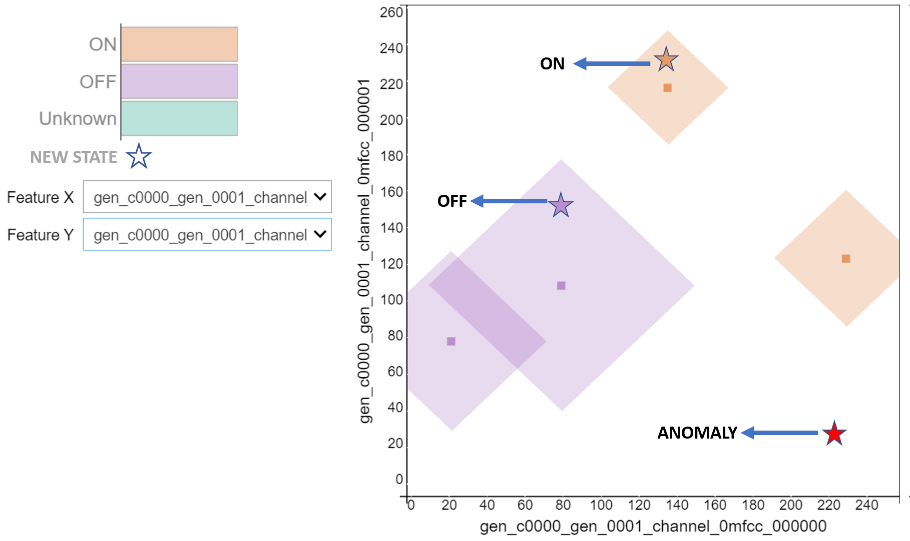
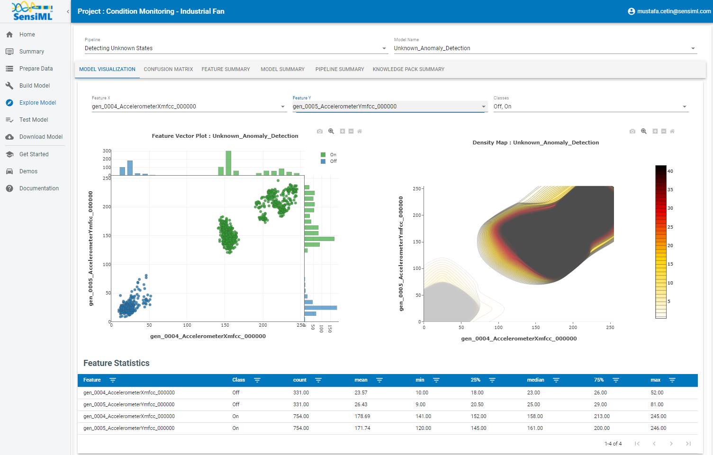
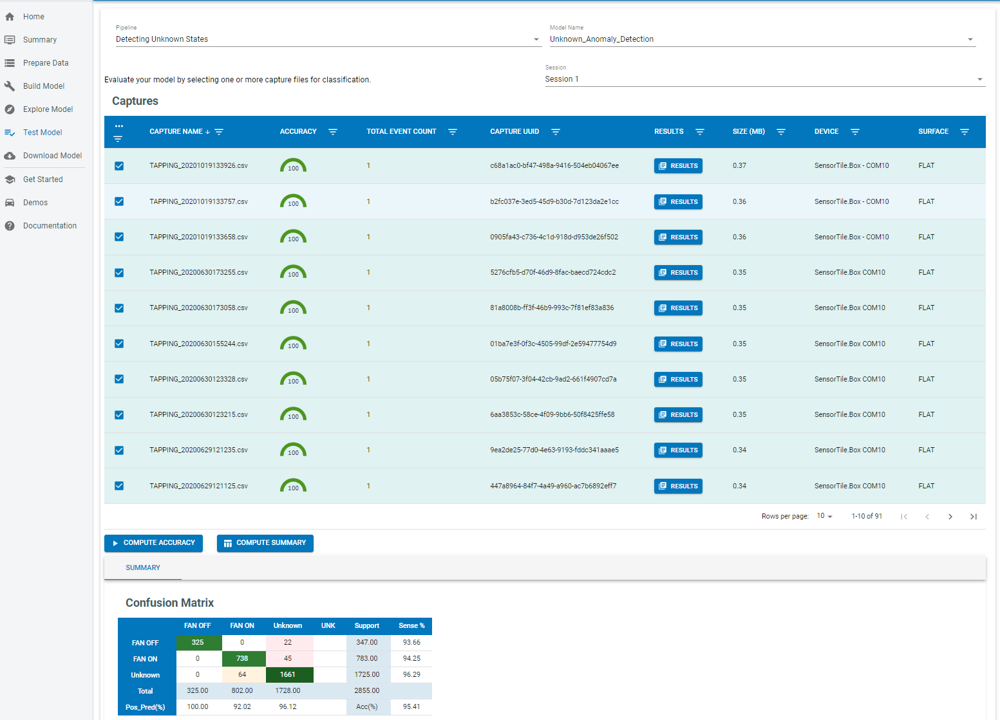
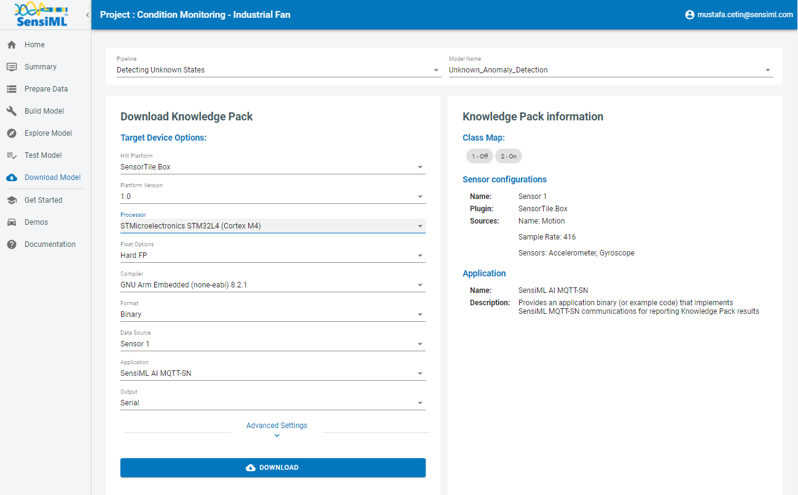

.. meta::
    :title: Vibration Anomaly Detection
    :description: Vibration Anomaly Detection
    :sensiml:title: Vibration Anomaly Detection
    :sensiml:excerpt: We build a predictive maintenance application with an unknown anomaly state for a fan that can run entirely on a cortex-M4 microcontroller.
    :sensiml:image: /documentation/_images/unknown-anomaly-detection-neuron-picture.PNG

Vibration Anomaly Detection
===========================

Overview
--------

 In this tutorial, we are going to build a predictive maintenance application with an unknown anomaly state for a fan that can run entirely on a cortex-M4 microcontroller using `SensiML Analytics Toolkit <https://sensiml.com/>`__. These technologies are applicable to a variety of domains where classifying time series sensor data is critical such as gesture recognition, activity recognition, sound classification, and keyword spotting.

Why do we need an unknown anomaly detection?
~~~~~~~~~~~~~~~~~~~~~~~~~~~~~~~~~~~~~~~~~~~~

Anomalies in systems deviate from the standard, happen rarely, and don't follow the known “pattern”. Depending on your exact use case and application, anomalies only typically occur between 0.001 to 1% of the time — that's an incredibly small fraction of the data. Therefore, collecting samples for the anomalies is a very expensive process and sometimes it is not possible. On the other hand, failure to detect an anomaly may cause a serious problem.

In this tutorial, we will build a model that will create a prediction for known vibration states and return “unknown” for vibration anomalies. Our approach is using known states (“OFF”,“ON”) to create an influence area for each class. If a new state falls in the influence area(neurons), the model will create a prediction for “OFF” or “ON” states. For any other vibration states that fall outside of the influence area, the model will create a prediction of “unknown”.

The figure below demonstrates the neuron(squares shapes) structure of the model and how to detect known and unknown vectors(stars shapes).

   Area of influence

Objective
~~~~~~~~~

1. Demonstrate how to collect and annotate a high-quality dataset of machine state for the fan using the SensiML Data Studio.
2. Build a data pipeline to extract features in real-time on your target device.
3. Train a classification model using SensiML custom pipeline.
4. Convert the model into a Knowledge Pack and flash it to our target embedded device.
5. Perform live validation of the Knowledge Pack running on-device using the SensiML TestApp.

Capturing Sensor Data
---------------------

For every machine learning project, the quality of the final product depends on the quality of your curated data set. Time series sensor data, unlike image and audio, are often unique to the application as the combination of sensor placement, sensor type, and event type greatly affects the type of data created. Because of this, you will be unlikely to have a relevant dataset already available, meaning you will need to collect and annotate your own dataset.

To help you to build a data set for your application we have created the SensiML :doc:`Data Studio </data-studio/overview>`, which we are going to use for collecting and annotating data for different fan states. If you are using the `demo version <https://app.sensiml.cloud/demo>`__ of SensiML this project is already uploaded to the account as the **Condition Monitoring - Industrial Fan**. 

:download:`Fan_State_Condition_Monitoring.zip </application-tutorials/file/fan-state-condition-monitoring/Fan_State_Condition_Monitoring.zip>`

1. Unzip the files and import the dataset to the Data Studio by clicking ``Import Project``

Below you can see a quick demonstration of how the Data Capture lab enabled us to create an annotated fan state data set. In the next few sections, we are going to walk through how we used the Data Studio to collect and label this dataset.

Determining events of interest
~~~~~~~~~~~~~~~~~~~~~~~~~~~~~~

Detecting and classifying events is ultimately the main goal of a time series application. In general, events fall into one of two types: continuous or discrete. For this tutorial, we will focus only on the continuous events.

**Continuous “Status” Events**

Continuous events are events that happen over longer, gradual intervals or periods of time. Think of them like you are looking for the current status of the device. An example of this includes a motor fault detection sensor. The sensor will detect a continuous “Normal” status or in a continuous “Failure” status. Another example is a fitness wearable, where you classify the user's activity status (Running, Walking, Resting).

**Why is this important?**

The type of event you are trying to detect will change the way you want to train your raw sensor data in the SensiML toolkit. In the SensiML Data Studio, you can put what we call Segment Labels on any portion of your sensor data. This allows you to accurately mark wherein the dataset each type of event is occurring.

Capturing environmental context
~~~~~~~~~~~~~~~~~~~~~~~~~~~~~~~

In addition to labels, it is also important to capture information about the environment. Capturing this contextual information enables you to build highly tailored models. Additionally, it makes it possible to diagnose why a model might be failing for subsets of your data.

For example, in this fan state dataset, we captured several contextual properties such as data collector, location, surface type, etc. Using these we would be able to build a model for fans that are on different types of surfaces as well as allowing us to understand if certain surfaces perform poorly.

You can capture the contextual information in the Data Studio using the metadata properties. Metadata are applied to the entire captured file, so when you are creating your data collection strategy think carefully about what information you may need. Metadata can be created as a selectable dropdown or manual entry allowing flexibility for your data collectors. You can also edit your metadata if there is a test case you did not initially account for.

Capturing Data
~~~~~~~~~~~~~~

It's time to start collecting data. To collect data, we will go to the **Capture** mode in the Data Studio. The first thing we need to do is to set up the sensor that we would like to use. For this tutorial, we are using the **ST SensorTile**. There are several other sensors with built-in support. You can see more information about this board :doc:`here </firmware/st-sensortile/st-sensortile>`.

We will configure Accelerometer and Gyroscope sensors to capture vibration data at a sample rate of **400Hz**. In this tutorial, the data is stored directly to an internal SD card then transferred directly to our computer.

After specifying our sensor configuration, we will connect to the device and be ready to record live data. The captured data will be saved locally to your computer as well as be synced up to the SensiML cloud. This allows other members of your team who have permission to see and label your new captured file. Alternatively, if you already have a data collection method for your device, the Data Studio can import CSV or WAV files directly so you can still use it for annotating the data. Also, you can record a video during data collection. Details can be found :doc:`here </open-gateway/recording-webcam-videos>`.

The video below walks through capturing and syncing the data to your cloud project with the Data Studio.

*The video below walks through:*

-  Open the project
-  Connecting Data Studio to edge device
-  Adding data to your cloud project with the Data Studio

.. raw:: html

    <iframe width="800" height="450" src="https://www.youtube.com/embed/7mixHMyctt0?autoplay=0&rel=0&version=3&&loop=1" frameborder="0"></iframe>

Annotating Events of Interest
~~~~~~~~~~~~~~~~~~~~~~~~~~~~~

The Data Studio has a manual label mode and an automatic event detection mode. For this tutorial, we are going to use manual event labels. We will label the regions where the fan is in a particular state. When we go to build the model, we will use a sliding window of 1 second to generate features to feed into our classifier.

Right-click on the graph to create a segment around your event of interest. Next, click the edit button to select the label that is associated with that event. If you have collected your data set through other means, you can also import CSV or WAV files into the Data Studio. More details can be found `:doc:`here </data-studio/importing-external-sensor-data>`.

The video below walks you through how to label the events of a captured file in the SensiML Data Studio.

.. raw:: html

    <iframe width="800" height="450" src="https://www.youtube.com/embed/EyZEZQIDegA?autoplay=0&rel=0&version=3&&loop=1" frameborder="0"></iframe>

Building a Model
----------------

The SensiML Analytics Studio is where you can create the following steps

-  Create a query and pull data into your model
-  Adding model building steps to the pipeline
-  Explore the model
-  Validate model accuracy against raw signal data
-  Download your model as firmware code for the target device

For the next part of the tutorial, you will need to log into `Analytics Studio <https://app.sensiml.cloud/>`__

Creating a Query
~~~~~~~~~~~~~~~~

We will first start off by selecting the “Condition Monitoring - Industrial Fan” project which is created with the SensiML Data Studio. When you select the project, you will see an overview of all the captures, queries, pipelines, and models that are part of the project. We will start off by creating a query.

The query is used to select your sensor data from your project. If you need to filter out certain parts of your sensor data based on metadata or labels, you can specify that here.

.. figure:: img/unknown-anomaly-detection-prepare-data-1-IMU.PNG
   :alt: Prepare Data
   :width: 800px
   :height: 285px

   Prepare Data

1. Open the Prepare Data screen to create a query
2. Create a new query with the following properties:

::

   * Query Name: Q_OFF_ON
   * Session: Session_1
   * Label: Label
   * Metadata: segment_uuid, capture_uuid
   * Source: Select all columns 
   * Filter: [Label] IN [OFF,ON]

3. After clicking **Save** the Analytics Studio will count all the **events of interest** you have labeled in this project and graph them

SensiML Python SDK
~~~~~~~~~~~~~~~~~~

We are going to connect to SensiML's cloud engine using the SensiML Python SDK. If you have not yet created an account on SensiML you will need to do that before continuing. You can create a free account by going `here <https://sensiml.com/plans/community-edition/>`__

To install the SensiML Python SDK in your environment, run the command in the following cell. ``!pip install sensiml -U``

Import the SensiML Python SDK and use it to connect to SensiML Cloud. Run the following cell, which will ask you for your username and password. After connecting, you will be able to use the SensiML Python SDK to manage the data in your project, create queries, build and test models as well as download firmware. Further documentation for using the SensiML Python SDK can be found :doc:`here </sensiml-python-sdk/overview>`.

.. code:: ipython3

    from sensiml import *
    client = SensiML()

.. raw:: html

    

Next we are going to connect to our **Condition Monitoring - Industrial Fan** project. Run the following cell to connect to the project.

.. code:: ipython3

    client.project = 'Condition Monitoring - Industrial Fan'

Creating a pipeline
~~~~~~~~~~~~~~~~~~~

Pipelines are a key component of the SensiML workflow. Pipelines store the preprocessing, feature extraction, and model building steps. When training a model, these steps are executed on the SensiML server. Once the model has been trained, the pipeline is converted to a firmware code that will run on your target embedded device. For more documentation on pipelines see the advanced model building :doc:`tutorial </sensiml-python-sdk/getting-started-with-the-sensiml-python-sdk>`. To create a new empty pipeline, run the cell below.

.. code:: ipython3

    client.pipeline = 'Detecting Unknown States'

.. parsed-literal::

    Sandbox Detecting Unknown States does not exist, creating a new sandbox.
    

Now we are going to add our preprocessing steps to the pipeline, for a detailed description of the features available in a pipeline see the documentation :doc:`here </pipeline-functions/overview>`.

You can also list the functions by running
``client.list_functions(qgrid=False)`` in a code cell of the notebook.

Adding steps to the pipeline
~~~~~~~~~~~~~~~~~~~~~~~~~~~~

The pipeline for this tutorial will consist of the following steps:

Input Query
^^^^^^^^^^^

Define the query that will be used in the pipeline.

.. code:: ipython3

    client.pipeline.reset()
    
    client.pipeline.set_input_query("Q_OFF_ON")

Signal Transform - Performing Segmentation
^^^^^^^^^^^^^^^^^^^^^^^^^^^^^^^^^^^^^^^^^^

The next step is to segment our data into windows which we can perform recognition on. For periodic events, we want to use the Windowing Transform. Delta is the sliding window overlap. Setting delta to the same value as the window size means that there is no overlap in our segmented windows.

Different window sizes can lead to better models. Since We will use MFCC features (it accept the time series <= 400 time points), we will set the window_size and delta to 400.

.. code:: ipython3

    client.pipeline.add_transform("Windowing", params={"window_size": 400, "delta": 400})

Segment Transform - Strip
^^^^^^^^^^^^^^^^^^^^^^^^^

This transform shifts the entire signal towards 'mean' or 'min' before calling the feature generation and classification. In this tutorial we will use the mean options.

.. code:: ipython3

    sensor_columns = list(client.project.columns())
    client.pipeline.add_transform(
        "Strip", params={"input_columns": sensor_columns, "type": "mean"}
    )

Feature Vector Generation
^^^^^^^^^^^^^^^^^^^^^^^^^

At this point, we are ready to generate a feature vector from our segments. Feature generators are algorithms to extract relevant feature vectors for model building. In this tutorial we will use MFCC features and set cepstra count to 2. Details of the features can be found :doc:`here </pipeline-functions/feature-generators>`.

Why do we need MFCC features?
'''''''''''''''''''''''''''''

MFCCs are the Mel Frequency Cepstral Coefficients. MFCC takes into account vibration perception for sensitivity at appropriate frequencies by converting the conventional frequency to Mel Scale. Therefore, it is quite suitable for vibration (frequency based) recognition tasks.

Why cepstra_count is 2?
'''''''''''''''''''''''

Since the goal of this project is building a predictive maintenance application with an unknown anomaly state, we will use more features than what we need to expend the solution space. When we set cepstra count to 2, SensiML creates 2 MFCC features for each time series channel. In this project, we have 6 time series channels (3 Accelerometers and 3 Gyroscope) and SensiML will create 12 features. These features will help to detect the known and unknown states.

Based on the complexity of the problem and the number of the known states, **cepstra count may require tuning**.

.. code:: ipython3

    client.pipeline.add_feature_generator(
        [
            {
                "name": "MFCC",
                "params": {
                    "columns": sensor_columns ,
                    "sample_rate": 400,
                    "cepstra_count": 2,
                },
            }
        ]
    )

Feature Transform - Isolation Forest Filtering
^^^^^^^^^^^^^^^^^^^^^^^^^^^^^^^^^^^^^^^^^^^^^^

Removing the outliers and noisy data is useful to improve the robustness of the model. In this tutorial, we will use the Isolation Forest Filtering. List of filters can be found :doc:`here </pipeline-functions/samplers>`

.. code:: ipython3

    client.pipeline.add_transform("Isolation Forest Filtering")

Feature Transform - Min Max Scale
^^^^^^^^^^^^^^^^^^^^^^^^^^^^^^^^^

Our classifiers are optimized for performance and memory usage to fit on resource constrained devices. Because of this we scale the features in the feature vector to be a single byte each so we need to add the Min Max Scale transform to the pipeline. This function will scale the features in the feature vector to have values between 0 and 255.

Why do we need pad?
'''''''''''''''''''

It can be used to make min max more robust to unseen data. “pad” changes the min and max value of each feature by “+-col.std()/pad” while keeping the solution space in 8bits(0~255 values). Setting the pad value to 1 maximizes the space between the border of the solution space and the min and max value of each feature. Setting the pad value to 0 is equivalent to setting the pad value to None.

Based on the complexity of the problem and the number of the known states, **pad value may require tuning**.

.. code:: ipython3

    client.pipeline.add_transform("Min Max Scale", params={"pad":8})

Classification Algorithm
^^^^^^^^^^^^^^^^^^^^^^^^

Classification algorithms take a feature vector as an input and return a classification based on a pre-defined model. The SensiML toolkit supports a variety of classifiers, for this tutorial we will use a classifier with an RBF activation and distance mode of L1.

Why do we need RBF?
'''''''''''''''''''

This is a classifier that can create a prediction for “unknown” state. It limits the area of interest with the borders of the known data clusters.

.. code:: ipython3

    client.pipeline.set_classifier(
        "PME",
        params={
            "classification_mode": "RBF",
            "distance_mode": "L1",        
        },
    )

Training Algorithms
^^^^^^^^^^^^^^^^^^^

The training algorithm attempts to optimize the number of neurons and their locations in order to create the best model. We are using the training algorithm “Hierarchical Clustering with Neuron Optimization,” which uses a clustering algorithm to optimize a neurons placement in the feature space.

Number of neurons may require tuning based on the number of different classes in the data set.

Why do we use “Hierarchical Clustering with Neuron Optimization”
''''''''''''''''''''''''''''''''''''''''''''''''''''''''''''''''

This optimization algorithm design to set the tight border around the known feature data by maximizing the solution space for unknown states. Based on the complexity of the feature distribution and the number of the known states, **number of the neurons may require tuning**.

To better understand the relation between the feature distribution and neuron creation see **“How to interpret the results?”** section.

.. code:: ipython3

    client.pipeline.set_training_algorithm(
        "Hierarchical Clustering with Neuron Optimization",
        params={"number_of_neurons": 50, "cluster_method": "kmeans"},
    )

Validation Methods
^^^^^^^^^^^^^^^^^^

Validation methods are used to check the robustness and accuracy of a model and diagnose if a model is overfitting or underfitting. Since we are trying to create a prediction for unknown states, we want to cover all known states by limiting the influence field with known data. Therefore we will use validation method with a “recall” option. More details regarding the validation methods can be found :doc:`here </pipeline-functions/validation-algorithms>`

.. code:: ipython3

    client.pipeline.set_validation_method("Recall")
    client.pipeline.set_tvo({"validation_seed": 0})

Execute the Pipeline
^^^^^^^^^^^^^^^^^^^^

The final step is where the pipeline is sent to the SensiML Cloud Engine for execution, once the job is completed the results will be returned to you as a model object.

.. code:: ipython3

    results, stats = client.pipeline.execute()

.. parsed-literal::

    Executing Pipeline with Steps:
    
    ------------------------------------------------------------------------
     0.     Name: Q_OFF_ON                  		Type: query                    
    ------------------------------------------------------------------------
    ------------------------------------------------------------------------
     1.     Name: Windowing                 		Type: segmenter                
    ------------------------------------------------------------------------
    ------------------------------------------------------------------------
     2.     Name: Strip                     		Type: transform                
    ------------------------------------------------------------------------
    ------------------------------------------------------------------------
     3.     Name: generator_set             		Type: generatorset             
    ------------------------------------------------------------------------
    ------------------------------------------------------------------------
     4.     Name: Isolation Forest Filtering 		Type: sampler                  
    ------------------------------------------------------------------------
    ------------------------------------------------------------------------
     5.     Name: Min Max Scale             		Type: transform                
    ------------------------------------------------------------------------
    ------------------------------------------------------------------------
     6.     Name: tvo                       		Type: tvo                      
    ------------------------------------------------------------------------
    	Classifier: PME
    		classification_mode: RBF
    		distance_mode: L1
    		max_aif: 16384
    		min_aif: 2
    		num_channels: 1
    		reinforcement_learning: False
    		reserved_patterns: 0
    
    	Training Algo: Hierarchical Clustering with Neuron Optimization
    		aif_method: max
    		centroid_calculation: robust
    		cluster_method: kmeans
    		flip: 1
    		linkage_method: average
    		max_number_of_weak_vector: 1
    		min_number_of_dominant_vector: 3
    		number_of_neurons: 50
    		singleton_aif: 0
    
    	Validation Method: Recall
    
    ------------------------------------------------------------------------
    
    Status: Running, Time: 0.34, STEP:   3/7, NAME: generator\_, TYPE: generators, BATCH:      3/3 
    
    Results Retrieved... Execution Time: 0 min. 32 sec.
    

Model summary
~~~~~~~~~~~~~

After executing the pipeline, the cloud computes a model summary as well as a confusion matrix. The model summary gives a quick overview of the model performance so we can see what the accuracy of the quantized model was across our data set.

.. code:: ipython3

    results.summarize()

.. parsed-literal::

    TRAINING ALGORITHM: Hierarchical Clustering with Neuron Optimization
    VALIDATION METHOD:  Recall
    CLASSIFIER:         PME
    
    AVERAGE METRICS:
                     F1_SCORE:  99.0  std: 0.00
                    PRECISION:  100.0  std: 0.00
                  SENSITIVITY:  98.1  std: 0.00
    
    --------------------------------------
    
    RECALL MODEL RESULTS : SET VALIDATION
    
    MODEL INDEX: Fold 0
                     F1_SCORE:    train: 99.03  validation: 99.03  
                  SENSITIVITY:    train: 98.09  validation: 98.09  
    
    

Confusion matrix
~~~~~~~~~~~~~~~~

The confusion matrix provides information not only about the accuracy but also what sort of misclassifications occurred. The confusion matrix is often one of the best ways to understand how your model is performing, as you can see which classes are difficult to distinguish between. The confusion matrix here also includes the Sensitivity and Positive Predictivity for each class along with the overall accuracy.

.. code:: ipython3

    model = results.configurations[0].models[0]
    cm = model.confusion_matrix_stats
    cm['validation'].confusion_matrix_data_frame

.. raw:: html

    

    
    <table border="1" class="dataframe">
      <thead>
        <tr style="text-align: right;">
          <th></th>
          <th>ClassIn</th>
          <th>Off</th>
          <th>On</th>
          <th>UNK</th>
          <th>UNC</th>
          <th>Support</th>
          <th>Sens(%)</th>
        </tr>
      </thead>
      <tbody>
        <tr>
          <th>0</th>
          <td>Off</td>
          <td>328.0</td>
          <td>0.0</td>
          <td>3.0</td>
          <td>0.0</td>
          <td>331</td>
          <td>99.093656</td>
        </tr>
        <tr>
          <th>1</th>
          <td>On</td>
          <td>0.0</td>
          <td>732.0</td>
          <td>22.0</td>
          <td>0.0</td>
          <td>754</td>
          <td>97.082228</td>
        </tr>
        <tr>
          <th>2</th>
          <td>UNK</td>
          <td>0.0</td>
          <td>0.0</td>
          <td>0.0</td>
          <td>0.0</td>
          <td>0</td>
          <td>NaN</td>
        </tr>
        <tr>
          <th>3</th>
          <td>Total</td>
          <td>328.0</td>
          <td>732.0</td>
          <td>25.0</td>
          <td>0.0</td>
          <td>1085</td>
          <td>0.000000</td>
        </tr>
        <tr>
          <th>4</th>
          <td>PosPred(%)</td>
          <td>100.0</td>
          <td>100.0</td>
          <td>NaN</td>
          <td>0.0</td>
          <td>Acc(%)</td>
          <td>97.695853</td>
        </tr>
      </tbody>
    </table>
    

How to interpret the results?
~~~~~~~~~~~~~~~~~~~~~~~~~~~~~

Creating a model for with an unknown anomaly state may requires domain knowledge about the data set and tuning the pipeline parameters. To better understanding the relation of feature distribution and neuron creation see the figure below.

-  First, we need to get the features which used to create the model based on the neuron creation.

.. code:: ipython3

    features = client.pipeline.data(5)

-  Display the features and neurons.

.. code:: ipython3

    f1 = features.columns[8]
    f2 = features.columns[6]
    client.pipeline.visualize_neuron_array(model, featureX=f1, featureY=f2, feature_vector=features)

.. image:: /application-tutorials/vibration-anomaly-detection_files/vibration-anomaly-detection_46_0.png

The figure above shows features(dots) from known states which are tightly covered by neurons(squares). So if any feature falls outside the neural space will be labelled as an “unknown” state.

Saving the Model
~~~~~~~~~~~~~~~~

Finally, we save the model knowledge pack with a name. This tells the server to persist the model. Models that you persist can be retrieved and viewed in the Analytics Studio in the future. Models that are not saved will be deleted when the pipeline is rerun.

.. code:: ipython3

    model.knowledgepack.save("Unknown_Anomaly_Detection")

Exploring the Created Models
~~~~~~~~~~~~~~~~~~~~~~~~~~~~

In the Explore Model tab, you can get more information about the models that were generated. In this tab you can find the following options:

-  Model Visualization
-  Confusion Matrix
-  Feature Summary
-  Model Summary
-  Pipeline Summary
-  Knowledge Pack Summary

After selecting your pipeline and a model to explore, you can see the performance of your model in confusion matrix that describes how well the model performed at recognizing each class based on validation data. If the selected model is a hierarchical model, the structure of the model and sub-models can be seen in the explore model tab as shown below.

   Explore The Model

Testing a Model in the Analytics Studio
---------------------------------------

Before you flash the model to the device, you can test the model using the Test Model tab. You can test against any of the captured data files. To do this:

1. Go to the Explore Model tab of the Analytics Studio.
2. Select the pipeline you built the model with.
3. Select the model you want to test.
4. Select any of the capture files in the Project.
5. Click RUN to classify that capture using the selected model.

The model will be compiled in the SensiML Cloud and the output of the model will be returned. The graph shows the segment start and segment classified for all the detected events.

   Test Model

Our model is trained with 'OFF' and 'ON' vibration states. We tested our model with known ('OFF', 'ON') and unknown states (TAPPING, FAN_GUARDS and BLADE FAULT). Our model is able to create a prediction for the known vibration states which are OFF and ON. Also it creates a prediction for all other vibration states as “unknown”.

Results
~~~~~~~

Our model successfully creates a prediction for known and unknown states.

Live Model Validation
---------------------

Downloading the Knowledge Pack
~~~~~~~~~~~~~~~~~~~~~~~~~~~~~~

Now that we have validated our model it is time for a live test. To build the firmware for your specific device go to the Download Model tab of the Analytics Studio. We support the compiled binaries for our target platforms which include fully configured sensors and classification reporting over BLE. We also provide compiled libraries that can be integrated into your application. For enterprise customers, you will have full access to the SDK and can take the compiled models and modify or optimize them for your target devices.

If you are using the community edition of SensiML you can download the firmware binary or library for your device. Head over to the `Analytics Studio <https://app.sensiml.cloud>`__ to download your model and flash it to the device. To download the firmware for this tutorial

1. Go to the **Download Model** tab of the Analytics Studio
2. Select the pipeline and model you want to download
3. Select the HW platform **ST SensorTile**
4. Select Format **Binary**
5. To turn on debug output check Advanced Settings and set **Debug** to True
6. Click on Output and add **BLE** as an option as well which enables UART output over serial
7. Click Download and the model will be compiled and downloaded to your computer.
8. Unzip the downloaded file and flash to your device.

   Download The Model

After downloading the Knowledge Pack, follow the instructions associated with your firmware for flashing it. We have flashing instructions for our supported boards :doc:`here </knowledge-packs/flashing-a-knowledge-pack-to-an-embedded-device>`.

Summary
-------

We hope you enjoyed this tutorial using SensiML Analytics Toolkit. In this tutorial we have covered how to:

1. Collect and annotate a high-quality data set.
2. Build a pipeline using SensiML.
3. Use the SensiML Analytics Toolkit - Test Model to perform validation/test of the model.

For more information about SensiML visit our website. To work with us to enable you to build your application get in `touch with us <https://sensiml.com/contact/>`__.

`SensiML <https://sensiml.com>`__
~~~~~~~~~~~~~~~~~~~~~~~~~~~~~~~~~

SensiML enables developers to quickly and easily create machine learning models that run locally on resource-constrained edge devices. SensiML SaaS provides an end to end solution from collecting and annotating a high-quality sensor time-series data set, to analyzing and building data models using AutoML, and finally generating firmware that will run on your target device.
