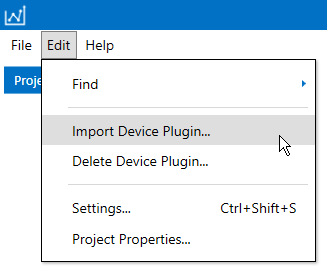
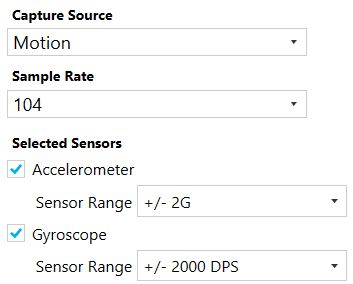

.. meta::
   :title: Data Studio - Adding Custom Device Firmware
   :description: How to add your own custom device firmware in the Data Studio

.. |br| raw:: html

    

Adding Custom Device Firmware
=============================

The Data Studio supports data collection from any third-party hardware.

.. note:: If you have your own means of collecting sensor data from your embedded device, the Data Studio can import CSV/WAV datasets from any source. See more on the various import formats described in the :doc:`Importing External Sensor Data Documentation<importing-external-sensor-data>`.

Interfacing with Data Collection Firmware
-----------------------------------------

Follow the steps below to use your embedded device to capture sensor data in the Data Studio.

1. Implement the SensiML Simple Streaming Interface in your embedded device firmware. The Simple Streaming Interface specification can be found in the :doc:`Simple Streaming Interface Documentation<../simple-streaming-specification/introduction>`.

2. Create a Device Plugin. A Device Plugin is created by implementing an .SSF (SensiML Sensor Format) file. We will go over how to define the .SSF file below.

Device Plugins
--------------

Device Plugins are a list of properties that describe how the Data Studio will collect data from your device. For example, the device plugin may contain a list of sample rates that your device supports. This allows the Data Studio to collect data from any device that has been built to accept the supported parameters below.

.. _how_to_import_plugin:

How to Import a Device Plugin
-----------------------------

The Data Studio allows you to import Device Plugins via .SSF files. We will define the SSF file format in the next section below. For now, just note that you can import your SSF file through the menu item *Edit* → *Import Device Plugin*…

.. _example_ssf_files:

Example SSF File
----------------

* :download:`Example SSF File <file/example.ssf>`

.. note:: Device Plugins require that you set your own ``uuid`` property in the SSF file. The ``uuid`` is how the Data Studio identifies your Device Plugin.

SSF File Format
---------------

The Data Studio allows you to import Device Plugins via .SSF files. Let's go over the SSF file format and how this file will be used in the Data Studio. The SSF file format is a JSON based format with JSON properties that the Data Studio will use when configuring your Device Plugin.

1. Open the :download:`Example SSF File <file/example.ssf>` in any text editor and look at the properties. We will define these properties in the next section.

When you import your Device Plugin the Data Studio will use the plugin to dynamically build out a screen for a user to configure sensor properties during data collection. See a screenshot below for a better understanding of how these parameters will be displayed in the Data Studio:

Notice that there are options for selecting your Device Plugin *sample rate* and *sensors* in the screenshot. Now, let's look at how this screen will map to the SSF file format.

JSON Object Definitions
-----------------------

**Device Plugin**

.. csv-table::
   :widths: 5,20

   uuid, (GUID) A unique ID to identify a plugin
   device_name, (String) Name of your device
   device_manufacturer, (String) Name of the developer or company that manufacturers the device
   plugin_developer, (String) Name of the developer or company that developed the Device Plugin
   firmware_download_links, (List<Object>) A list of links that a user can use to find information on updating the device firmware for data collection. See how to define a firmware_download_link in the :ref:`Plugin Link <plugin-link-ref>` section
   documentation_links, (List<Object>) A list of links that a user can use to find information on general tutorials or useful documentation about the device. See how to define a documentation_link in the :ref:`Plugin Link <plugin-link-ref>` section
   capture_sources, (List<Object>) Defines each of the sensors in your device. See how to define the capture_source JSON property in the :ref:`Capture Source <capture-source-ref>` section
   device_connections, (List<Object>) Defines the connection protocols your board supports. See how to how to define the device_connection JSON property in the :ref:`Device Connection <device-connection-ref>` section
   is_little_endian, (Boolean) Defines if your embedded device is little endian (true) or big endian (false)

Example Device Plugin:

.. code-block:: json

    {
        "uuid": "00000000-0000-0000-0000-000000000000",
        "device_name": "Your Device Name",
        "device_manufacturer": "You Device Manufacturer",
        "plugin_developer": "Your Device Plugin Developer",
        "firmware_download_links": [
        ],
        "documentation_links": [
        ],
        "capture_sources": [
        ],
        "device_connections": [
        ],
        "is_little_endian": true
    }

.. _plugin-link-ref:

**Plugin Link**

.. csv-table::
   :widths: 5,20

   title, (String) A user-friendly title for the link. Example: Data Collection Tutorial
   description, (String) An optional field used to describe the contents of the link
   link, (String) Hyperlink URL location. Example: https://sensiml.com/documentation/data-studio/flashing-data-collection-firmware.html

Example Plugin Link:

.. code-block:: json

    {
        "title": "Data Collection Firmware",
        "description": "",
        "link": "https://sensiml.com/documentation/data-studio/flashing-data-collection-firmware.html"
    }

.. _capture-source-ref:

**Capture Source**

.. csv-table::
   :widths: 5,20

   name, (String) Display name for your source. Example: Motion is used to describe a source that can supply both an Accelerometer and a Gyroscope sensor. Audio is used to describe a source that is a Microphone sensor.
   part, (String) Name of the device hardware part. Set to “Default” if a device only has one
   sample_rates, (List<Integer>) A list of all available sample rates your device can support
   sensors, (List<Object>) Defines the sensors your board supports. See how to how to define the sensor JSON property in the :ref:`Sensor <sensor-ref>` section

Example Capture Source:

.. code-block:: json

    {
        "name": "Motion",
        "part": "Default",
        "sample_rates": [
            400,
            200,
            100,
            50
        ],
        "sensors": [
        ]
    }

.. _sensor-ref:

**Sensor**

.. csv-table::
   :widths: 5,20

   type, (String) Class/name of the sensor. Example: Accelerometer
   is_default, (Boolean) Defines if this sensor is selected as a default option in the Data Studio user interface
   column_count, (Integer) Defines how many columns of data this sensor sends
   column_suffixes, (List<String>) A list of strings used to describe sensors axes or channels. During data collection the Data Studio will append the column_suffix to the sensor name to create the sensor column names. For example: X | Y | Z on Accelerometer would save as AccelerometerX | AccelerometerY | AccelerometerZ
   parameters, (List<Object>) Defines a list of sensor specific parameters such as Accelerometer range or Microphone gain. See how to how to define the sensor_parameter JSON property in the :ref:`Sensor Parameter <sensor-parameter-ref>` section

Example Sensor:

.. code-block:: json

    {
        "type": "Accelerometer",
        "is_default": true,
        "column_count": 3,
        "column_suffixes": [
            "X",
            "Y",
            "Z"
        ],
    }

.. _sensor-parameter-ref:

**Sensor Parameter**

Sensor Parameters are used to define properties you wish to send to the sensor during data collection or recognition. For example setting the Range in an Accelerometer sensor.

We do not support Sensor Parameters out-of-the-box, but if you `contact the SensiML integration team <https://sensiml.com/contact/>`__, we can work with you.

.. csv-table::
   :widths: 5,20

   name, (String) Name of the parameter sent as an unsigned integer value to the device. It must match the definition used on your device. This is used for both data collection and for a Knowledge Pack to configure your sensors.
   values, (List<Object>) Defines a list of available parameter values for the user to select. See how to how to define the value JSON property in the :ref:`Sensor Parameter Value<sensor-parameter-value-ref>` section

.. _sensor-parameter-value-ref:

**Sensor Parameter Value**

.. csv-table::
   :widths: 5,20

   display_value, (String) Value to be displayed to the user
   actual_value, (Integer) Value to be used when configuring the device (saved as an unsigned 64-bit value). This can be turned into a byte array with the *num_bytes* property
   num_bytes, (Integer) The number of bytes that the *actual_value* property needs to be converted. This is typically one byte.

Sensor Paramater/Parameter Value Example:

.. code-block:: json

    {
        "name": "Accelerometer Range",
        "values": [
            {
                "actual_value": 20,
                "num_bytes": 1,
                "display_value": "+/- 2G"
            },
            {
                "actual_value": 40,
                "num_bytes": 1,
                "display_value": "+/- 4G"
            },
            {
                "actual_value": 80,
                "num_bytes": 1,
                "display_value": "+/- 8G"
            },
            {
                "actual_value": 160,
                "num_bytes": 1,
                "display_value": "+/- 16G"
            }
        ],
    }

.. _device-connection-ref:

**Device Connection**

Device connections define the protocol for how you will connect to your device (Bluetooth-Low Energy, Serial/Wired UART Port, or Wi-Fi).

.. csv-table::
   :widths: 5,20

   display_name, (String) Name to be displayed to the user
   value, (Integer) Value to define the connection type. There are three available options: |br| |br| 0 : Bluetooth-Low Energy |br| 1 : Serial/Wired UART Port |br| 2 : Wi-Fi
   is_default, (Boolean) Defines if this connection is the default option in the Data Studio user interface
   bluetooth_le_configuration, (Object) Defines Bluetooth-Low Energy specific configuration options. See how to how to define the bluetooth_le_configuration JSON property in the :ref:`Bluetooth-LE Configuration <bluetooth-config-ref>` section
   serial_port_configuration, (Object) Defines Serial/Wired UART Port specific configuration options. See how to how to define the serial_port_configuration JSON property in the :ref:`Serial Port Configuration <serial-port-config-ref>` section

Device Connection Example:

.. code-block:: json

    {
        "display_name": "Serial Port",
        "value": 1,
        "is_default": true,
        "serial_port_configuration": {
        }
    }

.. _bluetooth-config-ref:

**Bluetooth-LE Configuration**

.. csv-table::
   :widths: 5,20

   uuid_service, (GUID) The service UUID of your device GATT service for data collection
   uuid_sensor_data_out, (GUID) The characteristic UUID that transmits your sensor data output
   uuid_device_configuration, (GUID) The characteristic UUID that transmits your device json configuration information

Example Bluetooth-LE Configuration:

.. code-block:: json

    {
        "bluetooth_le_configuration": {
            "uuid_service": "00000000-0000-0000-0000-000000000000",
            "uuid_sensor_data_out": "00000000-0000-0000-0000-000000000000",
            "uuid_device_configuration": "00000000-0000-0000-0000-000000000000"
        }
    }

.. _serial-port-config-ref:

**Serial Port Configuration**

.. _Microsoft BaudRate Documentation :  https://docs.microsoft.com/en-us/dotnet/api/system.io.ports.serialport.baudrate?view=netframework-4.8
.. _Microsoft StopBits Documentation :  https://docs.microsoft.com/en-us/dotnet/api/system.io.ports.stopbits?view=netframework-4.8
.. _Microsoft Parity Documentation :  https://docs.microsoft.com/en-us/dotnet/api/system.io.ports.parity?view=netframework-4.8
.. _Microsoft Handshake Documentation :  https://docs.microsoft.com/en-us/dotnet/api/system.io.ports.handshake?view=netframework-4.8

.. csv-table::
   :widths: 5,20

   baud_rate, (Integer) Speed at which you communicate. Default value is 115200. Refer to `Microsoft BaudRate Documentation`_ for more details
   stop_bits, (Integer) Number of stop bits. Default value is 1. Refer to `Microsoft StopBits Documentation`_ for more details
   parity, (Integer) Parity scheme. Default value is 0. Refer to `Microsoft Parity Documentation`_ for more details
   handshake, (Integer) Handshake scheme. Default value is 0. Refer to `Microsoft Handshake Documentation`_ for more details

Example Serial Configuration:

.. code-block:: json

    {
        "serial_port_configuration": {
            "baud": 921600,
            "stop_bits": 1,
            "parity": 0,
            "handshake": 0
        }
    }