.. meta::
   :title: Data Studio - Release Notes
   :description: Release notes history for the Data Studio

.. raw:: html

    <style> .blue {color:#2F5496; font-weight:bold; font-size:16px} </style>

.. role:: blue

=============
Release Notes
=============

Current Release
---------------

.. _data-studio-release-2024-2-1:

2024.2.1 (07/01/2024)
`````````````````````

:blue:`What's New`

 * Added new setting 'Connect To Piccolo AI Server' *(Enables connecting to a Piccolo AI server instance)*

.. figure:: /data-studio/img/release-notes/ds-settings-connect-to-piccolo-ai-server.png
 :align: center
..

   *Piccolo AI is an open-source version of the SensiML Analytics Studio. You can run your own server for building models. See more about running a Piccolo AI server at https://github.com/sensiml/piccolo*

:blue:`Bug Fixes`

 * Fixed issue where the 'Delete Video Files' confirmation dialog was displayed even when files do not have videos

Past Releases
-------------

.. _data-studio-release-2024-2-0:

2024.2.0 (06/18/2024)
`````````````````````

:blue:`What's New`

 * Added the feature to upload and download videos to the cloud

.. figure:: /data-studio/img/release-notes/ds-media-player-video-cloud-update.png
 :align: center
..

 * Added 'Continuous Recording' setting to capture mode. This allows a user to automatically record any number of files based on the max record time setting

.. figure:: /data-studio/img/release-notes/ds-settings-continuous-recording-update.png
 :align: center
..

 * Added 'Video Size' column and Updated 'Video' column to reflect server status in the Project Explorer

.. figure:: /data-studio/img/release-notes/ds-project-explorer-video-column-update.png
 :align: center
..

*Video 'server status' now has 5 states: 'Videos need to be uploaded', 'Videos need to be downloaded', 'Videos need to be uploaded and downloaded', 'Videos are in sync', and 'None'*

 * You can find more information about the video status if you hover your mouse over the any of the video columns

.. figure:: /data-studio/img/release-notes/ds-project-explorer-video-status-tooltip.png
 :align: center
..

 * Added options for bulk downloading and bulk uploading videos based on selected files in project

.. figure:: /data-studio/img/release-notes/ds-project-explorer-bulk-video-management-menu-items.png
 :align: center
..

 * The *Add Video* screen has been updated to show the videos being added with an option to Auto-Upload the video

.. figure:: /data-studio/img/release-notes/ds-upload-videos-update.png
 :align: center
..

 * Added options to remove videos locally, cloud only, or all to the “Remove Videos” screen

.. figure:: /data-studio/img/release-notes/ds-remove-videos-update.png
 :align: center
..

 * Added video information to *Open Project* screen

.. figure:: /data-studio/img/release-notes/ds-open-project-video-update.png
 :align: center
..

 * Added video total to *Recent Projects* view

.. figure:: /data-studio/img/release-notes/ds-recent-projects-video-update.png
 :align: center
..

:blue:`Bug Fixes`

 * Fixed issue where sometimes the time series track for WAV files would not load the first time opening a project

 * Fixed issue where adding or deleting project metadata labels would not properly refresh the Project Explorer column data properly

 * Fixed 'storage credits' calculation in the Account screen

.. _data-studio-release-2024-1-2:

2024.1.2 (05/16/2024)
`````````````````````

:blue:`What's New`

Minor Updates

 * Updated the Project Explorer to automatically switch to the Data Explorer when double-clicking a file that is already open

 * Added support for new subscriptions

.. _data-studio-release-2024-1-1:

2024.1.1 (04/02/2024)
`````````````````````

:blue:`What's New`

Minor Updates

 * Added support for float sensor data in Python models

 * Added additional stack trace information to event logs when running Python transforms or models

 * Added validation for invalid segment index locations when running a Python model

:blue:`Bug Fixes`

 * Fixed issue with Python models when importing from a DSPROJ file

.. _data-studio-release-2024-1-0:

2024.1.0 (03/19/2024)
`````````````````````

:blue:`What's New`

Major Updates

 * Re-branded the Data Capture Lab to Data Studio

.. figure:: /data-studio/img/release-notes/ds-application-name-change.png
 :align: center
..

 * Added feature to graph two sessions on a single file *(Primary session and Secondary session)*

.. figure:: /data-studio/img/release-notes/ds-data-explorer-primary-secondary-session-graph.png
 :align: center
..

 * Add a secondary session by clicking the + icon next to the primary session tab in the Segment Explorer or the Project Explorer

 *Project Explorer*

.. figure:: /data-studio/img/release-notes/ds-project-explorer-add-secondary-session-button.png
 :align: center
..

 *Segment Explorer*

.. figure:: /data-studio/img/release-notes/ds-segment-explorer-add-secondary-session-button.png
 :align: center
..

 * Updated Project Explorer to show multiple Label Distribution columns when a secondary session has been selected

.. figure:: /data-studio/img/release-notes/ds-project-explorer-secondary-session-label-distribution-column.png
 :align: center
..

 * Added secondary session segment totals to the label distribution hover tooltip in the Project Explorer

.. figure:: /data-studio/img/release-notes/ds-project-explorer-label-distribution-hover-tooltip.png
 :align: center
..

 * Added secondary session segment totals to the multi-file label distribution window *(Right + Click → Label Distribution)*

.. figure:: /data-studio/img/release-notes/ds-label-distribition-screen-secondary-session.png
 :align: center
..

 * Added the ability to select the primary or secondary session when using any bulk segment operation from the Project Explorer → Right + Click menu options

.. figure:: /data-studio/img/release-notes/ds-project-explorer-bulk-segment-operations-session-select-support.png
 :align: center
..

 * Added a confusion matrix table for displaying predicted vs ground truth results when graphing a secondary session. The primary session is used as the ground truth in the confusion matrix calculation.

.. figure:: /data-studio/img/release-notes/ds-data-explorer-confusion-matrix-table.png
 :align: center
..

 * Added Weighted and Threshold options for the calculated the confusion matrix

.. csv-table::
       :widths: 10,20

       *Weighted*, Calculate the confusion matrix based on the exact percentage of the overlaps between primary and predicted labels
       *Threshold*, Minimum required overlap between the primary and predicted labels to accept a prediction

.. figure:: /data-studio/img/release-notes/ds-data-explorer-confusion-matrix-options.png
 :align: center
..

*Weighted Analysis Example*

.. figure:: /data-studio/img/release-notes/ds-data-explorer-confusion-matrix-table-weighted.png
 :align: center
..

*Non-Weighted Analysis Example*

.. figure:: /data-studio/img/release-notes/ds-data-explorer-confusion-matrix-table-non-weighted.png
 :align: center
..

 * Added ability to run custom external Python models *(previously could only run SensiML DLL Knowledge Packs)*. See how to build custom Python models in the :doc:`Importing Python Models Documentation </data-studio/importing-python-models>`

.. figure:: /data-studio/img/release-notes/ds-models-python-type.png
 :align: center
..

 * Python models can be imported by clicking *Import From Python* in any of the model selection screens

.. figure:: /data-studio/img/release-notes/ds-project-explorer-import-python-model.png
 :align: center
..

 * Added ability to run built-in transforms and view transform results in graph tracks with sensor data. *(Current Transforms: Absolute Value, Base Logarithm, Autocorrelation, First Derivative, Linear Scaling, Magnitude, Min Max Scaling, Natural Logarithm, Normalize Signal, Sum, Symmetric Moving Average)*

.. figure:: /data-studio/img/release-notes/ds-data-explorer-transform-run.png
 :align: center
..

 * Built-In transforms can be added to any project through the Transforms tab in the Project Explorer

.. figure:: /data-studio/img/release-notes/ds-project-explorer-add-transform-built-in.png
 :align: center
..

 * Transform data will be graphed in-line with sensor data. After adding a transform to a project it can be added to any track through the *Update Columns* screen

.. figure:: /data-studio/img/release-notes/ds-update-columns-transform.png
 :align: center
..

 * Added ability to run custom external Python transforms. See how to build custom Python transforms in the :doc:`Importing Transforms Documentation </data-studio/importing-transforms>`

.. figure:: /data-studio/img/release-notes/ds-transform-python-type.png
 :align: center
..

 * Custom Python transforms can be added to any project through the Transforms tab in the Project Explorer

.. figure:: /data-studio/img/release-notes/ds-project-explorer-add-transform-python.png
 :align: center
..

 * Added feature to print Feature Vector, Class Probability, and Classification Results when running a model. *(Enable by opening the main menu → Settings screen)*

.. figure:: /data-studio/img/release-notes/ds-settings-model-ouput.png
 :align: center
..

 * Added ability to change graph type *(Supported Types: Line, Scatter, Scatter Line, Bar, Impulse Stem)*

.. figure:: /data-studio/img/release-notes/ds-data-explorer-graph-type.png
 :align: center
..

 * Graph type can be changed in the *Update Columns* screen

.. figure:: /data-studio/img/release-notes/ds-update-columns-graph-type.png
 :align: center
..

 * Updated Event Log to be resizable and draggable outside of the main Data Studio window

.. figure:: /data-studio/img/release-notes/ds-event-log-drag.png
 :align: center
..

 * Added Auto Scroll and Only Show Error Logs filter options to the Event Log

.. figure:: /data-studio/img/release-notes/ds-event-log-auto-scroll-filter.png
 :align: center
..

 * Added option to print serial log messages to the event log when connecting to devices over serial port in capture mode

.. figure:: /data-studio/img/release-notes/ds-capture-mode-serial-output-connection-settings.png
 :align: center
..

* Added ability to unlock and lock Sessions. *(Auto Sessions segment locations can now be manually changed if the Session is unlocked)*

.. figure:: /data-studio/img/release-notes/ds-session-unlock.png
 :align: center
..

Minor Features

 * Added performance optimizations when opening a project

 * Added support for importing mixed channel WAV files to the same project

 * Added better validation to handle white space in SSF file import

 * Updated DCLPROJ extension to DSPROJ *(Old project files will automatically be converted when opening a project)*

 * Updated DCLI extension to DAI *(DCLI files can still be imported via DAI import)*

 * Updated */project/knowledgepacks* directory to */project/models*. *(Old directory structure will automatically be converted when opening a project)*

 * Updated license agreement to latest version *(v063021)*

 * Updated the event log to only display the last 5000 logs for better performance *(The entire log history is still saved when saving the log to your computer)*

 * Moved *Project Explorer* menu option *'Segments → Add → From Knowledge Pack'* to top menu option *'Run Model'*

 * Moved *Project Explorer* menu option *'Segments → Add → From Segmenter Algorithm'* to top menu option *'Run Segmenter Algorithm'*

:blue:`Bug Fixes`

 * Fixed issue where sometimes connecting to a simple streaming device over Wi-Fi could cause packet drops in the data

 * Fixed issue where clicking cancel during serial port scan in capture mode would cause an unexpected error

 * Fixed issue where sometimes using the 'Apply Overlapping Labels' feature could cause a null exception if there were unsaved changes in the file

 * Minor stability improvements

.. _data-capture-lab-release-2023-2-0:

2023.2.0 (08/28/2023)
`````````````````````

:blue:`What's New`

Major Updates

*User Interface Improvements*

 * Updated main interface with a left navigation bar and bottom navigation bar to enable faster project navigation and better application structure

.. figure:: /data-studio/img/release-notes/dcl-new-user-interface.png
 :align: center
..

 * Added bottom navigation bar with new controls for *Active Session*, *Device Status*, *Username*, *Cloud Sync Toggle*, and *Event Log*. *(More details in the General Improvements section below)*

.. figure:: /data-studio/img/release-notes/dcl-navigation-bar-bottom.png
 :align: center
..

 * Moved *Project Explorer* to the left navigation bar

.. figure:: /data-studio/img/release-notes/dcl-navigation-bar-lelft-move-project-explorer.png
 :align: center
..

 * Moved the 'Switch Modes' buttons/popups for *Label Explorer* and *Capture Mode* into the left navigation bar. *(New names: Data Explorer, Live Capture, Test Model)*

.. figure:: /data-studio/img/release-notes/dcl-navigation-bar-left-move-modes.png
 :align: center
..

 * Added *Project Properties* and *Settings* menu options to the left navigation bar *Manage* button

.. figure:: /data-studio/img/release-notes/dcl-navigation-bar-left-manage.png
 :align: center
..

 * Moved *Data Explorer* graph controls to the top right section of the window *(Session Select, Run Algorithm, Graph Toggles, and Previous/Next segments)*

.. figure:: /data-studio/img/release-notes/dcl-graph-controls-top.png
 :align: center
..

 * Added *Account* menu option to main menu bar

.. figure:: /data-studio/img/release-notes/dcl-main-menu-account.png
 :align: center
..

*Model Improvements*

 * Improved graph performance of live *Test Model* features with high frequency models *(500+ classifications per second)*

 * Added new panel to the *Data Explorer* graph called *Test Model*. This has a new feature that enables you to run a model on the current open file and save or discard the results.

.. figure:: /data-studio/img/release-notes/dcl-data-explorer-run-model-panel.png
 :align: center
..

 * Added *Run Model* and *Run Algorithm* menu options to the Project Explorer *(Performs the same function as the menu option for Segments → Add → From Knowledge Pack/From Segmenter Algorithm)*

.. figure:: /data-studio/img/release-notes/dcl-project-explorer-menu-run-model.png
 :align: center
..

 * Added new *Run Model* screen which remembers the last model run from the Project Explorer

.. figure:: /data-studio/img/release-notes/dcl-run-model-screen.png
 :align: center
..

 * Added feature to rename Knowledge Packs *(Right Click → Rename)*

.. figure:: /data-studio/img/release-notes/dcl-knowledge-pack-rename.png
 :align: center
..

 * Added feature to multi-select Knowledge Packs for *Download* or *Delete*

.. figure:: /data-studio/img/release-notes/dcl-knowledge-pack-download-delete.png
 :align: center
..

*Label Improvements*

* Added feature *Apply Labels From Session* that enables you to select another session to use as the ground truth with an overlap % setting *(Right + Click →  Apply Labels From Session)*. This option is available in the *Data Explorer* graph or in any of the bulk segment update screens *(Run Model, Run Algorithm, Edit Segments)*

.. figure:: /data-studio/img/release-notes/dcl-apply-labels-from-session-menu-option.png
 :align: center
..

.. figure:: /data-studio/img/release-notes/dcl-apply-labels-from-session-screen.png
 :align: center
..

* Added *Show Segments For Open File* toggle to the *Session Select* screen *(Shows total segments and label distribution in a session for the current open file instead of total project label distribution)*

.. figure:: /data-studio/img/release-notes/dcl-session-select-show-segments-for-open-file.png
 :align: center
..

*General Improvements*

 * Added feature to work offline by enabling/disabling cloud sync from the bottom navigation bar *(Click on Cloud Sync Status)*

.. figure:: /data-studio/img/release-notes/dcl-navigation-bar-bottom-cloud-sync.png
 :align: center
..

 * Added feature to view account information. *(Click on username → View Account)*

.. figure:: /data-studio/img/release-notes/dcl-navigation-bar-bottom-view-account.png
 :align: center
..

 *Account Information Screen*

.. figure:: /data-studio/img/release-notes/dcl-account-information-screen.png
 :align: center
..

 * Added feature to sign in/sign out from the bottom navigation bar *(Click on username)*

.. figure:: /data-studio/img/release-notes/dcl-navigation-bar-bottom-sign-out.png
 :align: center
..

 * Added option to switch sessions in the Capture Mode *Save Confirmation* screen

.. figure:: /data-studio/img/release-notes/dcl-capture-mode-save-confirmation-change-session.png
 :align: center
..

 * Updated Capture Mode *Save Confirmation* screen with feature to auto-create missing project labels that are returned from a model

.. figure:: /data-studio/img/release-notes/dcl-capture-mode-missing-labels.png
 :align: center
..

 * Updated Capture Mode to remain connected/recording from a device when opening a file in the Data Explorer

.. figure:: /data-studio/img/release-notes/dcl-navigation-bar-bottom-device-status.png
 :align: center
..

 * Separated Capture Mode *Live Labeling* and *Test Model* panels into *Live Capture* and *Test Model* modes in left navigation bar

.. figure:: /data-studio/img/release-notes/dcl-capture-mode-separate-live-capture-test-model.png
 :align: center
..

 * Added *Quick Access* buttons to the *Data Explorer* when a file is not open

.. figure:: /data-studio/img/release-notes/dcl-quick-access.png
 :align: center
..

 * Added *Import Files* button to Project Explorer

.. figure:: /data-studio/img/release-notes/dcl-project-explorer-import-files.png
 :align: center
..

:blue:`Bug Fixes`

 * Fixed issue with switching between Capture Mode and Label Mode on multiple monitors not retaining the current screen
 * Fixed issue with connecting to a model that is reporting classifications that do not exist in the *model.json* file
 * Minor stability improvements

.. _data-capture-lab-release-2023-1-2:

2023.1.2 (03/08/2023)
`````````````````````

:blue:`What's New`

Minor Updates

 * Updated Knowledge Packs to stay connected if there are dropped packets in Capture Mode

:blue:`Bug Fixes`

 * Fixed issue where running a segmenter algorithm from the Project Explorer could sometimes fail on files that did not have any results
 * Minor stability improvements

.. _data-capture-lab-release-2023-1-1:

2023.1.1 (02/16/2023)
`````````````````````

:blue:`What's New`

Minor Updates

 * Added *Size* column to the Project Explorer

.. figure:: /data-studio/img/release-notes/dcl-project-explorer-size-column.png
 :align: center
..

 * Added *Size* column to the Project Management screen

.. figure:: /data-studio/img/release-notes/dcl-project-management-size-column.png
 :align: center
..

 * Added M5Stack M5StickC Plus as a built-in device plugin for data collection

.. figure:: /data-studio/img/release-notes/m5stack-m5stickc-plus.png
 :align: center
..

:blue:`Bug Fixes`

 * Minor stability improvements

.. _data-capture-lab-release-2023-1-0:

2023.1.0 (01/23/2023)
`````````````````````

:blue:`What's New`

Major Updates

 * Added a new screen to view statistics of a segment: *Average, Standard Deviation, Minimum, 25th Percentile, Median, 75th Percentile, Maximum (Right + Click → View Statistics)*

.. figure:: /data-studio/img/release-notes/dcl-segment-statistics.png
 :align: center
..

 * Updated the session management screen with new columns: Files, Segments, Label Distribution, Created

    .. csv-table::
       :widths: 12,20

       *Files*, Number of labeled files in the session
       *Segments*, Number of segments in the session
       *Label Distribution*, Label distribution of segments in the session
       *Created*, Date the session was created

.. figure:: /data-studio/img/release-notes/dcl-session-management.png
 :align: center
..

 * Added a tooltip to the session algorithm column that shows the algorithm input parameters

.. figure:: /data-studio/img/release-notes/dcl-segmenter-algorithm-tooltip.png
 :align: center
..

 * Added menu options *Edit, Delete, Rename, Create Copy* to the session management screen *(Right + Click)*

.. figure:: /data-studio/img/release-notes/dcl-session-menu-right-click.png
 :align: center
..

 * Added *Segments* property in the project explorer to display total segments in the current session

.. figure:: /data-studio/img/release-notes/dcl-project-explorer-session-segments.png
 :align: center
..

Minor Updates

 * Updated the session dropdown in the Project Explorer and graph to use the new session select screen above
 * Updated the DCL to remember the last used session in a project
 * Added a keyboard shortcut to place a segment at the current media player location *(Alt + V)*
 * Added a keyboard shortcut to move the media player to the current segment location *(Alt + B)*
 * Minor workflow improvements

:blue:`Bug Fixes`

 * Fixed issue where the file name filter in the Project Explorer would reset after sorting by file column headers
 * Minor stability improvements

.. _data-capture-lab-release-2022-7-0:

2022.7.0 (11/08/2022)
`````````````````````

:blue:`What's New`

Major Updates

 * Added new features to graph spectrogram and segment tracks

.. figure:: /data-studio/img/release-notes/dcl-spectrogram-segment-track.png
 :align: center
..

 * Added new settings screen for spectrogram tracks

.. figure:: /data-studio/img/release-notes/dcl-spectrogram-track-settings.png
 :align: center
..

 *Spectrogram Track Highlights*

 * Graph multiple spectrogram tracks with different settings

.. figure:: /data-studio/img/release-notes/dcl-spectrogram-multiple-tracks.png
 :align: center
..

 * FFT Transform Setting – Set the overlap percent and window size of the FFT transform

.. figure:: /data-studio/img/release-notes/dcl-spectrogram-fft-transform-setting.png
 :align: center
..

 * Spectrogram Setting – Set the color range dB, Y-Axis range, and color profile

.. figure:: /data-studio/img/release-notes/dcl-spectrogram-setting.png
 :align: center
..

 * Time Series Setting - Overlay the time series on the spectrogram graph, set the time series color, and set the time series Y-Axis range


.. figure:: /data-studio/img/release-notes/dcl-spectrogram-time-series-setting.png
 :align: center
..

 * New menu options – Added features for showing/hiding the time series plot, segments, X-Axis, and legend. *Note: The time series color can be changed in the track settings screen above*

.. figure:: /data-studio/img/release-notes/dcl-spectrogram-time-series-overlay.png
 :align: center
..

.. figure:: /data-studio/img/release-notes/dcl-spectrogram-menu-options.png
 :align: center
..

 *Time Series Track Highlights*

 * Updated the time series track with new display options. Added menu options for showing/hiding segments, X-Axis, and legend

.. figure:: /data-studio/img/release-notes/dcl-spectrogram-time-series-menu-options.png
 :align: center
..

 *Segment Track Highlights*

 * Added feature to break out segments into a stand-alone track *(Add Track → Segments)*

.. figure:: /data-studio/img/release-notes/dcl-add-track-segments.png
 :align: center
..

 *Compare Files Highlights*

 * Updated the *Compare Files* screen to use all new track settings listed above

.. figure:: /data-studio/img/release-notes/dcl-spectrogram-compare-files-update.png
 :align: center
..

 *New Devices*

 * Added Microchip AVR128DA48 Curiosity Nano Evaluation Kit as a supported platform for data collection

.. figure:: /data-studio/img/release-notes/microchip-avr128-curiosity-nano.png
 :align: center
..

 * Added Microchip PIC-IoT WG Development Board as a supported platform for data collection

.. figure:: /data-studio/img/release-notes/microchip-pic-iot.png
 :align: center
..

:blue:`Bug Fixes`

 * Fixed issue where imported files would sometimes not cleanup properly if the file upload failed
 * Minor stability improvements

.. _data-capture-lab-release-2022-6-0:

2022.6.0 (09/19/2022)
`````````````````````

:blue:`What's New`

Major Updates

 * Added *Edit Location*, *Adjust Location*, *Adjust Length*, *Adjust Size* menu options in all bulk segment review/edit screens

    .. csv-table::
       :widths: 20

       *Project Explorer → Right + Click → Segments → Edit*
       *Project Explorer → Right + Click → Segments → Add → From Knowledge Pack*
       *Capture Mode → Live Labeling*
       *Capture Mode → Knowledge Pack Labeling*

.. figure:: /data-studio/img/release-notes/dcl-bulk-adjust-segment-locations.png
 :align: center
..

Minor Updates

 * Added validation to check for device firmware version on Simple Streaming devices in Capture Mode
 * Added additional validation messages and workflow updates for importing/updating Community Edition projects over the maximum segment limit

:blue:`Bug Fixes`

 * Minor stability improvements

.. _data-capture-lab-release-2022-5-1:

2022.5.1 (08/29/2022)
`````````````````````

:blue:`What's New`

Minor Updates

 * Added feature to copy capture file *UUIDs* in the Project Explorer *(Right + Click → Copy UUID)*
 * Added capture file *UUID* column in the Project Explorer *(Right + Click On Column Header)*
 * Minor UI updates

:blue:`Bug Fixes`

 * Minor stability improvements

.. _data-capture-lab-release-2022-5-0:

2022.5.0 (08/22/2022)
`````````````````````

:blue:`What's New`

Major Updates

 * Updated the workflow for opening, importing, and managing projects

.. figure:: /data-studio/img/release-notes/dcl-open-project-workflow-update.png
 :align: center
..

 *Open Project Screen Highlights*

 * Updated UI to show local and cloud projects

.. figure:: /data-studio/img/release-notes/dcl-open-project-status-column.png
 :align: center
..

 * Updated UI to show total *Files*, *Segments*, and *Knowledge Packs* in a Project

.. figure:: /data-studio/img/release-notes/dcl-open-project-summary-columns.png
 :align: center
..

 * Added feature to *Rename* a Project *(Right + Click → Rename)*

.. figure:: /data-studio/img/release-notes/dcl-rename-project.png
 :align: center
..

 * Added feature to *Delete* a list of selected Projects *(Right + Click → Delete)*

.. figure:: /data-studio/img/release-notes/dcl-delete-project.png
 :align: center
..

 * Added option to *Upload* local projects from the *Open Project* screen *(Right + Click → Upload)*

.. figure:: /data-studio/img/release-notes/dcl-open-project-menu-item-upload.png
 :align: center
..

 * Added option to *Copy* a list of Project UUIDs *(Right + Click → Copy UUID)*

.. figure:: /data-studio/img/release-notes/dcl-open-project-menu-item-copy-uuid.png
 :align: center
..

 * Added feature to open a DCLPROJ file directly *(Search For .DCLPROJ File)*

.. figure:: /data-studio/img/release-notes/dcl-open-project-search-for-project-file.png
 :align: center
..

.. figure:: /data-studio/img/release-notes/dcl-open-project-file-select.png
 :align: center
..

 *Recent Project Highlights*

 * Updated the *Recent Project* view to show total *Files*, *Segments*, and *Knowledge Packs* in a Project

.. figure:: /data-studio/img/release-notes/dcl-recent-project-view-update.png
 :align: center
..

 * Added main menu option to open Recent Projects *(Main Menu → File → Open Recent)*

.. figure:: /data-studio/img/release-notes/dcl-recent-project-menu-item.png
 :align: center
..

 * Added menu options to *Refresh* and *Clear* the Recent Project list *(Right + Click → Refresh Recent Projects, Clear Recent Projects)*

.. figure:: /data-studio/img/release-notes/dcl-recent-project-menu-items.png
 :align: center
..

 *Import Project Highlights*

 * Created new *File Select* screen

.. figure:: /data-studio/img/release-notes/dcl-import-file-select-screen.png
 :align: center
..

 * Created new *Import Project* screen

.. figure:: /data-studio/img/release-notes/dcl-import-project-screen.png
 :align: center
..

 * Added option to rename a Project during import

.. figure:: /data-studio/img/release-notes/dcl-import-project-rename.png
 :align: center
..

 * Updated the *New Project* screen

.. figure:: /data-studio/img/release-notes/dcl-new-project-screen.png
 :align: center
..

 *Project Explorer Highlights*

 * Added new *Time* column

.. figure:: /data-studio/img/release-notes/dcl-project-explorer-time-column.png
 :align: center
..

 * Added new columns for *Sample Rate* and *Sensor Configuration*

.. figure:: /data-studio/img/release-notes/dcl-project-explorer-sensor-configuration-column.png
 :align: center
..

 * Added feature to show/hide all columns in the Project Explorer *(Right + Click On Column Header)*

.. figure:: /data-studio/img/release-notes/dcl-project-explorer-hide-columns.png
 :align: center
..

 * Added features to manage Sensor Configurations saved to files in a Project *(Right Click → Sensor Configuration → View Details, Edit, Clear)*

.. figure:: /data-studio/img/release-notes/dcl-project-explorer-sensor-configuration-menu-options.png
 :align: center
..

 * Added menu option to *Rename* Sensor Configurations *(Right + Click → Rename)*

.. figure:: /data-studio/img/release-notes/dcl-sensor-configuration-rename.png
 :align: center
..

Minor Updates

 * Added additional column validation to file import

:blue:`Bug Fixes`

 * Fixed issue with the *Detect Segments* button sending all selected capture files instead of just the current open file
 * Fixed issue where importing a new project would sometimes not reset Knowledge Pack status correctly
 * Minor stability improvements

.. _data-capture-lab-release-2022-4-0:

2022.4.0 (05/24/2022)
`````````````````````

:blue:`What's New`

Major Updates

 * Added *Label Distribution* column to the Project Explorer

.. figure:: /data-studio/img/release-notes/dcl-label-distribution-column.png
 :align: center
..

 * Added feature to highlight a list of files and see the total label distribution in the Project Explorer *(Right + Click → Label Distribution)*

.. figure:: /data-studio/img/release-notes/dcl-project-explorer-menu-label-distribution.png
 :align: center
..

 *Label Distribution Screen*

.. figure:: /data-studio/img/release-notes/dcl-label-distribution-screen.png
 :align: center
..

 * Added file *Length* column to the Project Explorer

.. figure:: /data-studio/img/release-notes/dcl-length-column.png
 :align: center
..

 * Added menu options in the Project Explorer to create segments across multiple files at the beginning/ending of each file or a specific index location *(Right + Click → Segments → Add → At File Begin/End…), (Right + Click → Segments → Add → At Location…)*

.. figure:: /data-studio/img/release-notes/dcl-add-segments-at-file-end.png
 :align: center
..

 * Added *Countdown Timer* setting to Capture Settings

.. figure:: /data-studio/img/release-notes/dcl-countdown-timer-setting.png
 :align: center
..

 * Added *Show X-Axis Labels* setting to Label Explorer Settings

.. figure:: /data-studio/img/release-notes/dcl-setting-show-x-axis-labels.png
 :align: center
..

 * Added menu option to the Label Explorer to edit segment start/end location *(Right + Click → Edit Location)*

.. figure:: /data-studio/img/release-notes/dcl-menu-segment-edit-location.png
 :align: center
..

 *Edit Location Screen*

.. figure:: /data-studio/img/release-notes/dcl-segment-edit-location-screen.png
 :align: center
..

 * Added *Adjust Location*, *Adjust Length*, and *Adjust Size* menu options for bulk updating segment locations in the Label Explorer. *(Highlight a list of segments → Right + Click)*

.. figure:: /data-studio/img/release-notes/dcl-adjust-segment-select.png
 :align: center
..

 *Adjust Location Screen*

.. figure:: /data-studio/img/release-notes/dcl-adjust-segment-location.png
 :align: center
..

 *Adjust Length Screen*

.. figure:: /data-studio/img/release-notes/dcl-adjust-segment-length.png
 :align: center
..

 *Adjust Size Screen*

.. figure:: /data-studio/img/release-notes/dcl-adjust-segment-size.png
 :align: center
..

 * Segment Move Toggle - Added feature to select multiple segments and move them by pressing *(Keyboard→ Left Arrow)* or *(Keyboard → Right Arrow)*

.. figure:: /data-studio/img/release-notes/dcl-segment-move-toggle.png
 :align: center
..

 * Added *Segment Move Increment* setting to change the distance the segments move when the *Segment Move Toggle* is active

.. figure:: /data-studio/img/release-notes/dcl-setting-segment-move-increment.png
 :align: center
..

 * Updated the *XY Coordinate Toggle* in the Label Explorer to show Y-Axis and X-Axis labels on the mouse hover crosshair location

.. figure:: /data-studio/img/release-notes/dcl-xy-coordinate-label-update.png
 :align: center
..

 * Added option to discard all changes in the Label Explorer

.. figure:: /data-studio/img/release-notes/dcl-discard-changes.png
 :align: center
..

Minor Updates

 * Updated Knowledge Packs to automatically cast Float as Int16 when classifying CSV files in the Project Explorer
 * Increased timeout length of loading available Knowledge Packs in a Project from the server

:blue:`Bug Fixes`

 * Minor stability improvements

.. _data-capture-lab-release-2022-3-0:

2022.3.0 (05/03/2022)
`````````````````````

:blue:`What's New`

Major Updates

 * Updated the UI/UX workflow for segments in the Label Explorer

.. figure:: /data-studio/img/release-notes/dcl-segment-ui-update.png
 :align: center
..

 * Added feature to edit segment label colors in the *Project Properties* window *(Main Menu: Edit → Project Properties)*

.. figure:: /data-studio/img/release-notes/dcl-project-properties-edit-color.png
 :align: center
..

 * Updated the *Live Labeling* and *Test Model* features in Capture Mode to use label colors saved in *Project Properties*

.. figure:: /data-studio/img/release-notes/dcl-live-labeling-color-update.png
 :align: center
..

 * Added option to set segment label color transparency in the *Settings* window *(Main Menu: Edit → Settings…)*

.. figure:: /data-studio/img/release-notes/dcl-label-transparency.png
 :align: center
..

 * Added label colors to the segment *Quick Edit* windows in the Project Explorer *(Segments → Edit, Segments → Add → From Knowledge Pack, Segments → Add → From Segmenter Algorithm)*

.. figure:: /data-studio/img/release-notes/dcl-edit-segments-color.png
 :align: center
..

 * Added a segment summary tooltip when hovering mouse over segments. The segment summary tooltip displays the segment label, time duration, length in samples, and start location

.. figure:: /data-studio/img/release-notes/dcl-hover-tooltip.png
 :align: center
..

 * Created new Settings window *(Main Menu: Edit → Settings…)*

.. figure:: /data-studio/img/release-notes/dcl-settings.png
 :align: center
..

 * Updated the *Compare Files* window with segment UI/UX updates *(Project Explorer → Right + Click → Compare Files)*

.. figure:: /data-studio/img/release-notes/dcl-compare-files.png
 :align: center
..

 * Added the following features to the Compare Files window:

    .. csv-table::
       :widths: 20

       Added files names in graph
       Added tracks to graph
       Added label filters
       Added *Previous/Next* segment shortcuts
       Added *X/Y Coordinate* hover option
       Added loading screen

 * Added menu option *(Right + Click → Open In File)* to the *Compare Files* window

.. figure:: /data-studio/img/release-notes/dcl-compare-files-open-file.png
 :align: center
..

 * Added :doc:`Silicon Labs xG24 Dev Kit</firmware/silicon-labs-xg24/silicon-labs-xg24>` as a supported platform for data collection

.. figure:: /data-studio/img/release-notes/xg24-dev-kit.png
 :align: center
..

Minor Updates

 * Updated the *Save File* UI/UX workflow
 * Added additional validation when updating project settings *(Main Menu: Edit → Settings…)*
 * Minor UI enhancements

:blue:`Bug Fixes`

 * Fixed issue where *File → Import From DCLI* would sometimes falsely show an error when importing video path information
 * Fixed issue where logging in would sometimes fail for users with conflicting security policies on their local machine
 * Minor stability improvements

.. _data-capture-lab-release-2022-2-0:

2022.2.0 (03/28/2022)
`````````````````````

Major Updates

 * **Performance Optimizations:** Updated the following operations in the DCL to handle extremely large datasets

    .. csv-table::
       :widths: 20,12

       Importing segments and metadata from a DCLI file, *up to 250x speed improvement*
       Exporting segments and metadata to a DCLI file, *up to 400x speed improvement*
       Switching session in the Project Explorer, *up to 20x speed improvement*
       Selecting multiple files in the Project Explorer, *up to 30x speed improvement*
       Loading and syncing segments and metadata from the server, *up to 50x speed improvement*
       Loading and syncing capture files from the server, *up to 60x speed improvement*
       Project Explorer → *Right + Click → Segments → Copy*, *up to 40x speed improvement*
       Project Explorer → *Right + Click → Session → Copy*, *up to 40x speed improvement*
       Project Explorer → *Right + Click → Metadata → Edit*, *up to 40x speed improvement*
       Knowledge Pack and Segmentation Algorithm results → *Right + Click → Copy To Clipboard*, *up to 30x speed improvement*

 * Updated the Project Explorer to display file name extensions
 * Added dropdown control for segmentation algorithm parameters that have limited available options
 * Added feature to export Knowledge Pack and Segmentation Algorithm results to a CSV file *(Right + Click → Export To CSV)*

.. figure:: /data-studio/img/release-notes/dcl-export-to-csv.png
 :align: center
..

 * Added feature to clear metadata from the Project Explorer *(Right + Click → Metadata → Clear)*

.. figure:: /data-studio/img/release-notes/dcl-metadata-clear.png
 :align: center
..

 * Added :doc:`Arduino Nicla Sense ME</firmware/arduino-nicla-sense-me/arduino-nicla-sense-me>` as a supported platform for data collection

.. figure:: /data-studio/img/release-notes/nicla-sense-me-hardware.jpg
 :align: center
..

Minor Updates

 * Added available connections to the Plugin Details window

.. figure:: /data-studio/img/release-notes/dcl-plugin-connections.png
 :align: center
..

 * Added additional information to status messages when running auto-segmentation algorithms
 * Added additional validation for segments out of range during .DCLI file import
 * Added additional validation/error messages for files with dropped packets during .CSV file import
 * Improved name conflict resolution logic when syncing capture files from the server

:blue:`Bug Fixes`

 * Fixed issue with running a Knowledge Pack in the Project Explorer using large CSV files
 * Fixed issue where recording greater than 30 minutes of microphone data from Simple Streaming devices could sometimes fail to save in Capture Mode
 * Fixed issue where some international time formats could cause an error loading a Project

.. _data-capture-lab-release-2022-1-0:

2022.1.0 (02/07/2022)
`````````````````````

:blue:`What's New`

 * Added :doc:`Infineon PSoC 6 Wi-Fi BT Pioneer Kit<../firmware/infineon-psoc6/infineon-psoc6-cy8ckit-062s2-43012>` as a supported platform for data collection

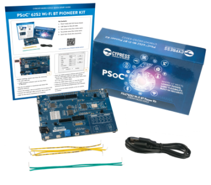
..

 * Added a menu option for opening a project in the Analytics Studio *(File → Open Project In Analytics Studio)*

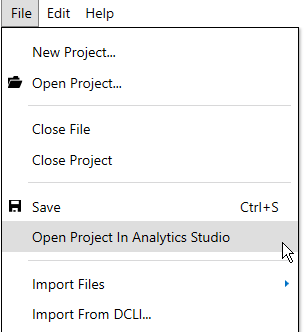
..

 * Added additional validation rules to SSF file import
 * Updated Knowledge Pack recognition to ignore results with a negative start index
 * Updated Device Plugin Import to default to the Simple Streaming Capture Protocol
 * Updated onsemi RSL10 Sense device plugin documentation links
 * Deprecated MQTT-SN Device Plugin Import. *Note: You can re-enable MQTT-SN Device Plugin Import by enabling the setting 'Enable MQTT-SN Device Plugin Import' in the Data Capture Lab Settings menu (Edit → Settings)*

2021.8.3 (01/04/2022)
`````````````````````

:blue:`What's New`

 * Added a *Clear* button to the Sensor Configuration panel in Capture Mode

:blue:`Bug Fixes`

 * Fixed a validation issue when using a Knowledge Pack with a segmentation algorithm
 * Minor stability improvements

2021.8.2 (12/28/2021)
`````````````````````

:blue:`What's New`

 * Added additional colors to the default label color selections in Capture Mode
 * Added additional colors to the default graph axis colors in Capture Mode and Label Mode

:blue:`Bug Fixes`

 * Fixed issue where sometimes using a Knowledge Pack in the Project Explorer could return classifications with a negative start index
 * Minor stability improvements

2021.8.1 (12/16/2021)
`````````````````````

:blue:`What's New`

 * Added feature to create sessions from the *Session Select* screen
 * Added feature to create labels from the *Live Labeling* panel in Capture Mode

:blue:`Bug Fixes`

 * Fixed display issue where sometimes the metadata scrollbar did not appear in the Capture Mode *File Settings* panel
 * Fixed issue where the serial COM port would sometimes not update properly for new serial ports in Capture Mode
 * Minor stability improvements

2021.8.0 (12/14/2021)
`````````````````````

:blue:`What's New`

Capture Mode

 * Updated Capture Mode UI/UX workflow
 * Added feature to connect to a model (Knowledge Pack) and save the results during data collection. See how to use this feature in the :doc:`Data Capture Lab Documentation<../data-studio/testing-a-model-using-the-data-studio>`. *(Simple Streaming devices only)*

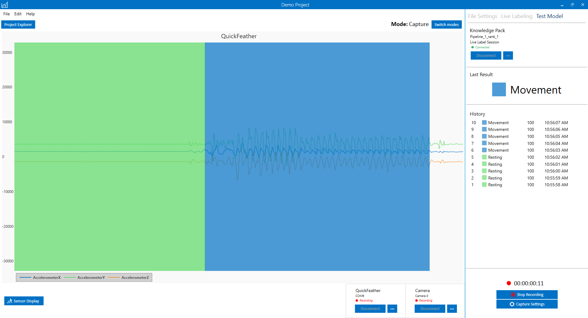
..

 * Added feature to set file names during data collection

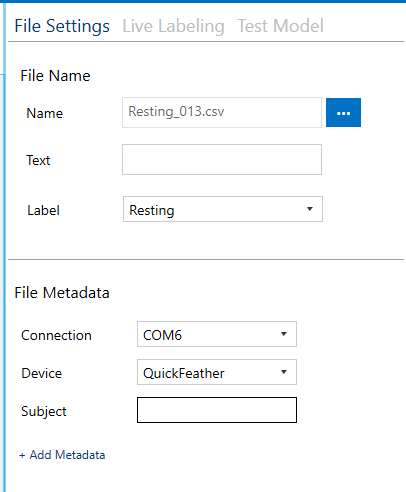
..

 * Added a File Name Template screen

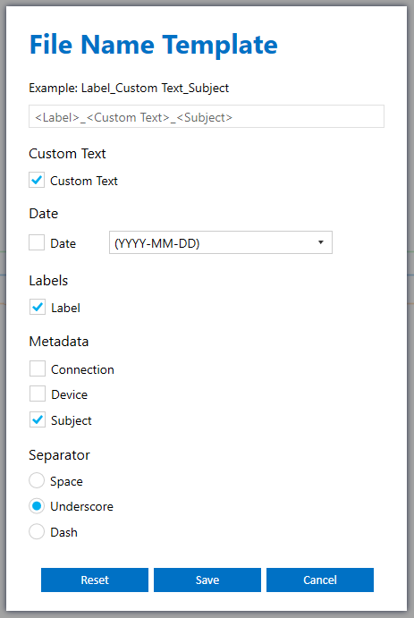
..

 * Added a Capture Setting screen

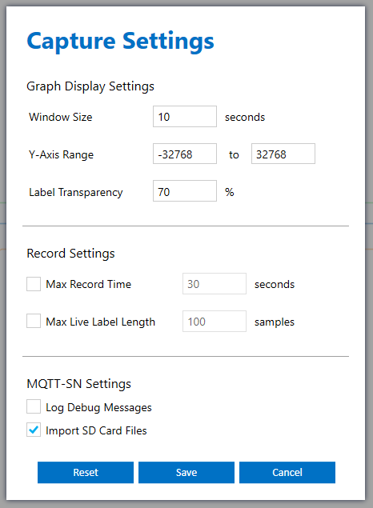
..

 * Added new capture setting *Max Live Label Length*
 * Added new capture setting *Y-Axis Range*
 * Added new capture setting *Label Transparency*
 * Updated capture setting *Window Size* behavior to use seconds instead of samples
 * Added ability to reset Capture Settings to default

 * Added a Save Confirmation screen *(Live Streaming Only)*

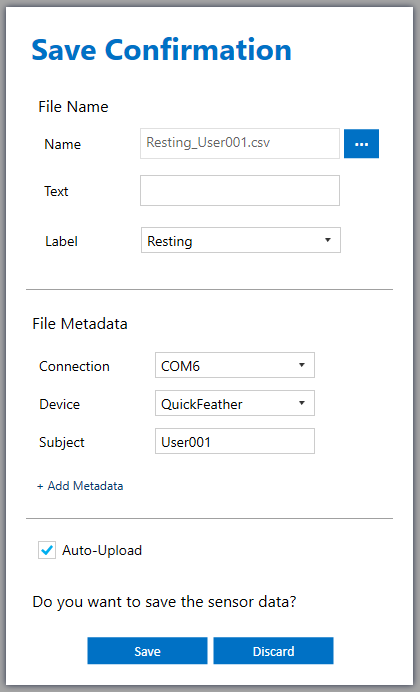
..

 * Updated Project to remember file metadata settings after closing the Data Capture Lab
 * Updated *Live Labeling* workflow

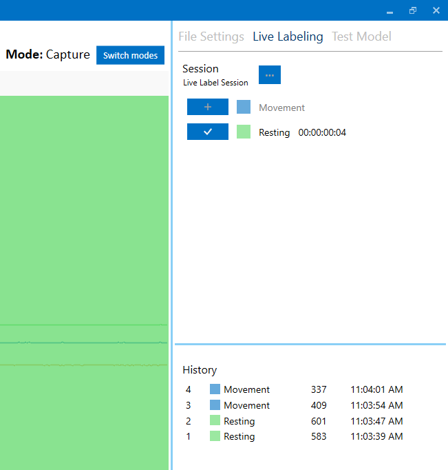
..

 * Updated *Live Labeling* graph to display labels as colors
 * Updated *Live Labeling* tab to allow multiple labels in the same file
 * Added a History panel to the *Live Labeling* tab

Project Explorer

 * Added feature to download Knowledge Packs

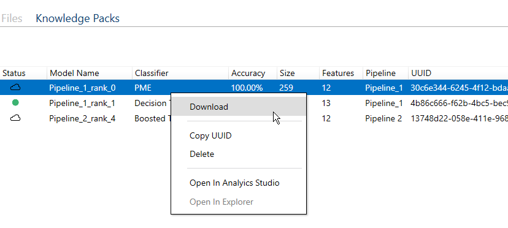
..

 * Added feature to use Knowledge Packs offline
 * Added feature to open Knowledge Pack in Analytics Studio *(Right + Click → Open In Analytics Studio)*

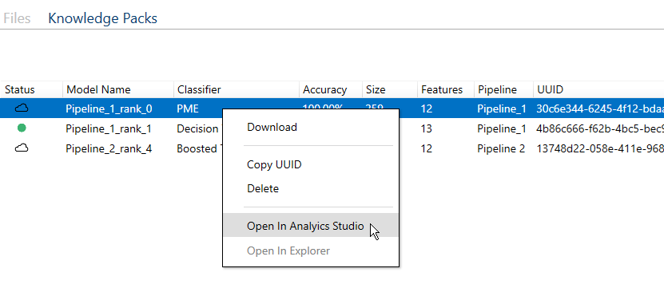
..

 * Added feature to import Knowledge Packs offline *(File → Import Knowledge Pack...)*

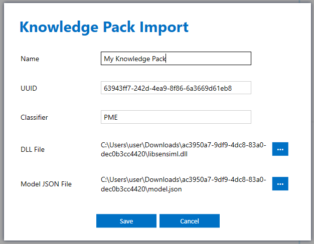
..

2021.7.1 (12/02/2021)
`````````````````````

:blue:`Bug Fixes`

 * Fixed issue where imported device plugins that use the Simple Streaming protocol could not connect over Bluetooth-LE
 * Fixed baud rate in the serial connection method of the onsemi RSL10 Sense device plugin
 * Fixed issue where the column selection screen sometimes would not scroll properly

2021.7.0 (11/04/2021)
`````````````````````

:blue:`What's New`

 * Added :doc:`onsemi RSL10 Sense<../firmware/onsemi-rsl10-sense/onsemi-rsl10-sense>` as a supported platform for data collection

2021.6.1 (10/04/2021)
`````````````````````

:blue:`What's New`

 * Added sensor column validation when connecting to devices that use the Simple Streaming capture protocol in Capture Mode

:blue:`Bug Fixes`

 * Fixed issue where importing a DCLI file could sometimes fail if the *video_path* was incorrectly formatted
 * Fixed issue where *Generate Auto Session* would not create magnitude transforms correctly
 * Fixed issue where some Device Plugins that use a Custom capture protocol would not remember the last used device after restarting the Data Capture Lab
 * Minor stability improvements

2021.6.0 (09/20/2021)
`````````````````````

:blue:`What's New`

 * Added feature to connect over Bluetooth-LE during data collection on devices that implement the Simple Streaming capture protocol

 * Added feature to bulk edit segments from the Project Explorer *(Right + Click → Segments → Edit)*

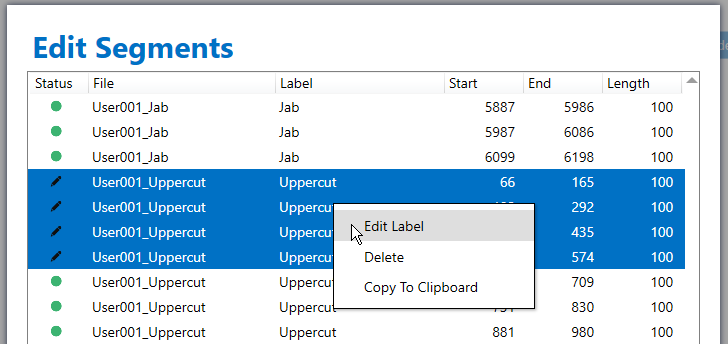
..

 * Added feature to use a segmenter algorithm on multiple files to generate segments in the Project Explorer *(Right + Click → Segments → Add → From Segmenter Algorithm)*

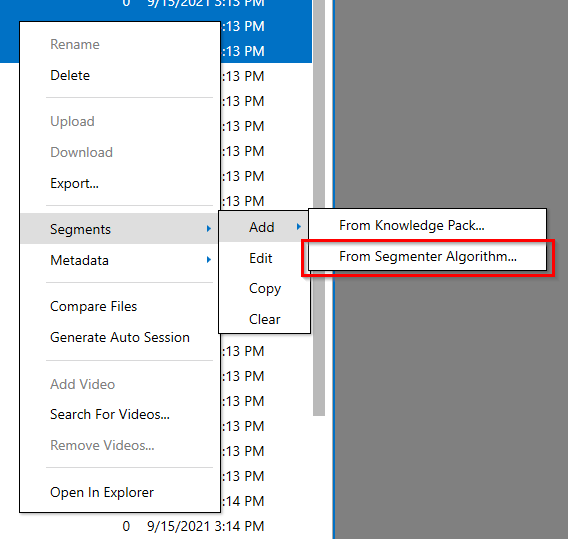
..

 * Added file *Uploaded* date column to the Project Explorer

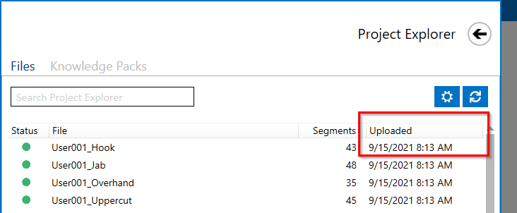
..

 * Added feature to use custom magnitude transforms in a segmenter algorithm

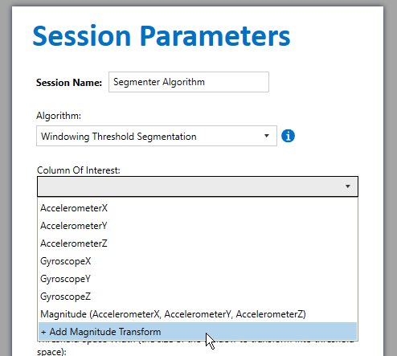
..

 * Added option to cancel updates when editing Session parameters

2021.5.2 (09/01/2021)
`````````````````````

:blue:`Bug Fixes`

 * Fixed issue in Capture Mode with connecting to devices that use the MQTT-SN capture protocol

2021.5.1 (08/18/2021)
`````````````````````

:blue:`Bug Fixes`

 * Fixed issue where Simple Streaming Wi-Fi connections were not clearing the data buffer properly
 * Fixed issue where an exported DCLI file could sometimes fail to import on another project


2021.5.0 (08/03/2021)
`````````````````````

:blue:`What's New`

 * Added feature to use a Knowledge Pack to generate segments in the Project Explorer *(Right + Click → Segments → Add → From Knowledge Pack)*

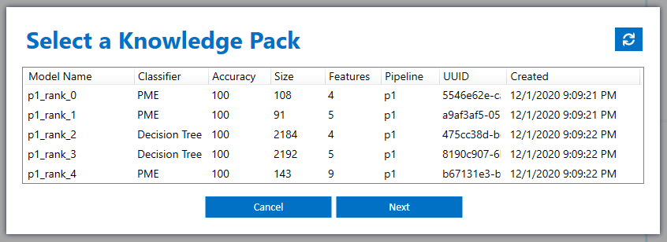
..

 * Added feature to clear segments from a list of files in the Project Explorer *(Right + Click → Segments → Clear)*

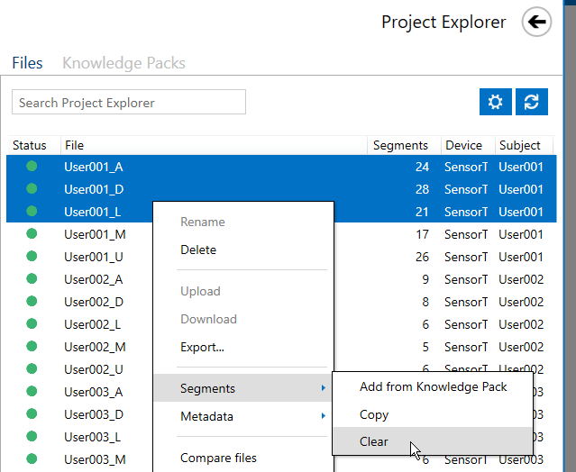
..

 * Added Knowledge Pack management tab to the Project Explorer

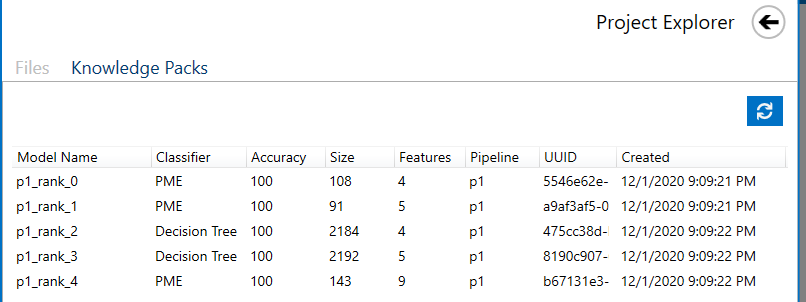
..

 * Added SparkFun QuickLogic Thing Plus - EOS S3 as a supported platform for data collection
 * Updated UI in the Project Explorer
 * Updated UI in the Copy Segments screen

2021.4.0 (06/30/2021)
`````````````````````

:blue:`What's New`

 * Added :doc:`Microchip Technology SAMD21 Machine Learning Evaluation Kit<../firmware/microchip-technology-samd21-ml-eval-kit/microchip-technology-samd21-ml-eval-kit>` as a supported platform for data collection

2021.3.1 (06/22/2021)
`````````````````````

:blue:`What's New`

 * Added support for Simple Streaming protocol version 2 in serial connections. Version 2 adds a small amount of overhead to enable a data sync protocol with a simple CRC for data integrity. See how to implement version 2 in the :doc:`describing output documentation<../simple-streaming-specification/simple-describing-output>`. *Note: Wi-Fi connections currently do not support Simple Streaming protocol version 2*

:blue:`Bug Fixes`

 * Fixed issue where importing device plugins could sometimes update invalid sensor configuration profile connection settings

2021.3.0 (06/15/2021)
`````````````````````

:blue:`What's New`

* Added new fields to Device Plugins (SSF files) - Device Name, Device Manufacturer, Plugin Developer, Firmware Download Links, and Documentation Links

* Updated the Device Plugin selection screen to include more information about Device Plugins

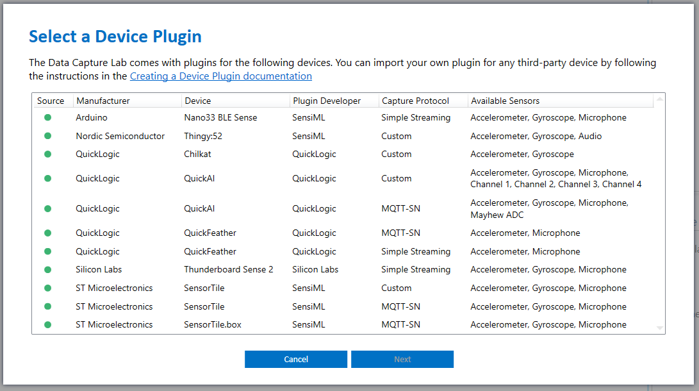
..

* Added a Plugin Details screen for viewing information about Device Plugins

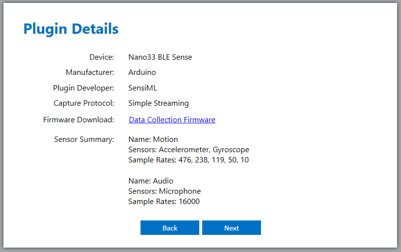
..

* Added a Sensor Configuration selection screen to make it easier to view and manage Sensor Configurations in a Project

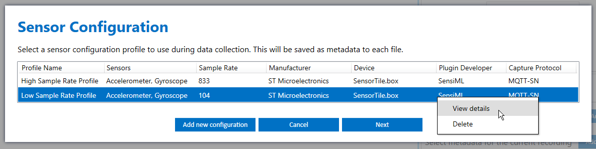
..

* Updated workflow for importing external sensor data files that did not use a Device Plugin

* Minor UI updates to the *Capture Mode - Sensor Configuration* tab

2021.2.1 (05/12/2021)
`````````````````````

:blue:`What's New`

 * Added progress indication screens for large video management operations

:blue:`Bug Fixes`

 * Fixed issue where project upload could sometimes fail

2021.2.0 (05/05/2021)
`````````````````````

:blue:`What's New`

Major Features

 * Added ability to record webcam videos in Capture Mode. *Note - requires the SensiML Open Gateway application*

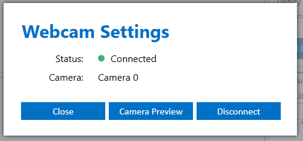
..

 * Updated **Status** column icons in the Project Explorer

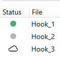
..

 * Added **Video** column to show if a file has been linked with a video in the Project Explorer

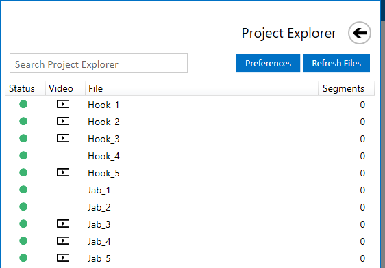
..

 * Added **Add video**, **Search for videos**, **Remove videos**, **Locate missing videos** menu options to the Project Explorer

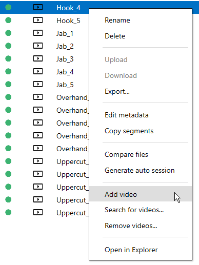
..

 * Added **Search for videos** feature for finding matching video files in a selected directory

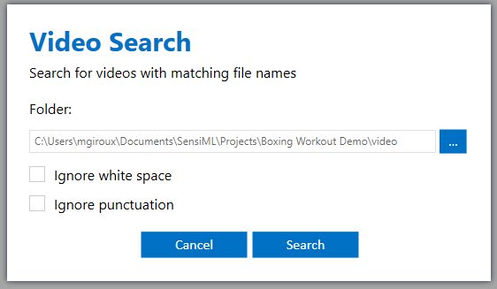
..

 * Added **Remove videos** feature for bulk removing video links from a project

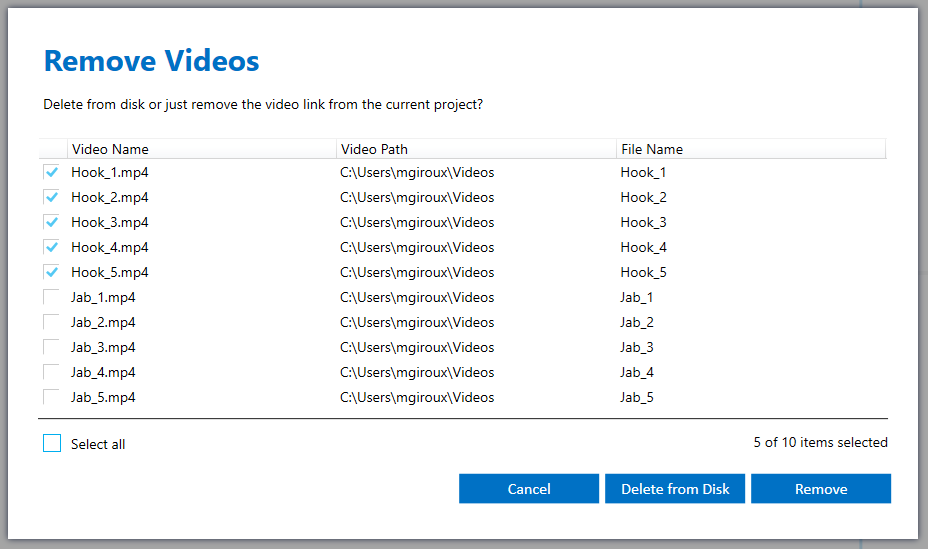
..

 * Added **Locate missing videos** feature for correcting video file paths that have been moved

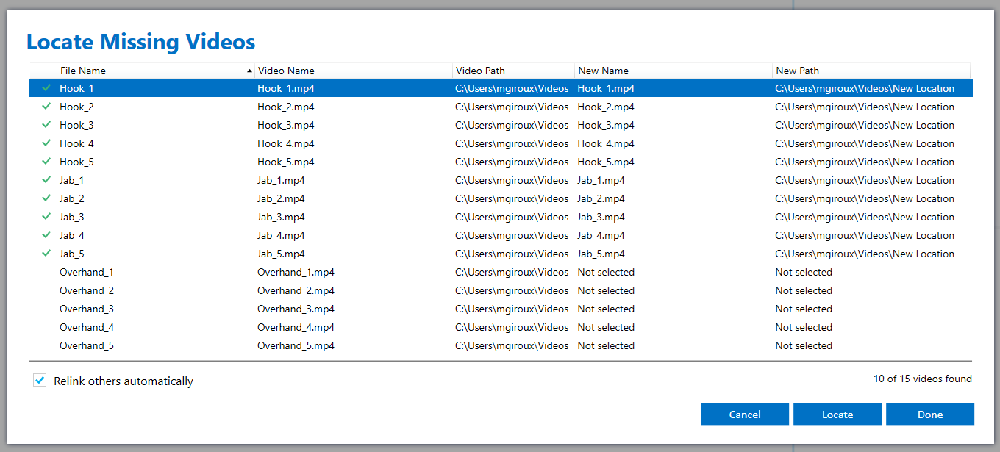
..

 * Added **Video information** option for DCLI import and export

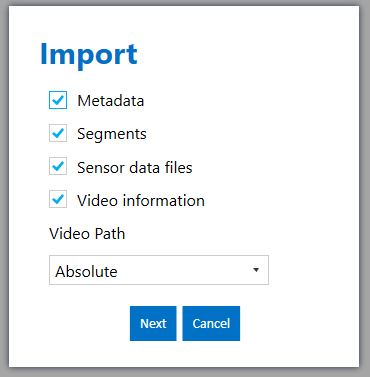
..

Minor Features

* Segments can now start at index 0 (previously started at index 1)

:blue:`Bug Fixes`

 * Fixed display issue with total sample number calculation
 * Fixed issue where media player could sometimes freeze when reaching the end of the video

2021.1.0 (03/18/2021)
`````````````````````

:blue:`What's New`

 * Added Silicon Labs Thunderboard Sense 2 as a supported platform for data collection
 * Added additional validation to SSF file import

:blue:`Bug Fixes`

 * Minor stability improvements in Capture Mode

2020.10.7 (03/08/2021)
``````````````````````

:blue:`Bug Fixes`

 * Fixed issue connecting to QuickAI devices using the built-in device plugin
 * Fixed issue in Capture Mode where devices using a serial connection would sometimes fail to disconnect properly
 * Minor stability improvements in Capture Mode

2020.10.6 (03/02/2021)
``````````````````````

:blue:`Bug Fixes`

 * Fixed issue where capture upload would sometimes fail on operating systems in regions that use comma decimal separators
 * Fixed issue with capturing audio sensor data using the Simple Streaming protocol
 * Fixed issue with capturing audio sensor data using the MQTT-SN SD card connection method
 * Minor stability improvements in loading device connection status in Capture Mode

2020.10.5 (02/03/2021)
``````````````````````

:blue:`Bug Fixes`

 * Fixed issue with disconnecting from a Wi-Fi connection using Simple Streaming device plugins
 * Minor stability improvements for Wi-Fi network connections

2020.10.4 (02/02/2021)
``````````````````````

:blue:`What's New`

 * Added the option to collect microphone data using the built-in QuickFeather Simple Stream plugin
 * Added the option to connect to the Arduino Nano 33 BLE Sense over Wi-Fi using the built-in device plugin
 * Added the option to save ``device_name`` as metadata from Simple Stream device firmware JSON
 * Added additional validation during CSV file import

:blue:`Bug Fixes`

 * Fixed issue with connecting to a microphone sensor from imported Simple Stream device plugins
 * Minor stability improvements in Capture Mode

2020.10.3 (01/14/2021)
``````````````````````

:blue:`Bug Fixes`

 * Fixed issue with capturing sensor data from some simple streaming devices
 * Fixed issue where forgetting simple streaming devices would sometimes fail in Capture Mode

2020.10.2 (01/13/2021)
``````````````````````

:blue:`What's New`

 * Updated the built-in QuickFeather Simple Streaming plugin available sample rates (50, 100, 200, 250, 333)
 * Added additional validation to simple streaming devices in Capture Mode. During device connection the DCL now checks that data collection firmware sample rate matches the selected sample rate setting in the DCL
 * Added the ability to disconnect/reconnect to simple streaming devices in Capture Mode without restarting the device *Note: Requires a firmware update*

:blue:`Bug Fixes`

 * Fixed issue where serial port scan would sometimes fail in Capture Mode

2020.10.1 (12/17/2020)
``````````````````````

:blue:`What's New`

 * Files captured from Simple Stream devices will now start at sequence number 0

:blue:`Bug Fixes`

 * Added an error message for connecting to a Simple Stream device that has been flashed with a Knowledge Pack
 * Added validation for empty project files during project upload

2020.10.0 (12/10/2020)
``````````````````````

:blue:`What's New`

 * Added the option to collect data over Wi-Fi via the Simple Streaming protocol. You can learn how to implement Wi-Fi data collection in the :doc:`Simple Streaming Documentation<../simple-streaming-specification/simple-wifi-streaming>`
 * Added a supported device plugin for the QuickFeather Simple Stream protocol

:blue:`Bug Fixes`

 * Fixed issue where sometimes the selected sensors in the Sensor Configuration screen would not display correctly

2020.9.0 (12/01/2020)
`````````````````````

:blue:`What's New`

 * **Segment Explorer Improvements** -  Updated the segment explorer control to make it more efficient/easy to view your labeled data and update your label data in project datasets

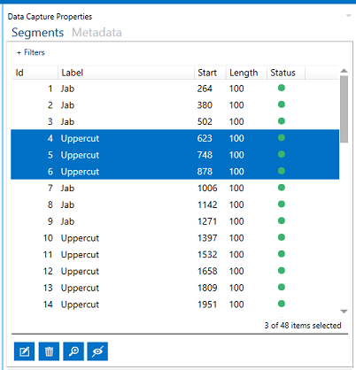
..

 * **Multi-Segment View** - The segment explorer control now shows all segments in your file instead of just the selected segment in the graph. This gives much more insight to what events are happening in the file and enables much faster labeling methods. You can use the keyboard shortcuts (Ctrl + Click) and (Shift + Click) to select, edit, and delete multiple segment labels at a time

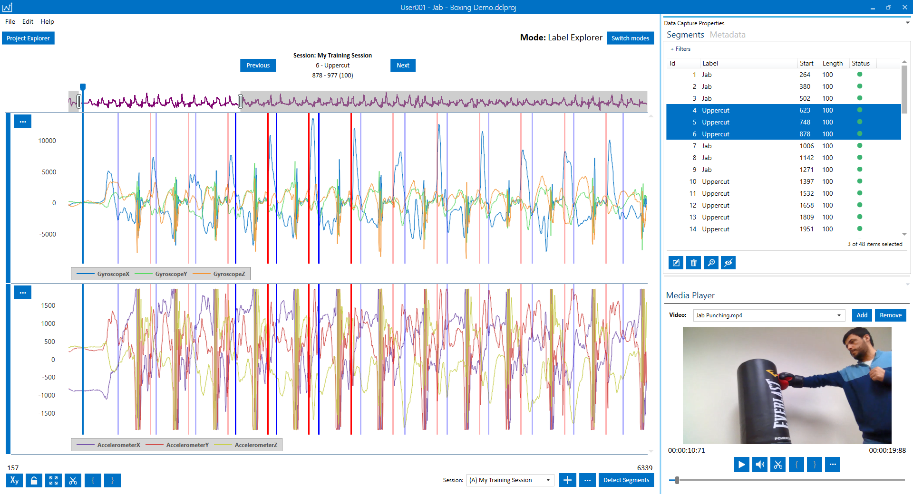
..

 * **Added New Columns** - New columns have been added to the segment explorer control (Length, Time, Status, Uploaded, Last Modified, UUID). *Note: Hide/show columns by right-clicking on the segment headers*

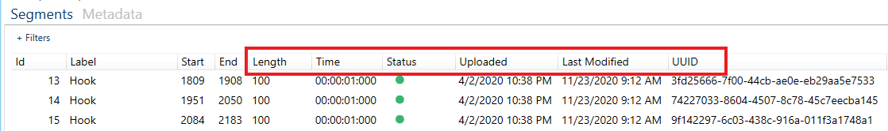
..

    .. csv-table::
       :widths: 10,20

       *Length*, Total number of samples in segment
       *Time*, Total segment time length (Hours / Minutes / Seconds) based on file sample rate
       *Status*, Server sync status (Synced with server / Saved offline / Has pending changes to be saved)
       *Uploaded*, Date/time segment was uploaded to the server
       *Last Modified*, Date/time segment was last modified on the server
       *UUID*, Server unique identifier for the segment

 * **Column Sort Feature** – Added the ability to sort segment data by clicking on the column header. This is useful for finding outliers in segment data

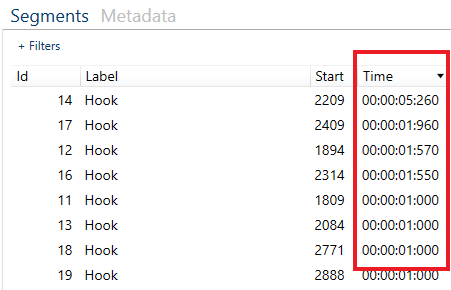
..

 * **Segment Filters** – Added the ability to filter segments in the segment explorer by event. This can be used by clicking (+ Filters) at the top of the segment explorer

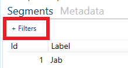
..

 * **Multi-Segment Selection** - Added the ability to select multiple segments in the graph view by either holding (Ctrl + Click) or (Shift + Click) while selected segments. Selecting segments in the graph will highlight the associated segment labels in the segment control view


..

 * **Status Column** - The segment status column has been updated to tell more information about your segment server status. It has three states (Green - Synced with server, Gray - Saved offline, Edit Icon - Has pending changes to be saved)

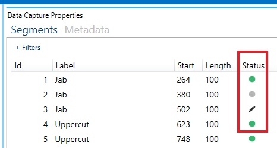
..

 * **Copy** - Added the ability to copy a list of selected segments into another session. (Right + Click)

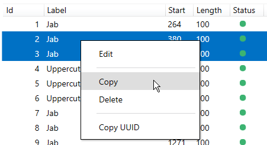
..

 * **Copy UUID** - Added the ability to copy a list of selected Segment UUIDs to your clipboard. (Right + Click) Segment UUIDs are unique identifiers used by the server and can be used as parameters for functions in the SensiML Python SDK

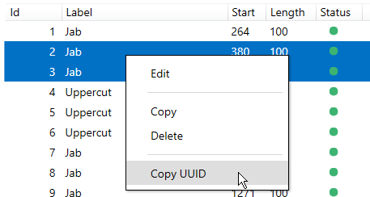
..

 * **Segments Outside of Trim Area** - If you have trimmed the ends of a file and there are segments outside of the trim area they will now show as gray in the segment explorer

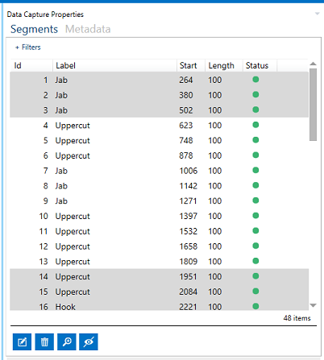
..

 * **Keyboard Shortcuts** – New keyboard shortcuts have been added to make labeling data easier. Some old keyboard shortcuts have been updated. You can find the full list of DCL keyboard shortcuts under the menu option Help → Keyboard Shortcuts

    .. csv-table::
       :widths: 10,20

       *Right Arrow*, Select next segment
       *Left Arrow*, Select previous segment
       *Ctrl + A*, Select all segments
       *Ctrl + E*, Edit selected segment labels
       *Delete*, Delete selected segment labels
       *Ctrl + H*, Hide non-selected segment labels
       *Ctrl + M*, Magnify selected segment label location
       *Double click segment label*, Magnify selected segment location
       *Ctrl + F*, Find segment by UUID
       *Ctrl + Alt + F*, Find capture by UUID
       *Alt + A*, Add new segment to the start/end of the current file
       *Ctrl + R*, Reset graph track heights to fill screen
       *Right Arrow + Alt*, Step forward 1 frame or 100 ms (During media playback)
       *Right Arrow + Alt + Ctrl*, Step forward 30 frames or 1000 ms (During media playback)
       *Left Arrow + Alt*, Step backward 1 frame or 100 ms (During media playback)
       *Left Arrow + Alt + Ctrl*, Step backward 30 frames or 1000 ms (During media playback)

:blue:`Bug Fixes`

 * Fixed issue with deleting Simple Streaming Interface Device Plugins

2020.8.0 (10/27/2020)
`````````````````````

:blue:`What's New`

 * Added a new protocol for custom firmware data collection called the :doc:`Simple Streaming Interface<../simple-streaming-specification/introduction>`. This allows for quicker prototyping with your custom device firmware

    *See the documentation for* :doc:`Adding Custom Device Firmware<../data-studio/adding-custom-device-firmware>` *for more information on the protocols we support and how to implement your device firmware*

 * Added :doc:`Arduino Nano33 BLE Sense<../firmware/arduino-nano33/arduino-nano33>` as a supported platform for data collection
 * Enabled the QuickFeather microphone sensor for data collection

2020.7.3 (09/23/2020)
`````````````````````

:blue:`What's New`

 * Minor improvements to enhance user experience

:blue:`Bug Fixes`

 * Fixed issue where sometimes project upload status was not getting refreshed

2020.7.2 (09/17/2020)
`````````````````````

:blue:`What's New`

 * Updated Starter Edition to no longer have a license time limit. *Note: Starter Edition is limited to 2500 segments per project and must be logged in to add new data to a project*

2020.7.1 (08/19/2020)
`````````````````````

:blue:`What's New`

 * Added sample rates 210hz, 400hz, and 600hz to QuickFeather data collection options. *Note: The MC3635 accelerometer in QuickFeather has a +/- 10% tolerance in the internal clock used to set sample rate. This means setting a sample rate of 400Hz can result in captured sensor data varying from board to board within a range of 360Hz – 440hz. This sensor limitation should be understood and factored in your models for applications where sample timing sensitivity is critical.*

2020.7.0 (08/12/2020)
`````````````````````

:blue:`What's New`

 * Added :doc:`QuickLogic QuickFeather<../firmware/quicklogic-quickfeather/quicklogic-quickfeather>` as a supported platform for data collection
 
2020.6.1 (07/20/2020)
`````````````````````

:blue:`Bug Fixes`

 * Fixed issue with sensors not loading correctly in sensor configuration screen

2020.6.0 (07/15/2020)
`````````````````````

:blue:`What's New`

 * Added :doc:`ST SensorTile.box<../firmware/st-sensortile-box/st-sensortile-box>` as a supported platform for data collection
 * Added the ability to use external third-party devices for data collection within the Data Capture Lab. *For more details on this feature, see the following tutorial*: :doc:`How to Import a Device Plugin<../data-studio/adding-custom-device-firmware>`

2020.5.0 (05/26/2020)
`````````````````````

:blue:`What's New`

 * Performance Improvements - Added improvements to saving/uploading metadata and segments in the following areas of the DCL (up to 20x-100x faster depending on your project size)
     
     *Upload project*

     *File Import -> DCLI format*

     *File Import -> QLSM format*

     *Open Capture -> Metadata Add/Update/Delete*

     *Open Capture -> Segment Add/Update/Delete*

     *Open Capture -> Detect Segments*

     *Project Explorer -> Copy Segments*

     *Project Explorer -> Copy Session*

     *Project Explorer -> Edit Metadata*

     *Auto Sync -> Syncing offline metadata/segments with the server*

     *Auto Sync -> Syncing server metadata/segments with your local machine*

 * Added ability to load/save segments in Auto Sessions offline
 * Added new graphing tool called **Segment Width Lock**. The *Segment Width Lock* toggle gives you the ability to lock the segment width during location placement so that you can move an entire segment at one time instead of just the start or end of the segment

.. figure:: img/release-notes/segment-width-lock.png
   :align: center
..

:blue:`Bug Fixes`

 * Fixed issue where the *Max Capture Time* setting would sometimes show an error in Capture mode when auto-saving sensor data over BLE streaming connections

2020.4.0 (05/04/2020)
`````````````````````

:blue:`What's New`

WAV File Updates

 * Added support for WAV file upload/download on SensiML Servers
 * Added multi-channel support on WAV files
 * Note: WAV file updates are only supported in new projects created with DCL v2020.4.0 or later

Performance Improvements

 * Added improvements to load times in the following areas (up to 20x faster depending on your project size)

    *Project → Download*

    *Project → Open*

    *Project → Sync*

    *Capture File → Open*

Find Capture By UUID

 * Added option to lookup a capture by UUID in menu item Edit → Find

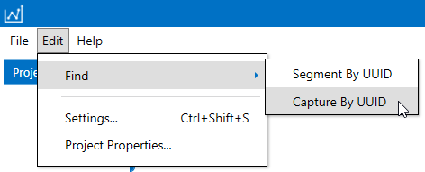
..

:blue:`Bug Fixes`

 * Fixed issue with *Session → Delete* not refreshing segment totals in Project Explorer
 * Minor stability fixes

2020.3.1 (04/14/2020)
`````````````````````

:blue:`What's New`

 * Added format selection screen to DCLI file import

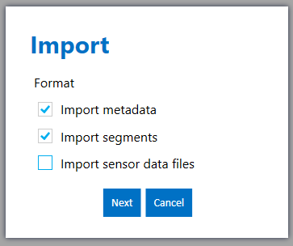
..

 * Added new validation checks to DCLI file import
 * Updated UX for all import file options to be more intuitive
 * Added a cancel button to *File → Upload* progress dialog
 * Added option to lookup a segment by UUID in menu item *Edit → Find*

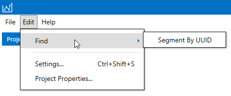
..

:blue:`Bug Fixes`

 * Fixed issue with renaming Project Property labels with different letter casing
 * Fixed issue with switching to Label mode in the middle of recording a file in Capture mode
 * Minor stability fixes

2020.3.0 (03/02/2020)
`````````````````````

:blue:`What's New`

 * Added feature to export metadata/segments into .dcli file format

    *This can be found in the Project Explorer: Select a list of files → Right + Click → Export*

 * Added feature to import auto sessions via .dcli format
 * Updated Project Properties → Segment Labels tab to show segment labels by default instead of segment groups. In order to change this back to show segment groups open the Advanced tab and click Enable segment label groups
 * Improved Copy Segments performance
 * Updated SaaS license agreement

:blue:`Bug Fixes`

 * Fixed project sync issue where sometimes loading capture files would fail
 * Fixed threading issue with Save Changes button
 * Fixed issue where disabling Import → Index column setting would sometimes not work correctly
 * Fixed issue where deleting Project Properties offline would sometimes not work correctly
 * Fixed issue where uploading a project via Project Upload would sometimes not clear dependencies correctly
 * Minor stability fixes

2020.2.0 (02/06/2020)
`````````````````````

:blue:`What's New`

Import Upgrades

 * Added feature for importing metadata and segments from outside sources via a new file format (.dcli)

  *For more details see the* :doc:`../../../data-studio/importing-external-sensor-data` *tutorial*

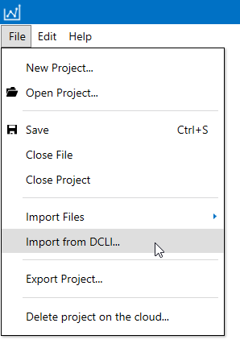
..

 * General usability improvements
 * Minor UI improvements

:blue:`Bug Fixes`

 * Fixed issue with track settings sometimes not saving
 * Minor stability fixes

2020.1.0 (01/14/2020)
`````````````````````

:blue:`What's New`

 * Capture mode - Added support for MQTT-SN data collection with QuickAI

:blue:`Bug Fixes`

 * Fixed issue with collecting data from QuickAI and Chilkat when Windows language setting is not set to English
 * Fixed issue with selected files in the Project Explorer changing when switching between Capture and Label mode
 * Minor stability fixes

2019.5.0 (12/10/2019)
`````````````````````

:blue:`What's New`

Project Explorer Upgrades

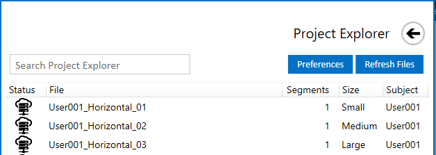
..

 * Added metadata columns to the project explorer
 * Added ability to sort files by metadata column
 * Moved *Import Files* button to menu *File → Import Files*...
 * Moved *Project Properties* button to menu *Edit → Project Properties*
 * Added a status window when deleting files
 * Improved performance of Import and Delete operations on files
 * Added selected file count to the project explorer

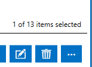
..

 * Added the ability to *group by metadata* columns

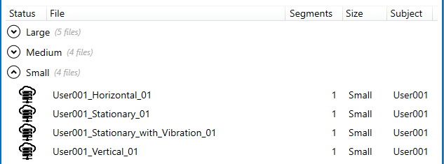
..

 * The *group by metadata* feature can be found in *Project Explorer → Preferences*

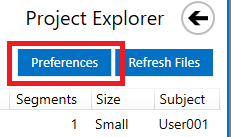
..

 * Added Expand all/Collapse all button for expanding/collapsing metadata groups

General Updates

 * Added Keyboard Shortcut screen. This can be found under menu Help → Keyboard Shortcuts
 * Added a progress bar for longer file operations (File upload, download, delete, sync)
 * Added subscription tier to startup screen
 * Minor bug fixes

2019.4.3 (11/20/2019)
`````````````````````

:blue:`Bug Fixes`

 * Fixed issue where importing external CSV files would fail in some scenarios
 * Minor bug fixes

2019.4.2 (11/19/2019)
`````````````````````

:blue:`Bug Fixes`

 * Fixed issue with uploading WAV files
 * Minor bug fixes

2019.4.1 (11/16/2019)
`````````````````````

:blue:`Bug Fixes`

 * Minor bug fixes

2019.4.0 (11/12/2019)
`````````````````````

:blue:`What's New`

Project Architecture Updates

 * Refactored project architecture

  *- .dclproj files created before v2019.4.0 will be upgraded to the new format when you open your project. A backup of your original .dclproj file will be saved to your computer*

  *- .dcl, .sdcl, label.config, and builder.dclseg files were deprecated with this update. These files will also be backed up when you convert your .dclproj file to the new format, but they are no longer used*

 * General performance improvements
 * Changed behavior of project properties screen. Adding, updating, or deleting project properties now updates the entire project

Project Explorer Menu Options

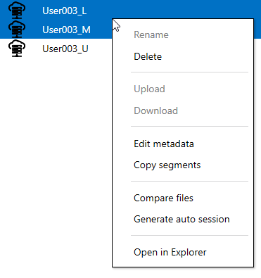
..

 * Added the ability to compare multiple files in the same graph
 * Added the ability to edit metadata from Project Explorer
 * Added the ability to copy segments from multiple files to another session
 * Added the ability to use selected files to find a segmenter algorithm by using the *Generate auto session* button
 * Segment totals are now based on the current session
 * Segment totals now include offline segments

Session Menu Options

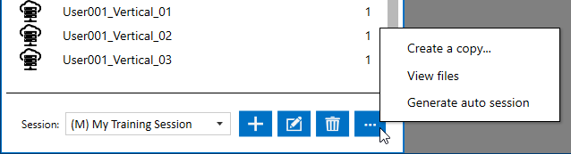
..

 * Added the ability to create a new copy of a session
 * Replaced Segmenter Builder mode. You can now use any existing session as your training data set. Click *Generate auto session* inside the Project Explorer to use a session for finding a segmenter.
 * Added the ability to view all files that have been labeled in a session together in the same graph

General

 * Switching video file views retains the previous video position
 * Video file locations are now saved as relative paths instead of absolute paths
 * Added an expand track button to the graphing tool
 * Enabled data collection for AD7476 on QuickAI

2019.3.2 (10/22/2019)
`````````````````````

:blue:`What's New`

 * Created a read-only version of DCL for opening and viewing project data sets without an active subscription. This version cannot create or modify projects
 * Added a checkbox to the Import Files screen to disable auto-upload

2019.3.1 (09/24/2019)
`````````````````````

:blue:`What's New`

 * Added ability to sort columns in the project explorer
 * Added 'MagnitudeAllColumns' transform to the auto-session parameters
 * Moved capture collection methods dropdown into the main Capture window

:blue:`Bug Fixes`

 * Fixed issue with opening a project that contained a session where the segmenter no longer exists

2019.3.0 (07/30/2019)
`````````````````````

:blue:`What's New`

 * Capture mode - Added new supported capture device SensorTile

    *Supported Frequencies: 26hz, 52hz, 104hz, 208hz, 416h*

2019.2.3 (07/18/2019)
`````````````````````

:blue:`What's New`

 * Added ability to set max record time limit in Capture mode. This setting can be found in the main DCL Settings → Max Record Time

:blue:`Bug Fixes`

 * Fixed issue with *Session → Clear* button not clearing empty segments
 * Fixed issue with *Session → Detect* button not clearing empty segments

2019.2.2 (07/02/2019)
`````````````````````

:blue:`What's New`

 * Added ability to save metadata properties on files recorded via QuickAI SD card

    *Note: Must import .qlsm files through the project where the files were captured*

 * Added ability to lock Y-Axis range and set Y-Axis minimum and maximum bounds

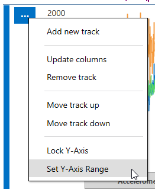
..

 * Deprecated SegmentID labels. This speeds up Create/Update/Delete actions by 2x on Segment modifications
 * Added clear error message for expired login credentials

:blue:`Bug Fixes`

 * Minor stability fixes

2019.2.1 (06/18/2019)
`````````````````````

:blue:`What's New`

 * Moved Label Config tab to Project Explorer → Project Properties screen
 * Updated metadata and label configuration UX to be more intuitive
 * Added 'Segments on Cloud' feature to the Project Explorer. This shows the total number of segments in a capture file
 * Added a segment length property shown above the graph in the Label Explorer

:blue:`Bug Fixes`

 * Fixed off-by-one error in 'Default Segment Length' setting
 * Minor stability fixes

2019.2.0 (06/11/2019)
`````````````````````

:blue:`What's New`

 * Added support for capturing sensor data from QuickLogic Chilkat devices

:blue:`Bug Fixes`

 * Fixed issue with QuickAI device not releasing resources correctly on BLE disconnect
 * Fixed display issue on capture sensor configuration screen

2019.1.2 (05/21/2019)
`````````````````````

:blue:`What's New`

Project Explorer Upgrades

 * Added ability to select multiple files in the Project Explorer
 * **Important** Behavior change (Open File) → To open a file in the project explorer double click the file name
 * Added ability to Upload, Download, and Delete multiple selected files at the same time
 * Right-Click on a file name in the Project Explorer to see Upload, Download, and Delete menu options
 * Moved 'Upload Files To Cloud' button into the project explorer menu options (Upload)
 * Moved 'Download Files From Cloud' button into the project explorer menu options (Download)
 * New keyboard shortcuts in Project Explorer:

    .. csv-table::
       :widths: 10,20

       *SHIFT + Click*, Select multiple consecutive files
       *CTRL + Click*, Select multiple non-consecutive files
       *CTRL + A*, Select all files

Import File Screen

 * Added check/conversion options for Signed/Unsigned data from .qlsm files

:blue:`Bug Fixes`

 * Fixed localization error with saving estimated (calculated) sample rate during capture mode
 * Added validation rules to label configuration screens

2019.1.1 (05/08/2019)
`````````````````````

:blue:`What's New`

 * Added a max file size limit while recording in capture mode
 * Added max throughput configuration check for Mayhew LTC1859
 * Removed unsupported Mayhew LTC1859 channel configuration parameters (0-5V Single-Ended, 0-10V Single-Ended, 0-5V Differential, 0-10V Differential)

:blue:`Bug Fixes`

 * Fixed error with restarting QuickAI device while recording in capture mode
 * Fixed scenario where 'Device' metadata property was sometimes cleared

2019.1.0 (05/05/2019)
`````````````````````

:blue:`What's New`

 * Capture mode - Enabled high frequency sample rates on QuickAI (208, 416, 832, 1660)

    *Note: High frequency sample rate files are saved to SD card*

 * Capture mode - Enabled Audio on QuickAI

    *Note: Audio files are saved to SD card*

 * Capture mode - Enabled Mayhew LTC1859 on QuickAI

    *Note: Mayhew LTC1859 files are saved to SD card*

 * Added new supported file type (.qlsm)
 * Added ability to create multiple sensor configurations on a project
 * Added ability to set sensor configurations when importing external files
 * Updated sample rate to be pulled from sensor configurations

:blue:`Bug Fixes`

 * General stability improvements to capture mode

2.5.0 (04/10/2019)
``````````````````

:blue:`What's New`

Multi-Sensor Graphing

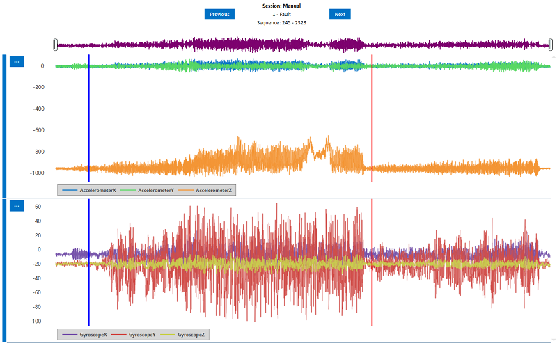
..

 * Added ability to split sensor data columns graph into multiple tracks
 * Added ability to change graph height
 * Added ability to change order of tracks
 * Added ability to trim the start/end points in a CSV or WAV file

Media Player Updates

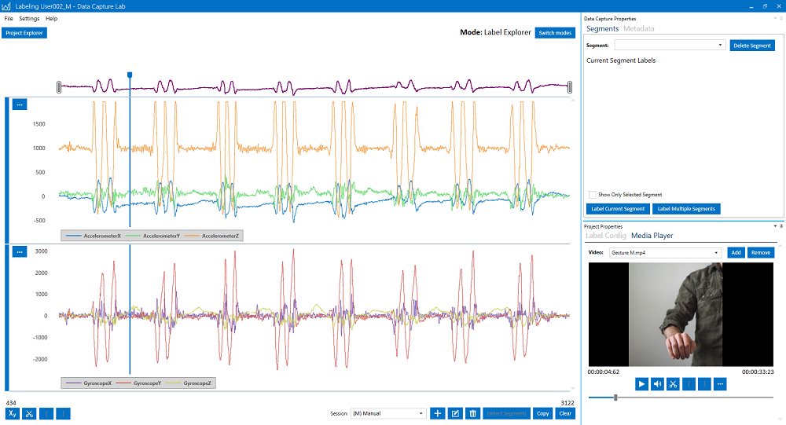
..

 * New UX for media player
 * General stability improvements
 * Added option to Float / Dock media player
 * Added time display for current sensor data location
 * Added time display for video location and total video length
 * Added ability to trim the start/end points in a video file
 * Added keyboard shortcuts for media playback

    .. csv-table::
       :widths: 10,20

       *Spacebar*, Play/Stop video or audio file
       *Right Arrow*, Step forward 1 frame
       *SHIFT + Right Arrow*, Step forward X frames (set in DCL settings screen)
       *Left Arrow*, Step backward 1 frame
       *SHIFT + Left Arrow*, Step backward X frames (set in DCL settings screen)

Multiple Manual Segmenters (Sessions)

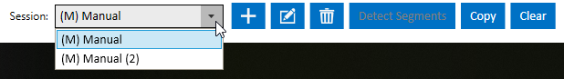
..

 * Added ability to create multiple manual segmenters
 * Added ability to customize manual segmenter names
 * Added ability to use Delete/Clear buttons with manual segmenters
 * Added new button 'Copy' to copy segments from one segmenter to another
 * Added option in Capture mode to select a segmenter session while capturing files

General Updates

 * Added better support for low screen resolutions
 * Added display for total sensor file length
 * Added *File → Close File* menu option
 * Added *Help → Check for Updates* menu option
 * Moved sample rate control into the Metadata tab
 * Moved toggle for packet loss annotations into DCL application settings
 * Minor UX improvements

:blue:`Bug Fixes`

 * Fixed issue in capture mode where last used device would sometimes fail to connect
 * Fixed issue in capture mode with estimated sample rate not being saved
 * Fixed issue in Open Project screen where project names that have an underscore were not displaying properly
 * Fixed issue in Label Mode with Segment Overview Control sometimes not displaying labels
 * Minor stability fixes

2.4.0 (02/26/2019)
``````````````````

:blue:`What's New`

 * Capturing audio data on Nordic Thingy now saves to WAV instead of CSV
 * Enabled QuickAI low frequency sample rates (26hz, 52hz)
 * Improved performance of Auto-Segmenters in DCL
 * Added support for upcoming server release

:blue:`Bug Fixes`

 * Fixed an invalid parameter in some auto-segmenter algorithms
 * Fixed sample rate when capturing Nordic Thingy audio (Changed from 8kHz to 16kHz)
 * Fixed issue when resolving a merge conflict between two labels would sometimes not save the segmenter
 * Fixed issue with creating a custom project schema while importing external captures files that have a 'sequence' column
 * Added user friendly error message for files with corrupted sensor data in a row

2.3.0 (09/26/2018)
``````````````````

:blue:`What's New`

Major Features

 * Added a timer while recording sensor data in Capture mode
 * Added a service to check for the latest version on startup

Minor Features

 * Updated 'Sensor Select' in the graphing control to always remember the last selected sensor columns
 * Changed the default behavior for labeling multiple file metadata and segments

:blue:`Bug Fixes`

 * Fixed bug with 'Auto add label' checkbox on the segment label screen not always remembering the last selected label
 * Fixed bug that sometimes causes an error when switching out of Capture mode while recording

2.2.1 (09/10/2018)
``````````````````

:blue:`Bug Fixes`

 * Fixed issue where QuickAI sample rate metadata was saved as 100hz instead of 104hz

2.2.0 (08/30/2018)
``````````````````

:blue:`What's New`

Major Features

 * Added new supported device - QuickAI
 * Added feature to remember the last connected device in Capture mode
 * Refactored device plugin architecture
 * Added new feature in the Project Explorer for importing external sensor data files into the DCL

Minor Features

 * Added 'Open in Explorer' option when you right-click on a file in the Project Explorer. This opens the selected file in Windows Explorer
 * Moved 'CSV Time Column' and 'Sample Rate' settings from the Application Settings screen into the new import settings screen. These settings are used when importing external files to a project
 * Removed relative 'CaptureFiles' paths from the .dclproj file. The DCL now automatically loads all files in the /data/ directory
 * The Label Config screen now trims extra white space from the end of labels to ensure consistent labeling

:blue:`Bug Fixes`

 * .WAV column name updated from 'Channel_0' to 'Microphone'. When collecting audio files through the DCL the column was saved as Microphone, but if you opened a .WAV file the column would load as 'Channel_0' which caused a mismatch on the server
 * Fixed minor issue where sometimes the plugin configuration would not load correctly, causing the 'Save Changes' button to appear even though there were no changes made
 * Fixed issue where vertical videos would playback in horizontal mode
 * Removed unsupported sensors from Nordic Thingy data sensor configuration screen

2.1.5
`````

:blue:`What's New`

 * Added signing certificate to installer

2.1.4
`````

:blue:`What's New`

Minor Features

 * Combined the Activity/Metadata tabs on the capture screen
 * Updated desktop DCL icon to match mobile DCL icon
 * Added ability to set 'Default Segment Length' when you add a segment via single right click on the graph

:blue:`Bug Fixes`

 * Fixed issue with adding a new segmenter algorithm when there are unsaved segment changes

2.1.3
`````

:blue:`Bug Fixes`

 * Fixes null exception while opening an offline project

2.1.2
`````

:blue:`What's New`

Major Features

 * Device plugin configuration is now saved to the cloud

:blue:`Bug Fixes`

 * Fixed issue in the Project Explorer where 'Try again' upload option would appear on files that have not been linked locally

2.1.1
`````

:blue:`What's New`

Major Features

 * Added support for capturing audio data from Nordic Thingy

    *Note: Currently saves raw data in CSV format*

Minor Features

 * Added ability to rename capture files in the project explorer
 * Updated remove capture feature to delete capture in the project explorer

:blue:`Bug Fixes`

 * Fixed issue with extra fields being saved to segment file (NoBinding fields)

2.1.0
`````

:blue:`What's New`

Major Features

 * Added Nordic Thingy as a supported capture device
 * Created new 'Open Project' screen
 * Added 'Recent Projects' list feature. The DCL remembers the most recently opened projects to allow for quick access the next time opening the DCL
 * Added 'Remember me' capability to the login screen
 * Added ability to use Magnitude transforms on auto-segmenter columns

Minor Features

 * Updated capture mode to automatically adds files to a project
 * Updated capture mode to use the label configuration

:blue:`Bug Fixes`

 * Fixed issue with Toast notifications appearing on wrong monitor if PC is docked to multiple monitors

2.0.2
`````

:blue:`What's New`

Minor Features

 * Save project from cloud now saves the label configuration
 * Added better error messages when deserializing label configuration

2.0.1
`````

:blue:`What's New`

Major Features

 * Added ability to download project and capture data from cloud to local hard drive

Minor Features

 * Added ability to clear auto-generated segments on a capture file

:blue:`Bug Fixes`

 * Fixed display issue with video playback
 * Fixed unexpected error when clicking on segment line inside the Segmenter Builder
 * Fixed issue with empty .sdcl files

2.0.0
`````

:blue:`What's New`

WAV File Support

 * Added ability to add .WAV files to a project
 * Added ability to segment and play .WAV files
 * Added ability to save a .WAV file as CSV

Auto Segmenters

 * Added ability to create multiple auto-segmenters for a project
 * Added ability to view segments generated by auto-segmenters

General Updates

 * Added Y-Axis to label mode graph
 * Created 'Segmenter Builder' feature - Allows user to select "ideal" segments to automatically find a segmenter for generating segments
 * Created Label Config - New feature for labeling Segments/Metadata. Makes typo errors less likely. Replaces 'Default Labels/Default Metadata'
 * Created 'Segment Overview' - Allows user to quickly tab through segments on a file to see basic segment label summary

Minor Features

 * Segment double click - Added ability to double click on a segment to have the graph zoom into the segment
 * Adjust offset feature - Adds ability to drag the blue offset line to the correct location while playing videos
 * Cloud sample rate - Sample rate now is saved to both local captures and cloud captures
 * Calculated sample rate - New feature for keeping video files in sync with raw data
 * Loading capture file - Loading 'Cloud only' project files is now significantly faster
 * Uploading capture file - Uploading new files to the cloud is now significantly faster
 * Add video feature - Added buttons for for adding/removing a video to play with a raw capture file
 * Show packet loss gaps - Added a checkbox for making packet loss gaps visible as gray boxes in the graph
 * Show Line Point Markers - Added a checkbox to show exact sensor amplitude values when hovering over graph points

Limitations

 * Audio features - Audio must be in .WAV format, 16 bit, and 16 kHz sampling rate
