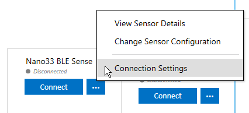
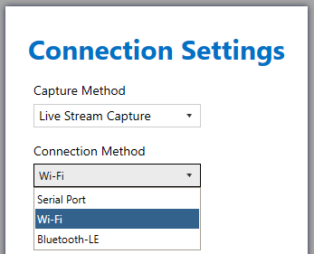
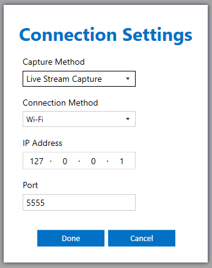
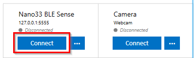
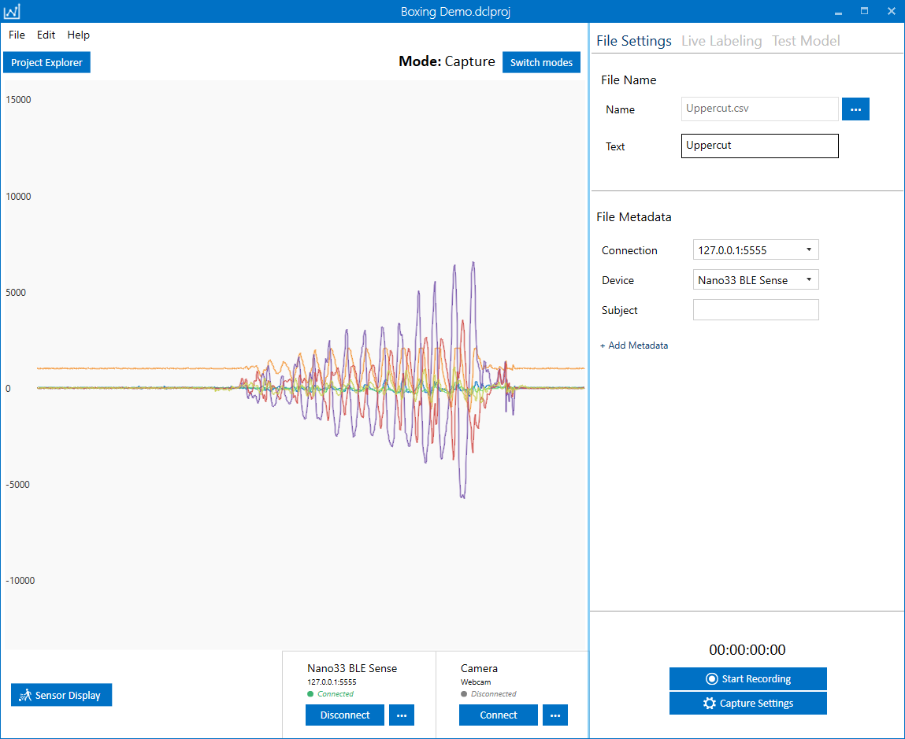

1. Open the sensor Connection Settings

2. Select Wi-Fi connection method

3. Enter the address and port of your Device/Gateway

4. Click Connect

5. Verify the data is being streamed live into the Data Studio

Now that the data is streaming to the Data Studio, you can begin recording capture files. Files that are recorded will be saved locally and synced up to the SensiML Cloud. 