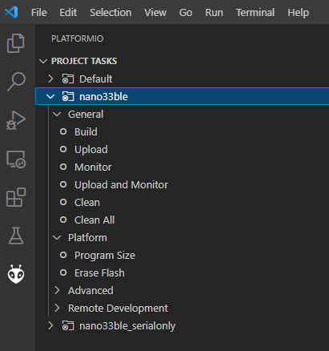
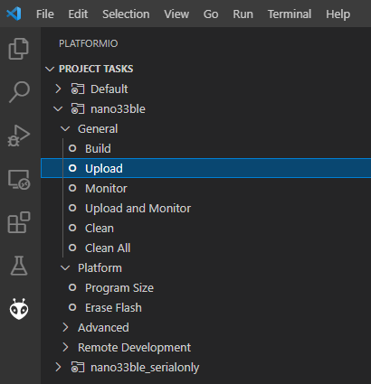
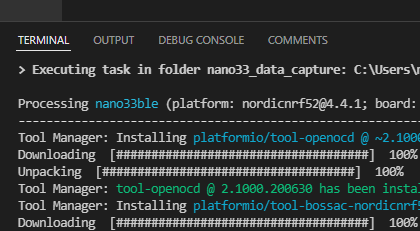

.. meta::
   :title: Firmware - Arduino Nano33 BLE Sense
   :description: Guide for flashing Arduino Nano33 BLE Sense firmware for data capture and recognition

=========================
Arduino Nano 33 BLE Sense
=========================

.. image:: /firmware/arduino-nano33/img/nano33-hardware.jpg
    :align: center
    :alt: The Nano 33 BLE Sense Hardware

The Arduino Nano 33 BLE Sense combines a tiny form factor, different environment sensors, and the possibility to run AI using TinyML and TensorFlow™ Lite. Whether you are looking at creating your first embedded ML application or you want to use Bluetooth® Low Energy to connect your project to your phone, the Nano 33 BLE Sense will make that journey easy.

This guide will go over how to setup the Arduino Nano 33 BLE Sense firmware for data collection or recognition. Once your device is setup, you can find a tutorial on how to use the SensiML Toolkit software in the :doc:`Getting Started Tutorial</guides/getting-started/overview>`.

.. platformio-start-marker

PlatformIO
----------

Arduino firmware in this guide is flashed using the Arduino built-in flashing tools. For building the firmware, we have chosen to use PlatformIO as the main interface for building firmware for Arduino boards which can be found at `<https://platformio.org/>`_. It allows the user ease of access to change and add build flags, as well as allowing for multiple build environments.

PlatformIO can be installed into your favorite editor or run from the command line. We will use Visual Studio Code in this guide, PlatformIO's recommended editor.

.. platformio-end-marker

Example Firmware
----------------

You can find examples of data collection or recognition firmware below.

**Data Collection Firmware**

.. list-table:: Arduino Nano 33 BLE Sense pre-built Data Collection Firmware
   :widths: 35 25 35 10
   :header-rows: 1

   * - Sensors
     - Protocol
     - Download
     - Version
   * - Accelerometer/Gyroscope (119 Hz)
     - Simple Stream V1.0 (USB Serial)
     - :download:`nano33-ss-imu-data-collection-serial-119hz.bin <file/nano33-ss-imu-data-collection-serial-119hz.bin>`
     - `1.0 <https://github.com/sensiml/nano33_data_capture/tree/1.0>`_
   * - Accelerometer/Gyroscope (119 Hz)
     - Simple Stream V1.0 (BLE)
     - :download:`nano33-ss-imu-data-collection-ble-119hz.bin <file/nano33-ss-imu-data-collection-ble-119hz.bin>`
     - `1.0 <https://github.com/sensiml/nano33_data_capture/tree/1.0>`_
   * - Audio (16KHz)
     - Simple Stream V1.0 (USB Serial)
     - :download:`nano33-ss-audio-data-collection-serial.bin <file/nano33-ss-audio-data-collection-serial.bin>`
     - `1.0 <https://github.com/sensiml/nano33_data_capture/tree/1.0>`_

.. note:: We provide the binaries above for testing data collection quickly. You can build your own binaries for additional sample rates by building from source code in the SensiML GitHub at `<https://github.com/sensiml/nano33_data_capture/>`__.

**Knowledge Pack/Recognition Firmware**

Knowledge Pack recognition firmware can be found in the SensiML GitHub at `<https://github.com/sensiml/nano33_knowledge_pack/>`__.

.. flash-instructions-start-marker

Flash Instructions
------------------

Follow the steps below to flash data collection firmware or recognition firmware to your device.

1. Open the PlatformIO Home page in VS Code

.. image:: /firmware/arduino-nano33/img/platformio-open.png
    :align: center

2. Click **Open Project** and select the data collection or recognition source code location on your computer.

.. image:: /firmware/arduino-nano33/img/platformio-open-project.png
    :align: center

3. PlatformIO will pull down the libraries and packages needed to build, this may take several minutes the first time building. Your project will now appear in the PlatformIO **Project Tasks** menu.

4. Click **Upload** in your selected project environment to build the firmware. Make sure your device is plugged in via a USB port.

5. PlatformIO will automatically detect the proper COM port (Windows) or /dev/ port (Linux) and upload to your device. You can see the status in the Terminal Window.

.. flash-instructions-end-marker

Using TensorFlow Lite for Microcontrollers in a Knowledge Pack
--------------------------------------------------------------

When running a model built using `TensorFlow Lite <https://sensiml.com/tensorflow-lite/>`__, another environment is provided in the Knowledge Pack code base. The environment ``env:nano33ble_with_tensorflow`` will automatically link this in with the same code base.

Changing IMU Frequency/Sample Rate
----------------------------------

The frequency/sample rate that IMU data collection firmware outputs is set at compile-time.

1. Open ``include/sensor_config.h``.

2. Update ``#define ACCEL_GYRO_DEFAULT_ODR`` to set the frequency. *Note: The default value for both is ACCEL_GYRO_ODR_119HZ*

Enabling Audio
--------------

Audio is disabled by default. Follow the instructions below to enable audio.

1. Open ``include/sensor_config.h``.

2. Update ``#define ENABLE_AUDIO`` to 1 to enable audio.

*Note: IMU and Audio cannot be enabled at the same time. Enabling Audio will disable the IMU.*

Adding Sensors
--------------

The Nano 33 BLE Sense has more sensors than just the IMU and Audio.

The data capture code provided here is meant to be an example for the following:

- Adding Sensors in the order intended to be run in a model
- Creating the JSON configuration message so that the Data Studio knows what data is coming in
- Sending sensor data out in the same order specified by the configuration message.

Adding another sensor from the board takes the following:

1. Adding the appropriate library to ``platformio.ini`` in the ``lib_deps`` section.

2. Adding a setup_sensor() function to main.cpp (or elsewhere). This setup function will add the sensor column names to the configuration message. The highest sample rate will be used when sending data out, regardless of if the sensor has an update.

3. Adding an update_sensor() function to main.cpp (or elsewhere). This function will add the sensors in the same order as the configuration message specifies.

Adding New Sensors to the Data Studio
-------------------------------------

The Data Studio includes a built-in device plugin for the Nano 33 BLE Sense *IMU* and *Audio* sensors. You can add additional sensors to your board and use them for data collection in the Data Studio by creating a custom device plugin. You can create a device plugin by defining your sensor information in an SSF file and importing it to the Data Studio. We provide an example SSF file for your device plugin named ``nano33_custom.ssf`` in the SensiML GitHub repository at `<https://github.com/sensiml/nano33_data_capture/>`__.

For more details on defining SSF file properties and implementing the Simple Streaming specification in your firmware see the :doc:`Adding Custom Device Firmware Documentation</data-studio/adding-custom-device-firmware>`.