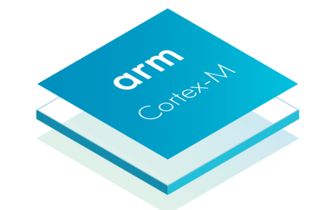
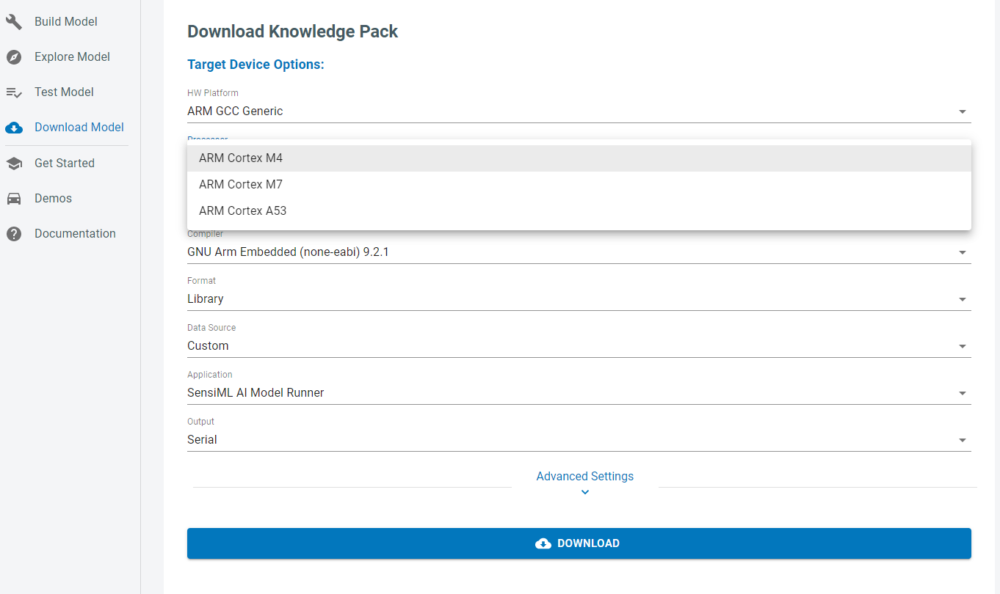

.. meta::
   :title: Firmware - Arm GCC Cortex M4/M7/A53
   :description: Guide for Arm GCC Cortex M4/M7/A53 firmware for data capture and recognition for machine learning applications

=========================
Arm GCC Cortex M4/M7/A53
=========================

We support building Knowledge Pack libraries which can be included as part of your application code for Cortex M4, M7, and A53 processors using the Arm GCC compiler.

For custom hardware, you will need to implement your own data collection and recognition firmware. 

You can follow our :doc:`Simple Streaming Interface<../../simple-streaming-specification/introduction>` to implement data capture to connect to the Data Studio. You can also import .csv or .wav files directly. 

You can follow our :doc:`Knowledge Pack Library<../../knowledge-packs/building-a-knowledge-pack-library>` for instructions on including the machine learning library in your application. 

To download the library, select Arm GCC Generic in the Download Model page along with the appropriate processor for your platform.

