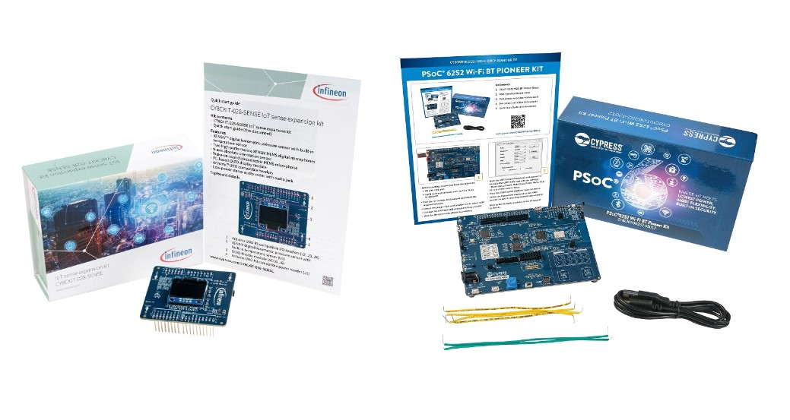
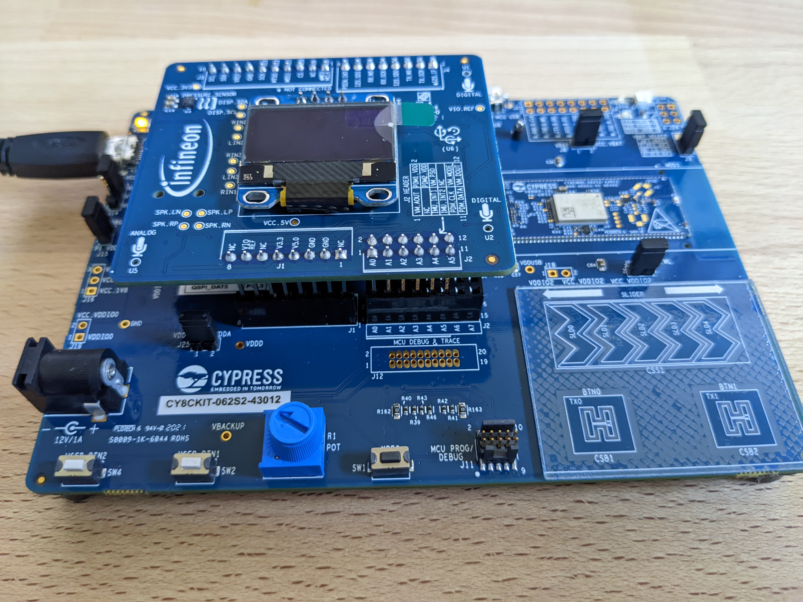
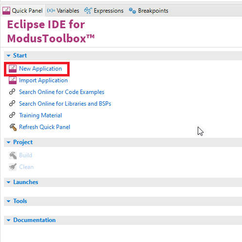
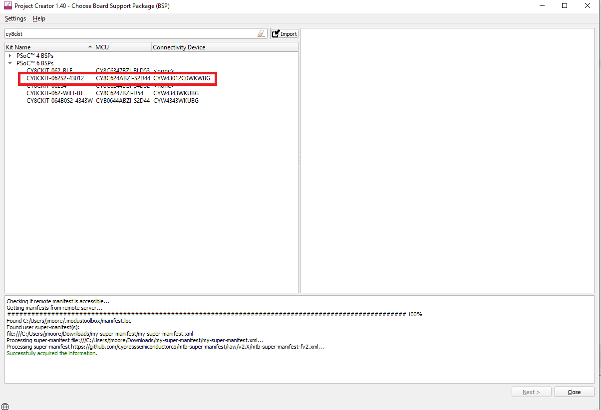
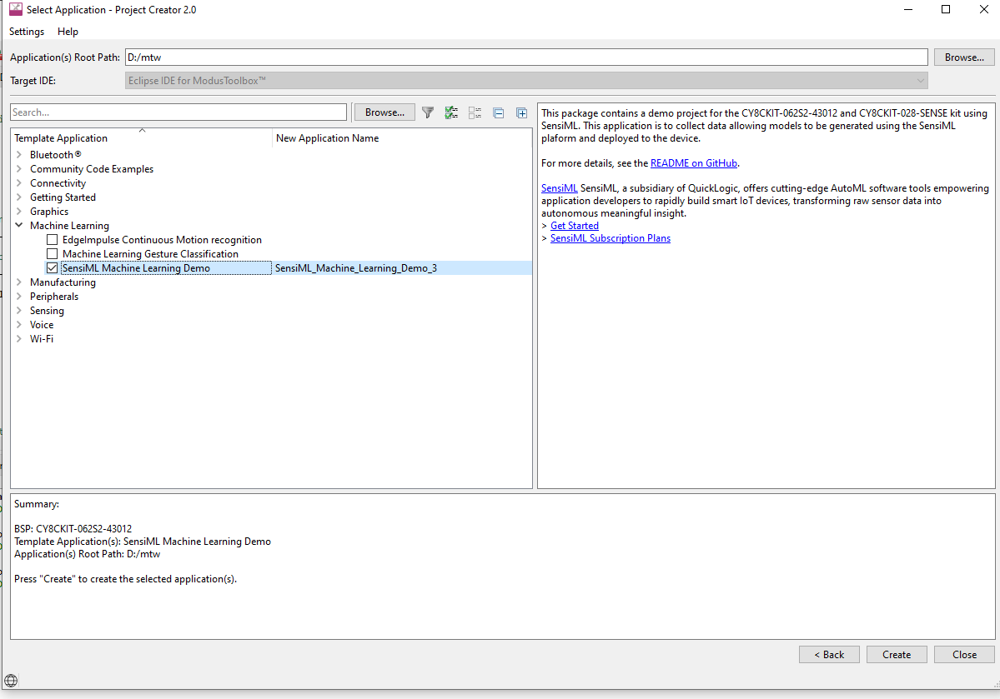

.. meta::
   :title: Firmware -  PSoC 62S2 Wi-Fi BT Pioneer Kit (CY8CKIT-062S2-43012)
   :description: Guide for flashing Infineon CY8CKIT-062S2-43012 with CY8CKIT-028-SENSE addon board

================
Infineon PSoC™ 6
================

The PSoC™ 6 family is built on an ultra-low-power architecture, and the MCUs feature low-power design techniques that are ideal for battery powered applications. The dual-core Arm® Cortex®-M4 and Cortex-M0+ architecture lets designers optimize for power and performance simultaneously. Using its dual cores combined with configurable memory and peripheral protection units, the PSoC™ 6 MCU delivers the highest level of protection defined by the Platform Security Architecture (PSA) from Arm.

SensiML supports the `Infineon PSoC 62S2 Wi-Fi BT Pioneer Kit <https://www.infineon.com/cms/en/product/evaluation-boards/cy8ckit-062s2-43012/?utm_source=cypress&utm_medium=referral&utm_campaign=202110_globe_en_all_integration-dev_kit>`__ with the `IoT sense expansion kit <https://www.infineon.com/cms/en/product/evaluation-boards/cy8ckit-028-sense/>`__

This guide will go over how to setup the PSoC™ 6 firmware for data collection or recognition. Once your device is setup, you can find a tutorial on how to use the SensiML Toolkit software in the :doc:`Getting Started Tutorial</guides/getting-started/overview>`.

Connecting the Board
--------------------

Connect the IoT sense expansion kit (CY8CKIT-028-SENSE) to the PSoC 62S2 Wi-Fi BT Pioneer Kit (CY8CKIT-062S2-43012) in order to use the IMU and Microphone sensors. 

Building & Flashing Firmware
----------------------------

In order to build firmware for the PSoC 62S2 kit, you will need ModusToolbox from Infineon, available here: https://softwaretools.infineon.com/tools/com.ifx.tb.tool.modustoolbox

The firmware source code is hosted by SensiML on GitHub: https://github.com/sensiml/psoc6-template-fw

This project can be manually imported into ModusToolbox or created as a new application in Eclipse.

To create a new application with the SensiML Template, first select a New Application in the Eclipse for ModusToolbox window:

Then, find ``CY8CKIT-062S2-43012`` for the board support package, and click next:

Then, select the SensiML Template Application, and give your project a name:

For data collection, set the ``#define APPLICATION_RUNNING_MODE`` in ``app_config.h`` to 

.. code-block:: c

    #define APPLICATION_RUNNING_MODE DATA_CAPTURE_RUNNING_MODE

To build and flash the application, open the terminal and run the command.

.. code-block:: bash

   make program TARGET=CY8CKIT-062S2-43012 TOOLCHAIN=GCC\_ARM

Connecting to the Data Studio
-----------------------------

After the board has been flashed with the data collection firmware you can start using it in the Data Studio. By default, the Data Studio supports data collection for the *Accelerometer*, *Gyroscope*, and *Microphone* sensors. If you want add new sensors see the :ref:`Adding Custom Device Firmware Documentation<how_to_import_plugin>` for more information.

.. psoc-6-build-flash-firmware-start-marker

Download/Flash Model Firmware
-----------------------------

In the Analytics Studio, download the Knowledge Pack Library.

.. figure:: /firmware/infineon-psoc6/img/download-library.png
   :align: center

Extract the downloaded file, and inside you will see a knowlegepack\_project and sensiml folders.

.. figure:: /firmware/infineon-psoc6/img/extract-files.png
   :align: center

You will want to copy all of the files in senisml/lib and sensiml/inc over to the source/lib folder in your ModusToolbox template project.

.. figure:: /firmware/infineon-psoc6/img/copy-lib-source-files.png
   :align: center

The knowledgepack\_project folder will contain the app\_config.h for your project. You can copy it to the source folder of your ModusToolbox template project.

Click the build icon button or run the following command in the terminal:

.. code-block:: bash

   make program TARGET=CY8CKIT-062S2-43012 TOOLCHAIN=GCC\_ARM

.. figure:: /firmware/infineon-psoc6/img/modus-toolbox-project.png
   :align: center

This will build and flash the PSoC 6 with firmware to perform local inference.

.. psoc-6-build-flash-firmware-end-marker