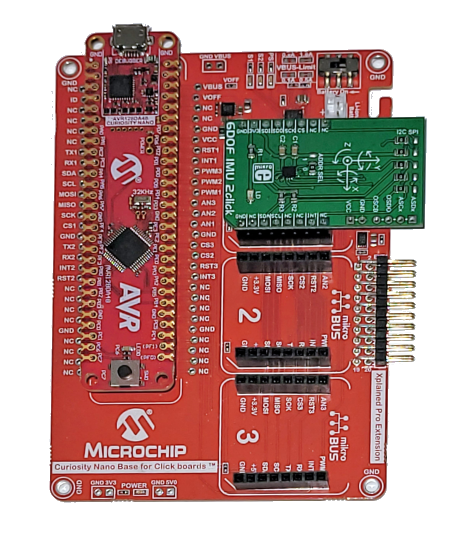

.. meta::
   :title: Firmware - Microchip Technology AVR128DA48 Curiosity Nano Evaluation Kit
   :description: Guide for flashing Microchip Technology AVR128DA48 Curiosity Nano Evaluation Kit firmware for data collection and recognition

=============================================================
Microchip Technology AVR128DA48 Curiosity Nano Evaluation Kit
=============================================================

Data Collection Firmware
------------------------

.. list-table:: Microchip Technology AVR128DA48 Curiosity Nano Evaluation Kit pre-built Data Collection Firmware
   :widths: 35 25 35 10
   :header-rows: 1

   * - Sensors
     - Protocol
     - Download
     - Repository
   * - (BMI160) Accelerometer & Gyroscope (100 Hz)
     - Simple Stream V2.0 (Serial)
     - :download:`avr128da48-imu-logger-100-hz.hex <file/avr128da48-imu-logger-100-hz.hex>`
     - `AVR128 Data Logger <https://github.com/MicrochipTech/ml-avrda-cnano-imu-data-logger>`_ 

.. note:: We provide the binary above for testing data collection quickly. You can build your own binary from the data collection source code for IMU data collection using the SensiML Simple Streaming Interface. The source code is located in the Microchip Technology github repository at at `<https://github.com/MicrochipTech/ml-avrda-cnano-imu-data-logger>`_.

Building & Flashing Firmware Tutorial
-------------------------------------

A tutorial for building and flashing firmware on the Microchip Technology AVR128DA48 Curiosity Nano Evaluation Kit can be found at `<https://github.com/MicrochipTech/ml-avrda-cnano-imu-data-logger>`_

Knowledge Pack/Recognition Firmware Source Code
-----------------------------------------------

Example source code for recognition firmware using a SensiML Knowledge Pack can be found in the github repository at `<https://github.com/sensiml/avr128da48-template>`_