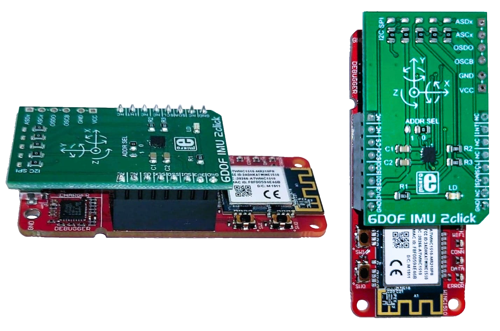

.. meta::
   :title: Firmware - Microchip Technology PIC-IoT WG Development Board
   :description: Guide for flashing Microchip Technology PIC-IoT WG Development Board firmware for data collection and recognition

==================================================
Microchip Technology PIC-IoT WG Development Board
==================================================

Data Collection Firmware
------------------------
 
.. list-table:: Microchip Technology PIC-IoT WG Development Board Data Collection Firmware
   :widths: 35 25 35 10
   :header-rows: 1

   * - Sensors
     - Protocol
     - Download
     - Repository
   * - (BMI160) Accelerometer & Gyroscope (100 Hz)
     - Simple Stream V2.0 (Serial)
     - :download:`ml-pic-iot-imu-sensiml-data-logger.hex <file/ml-pic-iot-imu-sensiml-data-logger.hex>`
     - `PIC-IOT Data Logger <https://github.com/sensiml/ml-pic-iot-imu-sensiml-data-logger>`_ 

.. note:: We provide the binary above for testing data collection quickly. You can build your own binary from the data collection source code for IMU data collection using the SensiML Simple Streaming Interface. The source code is located in the Microchip Technology github repository at at `<https://github.com/sensiml/ml-pic-iot-imu-sensiml-data-logger>`_.

Building & Flashing Firmware Tutorial
-------------------------------------

A tutorial for building and flashing firmware on the Microchip Technology PIC-IoT WG Development Board can be found at `<https://github.com/sensiml/ml-pic-iot-imu-sensiml-data-logger>`_

Knowledge Pack/Recognition Firmware Source Code
-----------------------------------------------

Example source code for recognition firmware using a SensiML Knowledge Pack can be found in the github repository at `<https://github.com/sensiml/ml-pic-iot-imu-sensiml-template>`_