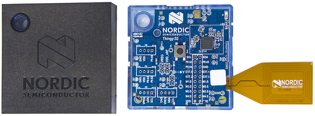

.. meta::
   :title: Firmware - Nordic Thingy
   :description: Guide for flashing Nordic Thingy firmware

=============
Nordic Thingy
=============

Data Collection Firmware
------------------------

.. list-table:: Nordic Thingy pre-built Data Collection Firmware
   :widths: 35 25 35 10
   :header-rows: 1

   * - Sensors
     - Protocol
     - Download
     - Build Version
   * - Accelerometer/Gyroscope (200, 100, 50, 25, 10, 5 Hz), Audio (16 Khz)
     - BLE Protocol
     - :download:`nordic-thingy-data-collection.zip <file/nordic-thingy-firmware.zip>`
     - `v2.1.0 <https://bitbucket.org/sensimldevteam/nordic_thingy_fw/src/v2.1.0/>`_ 

.. note:: We provide the binaries above for testing data collection quickly. You can build your own binary from the data collection source from the github repo found `here <https://bitbucket.org/sensimldevteam/nordic_thingy_fw/src/v2.1.0/>`__.

