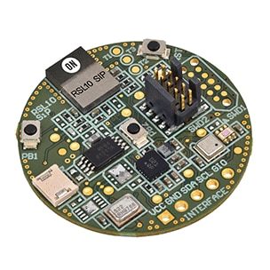

.. meta::
   :title: Firmware - onsemi RSL10 Sense
   :description: Guide for flashing onsemi RSL10 Sense firmware for data collection and recognition

============================
onsemi RSL10 Sense
============================

Getting Started Guide
---------------------

You can find a Getting Started user guide for setting up your onsemi RSL10 Sensor Kit at `<https://www.onsemi.com/pub/collateral/rsl10%20sensiml%20software%20getting%20started%20guide.pdf>`_

This user guide describes firmware toolchain installation and verification of an onsemi.SensiML CMSIS pack.

Product Page
------------

Additionally, you can find a feature overview, hardware information, and other resources in the onsemi RSL10 Sense product page at `<https://www.onsemi.com/design/tools-software/evaluation-board/rsl10-sense-gevk>`_.
