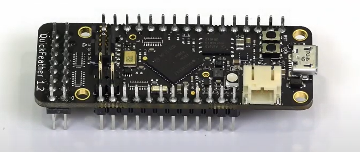
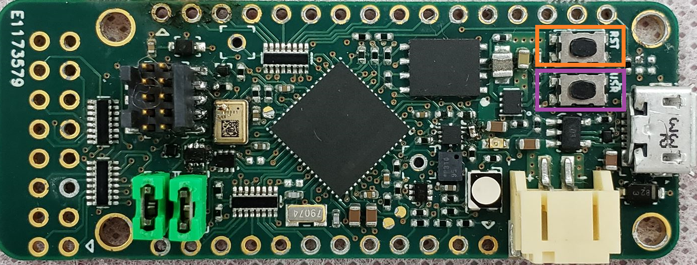
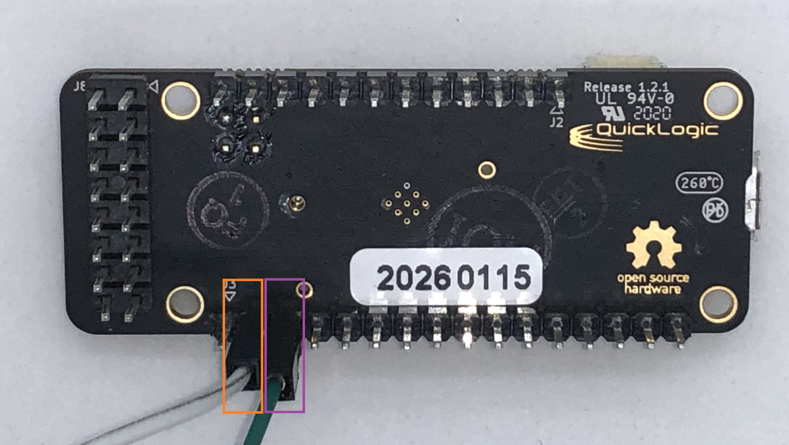

.. meta::
   :title: Firmware - QuickLogic QuickFeather
   :description: Guide for flashing QuickLogic QuickFeather firmware

=======================
QuickLogic QuickFeather
=======================




The `QuickFeather Development Kit <https://www.quicklogic.com/products/eos-s3/quickfeather-development-kit/>`_ is a small form factor system ideal for enabling the next generation of low-power Machine Learning (ML) capable IoT devices. Unlike other development kits which are based on proprietary hardware and software tools, QuickFeather is based on open source hardware, compatible with the Adafruit Feather form factor, and is built around 100% open source software (including the Symbiflow FPGA Tools).

The QuickFeather is powered by QuickLogic’s EOS™ S3, the first FPGA-enabled Arm Cortex®-M4F MCU to be fully supported with Zephyr RTOS

Flashing QuickFeather Firmware
------------------------------

**Data Collection Firmware**

In the links below you can find the firmware for flashing a QuickFeather device with data collection firmware for use with the SensiML Data Studio.

.. note:: *The MC3635 accelerometer in QuickFeather has a +/- 10% tolerance in the internal clock used to set sample rate. This means setting a sample rate of 400Hz can result in captured sensor data varying from board to board within a range of 360Hz – 440hz. This sensor limitation should be understood and factored in your models for applications where sample timing sensitivity is critical.*


.. list-table:: QuickFeather pre-built Data Collection Firmware
   :widths: 35 25 35 10
   :header-rows: 1

   * - Sensors
     - Protocol
     - Download
     - Version
   * - Accelerometer (104 Hz)
     - Simple Stream V1.0 (SERIAL)
     - :download:`qf-ss-imu-data-collection-serial-100hz.bin <file/qf-ss-imu-data-collection-serial-100hz.bin>`
     - `v1.10.0 <https://github.com/QuickLogic-Corp/qorc-sdk/tree/v1.10.0/qf_apps/qf_ssi_ai_app/>`_ 
   * - Accelerometer (104 Hz)
     - Simple Stream V1.0 (UART)
     - :download:`qf-ss-imu-data-collection-uart-100hz.bin <file/qf-ss-imu-data-collection-uart-100hz.bin>`
     - `v1.10.0 <https://github.com/QuickLogic-Corp/qorc-sdk/tree/v1.10.0/qf_apps/qf_ssi_ai_app/>`_ 
   * - Audio (16KHz)
     - Simple Stream V1.0 (USB Serial)
     - :download:`qf-ss-audio-data-collection-serial-16khz.bin <file/qf-ss-audio-data-collection-serial-16khz.bin>`
     - `v1.10.0 <https://github.com/QuickLogic-Corp/qorc-sdk/tree/v1.10.0/qf_apps/qf_ssi_ai_app/>`_ 
   * - Audio (16KHz)
     - Simple Stream V1.0 (UART)
     - :download:`qf-ss-audio-data-collection-uart-16khz.bin <file/qf-ss-audio-data-collection-uart-16khz.bin>`
     - `v1.10.0 <https://github.com/QuickLogic-Corp/qorc-sdk/tree/v1.10.0/qf_apps/qf_ssi_ai_app/>`_ 
   * - Accelerometer (600, 400, 210, 105, 54, 28, 14), Audio (16KHz)
     - MQTT-SN
     - :download:`qf-mqtt-data-collection.bin <file/quickfeather-mqtt-data-collection.bin>`
     - `v1.10.0 mqtt <https://github.com/QuickLogic-Corp/qorc-sdk/tree/v1.10.0/qf_apps/qf_mqttsn_ai_app>`_ 

    
.. note:: We provide the binaries above for testing data collection on QuickFeather quickly. You can build your own binary from the data collection source from the qorc github repo found at `https://github.com/QuickLogic-Corp/qorc-sdk <https://github.com/QuickLogic-Corp/qorc-sdk>`_. We recommend using the latest source over these pre-built binaries.

.. note:: Data Collection Firmware is **required** to record data with Data Studio. Data collection is disabled when running a Knowledge Pack.


.. _initial-setup-for-flashing-quickfeather:

Initial Setup for Flashing
``````````````````````````

Ensure you have a Python installation on your system. It is recommended to have Python 3.6 or newer installed.

You will need the TinyFPGA Programmer from QuickLogic to flash your device. Instructions for setting up your computer to flash a QuickFeather board are in the `Utilities section of the qorc-sdk README <https://github.com/QuickLogic-Corp/qorc-sdk#utilities>`_.

.. note:: You only need TinyFPGA Programmer and dependencies set up in order to flash, but installing the other items is recommended in order to build. The tinyfpgab python package will also run in Windows

.. note:: When you download the TinyFPGA Programmer you need to use `git <https://git-scm.com/>`_ to clone the repo from the github. Downloading a zip version of the repo can cause unexpected results

QuickFeather Buttons
````````````````````

The QuickFeather has two buttons, USR (User), and RST (Reset). They are used in flashing. In the figure below, RST is highlighted in orange, the USR button is highlighted in purple




.. _flashing-a-file-quickfeather:

Flashing a File
```````````````

 1. Connect your QuickFeather board to your computer using a USB to Micro-USB cable.
 2. Press the 'Reset' button on the QuickFeather board. The LED will flash blue for five seconds. Press the 'User' button while the LED is still flashing blue.

    After pressing the 'User' button the LED will begin to flash green. This means the device is now in upload mode. If the LED is not flashing green then repeat this step

 3. While the LED is blinking green, program the data collection binary into QuickFeather by running the following command:

    .. code-block:: bash

        python /Your-directory-path-to-TinyFPGA-Programmer/tinyfpga-programmer-gui.py --port COMX --m4app /Your-directory-path-to-binary/your-binary-file.bin --mode m4
        # Replace COMX with your own device COM port number.
        # Replace /Your-directory-path-to-TinyFPGA-Programmer/ and /Your-directory-path-to-binary/ with your computer's file path locations.
        # Replace your-binary-file.bin with the name of the file you are flashing.

 4. After programming has completed, press the 'Reset' button
    The LED should flash blue for 5 seconds and load the selected application. Once the application is done loading the LED will turn off

Recovering a QuickFeather
`````````````````````````

If the QuickFeather fails to flash, there could be a problem with the bootloader. However, it is possible to recover.

Instructions for recovering a "bricked" QuickFeather board can be found `here <https://github.com/QuickLogic-Corp/qf-initial-bins>`_.

QuickFeather Simple Streaming
-----------------------------

The QuickFeather board supports our :doc:`Simple Streaming<../../simple-streaming-specification/introduction>` interface, and provides an example application to use your own sensors as well.

.. _quickfeather-serial-setup:

Serial Port Setup
`````````````````

By default, the Simple Streaming version of the QuickFeather firmware uses the hardware UART. This means that a USB to TTL serial adapter must be used (or another Feather/Wing to communicate)

In order to see data collection and recognition output with the qf_ssi_ai_app firmware, the adapter must be wired accordingly. This adapter plugs in RXD to Pin 2 (white wire, orange box) and TXD to Pin 3 on J3 (green wire, purple box).



You can then open the port in Tera Term, PuTTy, or other serial port program at 460800 to test the connection.


Example Application
```````````````````

An example application for how to use the Simple Streaming interface with the QuickFeather can be found in GitHub at `<https://github.com/QuickLogic-Corp/qorc-sdk/tree/master/qf_apps/qf_ssi_ai_app>`_.

This application can be used for either data collection or recognition based on your build properties.


Adding a Sensor
```````````````

The `application README <https://github.com/QuickLogic-Corp/qorc-sdk/tree/master/qf_apps/qf_ssi_ai_app#adding-a-sensor>`_ of ``qf_ssi_ai_app`` explains how to add and configure sensor hardware within the application.


Seeing Debug Output
```````````````````

In order to enable debug output over the USB-serial port, it must be enabled in the QuickFeather firmware. To do this, modify the following two defines in ``Fw_global_config.h`` of the qf_ssi_ai_app to be the following:

.. code-block:: C

    #define FEATURE_USBSERIAL   1       // USBSERIAL port is present
    #define DEBUG_UART  UART_ID_USBSERIAL  // Write data to USB serial port

.. _getting-knowledge-pack-results-quickfeather-simple-stream:

Getting Knowledge Pack Results (Simple Stream)
``````````````````````````````````````````````

After flashing your device with a Knowledge Pack the results will print to the data (default: hardware) UART automatically.

1. Plug in your QuickFeather via a USB to TTL serial adapter (See :ref:`quickfeather-serial-setup` for more details)
2. Open a terminal emulator (such as Tera Term)
3. Set your serial speed to 460800
4. Create a new connection to your QuickFeather device COM port

You will now see classification results printed in the terminal

Using With Wi-Fi
````````````````

An example application for using Simple Streaming with the `ESP32 Feather <https://www.adafruit.com/product/3405>`_ board has been created to allow for both data capture and recognition results to be seen over a simple HTTP service.

The source code can be found in our `GitHub Repository <https://github.com/sensiml/esp32_simple_http_uart>`_ for this device. When the ESP32 is configured to swap the RX and TX UART ports, it will communicate with the QuickFeather with no additional changes needed for the QuickFeather.


QuickFeather MQTT-SN
--------------------


Seeing Debug Output
```````````````````

The QuickFeather board comes with a single USB-serial port, but another is enabled through via a USB to TTL serial adapter. This adapter plugs in RXD to Pin 2 (white wire, orange box) and TXD to Pin 3 on J3 (green wire, purple box).

In order to see Debug output with the data collection firmware provided, this port must be used. You can then open the port in Tera Term, PuTTy, or other serial port program at 115200bps.


.. _getting-knowledge-pack-results-quickfeather-mqtt-sn:

Getting Knowledge Pack Results (MQTT-SN)
````````````````````````````````````````

As the QuickFeather does not have wireless communication without a feather board addon, in order to see model results from a Knowledge Pack, some additional steps will need to be performed.

Download the `qorc-sdk Tools <https://github.com/QuickLogic-Corp/qorc-sdk/Tools>`_. In this directory there is a `serial to UDP bridge <https://github.com/QuickLogic-Corp/qorc-sdk/tree/master/Tools/bridge>`_, a copy of the `RSMB broker <https://github.com/QuickLogic-Corp/qorc-sdk/tree/master/Tools/rsmb>`_, and a `host application python script <https://github.com/QuickLogic-Corp/qorc-sdk/tree/master/Tools/dclsim>`_.

1. Open the options.json file in your 'bridge' directory. Update the SerialPortNum property with your device COM port (other options can be ignored):

  .. code-block:: javascript

      {
          "SerialPortNum": X,
          "BaudRate": 115200,
      }

2. Navigate to the 'rsmb' directory and start a command/PowerShell window. Run the RSMB by entering the following command:

  .. code-block:: powershell

      .\rsmb.exe .\rsmb_config.txt

3. Navigate to the 'bridge' directory start a second command/Powershell window. Run the MqttConsoleApp by entering the following command:

  .. code-block:: powershell

      .\MqttConsoleApp.exe -j .\options.json

4. Once the MqttConsoleApp window is finished loading, press 's' to start the bridge.

Next, we are going to listen for recognition results by using the host application script `smlhost.py`. This file can be found in the 'dclsim' directory

5. Navigate to the 'dclsim' directory and start a third command/powershell Window

6. In order to run the host application you will need the paho-mqtt python package. Enter the following command to install this package:

  .. code-block:: bash

      pip install paho-mqtt

7. In the same window, run the host application by entering the following command. Pass in `--recog` and a timeout (timeout of 0 will run until Ctrl+C is pressed):

  .. code-block:: bash

      python smlhost.py --recog --timeout XX --accel
      # Replace XX with a timeout value

You will also see classifications printed out over debug prints, if you have the debug USB-Serial cable attached to the QuickFeather.
