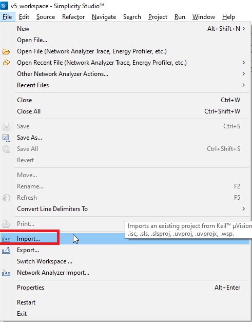
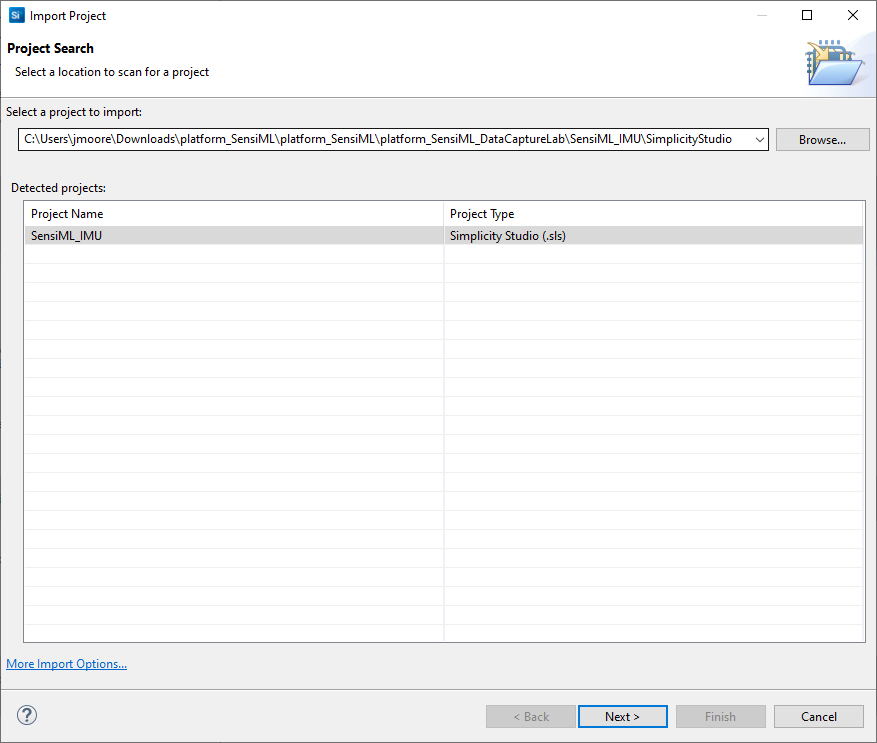
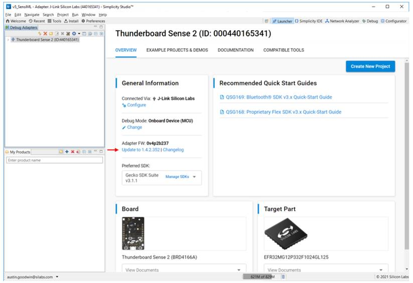
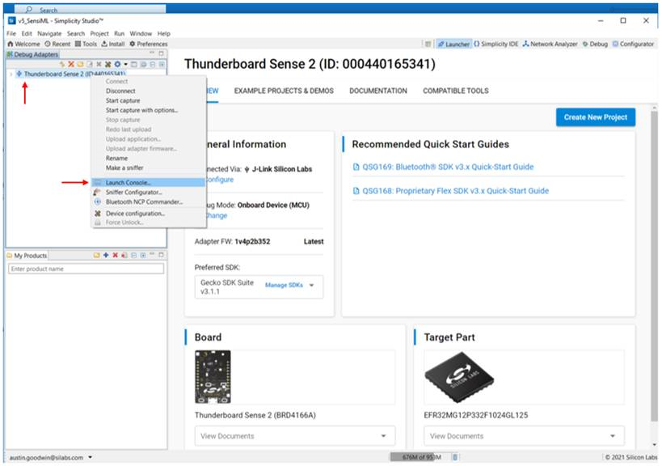
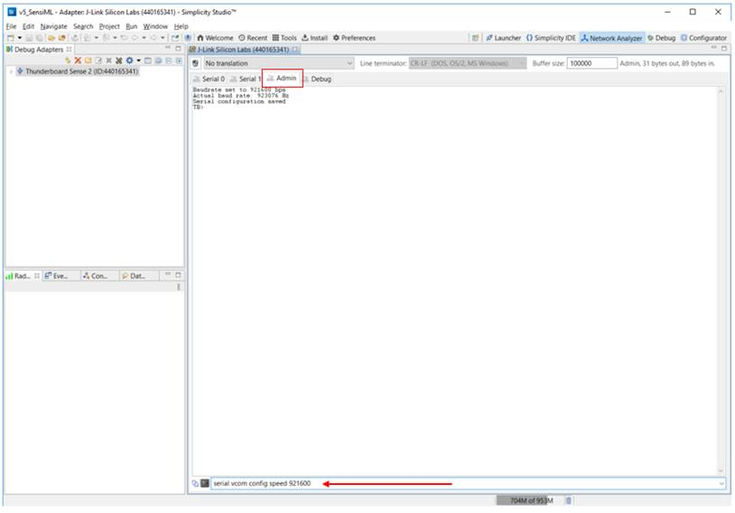
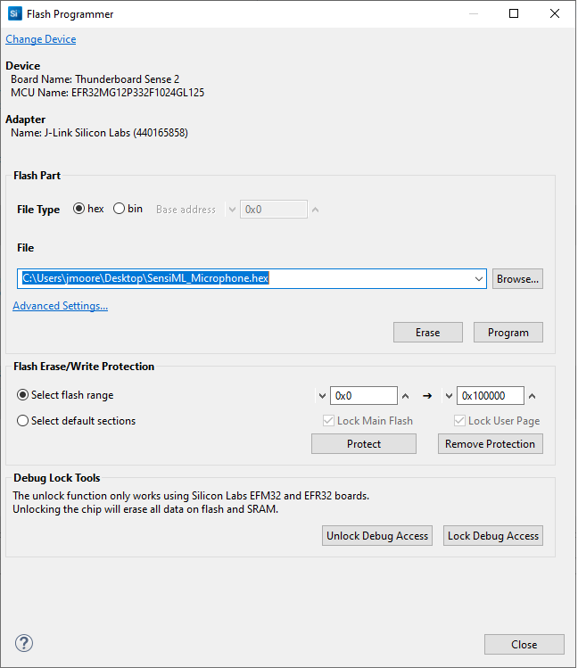
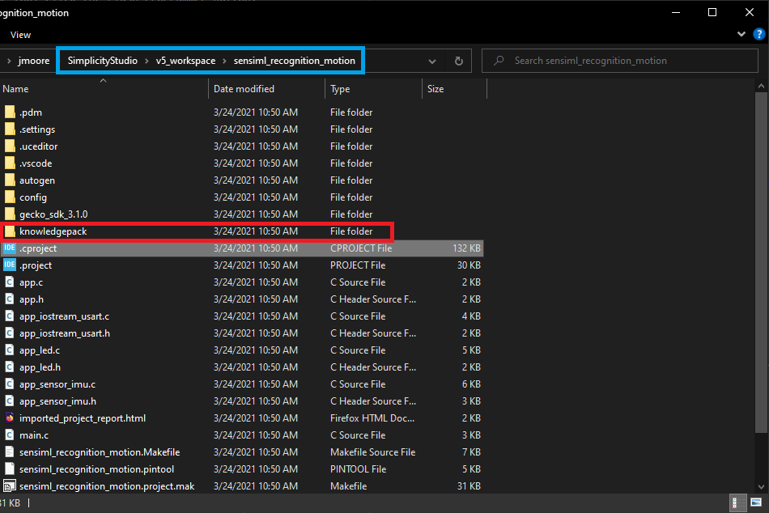

.. meta::
    :title: Firmware - Silicon Labs Thunderboard Sense 2
    :description: Guide for flashing Silicon Labs Thunderboard Sense 2 firmware

=================================
Silicon Labs Thunderboard Sense 2
=================================

.. figure:: /firmware/silicon-labs-thunderboard-sense-2/img/thunderboard-sense-2.png
    :align: center
    :alt: The Silicon Labs Thunderboard Sense 2

This page is for users of the `Thunderboard Sense 2 <https://www.silabs.com/development-tools/thunderboard/thunderboard-sense-two-kit>`_ development kit. All of the Silicon Labs examples provided implement our :doc:`Simple Streaming<../../simple-streaming-specification/introduction>` interface

Data Capture Firmware
---------------------

.. list-table:: Silicon Labs Thunderboard Sense 2 pre-built Data Collection Firmware
   :widths: 35 25 35 10
   :header-rows: 1

   * - Sensors
     - Protocol
     - Download
     - Version
   * - Accelerometer (562 Hz)
     - Simple Stream V1.0 (BLE)
     - :download:`silab-thunderboard2-ss-imu-data-collection-ble-562hz.bin <file/silab-thunderboard2-ss-imu-data-collection-ble-562hz.bin>`
     - `v9.1.2021 <https://github.com/SiliconLabs/platform_applications/tree/master/platform_SensiML/platform_SensiML_DataCaptureLab/SensiML_IMU_BLE/>`_ 

 

In order to capture data and recognize events that are happening, the firmware must be compiled. Silicon Labs provides the source code for both data collection and recognition examples for motion and audio data sources on their public `GitHub Pages <https://github.com/SiliconLabs>`_.  The `Platform Applications <https://github.com/SiliconLabs/platform_applications>`_ repository contains Silicon Labs' example applications used in this documentation.

You will also need `Simplicity Studio v5 <https://www.silabs.com/developers/simplicity-studio>`_ installed in order to compile and flash your board.

Once Simplicity Studio is installed, clone the `Platform Applications <https://github.com/SiliconLabs/platform_applications>`_ repository.

From there, open Simplicity Studio and select File->Import.



Navigate to ``platform_SensiML/platform_SensiML_DataCaptureLab`` for data capture. Choose an example data source (IMU or microphone), and navigate to the SimplicityStudio folder. In the SimplicityStudio folder, there is a "sls" file for the project. Selecting this will open the project in Simplicity Studio, and import it to your workspace.



If you are building for data capture, you can build the firmware directly. No changes are required unless you wish to deviate from the default settings.

Initial Setup for Flashing
``````````````````````````

The first thing to be done is updating the actual adapter firmware. This can be done from the Launcher perspective in Simplicity Studio by clicking and following the update link in the Overview tab under “Adapter FW”



After the Debug Adapter firmware update completes, in the Debug Adapters window, right-click on the Thunderboard Sense 2 and select “Launch Console…” from the drop-down menu:



Lastly, in the Console window, select the “Admin” tab and type “serial vcom config speed 921600” into the terminal input window and press "enter."



Now you will be able to connect the board for data capture or recognition.

Flashing the board
``````````````````

Flashing can be done in a few ways. The board shows up as a removable disk, and the bin or hex file generated from compiling a project can be dropped onto the disk to flash new firmware.

Flashing can also be done in Simplicity Studio with a flashing tool click the Flash Programmer button:

.. figure:: img/simplicity-studio-flash-program.png
    :align: center
    :alt: Simplicity Studio flash programmer

Select a file, and click on "Program":



Flashing can also be done through running the debugger. The debugger will first flash your application, and then allow for breakpoints to be set. The application will remain in flash until another program replaces it.

Recognition Firmware
--------------------

In Simplicity Studio, select File-> Import.


From the same repository cloned to build data collection firmware, navigate to the ``platform_SensiML/platform_SensiML_Recognition`` folder, and choose the same data source used to build a model. Navigate to the SimplicityStudio folder. In the SimplicityStudio folder, there is a "sls" file for the project. Selecting this will open the project in Simplicity Studio, and import it to your workspace.

.. figure:: img/simplicity-studio-import2-reco.png
    :align: center
    :alt: Simplicity Studio Import Recognition

Replacing the Knowledge Pack
````````````````````````````

In your Simplicity Studio Workspace folder, there will now be a "sensiml_recogition_motion" or "sensiml_recogition_audio" folder. In the folder will be a "knowledgepack" folder. When downloading a library from SensiML servers, the library download will contain a knowledgepack folder that replaces the existing example model provided in the source code.



From here, the application can be built and flashed onto the board.

For more on Knowledge Packs, see the :doc:`Knowledge Pack<../../knowledge-packs/index>` documentation.

Viewing Knowledge Pack Recognition Results
``````````````````````````````````````````

When a Knowledge Pack is flashed on the board, the classification results can be viewed by connecting to the virtual COM port in a terminal application. Follow the steps below for viewing the recognition results:

1. Open a terminal emulator (such as Tera Term)
2. Set your serial speed to 921600
3. Create a new connection to your Thunderboard Sense 2 COM port

You will now see classification results printed in the terminal
