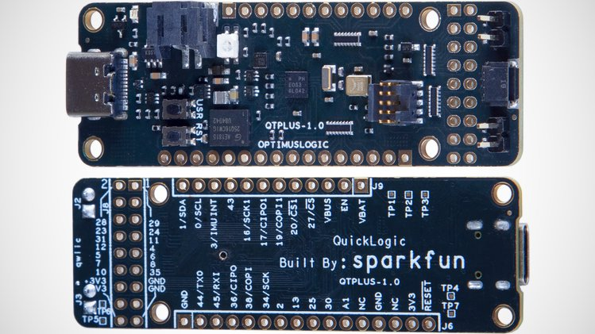
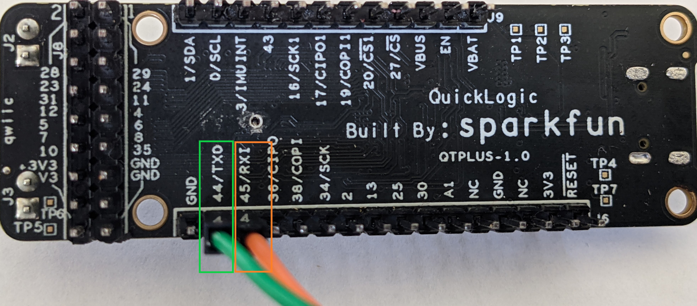

.. meta::
   :title: Firmware - SparkFun QuickLogic Thing Plus - EOS S3
   :description: Guide for flashing SparkFun QuickLogic Thing Plus - EOS S3 firmware

=======================================
SparkFun QuickLogic Thing Plus - EOS S3
=======================================

The `SparkFun QuickLogic Thing Plus - EOS S3 <https://www.quicklogic.com/products/eos-s3/sparkfun-thing-plus/>`_ development kit combines SparkFun’s Thing Plus form factor and the Qwiic® connect system with QuickLogic’s EOS S3 multicore MCU + eFPGA and QuickLogic’s QORC open source tools. This kit enables users to easily complement the embedded FPGA and MCU on the EOS S3 SoC with a multitude of additional development functionality. It’s fully supported by open source development tools, making the kit highly accessible to everyone.




Flashing SparkFun QuickLogic Thing Plus - EOS S3 Firmware
---------------------------------------------------------

**Data Collection Firmware**

In the links below you can find the firmware for flashing a Flashing SparkFun QuickLogic Thing Plus - EOS S3 device with data collection firmware for use with SensiML Data Studio.


.. list-table:: SparkFun QuickLogic Thing Plus - EOS S3 pre-built Data Collection Firmware
   :widths: 35 25 35 10
   :header-rows: 1

   * - Sensors
     - Protocol
     - Download
     - Version
   * - Accelerometer (100 Hz)
     - Simple Stream (USB Serial)
     - :download:`qt-ss-imu-data-collection-serial-100hz.bin <file/qt-ss-imu-data-collection-serial-100hz.bin>`
     - `v1.10.0 <https://github.com/QuickLogic-Corp/qorc-sdk/tree/v1.10.0/qt_apps/qt_ssi_ai_app>`_ 
   * - Audio (16 KHz)
     - Simple Stream (USB Serial)
     - :download:`qt-ss-audio-data-collection-serial-16Khz.bin <file/qt-ss-audio-data-collection-serial-16Khz.bin>`
     - `v1.10.0 <https://github.com/QuickLogic-Corp/qorc-sdk/tree/v1.10.0/qt_apps/qt_ssi_ai_app>`_ 

.. note:: We provide the binaries above for testing data collection on SparkFun QuickLogic Thing Plus - EOS S3 quickly. You can build your own binary from the data collection source from the qorc github repo found at `https://github.com/QuickLogic-Corp/qorc-sdk <https://github.com/QuickLogic-Corp/qorc-sdk>`_. We recommend using the latest source over these pre-built binaries.

.. note:: Data Collection Firmware is **required** to record data with the Data Studio. Data collection is disabled when running a Knowledge Pack.


.. _initial-setup-for-flashing-sparkfun-thing-plus-quicklogic-eos-s3:

Initial Setup for Flashing
``````````````````````````

Ensure you have a Python installation on your system. It is recommended to have Python 3.6 or newer installed.

You will need the TinyFPGA Programmer from QuickLogic to flash your device. Instructions for setting up your computer to flash a SparkFun QuickLogic Thing Plus - EOS S3 board are in the `Utilities section of the qorc-sdk README <https://github.com/QuickLogic-Corp/qorc-sdk#utilities>`_.

.. note:: You only need TinyFPGA Programmer and dependencies set up in order to flash, but installing the other items is recommended in order to build. The tinyfpgab python package will also run in Windows

.. note:: When you download the TinyFPGA Programmer you need to use `git <https://git-scm.com/>`_ to clone the repo from the github. Downloading a zip version of the repo can cause unexpected results

SparkFun QuickLogic Thing Plus - EOS S3 Buttons
```````````````````````````````````````````````

The SparkFun QuickLogic Thing Plus - EOS S3 has two buttons, USR (User), and RST (Reset). They are used in flashing. In the figure below, RST is highlighted in orange, the USR button is highlighted in purple

.. figure:: img/qt-buttons-highlight.png
    :align: center
    :alt: SparkFun QuickLogic Thing Plus - EOS S3 buttons


.. _flashing-a-file-sparkfun-thing-plus-quicklogic-eos-s3:

Flashing a File
```````````````

 1. Connect your  SparkFun QuickLogic Thing Plus - EOS S3 board to your computer using a USB to Micro-USB cable.
 2. Press the 'Reset' button on the  SparkFun QuickLogic Thing Plus - EOS S3 board. The LED will flash blue for five seconds. Press the 'User' button while the LED is still flashing blue.

    After pressing the 'User' button the LED will begin to flash green. This means the device is now in upload mode. If the LED is not flashing green then repeat this step

 3. While the LED is blinking green, program the data collection binary into SparkFun QuickLogic Thing Plus - EOS S3 by running the following command:

    .. code-block:: bash

        python /Your-directory-path-to-TinyFPGA-Programmer/tinyfpga-programmer-gui.py --port COMX --m4app /Your-directory-path-to-binary/your-binary-file.bin --mode m4
        # Replace COMX with your own device COM port number.
        # Replace /Your-directory-path-to-TinyFPGA-Programmer/ and /Your-directory-path-to-binary/ with your computer's file path locations.
        # Replace your-binary-file.bin with the name of the file you are flashing.

 4. After programming has completed, press the 'Reset' button
    The LED should flash blue for 5 seconds and load the selected application. Once the application is done loading the LED will turn off

SparkFun QuickLogic Thing Plus - EOS S3 Data Capture
-----------------------------------------------------

The SparkFun QuickLogic Thing Plus - EOS S3 board supports our :doc:`Simple Streaming<../../simple-streaming-specification/introduction>` interface, and provides an example application to use your own sensors as well.

.. _sparkfun-quicklogic-thing-plus-serial-setup:

USB to TTL serial adapter Port Setup
````````````````````````````````````

The UART Simple Streaming version of the SparkFun QuickLogic Thing Plus - EOS S3 firmware uses the hardware UART. This means that a USB to TTL serial adapter must be used (or another Feather/Wing to communicate)

In order to see data collection and recognition output with the qt_ssi_ai_app firmware, the adapter must be wired accordingly. This adapter plugs in RXD to Pin 2 (orange wire, orange box) and TXD to Pin 3 on J3 (green wire, green box).



You can then open the port in Tera Term, PuTTy, or other serial port program at 460800 to test the connection.


USB serial Setup
````````````````

The serial Simple Streaming version of the SparkFun QuickLogic Thing Plus - EOS S3 firmware uses the USB serial.

In order to see data collection and recognition output with the qt_ssi_ai_app firmware. You can then open the port in Tera Term, PuTTy, or other serial port program at 460800 to test the connection.


Example Application
```````````````````

An example application for how to use the Simple Streaming interface with the SparkFun QuickLogic Thing Plus - EOS S3 can be found in GitHub at `<https://github.com/QuickLogic-Corp/qorc-sdk/tree/master/qt_apps/qt_ssi_ai_app>`_.

This application can be used for either data collection or recognition based on your build properties.

Getting Knowledge Pack Results (Simple Stream)
``````````````````````````````````````````````

After flashing your device with a Knowledge Pack the results will print to the data (default: hardware) UART automatically.

1. Plug in your SparkFun QuickLogic Thing Plus - EOS S3 via a USB to TTL serial adapter (See :ref:`sparkfun-quicklogic-thing-plus-serial-setup` for more details)
2. Open a terminal emulator (such as Tera Term)
3. Set your serial speed to 460800
4. Create a new connection to your SparkFun QuickLogic Thing Plus - EOS S3 device COM port

You will now see classification results printed in the terminal

Using With Wi-Fi
````````````````

An example application for using Simple Streaming with the `ESP32 Feather <https://www.adafruit.com/product/3405>`_ board has been created to allow for both data capture and recognition results to be seen over a simple HTTP service.

The source code can be found in our `GitHub Repository <https://github.com/sensiml/esp32_simple_http_uart>`_ for this device. When the ESP32 is configured to swap the RX and TX UART ports, it will communicate with the SparkFun QuickLogic Thing Plus - EOS S3 with no additional changes needed for the SparkFun QuickLogic Thing Plus - EOS S3.


Seeing Debug Output
```````````````````

In order to enable debug output over the USB-serial port, it must be enabled in the SparkFun QuickLogic Thing Plus - EOS S3 firmware. To do this, modify the following two defines in ``Fw_global_config.h`` of the qt_ssi_ai_app to be the following:

.. code-block:: C

    #define FEATURE_USBSERIAL   1       // USBSERIAL port is present
    #define DEBUG_UART  UART_ID_USBSERIAL  // Write data to USB serial port

.. _getting-knowledge-pack-results-sparkfun-thing-plus-quicklogic-eos-s3-simple-stream:

Recovering a SparkFun QuickLogic Thing Plus - EOS S3
```````````````````````````````````````````````````````

If the SparkFun QuickLogic Thing Plus - EOS S3 fails to flash, there could be a problem with the bootloader. However, it is possible to recover.

Instructions for recovering a "bricked" SparkFun QuickLogic Thing Plus - EOS S3 board can be found `here <https://github.com/QuickLogic-Corp/qt-initial-bins>`_.
