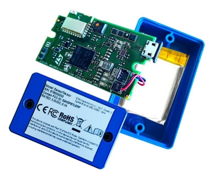
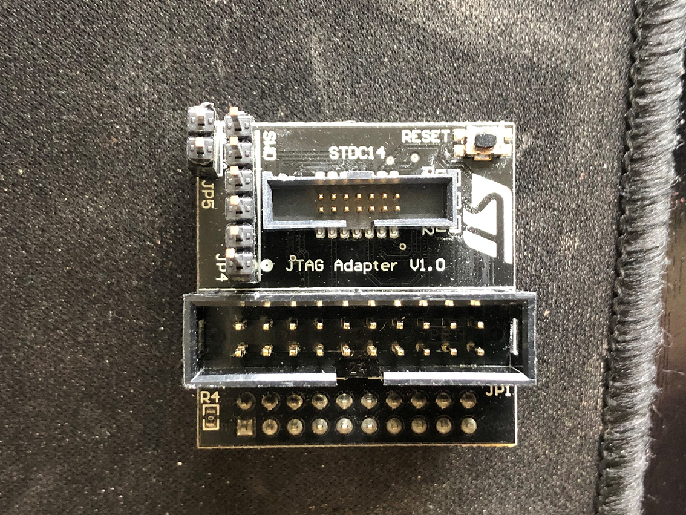
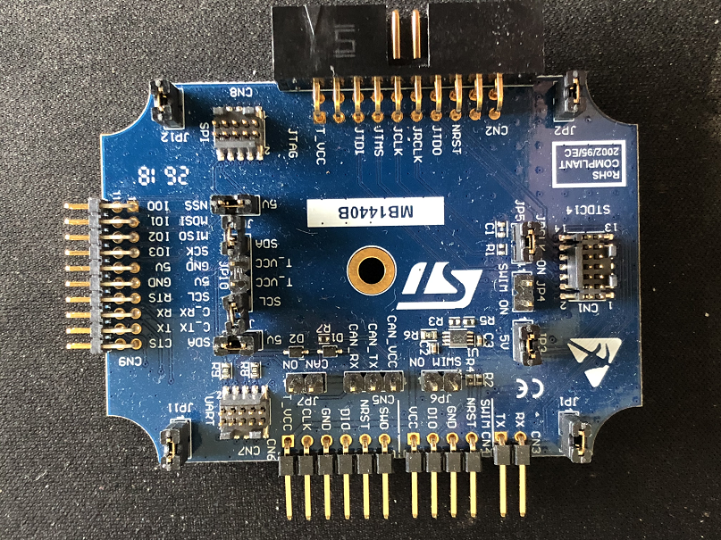
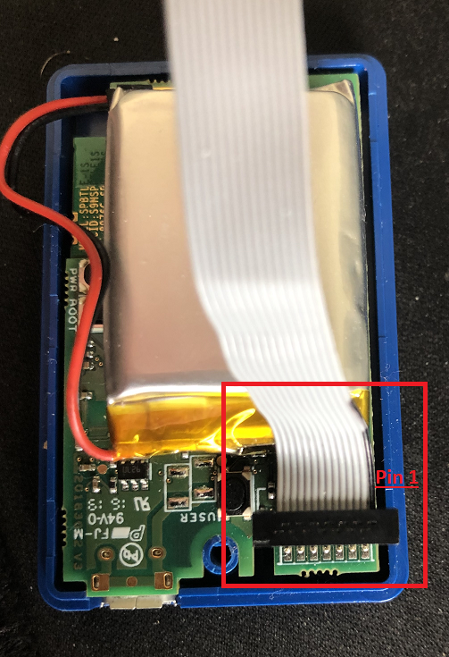
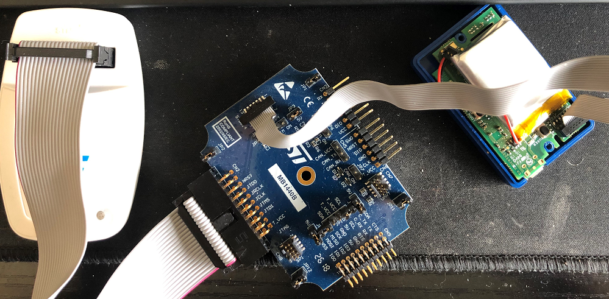
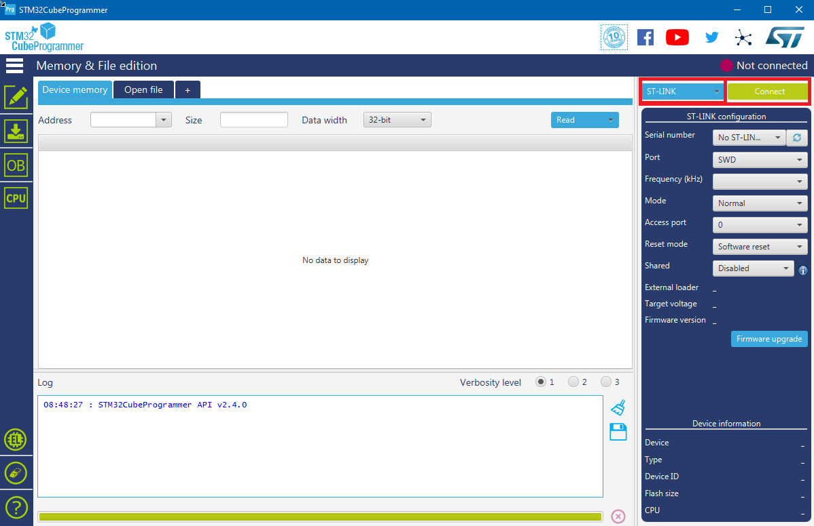
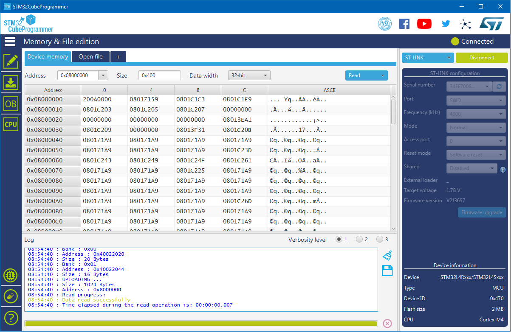
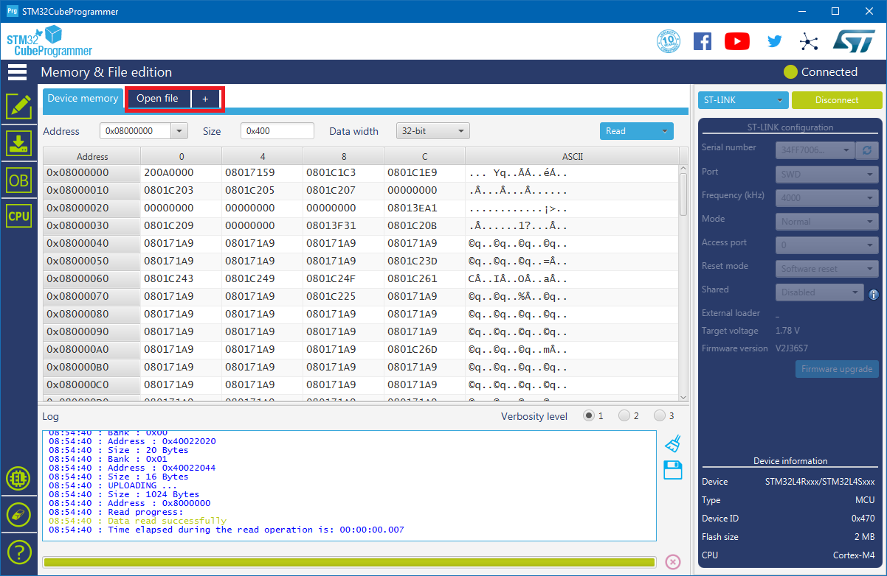
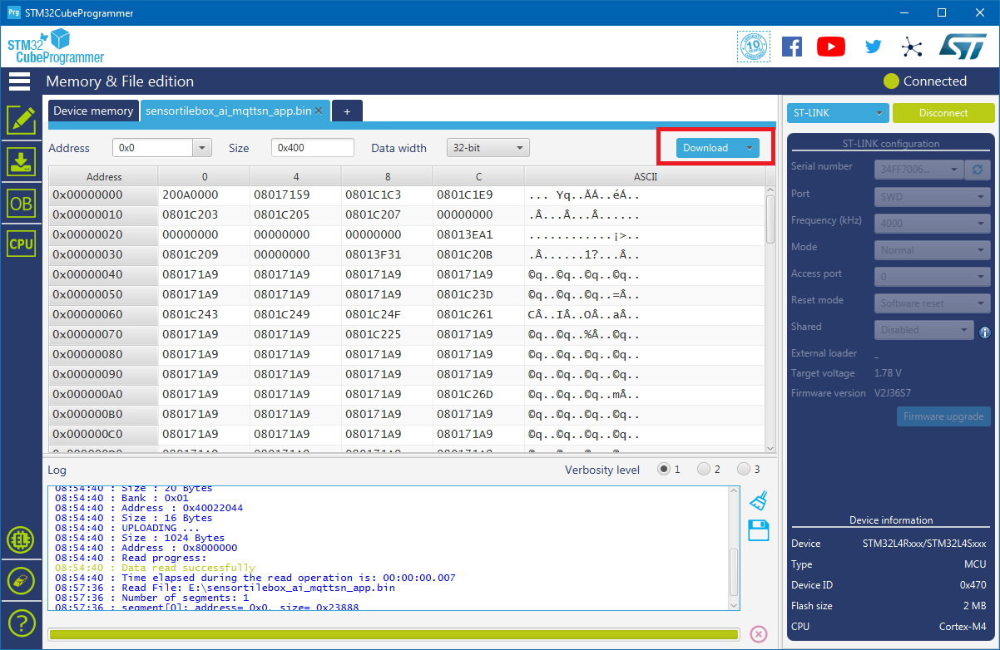
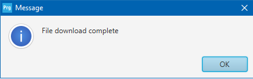

.. meta::
   :title: Firmware - STMicro SensorTile.box
   :description: Guide for flashing STMicro SensorTile.box firmware

======================
ST SensorTile.box
======================

Flashing SensorTile.box Firmware
--------------------------------

**Data Collection Firmware**

In the links below you can find the firmware for flashing a SensorTile.box device with data collection firmware for use with the SensiML Data Studio.

.. list-table:: SensorTile.box pre-built Data Collection Firmware
   :widths: 35 25 35 10
   :header-rows: 1

   * - Sensors
     - Protocol
     - Download
     - Version
   * - Accelerometer/Gyroscope (6667, 3333, 1666, 833, 416, 208, 104, 52, 26 Hz), Audio (16 Khz)
     - MQTT-SN
     - :download:`st-sensortile-box-data-collection.bin <file/sensortile-box-data-collection.bin>`
     - `1.0 <https://bitbucket.org/sensimldevteam/sensortile_box/src/v1.0/>`_ 

     
.. note:: Data Collection Firmware is **required** to record data with the Data Studio. Data collection firmware uses large portions of RAM to enable SD card collection, and is disabled when running a Knowledge Pack.

Configuring your ST-Link V2 for the first time
----------------------------------------------

1. Obtain ST-LINK V2 debugger. If your SensorTile.box did not come with a 20-pin to 14-pin adapter, you will need to also need an adapter board from the ST-Link V3 (shown in pictures for this document).

    *Note:* The ST-Link V3 does not work with the SensorTile.box currently. It does not support low-voltage (1.8V) devices.

2. Download and install `STM32 Cube Programmer <https://www.st.com/en/development-tools/stm32cubeprog.html/>`_  from STMicro for flashing

**ST-Link V2 Setup With SensorTile.box**

1) Ensure you have either a 20-pin to 14-pin adapter, or the adapter board from a ST-Link V3.

2) Connect the 14-pin cable to the SensorTile.box

    Pin 1 is located to the OUTSIDE of the board

3) Connect the other end of the 14-pin cable to either ST-Link adapter board, and the adapter board to the 20-pin cable from the ST-Link V2. These cables are keyed, and only go in one way.

Flashing SensorTile.box With STM32 Cube Programmer
--------------------------------------------------

.. important:: Ensure your device is powered on before you begin

Ensure your device is connected to the ST-Link and powered on. Open STM32 Cube Programmer

Ensure ST-Link is selected, then click on the connect button.

Once connected, you should see some of the memory dump of the chip:

Click on Open File:

Select the binary you wish to flash. Now click on Download

You will see text pop up in the Log on the bottom of the screen. Once the download completes, a popup will notify you.

