.. meta::
   :title: Firmware - ST SensorTile
   :description: Guide for flashing ST SensorTile firmware

=============
ST SensorTile
=============

Flashing SensorTile Firmware
----------------------------

**Data Collection Firmware**

In the links below you can find the firmware for flashing a SensorTile device with data collection firmware for use with the SensiML Data Studio.

.. list-table:: SensorTile  pre-built Data Collection Firmware
   :widths: 35 25 35 10
   :header-rows: 1

   * - Sensors
     - Protocol
     - Download
     - Build Version
   * - Accelerometer/Gyroscope (1660, 833, 416, 208, 104, 52, 26 Hz) Audio (16 Khz)
     - MQTT-SN
     - :download:`sensortile-mqttsn-data-collection.bin <file/sensortile-mqttsn-data-collection.bin>`
     - `v1.0 mqtt <https://bitbucket.org/sensimldevteam/sensiml_sensortile_project/src/v1.0/ST-Apps/sensortile_ai_mqttsn_app/>`_ 
   * - Accelerometer/Gyroscope (416, 208, 104, 52, 26 Hz) Audio (16 Khz)
     - BLE Protocol
     - :download:`sensortile-ble-data-collection.bin <file/sensortile-ble-data-collection.bin>`
     - `v1.0 ssi <https://bitbucket.org/sensimldevteam/sensiml_sensortile_project/src/v1.0/ST-Apps/sensortile_ai_app/>`_ 

.. note:: Data Collection Firmware is **required** to record data with the Data Studio. Data collection firmware uses large portions of RAM to enable SD card collection, and is disabled when running a Knowledge Pack.

**Firmware Source Code**

Firmware source code for both data capture and recognition can be found on Bitbucket at `<https://bitbucket.org/sensimldevteam/sensiml_sensortile_project/src/master>`_.

Configuring your Nucleo Board for the first time
------------------------------------------------

1. Obtain ST-LINK device such as a STM32 Nucleo board, which bundles an ST-LINK V2.1 debugger and programmer.
2. Download and install `ST-Link Utility <https://www.st.com/en/development-tools/stsw-link004.html/>`_  from STMicro for flashing
3. When you first receive your Nucleo board there is a first time setup step. (Full Documentation: `STM SensorTile Documentation <https://www.st.com/en/evaluation-tools/steval-stlkt01v1.html/#resource>`_ under UM2101 user manuals)

**Nucleo Boards First Time Setup**

1) Ensure that both jumpers on CN2 are OFF

2) Connect an external ST-LINK to the SWD connector on the cradle paying attention to the polarity of the connectors. (a 5-pin flat cable is provided in the SensorTile Kit package)

    Pin 1 on the STM and Sensor Tile is identified by:

        - A small circle on the PCB silkscreen – STM32 Nucleo board and SensorTile cradle expansion
        - The square shape of the soldering pad – connector on the SensorTile cradle

    Pin 1 on the flat-cable is identified by a small triangle on the connector

*STM32 Nucleo board, cradle and cradle expansion SWD connectors*

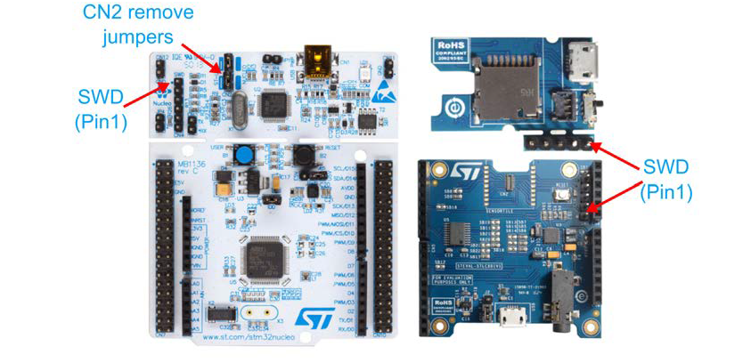

*SWD connections with 5-pin flat cable*

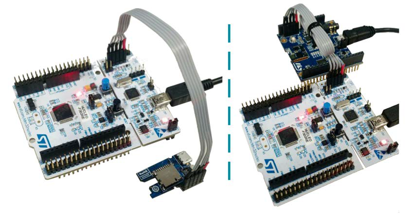

Connecting to the SensorTile Board
----------------------------------

See Pictures for the connection between your Nucleo board and your assembled SensorTile.

*Nucleo and connected SensorTile*

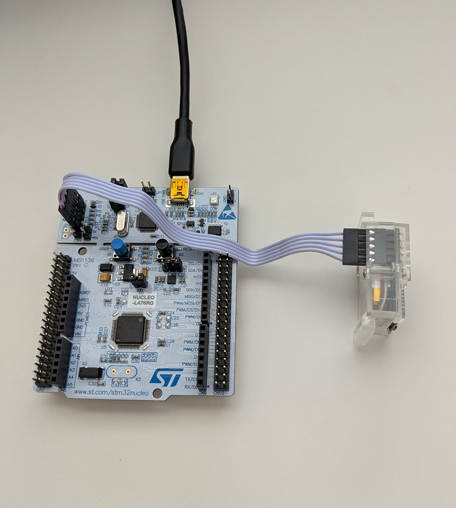

*Close up view of SensorTile connection*

.. image:: img/flashing/sensortile-nucleo-close.jpg

.. _flash-sensor-tile-with-st-link:

Flashing SensorTile With ST-Link Utility
----------------------------------------

**Windows GUI**

.. important:: Ensure your device is powered on before you begin

Ensure your device is connected to the ST-Link and powered on. Open the ST-Link Utility application.

Click on the connect to target button, or Target → Connect to Target

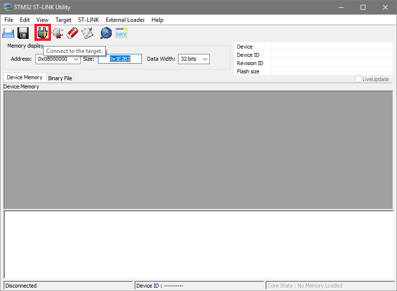

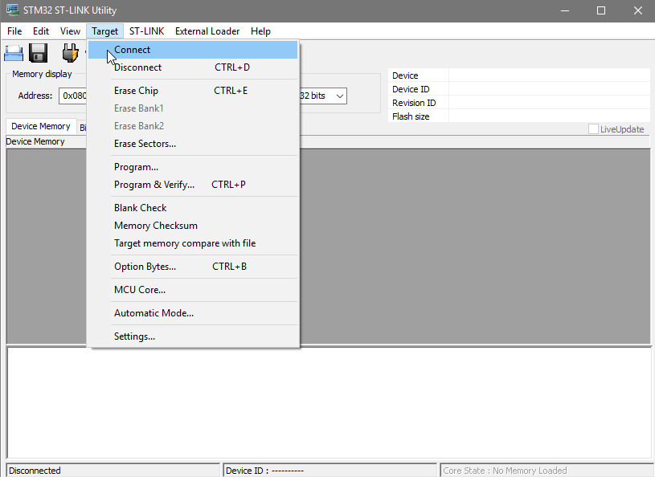

Once connected, you should see some of the memory dump of the chip:

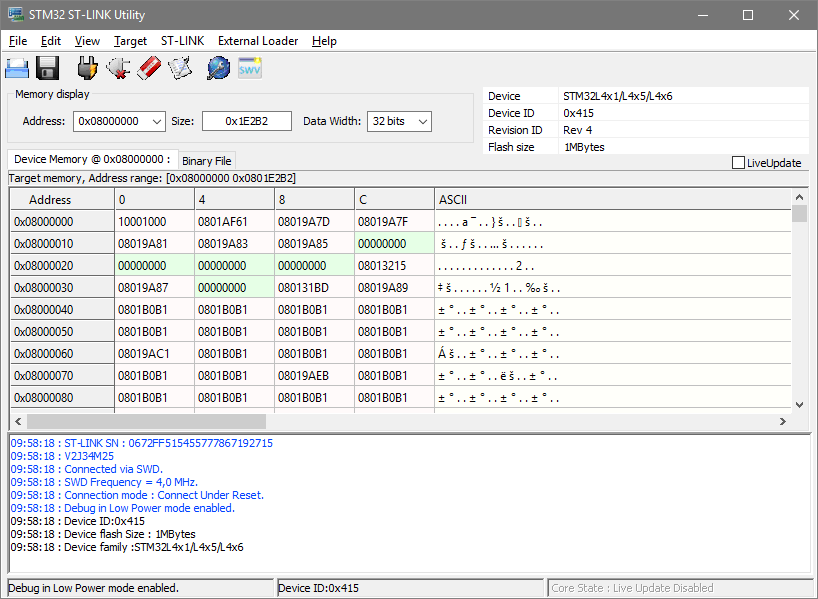

Click on Open File:

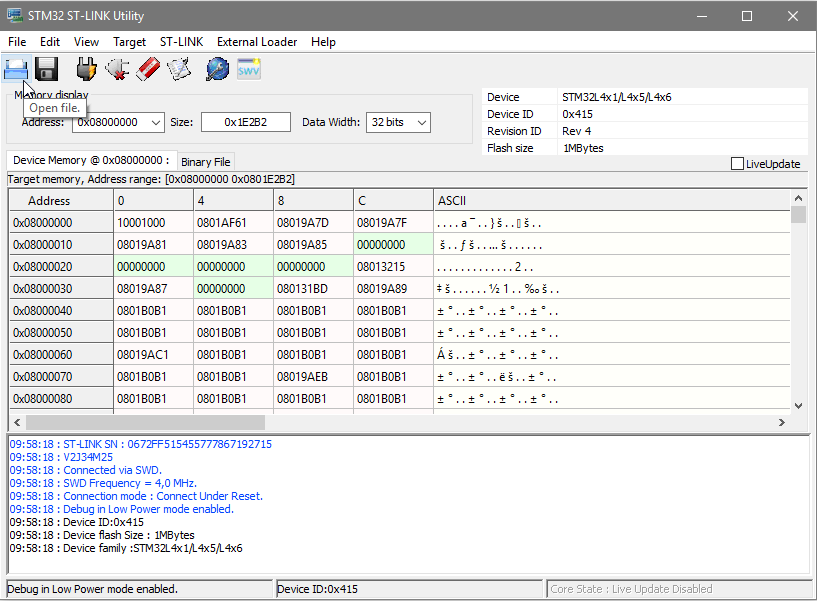

Select the binary you wish to flash. Now click on Program Verify (Ctrl+P)

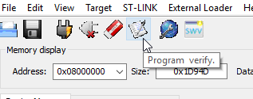

This will bring up the Download screen. You can leave all options the same and click "Start"

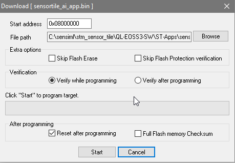

Once it is complete, you will see 'Programmed memory Checksum'

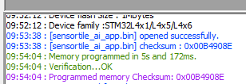

**STLink From Command Line**

Using the command line requires ``ST-LINK_CLI.exe`` to be in your path. The installer adds this by default.

This command will be assuming you have **ONE** ST-Link capable device plugged into your computer. Should you have multiple, select which STLink to connect to with ID=<number>

``ST-LINK_CLI.exe -c ID=0 SWD UR Hrst -Q -P <PATH_TO_BINARY_FILE> -V -HardRST HIGH -Rst``

**Using J-Link and JFlash-Lite**

**NOTE:** JFlash-Lite is not recommended for production by Segger, only for debug purposes

Open JFlash-Lite and select your device. it is an **ST STM32L476JG**. Leave **Interface** at *SWD* and **Speed** *4000kHz*.

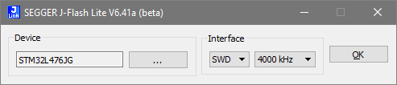

Select your binary file:

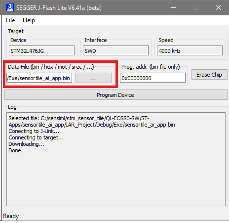

Click on Program Device. The default address of **0x08000000** is correct for the ST SensorTile

Viewing Knowledge Pack Recognition Results
------------------------------------------

When a Knowledge Pack is flashed on the board, the classification results can be viewed by connecting to the virtual COM port in a terminal application. Follow the steps below for viewing the recognition results:

1. Plug in your SensorTile device via serial USB cable
2. Open a terminal emulator (such as Tera Term)
3. Set your serial speed to 115200
4. Create a new connection to your SensorTile device COM port

You will now see classification results printed in the terminal

Advanced: SensorTile SDK Integration
------------------------------------

*(Optional)* See the :doc:`../../knowledge-packs/building-a-knowledge-pack-library` tutorial and :doc:`../../knowledge-packs/ide-setup/iar-with-sensortile` setup steps for how to integrate SensiML application code into the SensorTile SDK using IAR. This allows you to call Knowledge Pack APIs directly at the firmware level or customize your data collection firmware.
