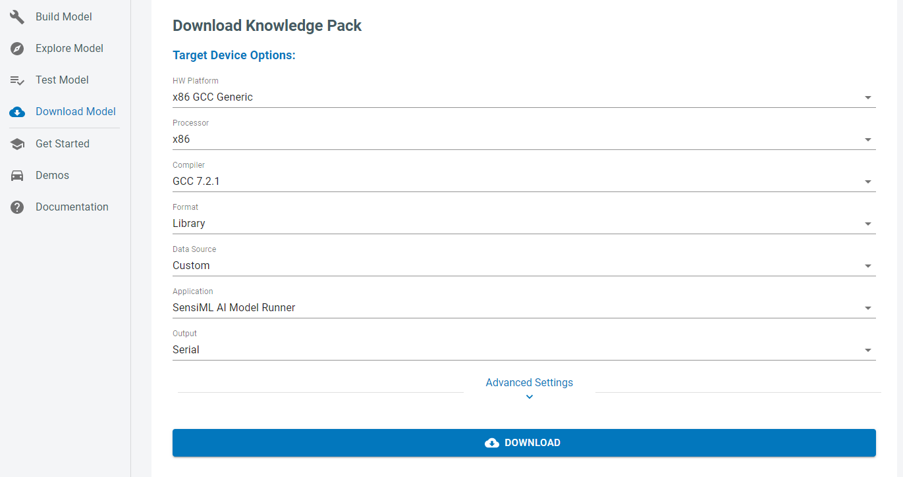

.. meta::
   :title: Firmware - x86 Processors
   :description: Guide for x86 Processors firmware for data capture and recognition for machine learning applications

==============================
x86_64 (GCC 9.2/mingw-64 9.3)
==============================

.. figure:: img/x86-hardware.jpg
   :align: center
   :alt: x86 processor

We support building Knowledge Pack libraries which can be included as part of your application code for x86 Processors with GCC compiler.  

For custom hardware, you will need to implement your own data collection and recognition firmware. 

You can follow our :doc:`Simple Streaming Interface<../../simple-streaming-specification/introduction>` to implement data capture to connect to the Data Studio. You can also import .csv or .wav files directly. 

You can follow our :doc:`Knowledge Pack Library<../../knowledge-packs/building-a-knowledge-pack-library>` for instructions on including the machine learning library in your application. 

To download the library, select x86 GCC Generic in the Download Model page along with the appropriate processor for your platform.

