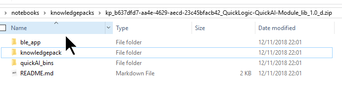
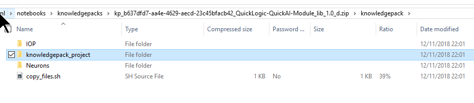

.. meta::
   :title: Knowledge Packs / Model Firmware - Building a Library
   :description: Guide for building a Knowledge Pack library file

=================================
Building a Knowledge Pack Library
=================================

The library version of the SensiML Knowledge Pack allows you to integrate Knowledge Pack APIs into your application at the firmware level.

.. note:: The following steps are only for the Knowledge Pack **Library** format. See more on the other Knowledge Pack formats in the :doc:`Knowledge Pack Format Documentation<knowledge-pack-format>`

The Library File
----------------

In a downloaded library zip file, you'll find a structure that looks like this (example taken from a QuickAI download for this picture):

``ble_app`` and ``quickAI_bins`` are specific to the Quick AI platform, and contain files necessary to run features on that device.

We will ignore them for this page. We really want the knowledgepack folder, and more specifically, the knowledgepack_project folder within. This contains both the library and full example code for running Recognition on the device. Downloads for other platforms will be similar, with the library file being in a folder titled ``libsensiml``, ``sensiml``, or something similar.

Regardless of platform being used for development, these are the steps to follow:

#. Open knowledgepack_project/sensiml

#. Copy this directory to a location of your choosing in your source code (remember where you put it!)

    **Tip:** We suggest doing this on a per-application basis, if you have multiple applications for your platform. This can even let you copy paste the same code for running different SensiML Knowledge Packs.

#. Setting up IDE workspace/project (see below for specific instructions)

#. Add in library calls to your code.

Configuring Your IDE
--------------------
We provide documentation for integrating a Knowledge Pack using several IDE environments. See :doc:`ide-setup/ide-setup` for instructions on configuring Keil uVision, Eclipse, and IAR environments.

Calling Knowledge Pack APIs from your code
------------------------------------------

For this, we’ll use snippets from the QuickAI FanDemo Recognition.c file. The same changes largely apply to your project, regardless of platform.

**Adding the header include**

The first thing you will need to do is include kb.h or sensiml.h.

.. code-block:: C

    //SensiML Includes
    #include "kb.h"

    #include "sml_output.h" //Contains functions for outputting results. This may not exist in your projects

**Initialize the model(s)**

Even if you have multiple models in one Knowledge Pack, you only need to initialize the library once. in Recognition.c, this is done before the FreeRTOS task handler enters its loop with **kb_model_init()**:

.. code-block:: C

    void RecognitionTaskHandler(void *pParameter)
    {
        BaseType_t qret;
        unsigned int TaskStop = 0;
        struct xQ_Packet Msg;

        //init training variables
        RecognitionTaskReady = 0;
        CurrentState = AWAITING_CMD;

        //Initialize Knowledge Pack Model
        kb_model_init();
        while (!TaskStop)
        {
    //    Task  code
        }
    }

Once you’ve added this call, you can compile your entire build and see RAM/Stack usage, as it will be linked in at this point. (See :doc:`determine-ram-stack-size` for more).

**Running the Model for Classification (Single Layer)**

For this example, we’re going to assume you have a single-layer Knowledge Pack (which is the default). For supported platforms like QuickAI and Nordic Thingy, a function like this is generated automatically for you. This example comes from a QuickAI download. Recognition.c, the Task gets a message for a batch of sensor data to process. It then handles the sensor data in this way:

.. code-block:: C

    static void processSampleInKnowledgePack(signed short *data, uint8_t num_sensors)
    {
        int ret;

        #if USE_TEST_DATA
        ret = kb_run_model((SENSOR_DATA_T*)&testdata[td_index++], TD_NUMCOLS, 0);
        if(td_index == TD_NUMROWS)
        {
            td_index = 0;
        }
        #else
                ret = kb_run_model((SENSOR_DATA_T *)data, num_sensors, KB_MODEL_rank_0_INDEX);

            if (ret >= 0){
                //Prints model results over UART
                kb_print_model_result(KB_MODEL_rank_0_INDEX, ret);
                //In this case, outputs over BLE
                sml_output_results(KB_MODEL_rank_0_INDEX, ret);
                //Reset running model to initial state.
                kb_reset_model(KB_MODEL_rank_0_INDEX);

            };

        #endif
    }

The key items to take away are:

``ret = kb_run_model((SENSOR_DATA_T *)data, num_sensors, KB_MODEL_rank_0_INDEX);``

This is the call to pass a single sample of data to your model. The model will take care of any segmentation and feature extraction/classification from there.

``if (ret >= 0)``

If you get a value from kb_run_model greater than or equal to zero, you have received a classification. 0 means Unknown. Above zero pertains to the class map you see when running SensiML Analytics Studio:

``sml_output_results(KB_MODEL_rank_0_INDEX, ret);``

For the example in Recognition.c, we are only reporting the results out. Here is where your development comes in. You get to decide how you handle the output from the classifier.

``kb_reset_model(KB_MODEL_rank_0_INDEX);``

After a classification is completed, you need to reset the model. This essentially sets it back to its initialized state, and gets the model ready for classifying the next event your device may be experiencing.

**Running the Model(s) for Classification (Multiple Layers)**

When building a hierarchical model, or multiple-layered model, the logic can be pretty involved. A large part of the logic depends on how your model is set up when running SensiML Analytics Studio. Unless you have specifically set up models to be multiple layers, you likely don't have models behaving in this manner.

In ``kb.h`` or ``sensiml.h``, you'll find the defines for your model indexes:

.. code-block:: C

    //Total Models in this Knowledge Pack
    #define SENSIML_NUMBER_OF_MODELS 5

    //Model Indexes to use for calls
    #define KB_MODEL_Parent_INDEX 0
    #define KB_MODEL_Imbalance_INDEX 1
    #define KB_MODEL_On_Off_INDEX 2
    #define KB_MODEL_Core_Classes_INDEX 3
    #define KB_MODEL_ON_Off_BladeFault_INDEX 4

For supported platforms like QuickAI and Nordic Thingy, we generate this logic in a C file for you. Here's what the same Recognition.c function from above looks like in the case of a hierarchical model (comments for what is happening are in line with the code):

.. code-block:: C

    static void processSampleInKnowledgePack(signed short *data, uint8_t num_sensors)
    {
        int ret;
        //Run the Base Model
        ret = kb_run_model((SENSOR_DATA_T *)data, num_sensors, KB_MODEL_Parent_INDEX);

        if (ret >= 0)
        {
            //Base model has returned a valid result.
            //We now decide how to deal with the result
            kb_print_model_result(KB_MODEL_Parent_INDEX, ret);
            switch (ret)
            {
            case (1):
                /* In this case, we want to run another model, which can give us more
                * differentiation on results, or run different feature generators on
                * the same data.
                * This time, we are not passing any data into the model,
                * as it is reusing the same buffered data as the original model.
                */
                ret = kb_run_model(NULL, num_sensors, KB_MODEL_Core_Classes_INDEX);
                if (ret >= 0)
                {
                    //This Model has now returned a result. We now decide how to deal with the data.
                    kb_print_model_result(KB_MODEL_Core_Classes_INDEX, ret);
                    switch (ret)
                    {
                    case (1):
                        /* Here again, we shift to another model
                        * This time, we are not passing any data into the model,
                        * as it is reusing the same buffered data as the original model.
                        */
                        ret = kb_run_model(NULL, num_sensors, KB_MODEL_ON_Off_BladeFault_INDEX);
                        if (ret >= 0)
                        {
                            kb_print_model_result(KB_MODEL_ON_Off_BladeFault_INDEX, ret);
                            switch (ret)
                            {
                            case (2):
                                //Here again, we shift to another model for this one result.
                                ret = kb_run_model(NULL, num_sensors, KB_MODEL_On_Off_INDEX);
                                if (ret >= 0)
                                {
                                    // This model will return results (sml_output_results();) no matter what number > 0 is found.
                                    kb_print_model_result(KB_MODEL_On_Off_INDEX, ret);
                                    sml_output_results(KB_MODEL_On_Off_INDEX, ret);
                                    kb_reset_model(KB_MODEL_On_Off_INDEX);
                                }
                                break;
                            default:
                                //All other results are reported out.
                                sml_output_results(KB_MODEL_ON_Off_BladeFault_INDEX, ret);
                                break;
                            }
                            //reset the models as we finish using them.
                            kb_reset_model(KB_MODEL_ON_Off_BladeFault_INDEX);
                        }

                        break;
                    default:
                        sml_output_results(KB_MODEL_Core_Classes_INDEX, ret);
                        break;
                    }
                    kb_reset_model(KB_MODEL_Core_Classes_INDEX);
                }
                break;

            case (2):
                //Run another model from the result, but a different one from the result of (1).
                ret = kb_run_model(NULL, num_sensors, KB_MODEL_Imbalance_INDEX);
                if (ret >= 0)
                {
                    //All results are printed out from this model.
                    kb_print_model_result(KB_MODEL_Imbalance_INDEX, ret);
                    sml_output_results(KB_MODEL_Imbalance_INDEX, ret);
                    kb_reset_model(KB_MODEL_Imbalance_INDEX);
                }
                break;
            default:
                //All other results are reported out.
                sml_output_results(KB_MODEL_Parent_INDEX, ret);
                break;
            }
            //Reset the parent model
            kb_reset_model(KB_MODEL_Parent_INDEX);
        }
    }