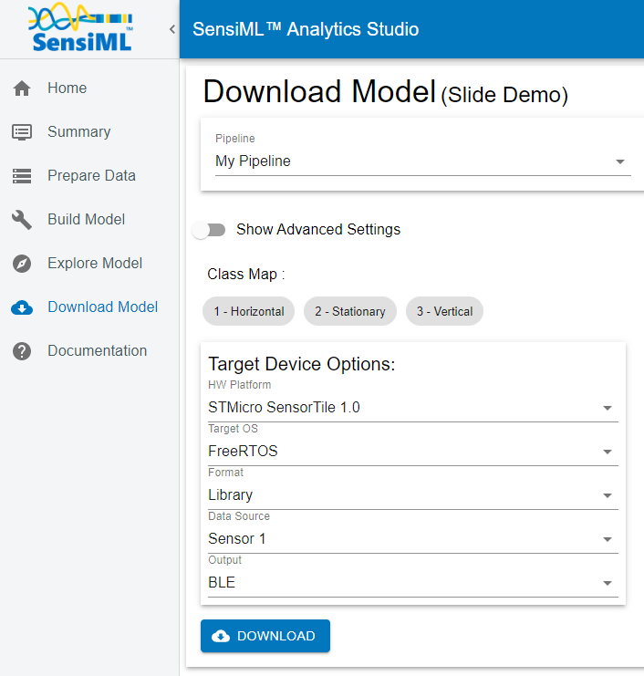
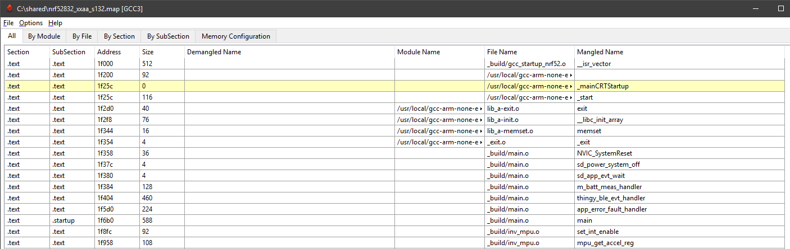
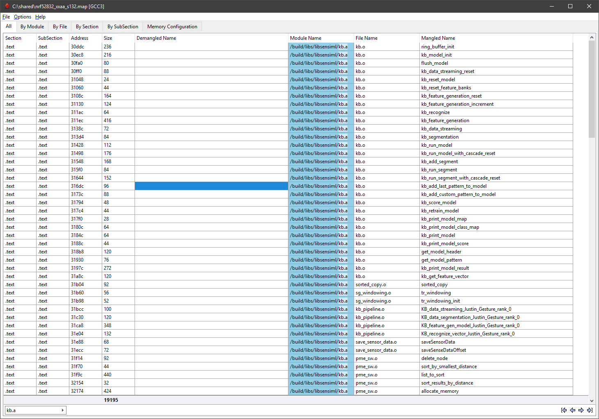
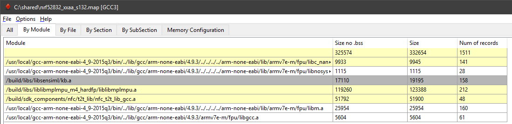
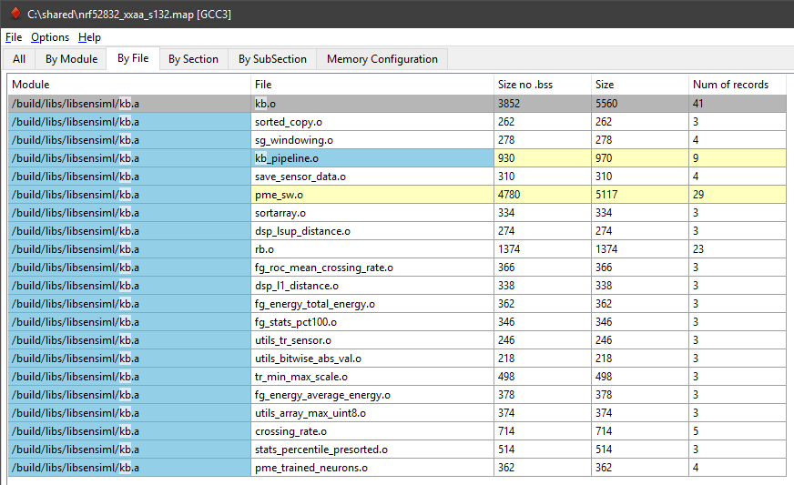

.. meta::
   :title: Knowledge Packs / Model Firmware - Determmine Code/RAM Size
   :description: How to determine Code/RAM size for a Knowledge Pack

============================================
Determine Code/RAM Size for a Knowledge Pack
============================================

In order to determine exact code/ram size for a Knowledge Pack it is necessary to generate a map file for the target hardware. You can generate a map file by compiling the **library** version of your Knowledge Pack. In order to compile a library version you just need to set the format to library from the Analytics Studio Download Model page. See screenshot below:

This will download a library version of the SensiML Knowledge Pack along with the example code for building the full application. Next, we will need to generate the map file. You can compile the library into your own firmware or use the reference firmware provided in the download in order to generate the map file.

Profiling the Knowledge Pack with the AMAP Tool
-----------------------------------------------

Once you have the map file, you can use Amap (a tool developed by Sergey Sikorskiy for the parsing of map files). It allows you to see the memory usage and code size of any file in your binary file. An example of the expected  an example Knowledge Pack, we see an output like this:

We can use the Search function in the bottom left to look for the library we compile: named kb.a or libsensiml.a

This will give you the totals (and addresses) for every section in your memory map:

    .text - Flash Memory

    .data - Initialized data in RAM

    .bss - Uninitialized data in RAM

`This article <https://mcuoneclipse.com/2013/04/14/text-data-and-bss-code-and-data-size-explained/>`_ has a much more in-depth explanation of memory sections for Arm

Module Totals
-------------

Click the “By Module” tab to see the total size of kb.a or libsensiml.a. This will give you a idea of the maximum flash and RAM usage by the library file itself.

File Totals
-----------

File totals will give you an idea of how each feature generator affects your memory usage. Some feature generators require utility functions, which is why you’ll see extra functions not “in” your pipeline or cost report from SensiML Analytics Studio.

