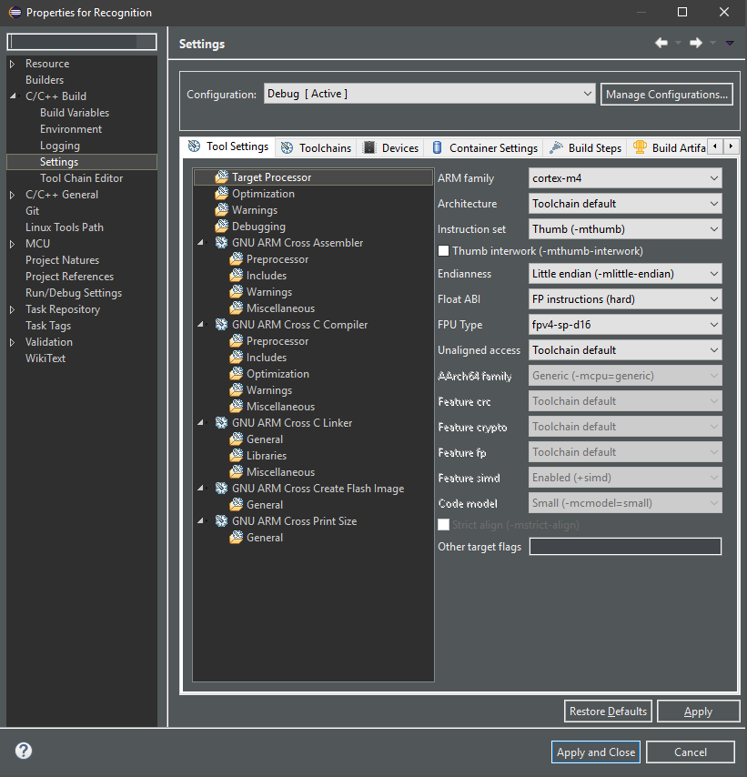
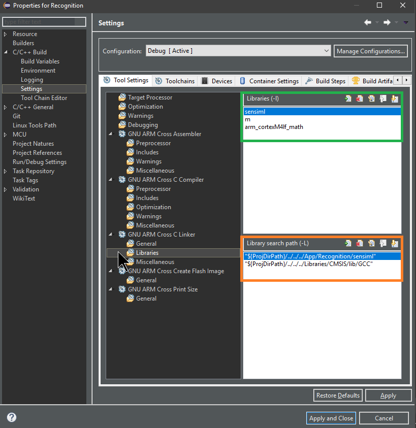
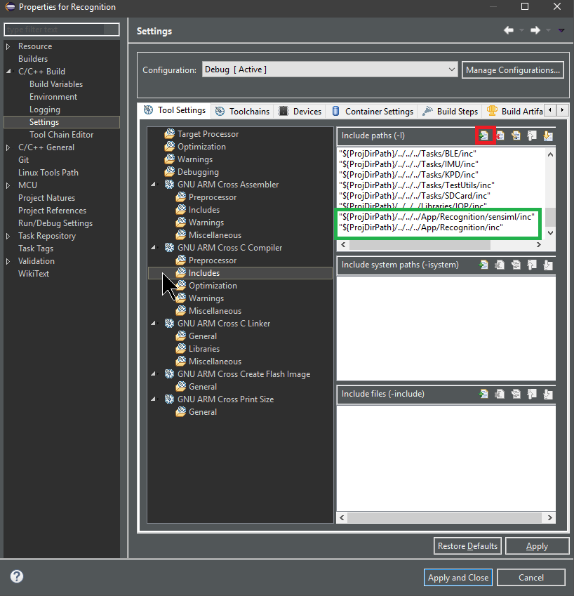

.. meta::
   :title: IDE Setup - Eclipse
   :description: Guide for setting up Eclipse to integrate a Knowledge Pack library file

=======
Eclipse
=======

Eclipse projects can link the SensiML library file fairly easily. The assumption here is that you are using an environment set up for Arm development (using GNU Arm Cross toolchain). However, these instructions should be similar for Atollic TrueStudio, TI Code Composer, and other Eclipse-based IDE’s.

**Setting up the Eclipse Project**

Right click your project and go to Properties. From there go to C/C++ Build → Settings:

**Adding the Library (libsensiml.a)**

Go to GNU Arm Cross C Linker → Libraries. You will need to link sensiml and math (m) libraries (green), as well as ensure you include the sensiml folder in your search path for the linker (orange).

Note: you do not specify ``libsensiml.a`` in this case because it works the same way as linking in a Makefile. In Makefiles, linking with a ``-lsensiml`` automatically appends lib to the front of the file name.

**Adding Include Directories**

Click on GNU Arm Cross C Compiler ->Includes. You will click on “Add” (Red square) and add the location of your sensiml directory:

**Library Integration**

Now you are ready to integrate the Knowledge Pack library with your code. Most modern linker applications will not link the library until you actually make a call to a function within the library. See more on how to do this at :doc:`../building-a-knowledge-pack-library`