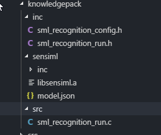

.. meta::
   :title: IDE Setup - IAR with SensorTile
   :description: Guide for setting up IAR with SensorTile SDK to integration a Knowledge Pack library file

===================
IAR with SensorTile
===================

There are additional steps for integrating the SensorTile SDK with SensiML application code using IAR.

1. Download the `SensorTile Source Code <https://bitbucket.org/sensimldevteam/sensiml_sensortile_project/>`_ from the SensiML Bitbucket repository

**Tools Used**

The instructions for this guide were tested with the following:

+-----------------------------------+-------------------------+-------------------------------------------------------------------------------------------------------------------------------------------------+
| Software                          | Version                 | Link                                                                                                                                            |
+===================================+=========================+=================================================================================================================================================+
| IAR Embedded Workbench            | 7.60.2.1135             | `IAR Home <https://www.iar.com//>`_                                                                                                             |
+-----------------------------------+-------------------------+-------------------------------------------------------------------------------------------------------------------------------------------------+
| GNU Make For Windows              | 3.81                    | `SourceForge <https://sourceforge.net/projects/gnuwin32/files/make/3.81//>`_                                                                    |
+-----------------------------------+-------------------------+-------------------------------------------------------------------------------------------------------------------------------------------------+
| Arm GCC Toolchain (arm-none-eabi) | 8.2.1 (8-2018-q4-major) | `Arm Developer Center <https://developer.arm.com/open-source/gnu-toolchain/gnu-rm/downloads//>`_                                                |
+-----------------------------------+-------------------------+-------------------------------------------------------------------------------------------------------------------------------------------------+
| SensorTile SDK                    | 2.1.1                   | `STMicro SensorTile Software <https://www.st.com/content/st_com/en/products/embedded-software/evaluation-tool-software/stsw-stlkt01.html/>`_    |
+-----------------------------------+-------------------------+-------------------------------------------------------------------------------------------------------------------------------------------------+

**Linking SensorTile SDK using IAR**

1. Navigate to ST-Apps/sensortile_ai_app/IAR_Project

2. Find the file `sensortile_ai_app.custom_argvars` Here you will need to fill in the file data

  **IAR Custom Argvars**

  .. code-block:: xml

    <iarUserArgVars>
        <group name="SENSIML" active="true">
            <variable>
                <name>STSW_STLKT01</name>
                <value>FILL_ME_IN</value>
            </variable>
        </group>
    </iarUserArgVars>

3. Put the path to where you have unzipped the SensorTile SDK where you see ``FILL_ME_IN``

4. Load the workspace/project in IAR by opening the ``sensortile_ai_app.eww`` file in IAR.

  .. image:: img/compiling/iar-open-workspace.png

  You can verify the variable is loaded by going to Tools → Configure Custom Argument Variables

  .. image:: img/compiling/iar-custom-args.png

  .. image:: img/compiling/iar-custom-args-2.png

**GCC Setup**

In order to run makefiles using GCC follow the steps below.

1. From the root of the repository cloned above, navigate to ``ST-Apps/sensortile_ai_app/GCC_Project``

2. Find the file `sensortile_ai_app.custom_argvars`

3. Uncomment the last line of the file:

.. code-block:: Makefile

    # Copy this file to sensortile_ai_app.custom_argvars

    # Uncomment the following line, and edit the variable name STSW-STLKT01
    # and modify its associated value to point to the location of the SensorTile SDK
    # installation directory.

    # export STSW_STLKT01=FILL_ME_IN

4. Put the path to where you have unzipped the SensorTile SDK where you see ``FILL_ME_IN``

You should now be able to run ``make`` and see the build.

**Building For Data Collection**

#. Open the file `ST-Apps/sensortile_ai_app/inc/Fw_global_cfg.h`
#. Search for `#define S3AI_FIRMWARE_MODE S3AI_FIRMWARE_MODE_COLLECTION` (Line 37)
#. Ensure this is the only mode defined in the file
#. Build with your chosen build system

**Building A Knowledge Pack Library**

SensorTile IAR and GCC Projects have already been set up to link the Knowledge Pack library downloads. If you are starting from scratch, you can refer to the :doc:`../building-a-knowledge-pack-library` section of the support site.

The default path of the SensiML library and generated code for the SensorTile projects is located in the repository at ``ST-Apps/sensortile_ai_app/knowledgepack``

The folder structure in the project looks like this:

