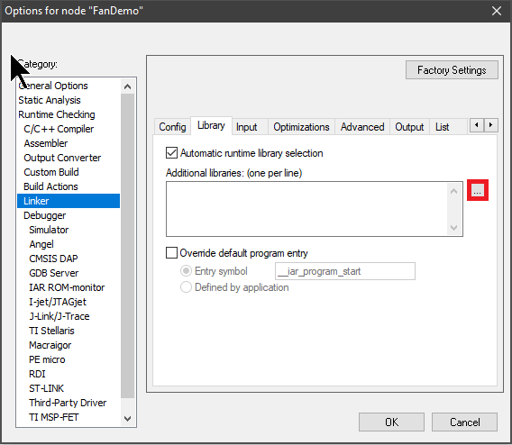
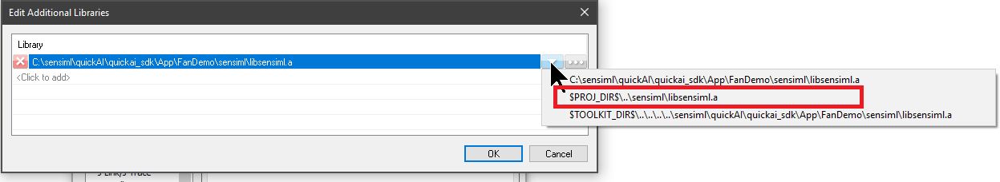
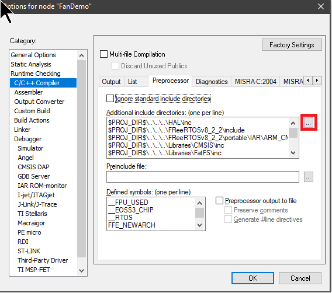
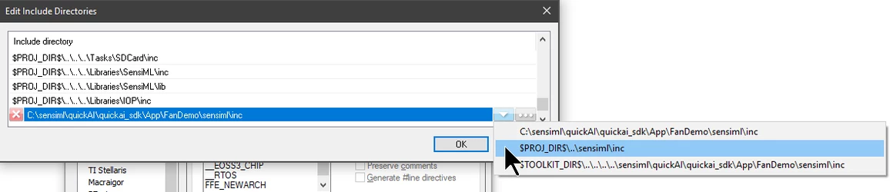

.. meta::
   :title: IDE Setup - IAR
   :description: Guide for setting up IAR to integrate a Knowledge Pack library file

===
IAR
===

Here we will explain a bit about the library file, and how to embed this into your IAR Workspace/Project

**Setting up The IAR Workspace/Project**

The screenshots in this solution are from version 7.6, but they are similar for 8.x (and possible earlier versions as well).

With this example, I’ll be using an example application from our QuickLogic QuickAI application for “FanDemo”, which monitors vibration data on fan operation. This application comes with the QuickAI SDK, but we also return example source code, for you to integrate.

**Adding the Library (libsensiml.a)**

In your IAR Workspace, Right click your project, and select “Options” and then go to the “Linker” settings, and the Library Tab.

Click on the three dots (highlighted in red above), and navigate to where you copied the sensiml directory in the previous steps, and choose the library file, and click “Open”:

.. image:: img/iar/iar-add-library.png

You will then need to make sure this will work on all computers that could be compiling your code. Press the arrow (below), and select the highlighted option. This will make a relative path to your library in the project:

**Adding Include Directories**

Next, choose C++ Compiler from the list, and the Preprocessor tab:

Add an additional include directory by clicking the three dots highlighted above. You will navigate to where the library exists, and choose the inc folder, setting it to use the relative path option like you did above:

**Library Integration**

Now you are ready to integrate the Knowledge Pack library with your code. Most modern linker applications will not link the library until you actually make a call to a function within the library. See more on how to do this at :doc:`../building-a-knowledge-pack-library`