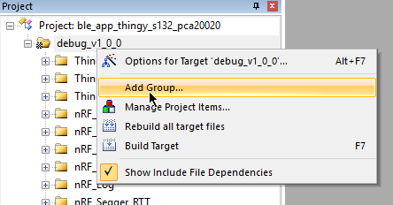
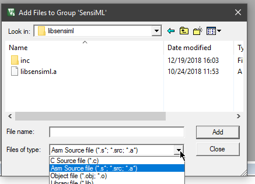
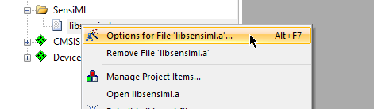
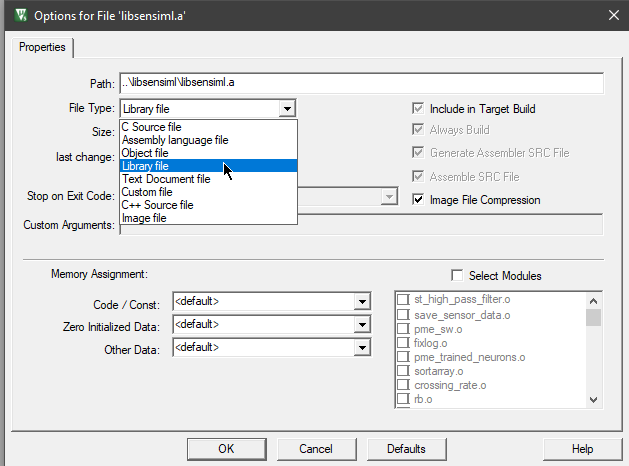
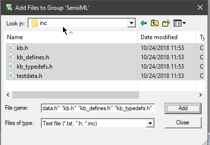
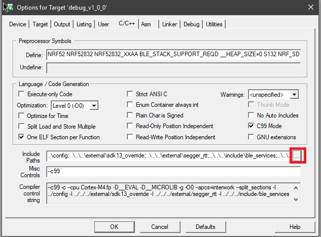
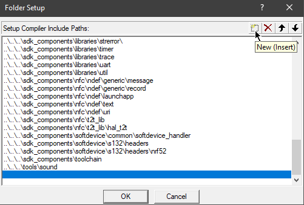

.. meta::
   :title: IDE Setup - Keil uVision
   :description: Guide for setting up Keil uVision to integrate a Knowledge Pack library file

============
Keil uVision
============

Here we will explain a bit about the library file, and how to embed this into your Keil uVision Project

**Setting up The Keil Project**

In a Keil Project, you will likely need to do the following steps for all Targets (release and debug, usually) in a given project. The example project shown below is from the Nordic Thingy SDK. Select Project → Options for Target…

**Adding the Library (libsensiml.a)**

Add a group to your project/target, to keep your project organized.

Rename the group “SensiML” or anything of your choosing. Then, right click this new group and then “Add Existing Files to Group”

.. image:: img/keil/keil-add-library-to-group.png

Select “Asm Source file” from the drop down, and navigate to where you placed the sensiml folder:

Choose libsensiml.a, and “Add”

Right click libsensiml.a in the Project panel, and choose options:

Change the File Type to Library File:

You can then add existing files (the organization of the group is up to you) for the SensiML group, to add the header files:

**Adding Include Directories**

Click on C/C++ to modify your include paths with the highlighted button:

Add a new include path. Navigate to the place you copied the sensiml or libsensiml directory to, and select the inc folder.

.. important:: Because we compile with GCC in the cloud, it produces character pointers with 32-bit width. Arm compiler default is 16-bit width. This will make your program fail to build. You will need to ensure that the compiler flag ``--wchar32t`` is set in the Misc. Controls section of C/C++:

  .. image:: img/keil/keil-wchar32.png

**Library Integration**

Now you are ready to integrate the Knowledge Pack library with your code. Most modern linker applications will not link the library until you actually make a call to a function within the library. See more on how to do this at :doc:`../building-a-knowledge-pack-library`