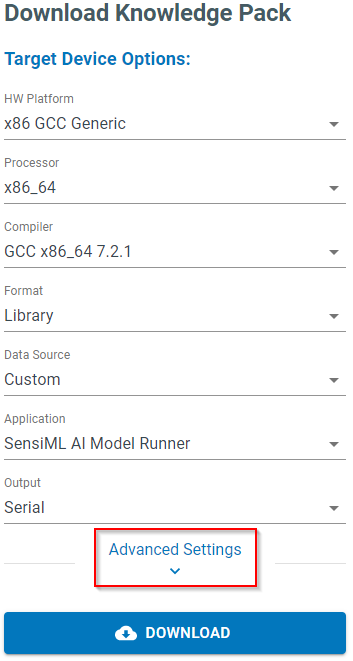
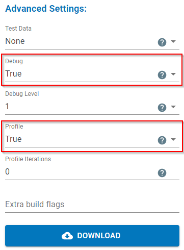

.. meta::
   :title: Firmware - Profiling Model Performance
   :description: Guide for profiling model performance in a Knowledge Pack

Profiling Model Performance
===========================

SensiML offers the option to profile model performance directly on a device. Profiling will give the latency information for each feature generator and classifier running in your model.

This lets you see exactly how your model is running and helps you decide which feature generators to be included in a model to conserve space or execution time.

.. important:: Profiling is only enabled for x86 and Arm Cortex processors with the `DWT_CYCCNT <https://developer.arm.com/documentation/ddi0337/e/ch11s05s01>`_ registers available.

Downloading a Knowledge Pack with Profiling Enabled
---------------------------------------------------

1. Expand **Advanced Settings** in the Download Model screen

2. Set **Debug** and **Profile** to True

This will download a Knowledge Pack with profiling enabled, allowing the output to be viewed in the serial output from the device.

Viewing Profile Information
---------------------------

The SensiML Python SDK has a profile parser that will connect to the device and run through a number of classifications to give an average of each feature generator. A file called ``model.json`` will be downloaded with your Knowledge Pack. You can set this path when viewing profile information.

.. note:: Installation instructions for the SensiML Python SDK can be found in the :doc:`SensiML Python SDK Documentation<../sensiml-python-sdk/overview>`.

.. code-block:: python

    from sensiml.profile import ProfileParser

    def run_profile(com_port="/dev/ttyACM0", run_count=100, model_json_path="MODEL_JSON_PATH", baud_rate=921600):
        parser = ProfileParser(
            port=com_port, num_msgs=run_count, json_path=model_json_path, baud=baud_rate
        )
        parser.run()
        return parser

This will return a ProfileParser object that can be output in YAML, JSON, or as a python dictionary. Here is a YAML example:

.. code-block:: yaml

    ClassifierAverageCycles:
        - PME: 15959
    FeatureCyclesPerInference:
        - Mean Crossing Rate: 16768
        - Mean Difference: 14270
        - Second Sigma Crossing Rate: 27372
        - Sigma Crossing Rate: 28443
        - Threshold Crossing Rate: 16932
        - Threshold With Offset Crossing Rate: 29295
        - Zero Crossing Rate: 17846
    RunCount: 100

To view the cycle count for features:

.. code-block:: python

    profile = run_profile(com_port="/dev/ttyACM0", run_count=100, model_json_path="MODEL_JSON_PATH", baud_rate=921600)

    print(profile.combined_metrics["FeatureCyclesPerInference"])

This will give the total **cycles** for each feature in a model. To get measured CPU time, divide this number by the clock frequency your device runs at.

To view the cycle count for classifiers:

.. code-block:: python

    profile = run_profile(com_port="/dev/ttyACM0", run_count=100, model_json_path="MODEL_JSON_PATH", baud_rate=921600)

    print(profile.combined_metrics["ClassifierAverageCycles"])

This will give the total **cycles** for each classifier in a model. To get measured CPU time, divide this number by the clock frequency your device runs at.
