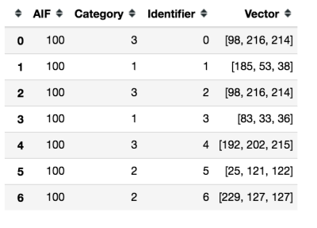

.. meta::
   :title: Knowledge Packs / Model Firmware - Running a Model On Windows/Linux
   :description: How to test models locally with the SensiML Python SDK

Running a Model Using the Python SDK
=====================================

We provide a python wrapper called SMLRunner that gives you the option to run your model on Windows or Linux directly from python. The following tutorial shows you how to use Windows or Linux to run your model. For a tutorial on how to run a model on an embedded device, see the :doc:`Running a Model On Your Embedded Device Guide</knowledge-packs/running-a-model-on-your-embedded-device>`.

The SMLRunner API is part of the :doc:`SensiML Python SDK</sensiml-python-sdk/overview>` which makes it easy to test a Knowledge Pack on your computer without an embedded device. *(Note: This requires your system is compatible with gcc-7.4)*

Download the x86 Knowledge Pack
-------------------------------

Windows
```````

1. Download the **Windows x86_64** version of a Knowledge Pack library

.. image:: /knowledge-packs/img/download-generic-windows.png
    :align: center

Linux
`````

1. Download the **x86 GCC Generic** version of a Knowledge Pack library

.. image:: /knowledge-packs/img/download-generic-linux.png
    :align: center


Download using Python SDK
---------------------------

.. code-block:: python
    
    # Windows Version
    config = client.platforms_v2.get_platform_by_name('Windows x86_64').get_config()

    # Linux Version
    config = client.platforms_v2.get_platform_by_name('x86 GCC Generic').get_config()

    kp = client.get_knowledgepack("<model-uuid>")


For Linux systems you will need to unzip the Knowledge Pack file, then build a shared library.

.. code-block:: none

    ar -x libsensiml.a
    gcc -shared -o libsensiml.so *.o


After creating the shared library, we will import and run it using the SensiML Python SDK. 

.. note::

    You can also link the code directly into any c/c++ program. The available APIs for the Knowledge Pack can be found in the kb.h. Example code for running the Knowledge Pack can be found in the main.c file.


Using SMLRunner
---------------

We are going to use the SMLRunner API, a python wrapper for the Knowledge Pack shared library, to call the shared library directly from within python. This makes experimenting and using the Knowledge Pack quite a bit easier. However, one drawback is that if you want to reset the Knowledge Pack, you will need to restart your notebook or python thread as there isn't a clean way to release the resources of our shared library.

.. code-block:: python

    from sensiml.sml_runner import SMLRunner

    # Windows Version
    sml = SMLRunner("<path-to-download.zip>")

    # Linux Version
    sml = SMLRunner("<path-to-libsensiml.so folder>")

The first thing we need to do is initialize the Knowledge Pack. This sets up all of the pointers and buffers internally. You should only do this once.

.. code-block:: python

    sml.init_model()


Classifying Sensor Data
------------------------

.. code-block:: python

    data = pd.read_csv("<path-to-captured-data>")
    rec_data = sml.recognize_capture(data, model_index=0, model_api="run_model")

.. image:: /knowledge-packs/img/smlrunner_rec_results.png
    :align: center


The recognize_capture has three different model_api to choose from. Select the one that is appropriate for your knowledgepack

 * run_model: Single Models
 * run_model_cascade_features: Single Models that use Feature Cascade
 * sml_recognition_run: Hierarchical models

Converting To DCLI
------------------

You can use the DataSegments API to convert the results into a DCLI format to import into the Data Studio or Audacity Labels to import into Audacity.

.. code-block:: python

    from sensiml.dclproj import DCLProject, segment_list_to_datasegments

    dcl = DCLProject()

    # Put the path to dclproj file for the project you would like to connect to
    dclproj_path = r'<path-to.dclproj-file>'

    dcl.create_connection(dclproj_path)

    # add the capture_name of the data file and the session you want to associate the data with
    rec_data['capture']=capture_name
    rec_data['session']=str(kp.uuid)

    rec_segs = segment_list_to_datasegments(dcl, rec_data)

    rec_segs.to_dcli(filename='export.dcli')


Advanced Usage
```````````````

Knowledge Packs can operate on streaming or segments of data. Let's first look at streaming data. We will pass the first sample of data to our model. We are going to use data from our training set that represented class 1 and pass it a single sample at a time.


.. image:: /knowledge-packs/img/streaming-data.png
    :align: center


.. code-block:: python

    class_1_segment = df[sensor_columns].iloc[0:10][sensor_columns].reset_index(drop=True)
    class_1_segment.plot()

    sample_count=1
    ret = sml.run_model(class_1_segment.iloc[0], model_index=0)

    print('Model Return:', ret)

    >> Model Return: -1


In this case the model returns -1. This means that it is waiting for more data before performing a classification.

This model has a windowing segmenter with window size=10 and delta=5. This means that the first time the model will wait for 10 samples before classifying. It will then slide 5 samples, wait for 5 new samples and classify again.

Let's go ahead and pass 9 more data samples to the model and see the classification.

.. code-block:: python

    for i in range(1, len(class_1_segment)):
        sample_count+=1

        # pass a single sample
        ret = sml.run_model(class_1_segment.iloc[i], model_index=0)

        # this returns -1 until it the buffer is filled, then it returns a classification
        if ret == -1:
            print('Sample Count: {}'.format(sample_count))

        if ret >= 0:
            print('Class: {}'.format(ret))

            # After a classification is received, call sml_reset model to advance the internal buffer.
            sml.reset_model(model_index=0)

            #set to 5 as there are already 5 in the stored after sliding delta number of samples
            sample_count=5

    >> Sample Count: 2
    >> Sample Count: 3
    >> Sample Count: 4
    >> Sample Count: 5
    >> Sample Count: 6
    >> Sample Count: 7
    >> Sample Count: 8
    >> Sample Count: 9
    >> Class: 1

We will pass the same segment again. This time we will see two classifications occur. One after the first 5 samples are passed in, and another after the next 5 samples are passed in.

.. code-block:: python

    for i in range(len(class_1_segment)):
        # pass a single sample
        sample_count+=1
        ret = sml.run_model(class_1_segment.iloc[i], model_index=0)

        # this returns -1 until it the buffer is filled, then it returns a classification
        if ret == -1:
            print('Sample Count: {}'.format(sample_count))

        if ret >= 0:
            print('Class: {}'.format(ret))

            # After a classification is received, call sml_reset model to advance the internal buffer.
            sml.reset_model(model_index=0)
            sample_count=5

    >> Sample Count: 6
    >> Sample Count: 7
    >> Sample Count: 8
    >> Sample Count: 9
    >> Class: 1
    >> Sample Count: 6
    >> Sample Count: 7
    >> Sample Count: 8
    >> Sample Count: 9
    >> Class: 1


Storing and Reloading PME Models
`````````````````````````````````

Models created that use the Pattern Matching Engine (PME) use a database of patterns to perform classifications. This Database has an API for storing, loading, and modifying those patterns.
In these next few steps we will walk through how you can get model information out of a Knowledge Pack that can be stored in flash as well as how to load that model back from flash. This can all be performed without a firmware update. The first call is to get the model.

.. code-block:: python

    stored_model = sml.get_model(model_index=0)
    stored_model




Here you can see the AIF, which is the influence field of the pattern, the category that will be returned if this neuron fires along with the centroid of the neuron in feature space. Next, we will flush the model which drops the entire database of patterns. You can verify this happens by rerunning get_model which returns and empty DataFrame.

.. code-block:: python

    sml.flush_model(0)
    print(sml.get_model(0))

    >> Empty DataFrame

Now that we have deleted our database, Let's load the patterns back into the model using the add_custom_pattern_to_model call.

.. code-block:: python

    sml.add_custom_pattern_to_model(model_index=0,
                                    feature_vector=stored_model.loc[index].Vector,
                                    category=stored_model.loc[index].Category,
                                    aif=stored_model.loc[index].AIF)
    sml.get_model(0)

.. image:: /knowledge-packs/img/load-one-pattern.png
    :align: center

After adding a single pattern you can now see that our database of patterns is back to having one. Let's go ahead and add the rest.

.. code-block:: python

    for index in range(1, len(stored_model)):
        sml.add_custom_pattern_to_model(model_index=0,
                                        feature_vector=stored_model.loc[index].Vector,
                                        category=stored_model.loc[index].Category,
                                        aif=stored_model.loc[index].AIF)

    sml.get_model(0)

.. image:: /knowledge-packs/img/update-database.png
    :align: center


Classifying a buffered data segment
````````````````````````````````````

For some applications, you may want to pass a full segment to the model and have it classify only on this segment. This is often done if you are buffering the data somewhere and want to prevent the need to wake up the embedded process for every new sample.

You can also do this if you have created your own segmentation algorithm outside of the SensiML toolkit but want to use the Knowledge Pack for feature extraction and classification.

.. code-block:: python

    ret = sml.run_segment(class_1_segment, model_index=0)

    if ret:
        print('Class: {}'.format(ret))

        #After a classification is received, call sml_reset model to prepare for a new segment
        sml.reset_model(model_index=0)

    >> This model has already been run with run_model.
    >> You will need to restart your kernal to run in this mode.


A limitation of the SMLRunner is that you can't switch between running segments and running streaming data. Let's go ahead and create a new SMLRunner object and then run our segment.

.. code-block:: python

    from sensiml.sml_runner import SMLRunner
    sml = SMLRunner("knowledgepacks/")

    sml.init_model()

    ret = sml.run_segment(class_1_segment, model_index=0)

    if ret:
        print('Class: {}'.format(ret))
        #After a classification is received, call sml_reset model to advance the internal buffer.
        sml.reset_model(model_index=0)

    >> Class: 1

When you are overwriting the internal ring buffer with a new segment of data. The sliding window will be ignored. You can see this happen by calling run segment again. You'll notice that instead of two classifications you only get a single one.

This concludes the tutorial for running a Knowledge Pack using SMLRunner. The C APIs we are accessing are documented in the kb.h file returned in the Knowledge Pack. The python wrapper used here follows them closely, but with some modifications for convenience.