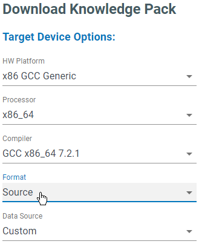

.. meta::
   :title: Knowledge Packs / Model Firmware - SensiML Embedded SDK
   :description: Guide for using the SensiML Embedded SDK

SensiML Embedded SDK
====================

The SensiML Embedded SDK contains the C/C++ source code files for the APIs we use to build a Knowledge Pack. Select the **Source Format** when downloading a Knowledge Pack to get the SensiML Embedded SDK.



.. important:: The Knowledge Pack **Source Format** is only available to specific subscription plans. See more details at `<https://sensiml.com/plans/>`_


The SensiML Embedded SDK is a set of instructions for transforming sensor data into feature vectors which can be classified using a classification algorithm. These instructions can be grouped into 6 categories. In this document we will describe in depth the requirements implementing a function for each of the categories.

1. **Sensor Transforms:** Act on a single sample of sensor data directly as  a pre-processing step.
2. **Sensor Filters:** Modifies a sensor in place and performs some sort of filtering (ie. moving average)
3. **Segmentation:** Looks at the ring buffer and indicates the start of a segment and the length of the segment. Returns 1 when it has found a segment and -1 when it is still looking.
4. **Segment Transforms:** Perform manipulations on an entire segment of data.
5. **Segment Filter: Filters** out segments preventing them from going forward to classification.
6. **Feature Generator:** Extract meaningful information from a segment of data.
7. **Feature Transforms:** Perform row wise operations on a single feature vector.
8. **Recognition:** Takes a feature vector as an input and predicts the categorization based on a predefined model.

Sensor Transforms (se_tr_xxx.c)
```````````````````````````````

* Takes one frame of sample(s) at a time and a pointer to the end of the FrameIDX array.
* performs an operation such as magnitude and stores it into the FrameIDX array
* Returns the number of points added to FrameIDX array

Sensor Filter (se_filter_xxx.c)
```````````````````````````````

* Takes one frame of sample(s) at a time and a pointer to the FrameIDX array.
* performs an operation on the incoming sample to modify it in some way, ie moving average filter
* if it needs to, stores information in an internal ring buffer about other data it needs to use
* always returns time synchronized data
* Returns -1 while its waiting for more data else it returns 1 once it has enough data to perform the filter operation

Segmentation Algorithm (sg_xxx.c)
`````````````````````````````````

* Must have either window size or max buffer length defined as part of the algorithm. This is used to define the buffer size of the circular buffer.
* Must make use of the ring buffer without modification to input data or data inside of the ring buffer.
* All parameters must be passed through a struct seg_params. All user facing parameters must be defined in the python input contract with a corresponding c_param:index.
* All flags must be part of seg_params as multiple segmenters can use the same segmenter.
* Must have an init function which describes resetting the ring buffer after a segment has been found.
* Returns 1 if a segment is found, otherwise returns 0

Segment Filter (sg_filter_xxx.c)
````````````````````````````````

* Returns 1 or 0. 1 if the pipeline should continue, 0 if the pipeline should be terminated for this segment.

Segment Transforms (sg_tr_xxx)
``````````````````````````````

* Operates a segment of data.
* Can modify data in the ring buffer, but is not allowed to add new data to the ring buffer, or add data to an additional ring buffer. *(Note: This can potentially cause issues. We currently do not have a way to address ring buffer issues)*
* Example is tr_strip which demeans the data in the ring buffer

Feature Generators (fg_xxx.c)
`````````````````````````````

* Create a single or multiple features from a segment of data.
* Adds a feature as a float to the feature vector stored in kb_model
* Returns the number of features added to the feature vector

Feature Transforms (fg_tr_xxx.c)
````````````````````````````````

* Takes a pointer to the feature generator and feature parameters.
* Operates on the feature vectors in place

Recognition
```````````

* Takes as input a feature vector
* Returns a classification result

Knowledge Pack Overview
```````````````````````

The core of a SensiML Embedded SDK is the kb_model_t structure which stores information for each model. The kb_model_t defines the overall state machine. The pointer to this object is passed to each function which then acts on it to change/advance its state. The definition for this function is shown below along with definitions for each of the parameters.

.. code-block:: C
 
    typedef struct{
        int framelen;            // Number of columns in the ring buffer this pipeline is associated with
        int sframelen;            // Number of columns in the streaming data ring buffer this pipeline is associated with
        int sg_length;           // This is the length of an identified segment of data.
        int sg_index;            // This is the position of the start of the index in the ring buffer
        int last_read_idx;       // This is the index of the last read value from the rb
        uint8_t parent;              // index of the parent model
        uint8_t feature_bank_index;   // index of the head of the feature bank
        uint16_t feature_bank_size;    // number of features in a bank
        uint8_t feature_bank_number;  // number of feature banks
        uint16_t feature_vector_size;  // The size of the feature vector
        uint8_t *feature_vector;  // pointer to the current feature vector
        uint8_t classifier_type; // This is the classifier type that the model uses
        uint8_t classifier_id;   // context to use when submitting this models feature vector
        seg_params *psegParams;  // Pointer to the segmenter data structure
        FVCOMP_T *pFeatures;     // pointer to the feature vector array
        ring_buffer_t *pringb;   // pointer to the ring buffer
        ring_buffer_t *psringb;  // Pointer to the streaming data buffer
        SENSOR_DATA_T *frameData; // pointer to array containing the most recently added data sample (placed here then into the ring buffer)
                                    // (Note: we could probably just add directly to the ring buffer instead of doing this copy in the future)
        model_feature_gen_f feature_gen; // Pointer to the feature generator function
        model_data_streaming_f data_streaming; // Pointer to the streaming data function
        model_data_segmentation_f segmentation; // Pointer to the data segmentation function
        model_recognize_vector_f recognize_vector; // Pointer to the feature vector classifier function
        model_feature_transform_f feature_transform; // Pointer to the feature transform function
        uint8_t *model_uuid; //Contains the 16-bytes used to identify the model in the cloud.
        int total_classifications; //Contains the total classifications run on the system per power cycle.
        kb_profile_t m_profile; //model profiler
    } kb_model_t;

Let's look at how kb_models are actually used. There are two main types of APIs for data running pipelines

1. Passing a single sample at a time using a run model.
2. Passing a buffer segment and calling run segment.

These functions return -1 when there is no classification yet (could be waiting for more data or something else). Other error codes can be returned as other negative numbers. We should set up a specific ENUM for these to be defined.

These return 0 for unknown, and 1, 2, 3… for the class. By using a combination of the model_index and the class, a user is able to map back to what the actual class represents.

Let's start with the kb_run_model API which is the simplest entry point into running a model. This takes a piece of sensor data and the model_index to associate that data with.

.. code-block:: C
 
    int kb_run_model(SENSOR_DATA_T *pSample, int nsensors, int model_index)
    {
        int ret = -1;
        if (kb_data_streaming(pSample, nsensors, model_index))
        {
            if (kb_segmentation(model_index) == 1)
            {
                kb_feature_generation_reset(model_index);
                if (kb_feature_generation(model_index) == 1)
                {
                    ret = kb_generate_classification(model_index);
                    kb_feature_generation_increment(model_index);
                    return ret;
                }
                else
                {
                    kb_reset_model(model_index);
                    return -2;
                }
            }
        }
        return -1;
    }

The model then goes through 4 main stages.
 
* kb_data_streaming: handles streaming data that comes in. Returns -1 or 1
* kb_segmentation: looks for segments of data and returns 1 or -1
* kb_feature_generation: Generates features for a specified model
* kb_generate_classification: recognize the feature vector stored in the model.

All of these functions are defined in kb.c and follow a similar pattern. Let's look at one in more detail to understand the basic design philosophy. You can look at others in the kb.c file for your own understanding.

The function kb_recognize takes the model_index. We then call the kb_feature_transform function which takes the generated feature vector and prepares it to be passed to the trained classifier algorithm. When we call kb_recognize, the prepared feature vector is fed to the classifier algorithm. This will return an int value. We check for 65535 which is a reserved pattern for Unknown.

.. code-block:: C
 
 
    int kb_generate_classification(int model_index)
    {
        int ret = -1;
        if (kb_feature_transform(model_index) == 1)
        {
            ret = kb_recognize(model_index);
            if (ret == 65535)
            {
                ret = 0;
            }
        }
 
        return ret;
    }
