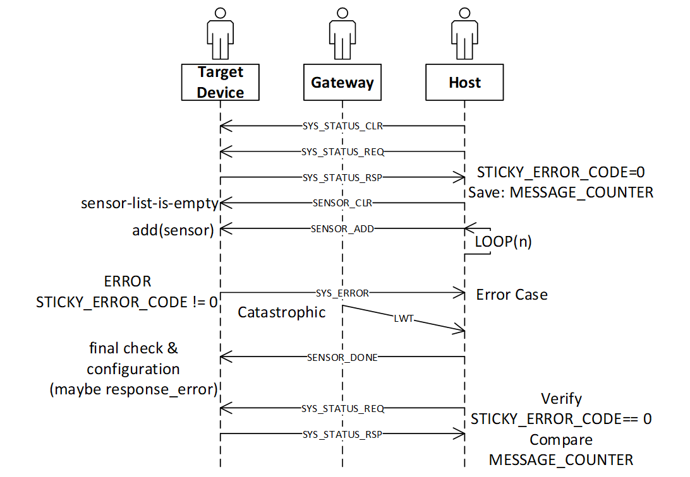

====================
Implementation Notes
====================

Sensor Limitations
---------------------------

The following factors need to be considered while configuring the sensors:

	* The mode the target device is operating in.
	* The sensors available in the mode.
	* The live stream data rate.
	* The data save stream rate.
	* The limitations of the output data rates from sensors. Some sensors only work at fixed output data rates (power of 2 multiples of 13 hz), while other sensors are infinitely programmable.
	* The limitations of the target device.

Live Stream Data Rate
------------------------------

Sometimes, the transport may not be able to support the total data rate. Therefore, to provide data in a live stream format the data is down sampled. Because the target is resource constrained, resampling must be simple.

**Rule Part (A)**:

The live stream data rate must have a simple integer relationship with the data collection rate.  For example, if the sensor operates at 1600 Hz, and the transport (BLE) only supports about 100 Hz, the relationship is 16:1.  Continuing the example: It is very easy for the resource constrained target to drop 15 samples and transmit the 16 – effectively down sampling the data stream..

**Rule Part (B)**:

The transport itself may impose limits based on the structure of the underlying transport protocol.  For example, when the transport works with USB 1.1/Full-Speed (12 Mbits) and with 64-byte packets, there are (N) opportunities per second to transmit up to 64 bytes. The overall data rate of the USB transport is affected by how the application layer protocol uses this time slot.

Example:
	A delivery truck appears every 1 millisecond at the factory door
	The truck can hold from 0 to 64 boxes (bytes)

	The truck cannot wait, it will leave immediately, use it or lose it.

	Shipping truck example options are:
		A. (not ready) Send the truck away with 0 boxes.
		B. (inefficient) Send the truck away with 1 box.
		C. (better) – Send the truck away with more than 1 box.
		D. (best-case) Fill the truck

.. note::
	To reach the 12 Mbit mark, every truck must be full. The same concept applies to other time or fixed packet-based protocols.

Calculating Packet Efficiency
``````````````````````````````
Assume five sensor samples fit in one packet, with a few bytes to spare. The packet efficiency for time-window based protocol is:

		PacketEfficency(%)=100*  UsefulPayloadByteCount/(BytesUsed+BytesUnused+ProtocolOverhead)

.. note::
	To simplify the example, the overhead is taken as zero. In your calculations, ensure that the overhead is considered.*

Example:
	Two sensors: Accelerometer + Gyro each have an X/Y/Z values.

	Each value = 16 bits, or 2 bytes.

	Sensor Cluster Size:  12 bytes = (3 * 2 * 2)

	Using USB Full-Speed as the transport, packets are 64 bytes each.

	We know that 5 readings require (12 * 5) = 60 bytes

	Ignoring overhead:  Our packet efficiency is 60/64 or 93.75%.

	Adding a 6th reading requires 12 more bytes, or a total of 72.

	But – packets are in multiples of 64, thus the available size is really 128.

	And thus, the packet efficiency is 72/128 = 56% efficient.

	In this case, one would have higher through put using 5 not 6 readings per packet.

	When saturating the transport bandwidth, it is important for us to understand how the whole system utilizes the transport.


Local Data Save Rate
----------------------------

Some target devices support an SD card. However, the exact interface varies. Many target devices support an SD card through the 1-bit SPI interface.  In contrast, other devices support a 4-bit dedicated SD card interface, which is four times faster.

SD cards vary in speed, and some SD drivers are more efficient than the others. SD cards also can have variable write busy periods and may periodically perform garbage collection. Therefore, the target may require some amount of RAM to accommodate these delays. But the target device may not have enough RAM to do so.


Sensor Configuration Sequence
------------------------------

The recommended configuration sequence is:
    1.	TOPIC_SYS_STATUS_CLR
    2.	TOPIC_SYS_STATUS_REQ (wait for the response)
    3.	TOPIC_SENSOR_CLR
    4.	Loop, in this case the topic is TOPIC_SENSOR_ADD
    5.	TOPIC_SENSOR_DONE
    6.	TOPIC_SYS_STATUS_REQ – verify STICKY ERROR is still 0.
    7.	Note that during the above, at any time the device may spontaneously respond with TOPIC_SYS_ERROR. If so, the final STATUS_REQ would have retained the sticky error code STATUS.

The Sequence
`````````````
The SENSOR configuration requires six commands:
    1.	**TOPIC_SYS_STATUS_CLR**
        This is the first command in the sequence. This command is highly recommended but is not mandatory and can be used if the error state of the device is unknown. This command clears (zeros) the STICKY_ERROR_CODE maintained by the target device.
    2.	**TOPIC_SYS_STATUS_REQ**
        This is the second command in the sequence. This command is not mandatory.

        When this command is received, the device publishes: TOPIC_SYS_STATUS_RSP

        The host must wait for this response before proceeding and verify the STICKY_ERROR_CODE is zero. The host can also make note of other fields in the TOPIC_SYS_STATUS_RSP.
    3.	**TOPIC_SENSOR_CLR**
        The third command in the sequence. This command is mandatory.

        This is the first command sent by the host and is used to initialize all sensors, removing all sensors from the configured list.

	4.	**TOPIC_SENSOR_ADD** – (First sensor)
        This is the fourth command in the sequence. This command is mandatory.

        This adds and configures exactly one sensor.

        This command contains both the primary and secondary information required to configure the sensor.  For example, an accelerometer may support two parameters: Output Data Rate (ODR, ie: 100hz, 200hz, etc) and Range (+/-2G, or +/-4G).  Other sensors such as an ADC may have range values, or input configuration settings.

        Errors may occur

        The target device implementation choices are:

            •	Configure each sensor as they are added, or
            •	Wait until the TOPIC_SENSOR_DONE command is complete

        If the TOPIC_SENSOR_ADD command fails, the device publishes a TOPIC_SYS_ERROR message.

	5.	**TOPIC_SENSOR_ADD** – (Other sensors)
        These are additional commands in the sequence.

        To configure additional sensors, repeat the command specifying other sensor IDs.

	6.	**TOPIC_SENSOR_DONE** – Configuration complete
        This is the fifth command in the sequence. This command is mandatory.

        This command informs the target device that no more changes are pending.

        As described earlier the target device may choose to

            •	Configure each sensor as they are added, or
            •	Wait until the TOPIC_SENSOR_DONE command is complete to configure and cross check various sensor configurations.

        Some sensors present a “chicken and egg” problem – To configure sensor A you must also configure sensor B.  But – each sensor (A and B) are added separately.  If when A is configured B is not yet configured, once both (A and B) are configured then decisions can be made.

        Hence the TOPIC_SENSOR_DONE is used to indicate to the device that it is safe to verify or solve various configuration “chicken and egg” problems.

        If anything is wrong, the device publishes TOPIC_SYS_ERROR.

	7.	**TOPIC_SYS_STATUS_REQ**
        This is the sixth command in the sequence. This command is mandatory.

        This command causes the device to** PUBLISH** a **TOPIC_SYS_STATUS_RSP**.

        The device uses MQTT-SN, and these messages are sent with QOS=1, therefore if the target has an error, the TOPIC_SYS_ERROR is sent before the TOPIC_SYS_STATUS_RSP.

        However, an intermediate broker may have stored the earlier TOPIC_SYS_ERROR and delivered messages out of order, by requesting the status as the last step the host can verify that no error occurred.

Sensor Configuration Success
````````````````````````````
The final **TOPIC_SYS_STATUS_RSP** will have the **STICKY_ERROR_CODE** = zero.
The host can use the (TX|RX)_COUNTER fields to determine how many commands were processed by the target device (subtract the value obtained in the earlier message). Also, no **TOPIC_SYS_ERROR** messages are received.
Thus, the host can determine if an error occurred, and/or commands where successful.

Sensor Configuration Failed Case
````````````````````````````````
One or more of the following occurs:

    •	In a catastrophic case, the host will receive a MQTT_LWT message.
    •	The host will receive a TOPIC_SYS_ERROR message.
    •	The final **TOPIC_SYS_STATUS_RSP** will not be received

Note: The final **TOPIC_SYS_STATUS_RSP** has a non-zero STICKY_ERROR_CODE.

Sequence Diagram
````````````````

The following figure shows the sequence diagram of the TOPIC_SENSOR configuration with error handling.
The sequence diagram skips the pass-through operation of the gateway. The catastrophic case when the target device no longer responds and causes the gateway to send the MQTT_LWT message must be considered.




   MQTT Command/Response Error Sequences


More on TOPIC_SYS
------------------

TOPIC_SYS_DEVICE_UUIDS
```````````````````````
The host uses the two host UUIDs in the TOPIC_SYS_DEVICE_UUIDS for two purposes.

**DCLASSS_UUID:**

Various chip vendors create reference platforms with sensors attached. Customers use these as the basis for their final design.

The Data Studio (and other host applications) uses the DCLASS_UUID to identify the board. Therefore, the Data Studio and other host applications can present appropriate dialog boxes and configuration screens.

Each board or class of boards has a unique UUID and a unique JSON file for the board.

**Implementation recommendation**
If you are creating a development board for resale:

	•	Create a unique UUID for each board you make and offer for sale or evaluation.
	•	Create the required plugin file including the configurable sensors for each board.

If you are an end customer designing your own board for your product:

	1.	Copy and paste the vendors board as a starting point.
	2.	Create your own UUID for your board replacing the board UUID.
	3.	Borrow (copy/paste) from existing sensor json files as much as possible, adding them to your board specific file.

**DUNIQUE_UUID**
When collecting data reproducibility is important. Being able to identify exactly which development board was used to capture the data is often essential to track down a problem. The implementation defines if the DUNIQUE_UUID is globally unique. If this is not possible, the target device must use the NIL UUID (all zeros).

**Implementation recommendation for DUNIQUE_IDs:**
	1.  Construct a Version 1 UUID
	2.  The last six bytes of the UUID is known as the node field. The value of the node field is generated using the computer MAC ADDRESS. The upper component of the UUID is time based, which provides some degree of randomness.  The lower component, the network node name uses the IEEE MAC-48 address, which is unique within the IEEE network address space.
	3.  Using a PC or WEB based tool generate a type 1 UUID once and use it as a template by the runtime code, which replaces the node name with something already on the chip.
	4.  If the target CPU chip already has a MAC address, use the MAC address. Most Wi-Fi, Ethernet, and Bluetooth based chips already have this in some register or in the flash).
	5.  The goal is to find a unique chip information to use in place of the MAC address. Chips have unique information, such as manufacturing lot, wafer number, and/or die position.
	6.  Ensure that the locally administrated bit and the multicast bit are set.

TOPIC_SYS_VERSON
``````````````````````````

When we produce a reference design, in our reference design we supply a simple ASCII string to identify the firmware version. That string is used as the response for this command. It is expected that every customer will modify the firmware, change things – tweak and develop a product. Often the “version number (or string)” needs to reflect the customers software version tag.

Thus, this string is specifically designed to be “a free form tag” the engineer can use for any purpose they need to identify the firmware in the device.

TOPIC_SYS_COMPDATETIME
`````````````````````````````````
Device version strings (see TOPIC_SYS_VERSION above) are not simple to maintain, especially during a heavy development edit/compile/debug cycle. To help with software identification in a device, the protocol supports using a standard C compiler feature to return a timestamp.

To simplify the process, we recommend using the C language predefined macros provided by the Compiler __DATE__ and __TIME__ which represent a date and time.
The response string should be constructed using the following C fragment:

.. code-block:: c

	const char compdatetime[] = __DATE__ " " __TIME__;

The result: Each time the developer clicks REBUILD, this secondary version string (a timestamp) is automatically updated.

TOPIC_SYS_UNIXTIME_SET
`````````````````````````````````

The following UNIX command sequence provides an example:

.. code-block:: bash

	$ date +%s ; date
	1566493823
	Thu, Aug 22, 2019 10:10:23 AM

It is recommended that the target device use the current RTC time to compute a new data filename.  See TOPIC_STORAGE, and TOPIC_COLLECT_START for more details about how the data filenames are computed.

TOPIC_SYS_STATUS_RSP
```````````````````````````````

Protocol level errors are handled by the protocol layer. The STICKY_ERROR_CODE is used only by the application level errors that would have caused a TOPIC_SYS_ERROR message. ZERO is never an error, Non-ZERO is an error. Unix/BSD systems have many well-known error codes, names, mnemonics, and text – the UNIX values are used as the basis for the names and values.

**Implementation note:**
If an additional error code is required, choose one from the FreeBSD list: **Mapping Unix errors to SensiML errors**

You can map to the supported error codes.  If required, you can use the numeric values from the FreeBSD list.

The host minimally displays:

::

	Error: (%d %s) while performing: %s
	Where %d = the error number
	Where %s = the text, ie: strerror() text
	Where %s = 1 to 2 word task description

Example:
	Error: (91 Not Supported) while adding sensor 0x12345678

If no text mapping is available, a generic phrase is used.

TOPIC_SYS_REBOOT
```````````````````````````
The intent of this command is to cause a power cycle or press the device reset button. Not all devices support this, some devices may require physical intervention (such as unplugging the power cord).

If N is 0, then NEWAPP is not present. The minimal requirement is that all devices support the N = 0 case. If N = 0, the device must be reset or pressing the reset button must be simulated.

If N is not 0, then NEWAPP contains a string. The implementation defines if the device supports this feature.

The device must have multiple images stored locally, either in FLASH, in external SPI flash, or possibly on an SD card.

For example, if the device boots from a file on the SD card, then this string modifies the name of the boot filename.

**Example:**
	**Precondition** The device has 2 images, FOO and BAR. The device is currently executing the FOO image.

	:Case 1: Device receives the TOPIC_SYS_REBOOT with a blank NEWAPP (N=0).
	:Action: The device must reboot and run the same image, FOO.

	:Case 2: Device receives the TOPIC_SYS_REBOOT with the BAR image and N=3, the length of the BAR image.
	:Action: The device must re-flash itself with the BAR image and then reboot. When the device recovers, it must be running the BAR image, not the FOO image.


More on TOPIC_SENSOR
--------------------

TOPIC_SENSOR_LIST_RSP
````````````````````````````````

IMPLEMENTATION NOTE:
Some devices have removable sensors – an example is a development board with one or more Digilent PMOD connectors.  It is recommended that the target device attempt to probe these positions and populate the sensor list accordingly.

It is acceptable (but not desired) to blindly return all possible sensor IDs.

TOPIC_SENSOR_ADD
```````````````````````````
In some cases, the sensor configuration may present a problem that is resolved using the TOPIC_SENSOR_DONE command.

SAMPLE_RATE
````````````
We recommend the sample rate be specified in Hz or milli-Hz as required by the actual sensor and by what is supported by the target device firmware.

Implementation notes: The meaning or interpretation of this value (Hz or milli-Hz) must be specified in the board/sensor specific json configuration file(s) used by the Data Studio application.

.. note::
	The SAMPLE_RATE value also effects the TOPIC_LIVE_DATA rate selection.*

CONFIG_BYTES
`````````````

This field is an opaque byte sequence known only by the board/sensor specific JSON configuration and the device firmware.
**Recommendations:**

	•	Some sensors have multiple inputs. For example, a quad channel ADC chip.  Channels can be grouped and treated as joined, or separate.
	•	Sensors often have configurable ranges. For example, ADCs (+/-5V or 0..5V) and accelerometers (2G, 4G, and so on). The values can be a lookup table index or the actual value to be placed in the sensor configuration register.
	•	Some sensors have additional settings. For example, ADC filter configuration or input mux configuration.

Eval/Reference design board vendors provide the required configuration details for the sensor configuration json file, which is editable by the end customer.

End customers can create configuration files for specific configuration required.

Handling JOINED sensors
```````````````````````

Examples:

	1.	Bosch BMI160 contains both an accelerometer and gyroscope.
	2.	Audio microphones are monaural, stereo, or have multiple microphones. The multiple microphone configuration is used with a DSP technique known as Audio Beam Forming to further improve signal quality.
	3.	ADCs often have multiple input channels.

It is recommended to treat the joined sensors as three sensors:

	•	Sensor (1) is a standalone accelerometer
	•	Sensor (2) is a standalone gyroscope
	•	Sensor (3) is the combination of the two

