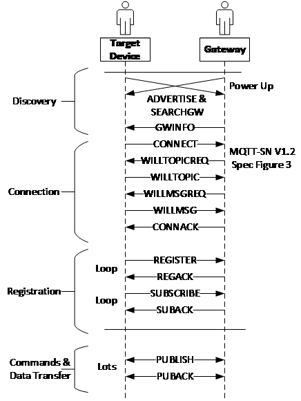

.. note::
   We assume readers have basic the knowledge of MQTT and MQTT-SN. For a more in depth overview of MQTT and MQTT-SN see the `MQTT documentation <https://docs.oasis-open.org/mqtt/mqtt/v5.0/mqtt-v5.0.pdf>`_.

MQTT Basics
-------------

System Architecture
```````````````````

MQTT-SN is a simplified version of MQTT adapted to the needs of sensor networks. Among other simplifications, MQTT-SN replaces long topic name strings with tokenized topic IDs and is thus much lower overhead for high-rate raw sensor data streaming.

In this documentation we refer to SensiML's Data Studio as the host application, but developers can follow this documentation to implement their own host application as well.

The Data Collection system consists of five main components:

•	Target Device
•	Bridge
•	Gateway
•	Broker
•	Host Application

 .. figure:: img/mqtt_fig_1.png
   :align: center
   :alt: MQTT Architecture Overview

The components in the system are described in the following sections.

Target Device
`````````````

The target device can range from a simple microcontroller to a more complex SoC running Android or Linux.  Currently, only serial communication is supported by the SensiML host application. But BLE, Cloud, TCP/IP will be supported in the future. A short description of the different communication interfaces are:

   •	**Serial** — A direct (3-wire: TX/RX/GND) serial port interface with the host. The serial port can be any one of the following:

      •  Physical serial port
      •	USB-serial cable
      •	Chip (such as FTDI, Prolific, Microchip or SILAB provides)
      •	USB-virtual COM port

   •	**BLE** — Using Nordic Semiconductor’s proprietary UART Service over Bluetooth Low Energy (BLE NUS) as supported by its nRF52xxx BLE radio ICs.  Using BLE NUS, a quasi-UART interface is created with the host.  The Data Studio provides a small translation (bridge) service that converts the BLE NUS protocol into a serial over a UDP socket interface.
   •	**TCP/IP** — The target device has a direct TCP/IP interface. For example, the development board may have a built in Ethernet interface, or a Wi-Fi interface. In this case, the target already has a TCP/IP socket type interface to either the gateway using the MQTT-SN protocol over UDP to the GATEWAY or a full MQTT interface directly to the DLC_BROKER (built into the Data Studio).

The Bridge
```````````

For UART interfaces, the Data Studio includes a simple sub-task that translates the MQTT-SN over a serial interface to an MQTT-SN over the UDP interface.

For BLE, the Data Studio has direct and easy access to the Bluetooth interface, thereby providing a bridge service transforming the BLE-NUS protocol to a socket.

The number of sensors and respective samples that can fit in one packet depends on the maximum packet size supported by the underlying transport layer. Some implementation of BLE 4.0 /4.2 has a maximum payload size of 20 bytes. For BLE 4.2 with DLE and BLE 5.0, the maximum packet size can go up to 251 bytes. For serial UART or other transport, the maximum packet size can be more.  To support message length greater than 20 bytes, the transport layer can use fragmentation. The application layer provides transport agnostic communication between the target and the host.

The Gateway
```````````

This is a Microsoft Windows port of the RSMB (Really Simple Message Broker) application implementing the simplified MQTT-SN protocol [3].

The Data Studio does the following:

•	At initialization, the Data Studio decides which socket/port numbers are to be used and creates a small ASCII text configuration file.
•	At startup, the Data Studio creates a small ASCII text RSMB configuration file and launches the RSMB application with an option specifying the path to the RSMB configuration file
•	When exiting, the Data Studio kills the application as required.

The Broker
``````````

In this environment, the RSMB application also provides the broker functionality.

In a full production environment, there would be one broker and many IoT end devices reporting data through the broker. Often, the broker is a cloud service.

In contrast, in this development configuration, there is only one device and one client. Therefore, in this configuration, the Data Studio uses RSMB for this process.

The primary reason for this decision is, for test and development purposes, the engineer developing the model will not require a third-party MQTT cloud service to perform the AI model development.

The secondary reason is some development environments do not have direct access to the cloud. Therefore, Data Studio + RSMB provides a self-contained solution.

The Host Applications
`````````````````````

The target device supports only one host application at a time. During initial model development steps, the exclusive interaction will be between the target device and the Data Studio application used to collect and label raw sensor data.

Often a design starts with a reference or evaluation board that has example sensors.  This pre-production hardware is then used to collect representative sensor data for developing the processing algorithm for the intended application. The SensiML Data Studio facilitates:

•	Configuring sensors on the target device board
•	Capturing data from those sensors
•	Labeling the captured data
•	Uploading the labeled data into the SensiML AI cloud
•	Importing/exporting labeled/raw sensor data


MQTT Command Sequence
```````````````````````
When a sensor device connects to a gateway, several packets are transferred to establish the connection. Details about these packets can be found in the MQTT-SN V1.2 Specification [2].

These are the different phases in the connection of a sensor device to a gateway using MQTT-SN:

**Discovery:** The gateway periodically broadcasts an advertisement, which the client (the target device board) is listening to. To speed up the process, the device can broadcast a SEARCHGW request. This concludes with the GWINFO response that informs the device about the gateway.

**Connection:** The device then begins the connection process. Depending on the target implementation, this may include a Last Will and Testament. The connection process completes with the connection acknowledgement, CONNACK.

**Clean Sessions:** Generally, the device must request a “clean connection” always.

**Registration and Subscription:**  While the MQTT topics are defined as strings, the MQTT-SN uses 16-bit topic ID numbers. There are two options available for the registration and subscription:

   •	The gateway reads a file with a list of predefined topic strings and topic ID numbers.

   •	The device loops over the topic strings it supports and registers them with the gateway.

The SensiML tools assume that the device will use Option 2 for registration and subscription.

**Publish Commands and Data:** Initial topic command sequence starts as follows:

   •	Both the Device and Data Studio register/subscribe TOPIC_SYS_DEVICE_UUIDS_RED/RSP as the last.
   •	The device publishes TOPIC_SYS_DEVICE_UUIDS_RSP as soon as it completes register/subscribe.
   •	The Data Studio publishes TOPIC_SYS_DEVICE_UUIDS_RED as soon as it completes register/subscribe.

Then the Device or the Data Studio can take the appropriate action when it receives the message from the other side.

**Disconnect:**  Not illustrated below, in this phase, the device shuts down and closes a connection.

The following figure shows the connection of a sensor device to a gateway using MQTT-SN.



At the line that between SUBACK and PUBLISH in Figure 3, the device will publish the device UUID response message to notify the host apps that the device is connected.


Why not MQTT End-to-End?
````````````````````````
The AI target device must support a command and response scheme from the SensiML host application.  While some target platforms may support a full TCP/IP type interface (Ethernet or Wi-Fi) – many do not.
The common protocol that all platforms support is a basic UART serial port or a USB-Serial port.  Therefore, MQTT-SN is a suitable choice.

