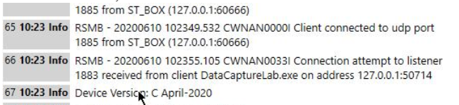

Integrating MQTT
----------------

Communication Method
````````````````````

In this tutorial we communicate between the host application and the target device (SensorTile.box) over USB serial. The Data Studio roadmap has plans to integrate support for BLE, TCP/IP over Wi-Fi and Cloud API’s.

Integrate the MQTT Library
```````````````````````````

You will need to port the MQTT library to your device. We use the open-sourced implementation for MQTT developed by IBM available `here <https://bitbucket.org/sensimldevteam/sensortile_box/src/master/Libraries/MQTTSN/>`__. Implementations of the topics to interface with the host application are found `here <https://bitbucket.org/sensimldevteam/sensortile_box/src/master/Libraries/MQTTSN_SML/>`__. For live streaming, you only need to implement a subset of these topics on your device.


Host application for debug
``````````````````````````

In order to see your messages come through from the device, you will need a message broker (RSMB), a Serial to UDP bridge, and a third client to send and receive MQTT-SN messages.

- RSMB: :download:`RSMB executable bundle<file/rsmb.zip>`
- Serial UDP bridge :download:`Serial UDP Bridge Console App bundle<file/mqttsn_console.zip>`
- MQTT Client: http://mqtt-explorer.com/

After unzipping the console application, options.json will allow you to configure what com port is connected with the SerialPortNum setting:

.. code-block:: javascript

   {
   ...Other options
   "SerialPortNum": 28,
   "BaudRate": 115200,
   }

Note: for SensorTile.box, the BaudRate should be set to 921600

Implement your first TOPIC
``````````````````````````

We recommend first implementing the **SYS_VERSION** topic and verifying your device is correctly communicating with the Data Studio. You will need to make sure your device can receive the _REQ (request), and send the _RSP (response). You can use any string for your version for debug.

The Data Studio will request **SYS_VERSION**, **SYS_COMPDATETIME**, and **SYS_DEVICE_UUID** upon connecting.

To use the host applications for debug - ensure you have downloaded and installed MQTT Explorer and RSMB/UDP bridge.

First, run RSMB:
.. code-block::

   .\ReallySmallMessageBroker.exe .\rsmb_config.txt

Then, run the UDP bridge:
.. code-block::

   .\MqttConsoleApp.exe -j .\options.json

Press 'S' in the Console application to start the bridge and connect to your device.

Then, Run MQTT Explorer. You'll need to add a local connection:
 .. figure:: img/mqtt-explorer-new-connection.png
   :align: center
   :alt: MQTT Explorer new connection

Configure the new connection to point to your local RSMB:
 .. figure:: img/mqtt-explorer-connection-settings.png
   :align: center
   :alt: MQTT Explorer connection settings

Publish your request message (for topics with payloads, you will need to hand-type the payload. This example uses the Version request, which is empty):
 .. figure:: img/mqtt-explorer-publish-version-req.png
   :align: center
   :alt: MQTT Explorer version request

On the left-hand side of MQTT-explorer, you will see a sensiml/ topic tree appear. you can expand it to see the response. You can verify it matches what you have set on the device
 .. figure:: img/mqtt-explorer-publish-version-req.png
   :align: center
   :alt: MQTT Explorer version request


Device ID
`````````
Each sensor board has 2 UUIDs associated with the board:

	* **DEVICE_DCLASS UUID** – This identifies the type or class of board.
	* **DEVICE_DUNIQUE UUID** – This UUID functions like a serial number.

All boards of type FOO - have the same DCLASS_UUID. All boards of type BAR would have a different DCLASS_UUID.

The scope of the DUNIQUE_UUID is within the DCLASS_UUID name space. The combination of DCLASS_UUID + DUNIQUE_UUID must be unique.


Create a DCLASS_UUID
````````````````````

Create a **DCLASS_UUID** for the board (See: **TOPIC_SYS_DEVICE_UUIDS_REQ**).

The basic list of commands that should be implemented at this stage are.

Required SYS commands
`````````````````````

TOPIC_SYS: System configuration and reporting

* TOPIC_SYS_DEVICE_UUIDS: Get Device Id
* TOPIC_SYS_COMPDATETIME: Get device time
* TOPIC_SYS_VERSION: Get version of software running on firmware
* TOP_SYS_STATUS_CLR: Clear status messages
* TOP_SYS_STATUS: Read status messages


Verify Data Studio Communication
````````````````````````````````

After implementing **TOPIC_SYS_VERSION** you can connect to your device in the Data Studio and verify it is working correctly by checking the event log, Help -> View Event Log. The first message that the Data Studio sends is a request for the **SYS_VERSION_TOPIC**. You will see the response in the logs, and after that you will see errors until you implement the rest of the TOPICS needed on your device.

.. note::
   In order to verify this with the Data Studio you will have to first :doc:`create the SSF plugin for your device<../data-studio/adding-custom-device-firmware>`


