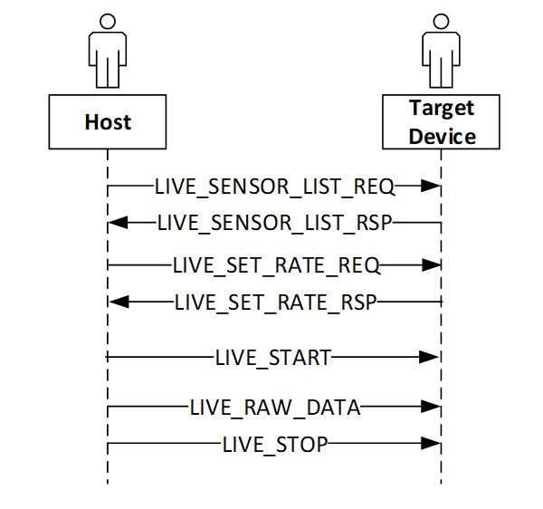

TOPIC_LIVE
-----------

The live sensor data streaming feature enables the SensiML data collection software to upload real-time raw sensor data to the Data Collection Lab. The sensor data can be used for the visual presentation of live data using the software or stored in the SensiML cloud or locally. 

A sensor is active if it is configured and the sampling data is ready for collection.

**Sequence Diagram**

This diagram shows the basic steps used to live streaming of the raw sensor data.
 


   Sequence Diagram for Live Streaming of Raw Data


TOPIC_LIVE_SENSOR_LIST_REQ 
```````````````````````````
:NAME:			TOPIC_LIVE_SENSOR_LIST_REQ
:DIRECTION:		HOST->TARGET
:REPLY:			TOPIC_LIVE_SENSOR_LIST_RSP
:MQTT_URL:		sensiml/live/sensor/list/req
:FIELDS:		Empty – there is no payload.
:DESCRIPTION:
    The Data Studio has a record of the sampling rate of all the active sensors on the end-point device. This is an optional command for the Data Studio to get the sampling rate of the desired sensors.
:ALSO SEE:
    •	TOPIC_LIVE_SENSOR_LIST_RSP

TOPIC_LIVE_SENSOR_LIST_RSP
```````````````````````````
:NAME:			TOPIC_LIVE_SENSOR_LIST_RSP
:DIRECTION:		TARGET->HOST
:REQUEST:		TOPIC_LIVE_SENSOR_LIST_REQ
:MQTT_URL:		sensiml/live/sensor/list/rsp
:FIELDS:		
    +-----------------+------------+------------------------------------------+
    | Field Name      | Type       | Description                              |
    +=================+============+==========================================+
    | SENSOR_1_ID     | U32        | The ID of sensor 1.                      |
    +-----------------+------------+------------------------------------------+
    | SENSOR_1_RATE   | U32        | The sample rate of sensor 1.             |
    +-----------------+------------+------------------------------------------+
    | …               | …          | …                                        |
    +-----------------+------------+------------------------------------------+
    | SENSOR_N_ID     | U32        | The ID of sensor n.                      |
    +-----------------+------------+------------------------------------------+
    | SAMPLE_N_RATE   | U32        | The sample rate of sensor n.             |
    +-----------------+------------+------------------------------------------+
    | Total bytes     | 8xN        | Total number of the bytes                |
    +-----------------+------------+------------------------------------------+
:DESCRIPTION:
    This is the response with the sampling rate corresponding to each active sensor.
:ALSO SEE:
    •	TOPIC_LIVE_SENSOR_LIST_REQ

TOPIC_LIVE_SET_RATE_REQ 
`````````````````````````
:NAME:			TOPIC_LIVE_SET_RATE_REQ
:DIRECTION:		HOST->TARGET
:REPLY:			TOPIC_LIVE_SET_RATE_RSP
:MQTT_URL:		sensiml/live/set/rate/req
:FIELDS:
    +----------------------+------------+------------------------------------------+
    | Field Name           | Type       | Description                              |
    +======================+============+==========================================+
    | SENSOR_COUNT         | U8         | Total number of the sensors              |
    +----------------------+------------+------------------------------------------+
    | SENSOR_ID_1          | U32        | The ID of sensor 1.                      |
    +----------------------+------------+------------------------------------------+
    | SENSOR_1_COUNT_DOWN  | U32        | The count-down number for sensor 1       |
    +----------------------+------------+------------------------------------------+
    | …                    | …          | …                                        |
    +----------------------+------------+------------------------------------------+
    | SENSOR_ID_N          | U32        | The ID of sensor n.                      |
    +----------------------+------------+------------------------------------------+
    | SENSOR_N_COUNT_DOWN  | U32        | The count-down number for sensor 1       |
    +----------------------+------------+------------------------------------------+
    | Total                | 8xN+1      | Total number of the bytes                |
    +----------------------+------------+------------------------------------------+
:DESCRIPTION:
    This command sets the live streaming rate which represented by the count-down number of the selected sensor but will not affect the actual sampling rate of the sensor. When the count-down number is set to “1”, it means every other sample. When it is set to “0” if you want to see every samples sensor provided.
    
    The Data Studio uses this command to configure the live streaming rate of the active sensors. The Data Studio can set the live streaming of one or more sensors to receive one or more sensor data concurrently. The Data Studio can stop the current streaming and select/configure different sensor for live streaming in any active Data Studio session. 
    
    This command does not change the configuration of the sensors that are not in the list of the command payload. Streaming rate can be set using the count-down.
:ALSO SEE:
    •	TOPIC_LIVE_SET_RATE_RSP

TOPIC_LIVE_SET_RATE_RSP 
`````````````````````````
:NAME:			TOPIC_LIVE_SET_RATE_RSP
:DIRECTION:		TARGET->HOST
:REQUEST:		TOPIC_LIVE_SET_RATE_REQ
:MQTT_URL:		sensiml/live/set/rate/rsp
:FIELDS:	
    +----------------------+------------+------------------------------------------+
    | Field Name           | Type       | Description                              |
    +======================+============+==========================================+
    | SENSOR_1_ID          | U32        | The ID of sensor 1.                      |
    +----------------------+------------+------------------------------------------+
    | SENSOR_1_COUNT_DOWN  | U32        | The count-down number for sensor 1       |
    +----------------------+------------+------------------------------------------+
    | …                    | …          | …                                        |
    +----------------------+------------+------------------------------------------+
    | SENSOR_N_ID          | U32        | The ID of sensor n.                      |
    +----------------------+------------+------------------------------------------+
    | SENSOR_N_COUNT_DOWN  | U32        | The count-down number for sensor n.      |
    +----------------------+------------+------------------------------------------+
    | Total                | 8xN        | Total number of the bytes                |
    +----------------------+------------+------------------------------------------+
:DESCRIPTION:
    The device sends this message in response to the TOPIC_LIVE_SET_RATE_REQ command. The message returns the live streaming rate in count down of each active sensor.  
    
    The live streaming rate depends on the capability of the underlying transport layer and varies among different communication protocols, the rate (sampling, streaming), and the way sensor data are feed. 
    
    In case the device is not able to support the requested rate of the requested senor ID, the rate field will contain an error code. The following error codes are supported:
    
    +------------+------------------------------------------+------------------------------------------------------------------------+
    | S. No.     | Error code                               | Comments                                                               |
    +============+==========================================+========================================================================+
    | 1          | (SENSOR_ID_INVALID) 0xFFFFFFFF           | The given sensor ID does not exist                                     |
    +------------+------------------------------------------+------------------------------------------------------------------------+
    | 2          | (SENSOR_NOT_ACTIVE) 0xFFFFFFFE           | The given sensor is not configured for data sampling/acquisition       |
    +------------+------------------------------------------+------------------------------------------------------------------------+
    | 3          | (INVALID_STREAM_RATE) 0xFFFFFFFD         | Device could not support the requested streaming rate —either the rate |
    |            |                                          | is too high or too low.                                                |
    +------------+------------------------------------------+------------------------------------------------------------------------+

    In the above table, the big numbers are selected for error codes so that the Data Studio can identify if the requested streaming rate is accepted or rejected by the device.
:ALSO SEE:
    •  	**TOPIC_LIVE_SET_RATE_REQ**

TOPIC_LIVE_START
`````````````````
:NAME:			TOPIC_LIVE_START
:DIRECTION:		HOST->TARGET
:REPLY:			none
:MQTT_URL:		sensiml/live/start
:FIELDS:
    +-----------------+------------+----------------------------------------------------+
    | Field Name      | Type       | Description                                        |
    +=================+============+====================================================+
    | SENSOR_COUNT    | U8         | Total number of sensors                            |
    +-----------------+------------+----------------------------------------------------+
    | SENSOR_1_ID     | U32        | The ID of the sensor 1                             |
    +-----------------+------------+----------------------------------------------------+
    | SENSOR_1_MIN    | U8         | Minimum of the sample counts per packet of sensor  |
    |                 |            | 1                                                  |
    +-----------------+------------+----------------------------------------------------+
    | …               | …          | …                                                  |
    +-----------------+------------+----------------------------------------------------+
    | SENSOR_N_ID     | U32        | The ID of the sensor N                             |
    +-----------------+------------+----------------------------------------------------+
    | SENSOR_N_MIN    | U8         | Minimum of the sample counts per packet of sensor  |
    |                 |            | N                                                  |
    +-----------------+------------+----------------------------------------------------+
    | Total bytes     | 5xN+1      | Total number of the bytes                          |
    +-----------------+------------+----------------------------------------------------+
:DESCRIPTION:
    This command is used to start the live sensor data streaming. The minimum is the minimal number of samples a packet will contain before the it is published.
    
    The Data Studio can choose one or multiple sensors for live streaming. This message allows you to choose to receive single or multiples samples for each sensor. 
    
    For the explanation of the minimum in the messages, see Notes for TOPIC_LIVE_START
:ALSO SEE:
    •	TOPIC_LIVE_RAW_DATA
    •	TOPIC_LIVE_STOP

TOPIC_LIVE_RAW_DATA
````````````````````
:NAME:			TOPIC_LIVE_RAW_DATA
:DIRECTION:		TARGET->HOST
:REQUEST:		none
:MQTT_URL:		sensiml/live/raw/data
:FIELDS:		
    +-----------------+------------+----------------------------------------------------+
    | Field Name      | Type       | Description                                        |
    +=================+============+====================================================+
    | SENSOR_ID       | U32        | The ID of sensor.                                  |
    +-----------------+------------+----------------------------------------------------+
    | SEQUENCE_NO     | U8         | Packet sequence number for sensor.                 |
    +-----------------+------------+----------------------------------------------------+
    | SAMPLE_1        | M          | M is the number of bytes for Sample 1 of sensor    |
    +-----------------+------------+----------------------------------------------------+
    | …               | …          | …                                                  |
    +-----------------+------------+----------------------------------------------------+
    | SAMPLE_N        | M          | M is the number of bytes for Sample N of sensor.   |
    +-----------------+------------+----------------------------------------------------+
    | Total bytes     | MXN+5      | Total number of the bytes                          |
    +-----------------+------------+----------------------------------------------------+
:DESCRIPTION:
    This command is used to send live sensor streaming data from the target device to the Data Studio for the sensors listed in the TOPIC_LIVE_START** message.
:ALSO SEE:
    •	TOPIC_LIVE_START
    •	TOPIC_LIVE_STOP

TOPIC_LIVE_STOP
```````````````
:NAME:			TOPIC_LIVE_STOP
:DIRECTION:		HOST->TARGET
:REPLY:			none
:MQTT_URL:		sensiml/live/stop
:FIELDS:		Empty		
:DESCRIPTION:
    This command is used to stop the live sensor data streaming. It will stop all sensors from streaming. All sensor’s live stream states/struct are reset, sensor’s sampling configuration not changed, this brings sensors to the state when they were added. To restart live streaming, do **TOPIC_LIVE_START** only.
:ALSO SEE:
    •	TOPIC_LIVE_RAW_DATA
    •	TOPIC_LIVE_START