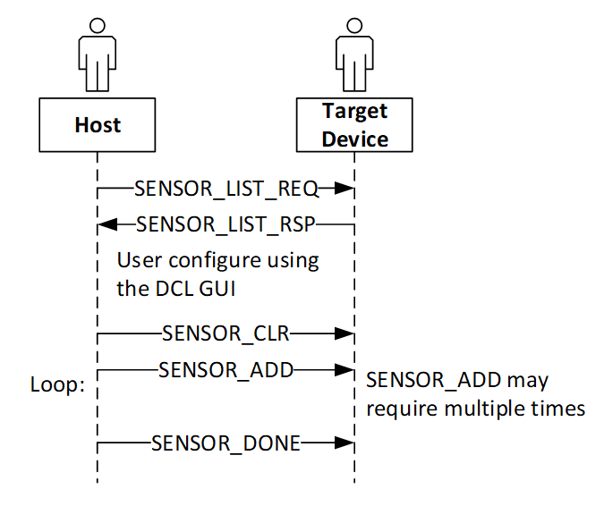

TOPIC_SENSOR
------------

The device maintains a list of available sensors that can be used. The host can use the **TOPIC_SENSOR** commands to configure sensors for data collection.

TOPIC_SENSOR_LIST_REQ
`````````````````````
:NAME:			TOPIC_SENSOR_LIST_REQ
:DIRECTION:		HOST->TARGET
:REPLY:			TOPIC_SENSOR_LIST_RSP
:MQTT_URL:		sensiml/sensor/list/req
:FIELDS:		Empty – there is no payload.
:DESCRIPTION:
    This command requests the target to respond with TARGET_SENSOR_LIST_RSP.
:ALSO SEE:
    •	TOPIC_SENSOR_LIST_RSP
    •	TOPIC_SENSOR_ADD

TOPIC_SENSOR_LIST_RSP
``````````````````````
:NAME:			TOPIC_SENSOR_LIST_RSP
:DIRECTION:		TARGET -> HOST
:REQUEST:		TOPIC_SENSOR_LIST_REQ
:MQTT_URL:		sensiml/sensor/list/rsp
:FIELDS:
    +-------------+----------+--------------------------------------------------------------+
    | Field Name  | Type     | Description                                                  |
    +=============+==========+==============================================================+
    | SENSOR_LIST | U32      | List of SENSOR_IDs that are supported in this configuration. |
    +-------------+----------+--------------------------------------------------------------+
    | TOTAL       | 4xN      | Where N = Number of sensors                                  |
    +-------------+----------+--------------------------------------------------------------+
:DESCRIPTION:
    The target responds with a list of SENSOR_IDs that are supported in this configuration.

    It is expected that target platforms will have compile time options (#define FEATURE settings) that include or exclude certain sensors.

    See Notes for TOPIC_SENSOR_LIST_RSP
:ALSO SEE:
    •	TOPIC_COLLECT
    •	TOPIC_SENSOR_LIST_REQ
    •	TOPIC_SENSOR_ADD

TOPIC_SENSOR_CLR
`````````````````
:NAME:			TOPIC_SENSOR_CLR
:DIRECTION:		HOST->TARGET
:REPLY:			no reply
:MQTT_URL:		sensiml/sensor/clr
:FIELDS:		Empty – there is no payload.
:DESCRIPTION:
    This command de-configures, clear, and disables all sensors.
:ALSO SEE:
    •	TOPIC_SENSOR_LIST_REQ
    •	TOPIC_SENSOR_LIST_RSP
    •	TOPIC_SENSOR_ADD

TOPIC_SENSOR_ADD
````````````````
:NAME:			TOPIC_SENSOR_ADD
:DIRECTION:		HOST->TARGET
:RESPONSE:		None.
:MQTT_URL:		sensiml/sensor/add/
:FIELDS:
    +--------------+----------+------------------------------------------------------------------------------+
    | Field Name   | Type     | Description                                                                  |
    +==============+==========+==============================================================================+
    | SENSOR_ID    | U32      | The specific 32-bit that identifies the sensor to be configured.             |
    +--------------+----------+------------------------------------------------------------------------------+
    | SAMPLE_RATE  | U32      | Sensor sample rate in Hz                                                     |
    +--------------+----------+------------------------------------------------------------------------------+
    | CONFIG_BYTES | BYTES(N) | N bytes – as specified by the specific sensor id.                            |
    |              |          | This field is board and sensor specific.                                     |
    +--------------+----------+------------------------------------------------------------------------------+
    | TOTAL        | 8+N      | Where N = Number of sensors                                                  |
    +--------------+----------+------------------------------------------------------------------------------+
:DESCRIPTION:
    This message will add one sensor that is configured when it is added to the data collection sensor id list.
    See Notes for TOPIC_SENSOR_ADD
:ALSO SEE:
    •	TOPIC_SENSOR_LIST_REQ
    •	TOPIC_SENSOR_LIST_RSP

TOPIC_SENSOR_DONE
```````````````````
:NAME:			TOPIC_SENSOR_DONE
:DIRECTION:		HOST->TARGET
:REPLY:			no reply
:MQTT_URL:		sensiml/sensor/done
:FIELDS:		Empty, there is no payload.
:DESCRIPTION:
    This informs the device that the sensor configuration is complete.
    The device can complete the sensor configuration at this time.
:ALSO SEE:
    •	TOPIC_COLLECT
    •	TOPIC_SENSOR_LIST_REQ
    •	TOPIC_SENSOR_LIST_RSP
    •	TOPIC_SENSOR_CLR
    •	TOPIC_SENSOR_ADD

:Sequence Diagram:

    This diagram shows the basic steps used to configure sensors by adding them.



   Sequence Diagram for Adding Sensors 
