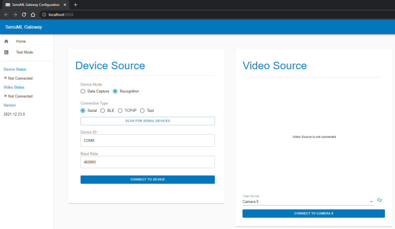

.. meta::
   :title: SensiML Open Gateway - Installation/Setup Instructions
   :description: How to install/setup the SensiML Open Gateway

Installation/Setup Instructions
===============================

The SensiML Open Gateway has two options for starting the application:

1. Run from an installer file **(Windows)**
2. Run from source code in python **(Windows, MacOS, Linux)**

Run from Installer (Windows)
----------------------------

1. Download the latest installer file from GitHub at `<https://github.com/sensiml/open-gateway/tags>`_

2. Start the application by running the ``EXE`` file

3. The Open Gateway will open in a browser window

Run from Source Code (Windows, MacOS, Linux)
--------------------------------------------

1. Running the Open Gateway from source code requires **python version 3.7 or greater** to be installed on your computer. Install python from `<https://www.python.org/downloads/>`_

2. Download or checkout the source code from GitHub at `<https://github.com/sensiml/open-gateway>`_

3. Open a command terminal window and navigate to the location where you saved the source code

4. Install the Open Gateway python dependencies by running the following command:

   .. code-block:: python

      pip install -r requirements.txt

5. Start the Open Gateway by running the following command:

   .. code-block:: python

      python app.py

6. The Open Gateway will open in a browser window

