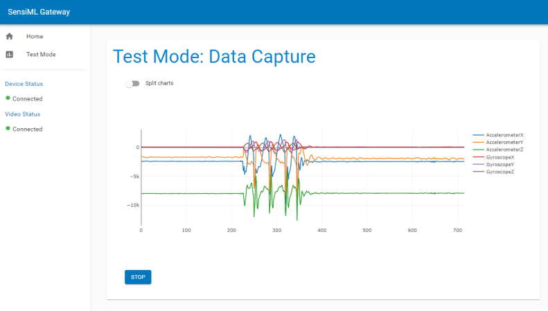

.. meta::
   :title: SensiML Open Gateway
   :description: Get started using the SensiML Open Gateway application

Overview
========

The SensiML Open Gateway is an application that connects to your embedded device over Bluetooth-LE, Serial, or Wi-Fi (TCP/IP). It can be used to display real-time classification results from a model or used as a sensor hub for collecting raw sensor data. It is an open-source application that you can update/customize the source code to meet your project needs.

Operating System
````````````````

* Windows
* MacOS
* Linux

Real-Time Model Classifications
-------------------------------

.. figure:: /open-gateway/img/open-gateway-recognition-with-images.png
   :align: center

Data Collection
---------------

