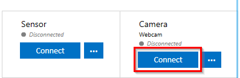
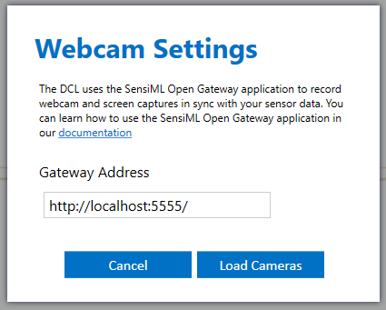
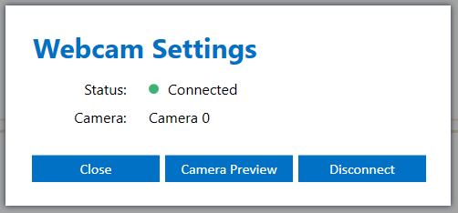

.. meta::
   :title: Recording Webcam Videos in the Data Studio
   :description: How to record webcam videos in the Data Studio

Recording Webcam Videos in the Data Studio
------------------------------------------

The Data Studio can use the SensiML Open Gateway application to record webcam videos or screen captures from your computer. You can find the steps for setting up the Open Gateway in the :doc:`Open Gateway Setup Guide<installation-setup-instructions>`. Follow the instructions below to setup your webcam settings.

1. Start the Open Gateway application

2. Open *Live Capture mode* or *Test Model mode* in the Data Studio

3. Click *Connect* in the Camera panel

4. Enter your Gateway Address and click *Load Cameras*

5. Select your camera and click *Connect*

.. figure:: img/webcam-settings-connect.png
   :align: center

6. The camera status will now show connected

After connecting to your camera the Data Studio will automatically record videos when recording sensor data from your device and save them to your project video directory