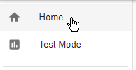
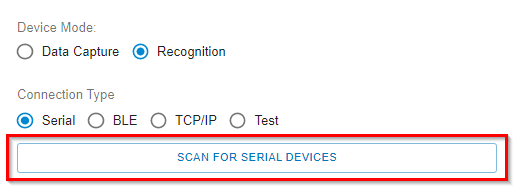
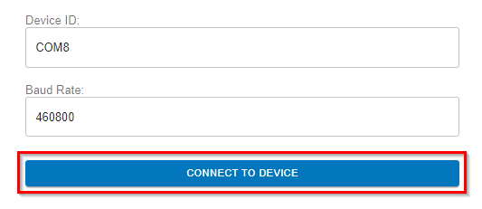
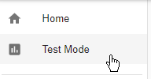
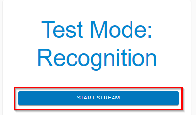
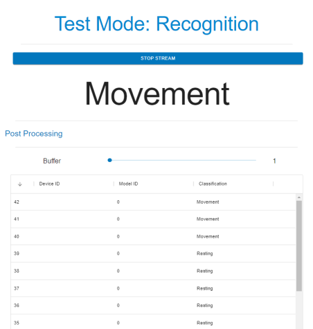

.. meta::
   :title: SensiML Open Gateway - Running a Model On Your Embedded Device
   :description: How to run a model using recognition mode in the Open Gateway

Running a Model On Your Embedded Device
=======================================

The Open Gateway can connect to an embedded device that has been flashed with a model to get classification results from the model running at the edge. See the example below for how to use recognition mode in the SensiML Open Gateway.

.. figure:: /open-gateway/img/open-gateway-recognition-with-images.png
   :align: center

1. Open the **Home** page

2. Select recognition mode, select a connection type, and click the **Scan** button to select your device

3. Click **Connect to Device** *(Note: When using a serial connection update the baud rate setting to your device's baud rate)*

4. Open the **Test Mode** page

5. Click **Start Stream**

6. The Open Gateway will now stream classification results from your embedded device. By default the Open Gateway will display classification IDs as defined in your model class map

7. *(Optional)* You can show classification names instead of classification IDs by following the instructions in the next section :doc:`adding-classification-names`

8. *(Optional)* You can show images with the classifications by following the instructions in the next section :doc:`adding-classification-images`

.. figure:: /open-gateway/img/open-gateway-recognition-with-images.png
   :align: center