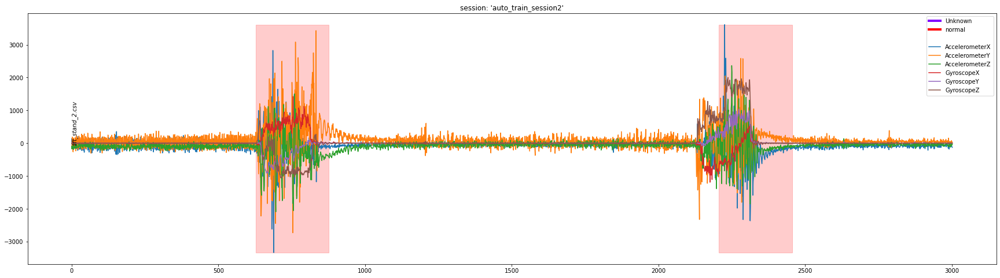
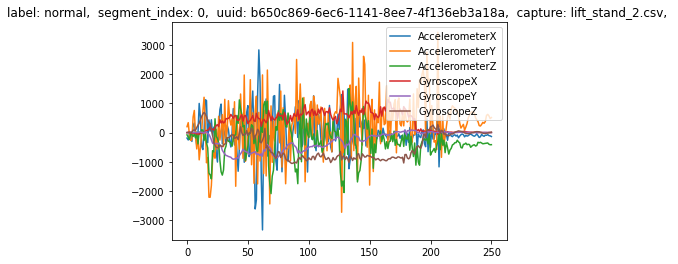
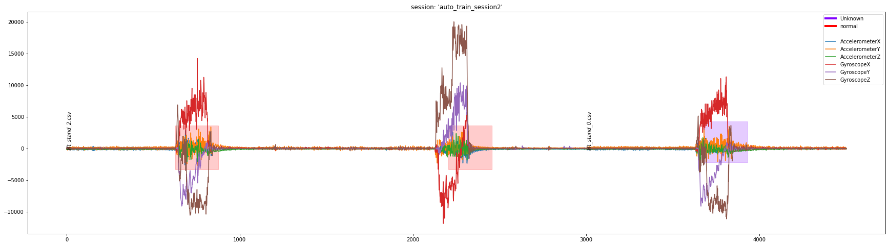
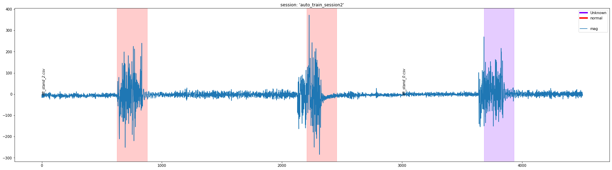

.. meta::
   :title: API Methods - DCLProject
   :description: How to use the DCLProject API

DCLProject
==========

The DCLProject API lets you analyze and access sensor data stored in the Data Studio .DCLPROJ format. DCLPROJ files are what the Data Studio uses to save your labeled sensor data.

First, we will import and instantiate the DCLProject object. Then, we are going to create a connection to your DCLPROJ file. This will give us access to the information in the DCL so we can more easily perform our analysis.

.. note:: 
  The API is **read-only** and does not make any modifications or updates to the DCLPROJ file.

.. code:: ipython3

    from sensiml.dclproj import DCLProject

    dclproj_path = '<PATH-To-File.dclproj>'

    dcl = DCLProject(path=dclproj_path)

.. raw:: html

    

There are several useful functions in the DCLProject API that will let you explore the data sets. You will be able to see information about each session of labeled data, captured data files, as well as the segments of data. Let's start by listing the sessions that are in this project.

.. code:: ipython3

    dcl.list_sessions()

.. raw:: html

    

    
    <table border="1" class="dataframe">
      <thead>
        <tr style="text-align: right;">
          <th></th>
          <th>id</th>
          <th>name</th>
          <th>parameters</th>
          <th>custom</th>
          <th>preprocess</th>
          <th>created_at</th>
          <th>local_status</th>
          <th>last_modified</th>
        </tr>
      </thead>
      <tbody>
        <tr>
          <th>0</th>
          <td>1</td>
          <td>pose_estimation_2</td>
          <td>None</td>
          <td>1</td>
          <td>None</td>
          <td>2021-09-28 17:12:19.340477</td>
          <td>Synced</td>
          <td>2021-09-28 17:12:19.340494</td>
        </tr>
        <tr>
          <th>1</th>
          <td>3</td>
          <td>auto_train_session2</td>
          <td>{"inputs":{"input_data":"","first_column_of_in...</td>
          <td>0</td>
          <td>{}</td>
          <td>2021-09-24 17:18:55.405671</td>
          <td>Synced</td>
          <td>2021-09-24 18:20:59.227769</td>
        </tr>
        <tr>
          <th>2</th>
          <td>7</td>
          <td>general_abs_sum</td>
          <td>{"inputs":{"input_data":"","first_column_of_in...</td>
          <td>0</td>
          <td>{}</td>
          <td>2021-09-30 23:44:21.626028</td>
          <td>Synced</td>
          <td>2021-09-30 23:50:41.601792</td>
        </tr>
        <tr>
          <th>3</th>
          <td>8</td>
          <td>Test</td>
          <td>None</td>
          <td>1</td>
          <td>None</td>
          <td>2021-10-01 20:46:42.223753</td>
          <td>Synced</td>
          <td>2021-10-01 20:46:42.223778</td>
        </tr>
      </tbody>
    </table>
    

As you can see there are two sessions in this project. The first one is what we call a custom or manual session, this means that the labels were manually placed by the user. The second one is what we call an auto session, which means the labels were created by a segmentation algorithm.

Next, we will list the segments that are part of the “auto_train_session2” session. To do this we will use the list_capture_segments API.

.. code:: ipython3

    dcl.list_capture_segments(session= "auto_train_session2")

.. raw:: html

    

    
    <table border="1" class="dataframe">
      <thead>
        <tr style="text-align: right;">
          <th></th>
          <th>capture..start</th>
          <th>capture..end</th>
          <th>last_modified</th>
          <th>segmenter</th>
          <th>capture</th>
          <th>label_value</th>
        </tr>
      </thead>
      <tbody>
        <tr>
          <th>0</th>
          <td>707</td>
          <td>957</td>
          <td>2021-09-29 00:03:17.659838</td>
          <td>auto_train_session2</td>
          <td>stand_start_3.csv</td>
          <td>normal</td>
        </tr>
        <tr>
          <th>1</th>
          <td>618</td>
          <td>868</td>
          <td>2021-09-29 00:05:37.647696</td>
          <td>auto_train_session2</td>
          <td>stand_start_1.csv</td>
          <td>Unknown</td>
        </tr>
        <tr>
          <th>2</th>
          <td>625</td>
          <td>875</td>
          <td>2021-09-29 00:03:17.660063</td>
          <td>auto_train_session2</td>
          <td>reach_lift_3.csv</td>
          <td>normal</td>
        </tr>
        <tr>
          <th>3</th>
          <td>624</td>
          <td>874</td>
          <td>2021-09-29 00:05:37.647696</td>
          <td>auto_train_session2</td>
          <td>reach_lift_1.csv</td>
          <td>Unknown</td>
        </tr>
        <tr>
          <th>4</th>
          <td>628</td>
          <td>878</td>
          <td>2021-09-29 00:05:37.647696</td>
          <td>auto_train_session2</td>
          <td>reach_lift_0.csv</td>
          <td>Unknown</td>
        </tr>
        <tr>
          <th>5</th>
          <td>629</td>
          <td>879</td>
          <td>2021-09-29 00:03:17.659923</td>
          <td>auto_train_session2</td>
          <td>lift_stand_3.csv</td>
          <td>normal</td>
        </tr>
        <tr>
          <th>6</th>
          <td>671</td>
          <td>921</td>
          <td>2021-09-29 00:05:37.647696</td>
          <td>auto_train_session2</td>
          <td>lift_stand_1.csv</td>
          <td>Unknown</td>
        </tr>
        <tr>
          <th>7</th>
          <td>680</td>
          <td>930</td>
          <td>2021-09-29 00:05:37.647696</td>
          <td>auto_train_session2</td>
          <td>lift_stand_0.csv</td>
          <td>Unknown</td>
        </tr>
        <tr>
          <th>8</th>
          <td>637</td>
          <td>887</td>
          <td>2021-09-29 00:03:17.660142</td>
          <td>auto_train_session2</td>
          <td>start_reach_3.csv</td>
          <td>normal</td>
        </tr>
        <tr>
          <th>9</th>
          <td>825</td>
          <td>1075</td>
          <td>2021-10-01 21:07:03.549009</td>
          <td>auto_train_session2</td>
          <td>unknown_reach_start_7.csv</td>
          <td>start</td>
        </tr>
      </tbody>
    </table>
    

This provides information about the segments in the captured file. We will pick one of the files and generate a plot which combines the data and the segments for that capture. To do this we will use the plot_segment_labels API. Next, pass a capture name and the session name into the plot_segment_labels API.

.. code:: ipython3

    df = dcl.plot_segment_labels(["lift_stand_2.csv"], "auto_train_session2")

This generates the above plot and stores data into the df object. df is a DataFrame containing the sensor data from those captures.

Next, we will get the information for the segments for this particular file. To do that we can use the get_capture_segments API.

.. code:: ipython3

    segments = dcl.get_capture_segments("lift_stand_2.csv", "auto_train_session2")

This returns a DataSegments object, which is a list of DataSegment objects with some additional functionality. To see a plot of all the segments in the DataSegments object, you can call plot API.

.. code:: ipython3

    segments[0].plot()

Additionally, you can index into the DataSegments to see more detailed information about each segment.

.. code:: ipython3

    segments[0].metadata

.. parsed-literal::

    {'label': 'normal',
     'segment_index': 0,
     'uuid': UUID('b650c869-6ec6-1141-8ee7-4f136eb3a18a'),
     'capture': 'lift_stand_2.csv'}

.. code:: ipython3

    segments[0].to_dataframe()

.. raw:: html

    

    
    <table border="1" class="dataframe">
      <thead>
        <tr style="text-align: right;">
          <th></th>
          <th>AccelerometerX</th>
          <th>AccelerometerY</th>
          <th>AccelerometerZ</th>
          <th>GyroscopeX</th>
          <th>GyroscopeY</th>
          <th>GyroscopeZ</th>
        </tr>
      </thead>
      <tbody>
        <tr>
          <th>0</th>
          <td>-189</td>
          <td>200</td>
          <td>-79</td>
          <td>-7</td>
          <td>-2</td>
          <td>2</td>
        </tr>
        <tr>
          <th>1</th>
          <td>-254</td>
          <td>338</td>
          <td>-161</td>
          <td>8</td>
          <td>-8</td>
          <td>8</td>
        </tr>
        <tr>
          <th>2</th>
          <td>-25</td>
          <td>-97</td>
          <td>-235</td>
          <td>21</td>
          <td>0</td>
          <td>-10</td>
        </tr>
        <tr>
          <th>3</th>
          <td>1</td>
          <td>-273</td>
          <td>-52</td>
          <td>9</td>
          <td>9</td>
          <td>-28</td>
        </tr>
        <tr>
          <th>4</th>
          <td>-303</td>
          <td>-237</td>
          <td>-65</td>
          <td>-23</td>
          <td>1</td>
          <td>17</td>
        </tr>
        <tr>
          <th>...</th>
          <td>...</td>
          <td>...</td>
          <td>...</td>
          <td>...</td>
          <td>...</td>
          <td>...</td>
        </tr>
        <tr>
          <th>246</th>
          <td>-93</td>
          <td>586</td>
          <td>-358</td>
          <td>1</td>
          <td>1</td>
          <td>-23</td>
        </tr>
        <tr>
          <th>247</th>
          <td>-71</td>
          <td>621</td>
          <td>-356</td>
          <td>-2</td>
          <td>0</td>
          <td>-17</td>
        </tr>
        <tr>
          <th>248</th>
          <td>-106</td>
          <td>570</td>
          <td>-400</td>
          <td>4</td>
          <td>3</td>
          <td>-10</td>
        </tr>
        <tr>
          <th>249</th>
          <td>-113</td>
          <td>478</td>
          <td>-417</td>
          <td>4</td>
          <td>0</td>
          <td>0</td>
        </tr>
        <tr>
          <th>250</th>
          <td>-136</td>
          <td>513</td>
          <td>-415</td>
          <td>2</td>
          <td>-2</td>
          <td>12</td>
        </tr>
      </tbody>
    </table>
    
251 rows × 6 columns

    

.. code:: ipython3

    segments[0].columns

.. parsed-literal::

    Index(['AccelerometerX', 'AccelerometerY', 'AccelerometerZ', 'GyroscopeX',
           'GyroscopeY', 'GyroscopeZ'],
          dtype='object')

Finally, we will look at how to apply some transforms to the sensor data and plot the results. We will create two functions, one that generates a new column (the magnitude) and one that scales the data in place.

You can see the example below for how to create these two types of transforms. One of them applies to data inline, the other creates a new column. You can chain one more together as needed.

.. code:: ipython3

    def mag_columns(x):
        return x[['AccelerometerX', 'AccelerometerY', 'AccelerometerZ']].sum()*0.058501749436316454
    
    def scale_columns(x):
        return x[['GyroscopeX','GyroscopeY', 'GyroscopeZ']]*10
    
    
    mag_columns_def = {'name':'mag','func':mag_columns, "type":'transform'}
    scale_columns_def = {'name':'filter','func':scale_columns, "type":'filter', "columns":['GyroscopeX','GyroscopeY', 'GyroscopeZ']}

.. code:: ipython3    

    df = dcl.plot_segment_labels(["lift_stand_2.csv", "lift_stand_0.csv"], "auto_train_session2", transforms=[scale_columns_def])

.. code:: ipython3

    df = dcl.plot_segment_labels(["lift_stand_2.csv", "lift_stand_0.csv"], "auto_train_session2", transforms=[mag_columns_def, scale_columns_def], columns=['mag'])

**Converting a CSV to DCLI**

You can convert a .CSV file into a .DCLI file that can be imported into the Data Studio by using the csv_to_dcli API

.. automodule:: sensiml.dclproj.csv_to_dcli
    :members:  to_dcli

.. automodule:: sensiml.dclproj.dclproj.DCLProject
    :members: create_connection, list_captures, list_sessions, list_capture_segments, get_segments, get_capture_metadata, get_capture_segments, get_capture, get_captures, plot_segment_labels