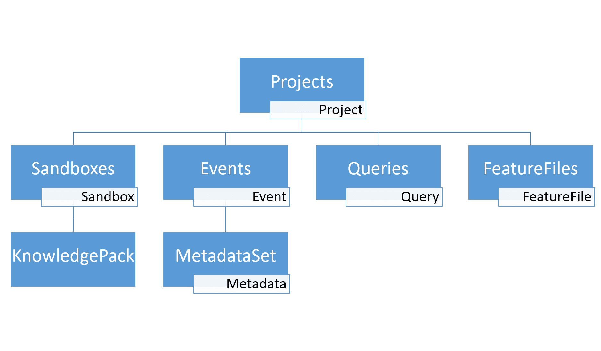

.. meta::
   :title: SensiML Python SDK - API Methods
   :description: Get started using SensiML Python SDK API Methods

Overview
========

The *API Methods* documentation describes a detailed overview of all the APIs in the SensiML Python SDK.

SensiML dataset/project architecture is setup with an object hierarchy for all of the properties of a project. See the diagram below.

**SensiML Object Hierarchy**:

For each type of object, there is a plural variant that represents a collection of those objects. To navigate to a
specific object, you will refer to the collection object and then call a "get_objects()" or "get_object_by_name()"
method. The Projects object is a property of the top-level SensiML Client object.

Examples::

    client.list_projects()
    client.project = "<My-Project-Name>"