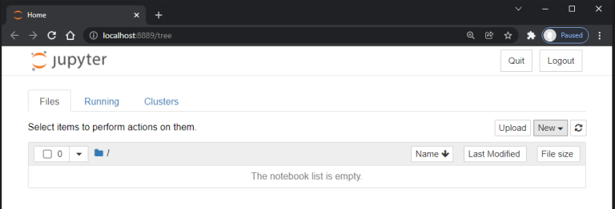
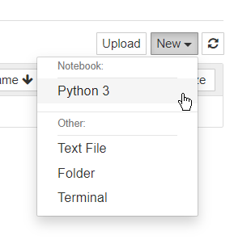

.. meta::
   :title: SensiML Python SDK - Jupyter Notebook Basics
   :description: Overview of Jupyter Notebook Basics

=======================
Jupyter Notebook Basics
=======================

We recommend using the SensiML Python SDK with Jupyter Notebook. For more information on Jupyter Notebook you can find the Jupter Notebook documentation at `<https://docs.jupyter.org/en/latest/>`_

1. Install Jupyter Noteook using pip in a terminal window

.. code-block:: python

    pip install notebook

2. Start a Jupyter Notebook server by running the following command in a terminal window

.. code-block:: python

    jupyter notebook

3. This will load Jupyter Notebook in a browser window



4. Create a new notebook by clicking **New** → **Python <version>** 




Jupyter Notebook Shortcuts
``````````````````````````

If you have not used Jupyter notebooks before the following keyboard shortcuts will be useful.

• **Run a cell** - Shift + Enter
• **Auto-complete** - Press tab at any time while typing a function/command and the SensiML Python SDK will give you all available options