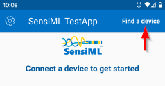
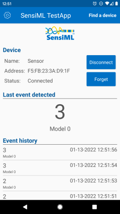
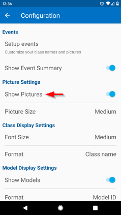
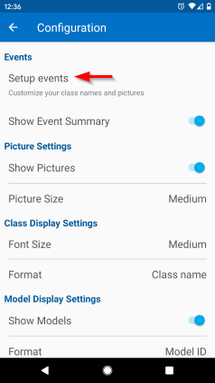
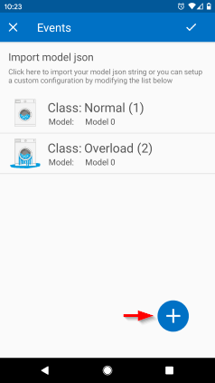

.. meta::
   :title: SensiML TestApp - Running a Model On Your Embedded Device
   :description: How to run a model using the SensiML TestApp

Running a Model On Your Embedded Device
=======================================

The SensiML TestApp is an Android application that uses **Bluetooth-LE** to connect to an embedded device that has been flashed with a model to get classification results from the model running at the edge. If your model uses a **Serial** or **Wi-Fi (TCP/IP)** connection you can use the :doc:`Open Gateway <../open-gateway/running-a-model-on-your-embedded-device>`. See the steps below for how to use the SensiML TestApp.

.. figure:: /testapp/img/testapp-classifications-with-images.png
   :align: center

Connecting to Your Device
-------------------------

1. Click **Find a device** to connect to your embedded device

2. The SensiML TestApp will automatically connect to your device and start streaming classification IDs from your model

Adding Classification Names and Images
--------------------------------------

By default, the app will be displaying the **Classification ID** of the event you are classifying. You can instead show classification names and images by modifying the SensiML TestApp settings

1. Open the SensiML TestApp settings page by clicking on the **gear icon**

.. figure:: img/testapp-settings.png
   :align: center

2. *(Optional)* Enable the **Show Pictures** setting to display images with your classifications

3. Click **Setup Events**

4. Click the **Add** button to add events or you can import a model.json file from the Knowledge Pack folder that you downloaded from the Analytics Studio

5. You will now see the classification names and images instead of classification IDs

.. figure:: /testapp/img/testapp-classifications-with-images.png
   :align: center