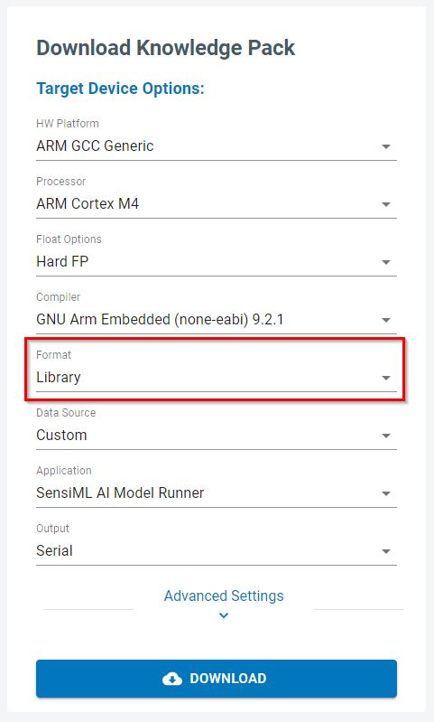

.. meta::
    :title: Third-Party Integration - Building Recognition Firmware
    :description: How to interface your device with SensiML recognition firmware

=============================
Building Recognition Firmware
=============================

The SensiML Analytics Studio supports building recognition firmware (Knowledge Packs) for any hardware platform described in the :doc:`Knowledge Packs Documentation<../../knowledge-packs/flashing-a-knowledge-pack-to-an-embedded-device>`.

**Supported Compilers** (Arm, x86, Android NDK) can generate library or source code firmware ready to be integrated onto your platform of choice.

**Supported Devices/Development Platforms** can generate binary, library, or source code firmware ready for flashing to the device without having to utilize separate tools.



Interfacing with SensiML Knowledge Packs
````````````````````````````````````````

Instructions for how to interface library or source code recognition models with your embedded device can be found in the :doc:`Building a Knowledge Pack Library Documentation<../../knowledge-packs/building-a-knowledge-pack-library>`.


Adding Devices to the SensiML Analytics Studio
``````````````````````````````````````````````

If you have a specific third-party device that you would like to be displayed as a build option within the SensiML Analytics Studio, we are able to provide support for adding it into the toolkit.